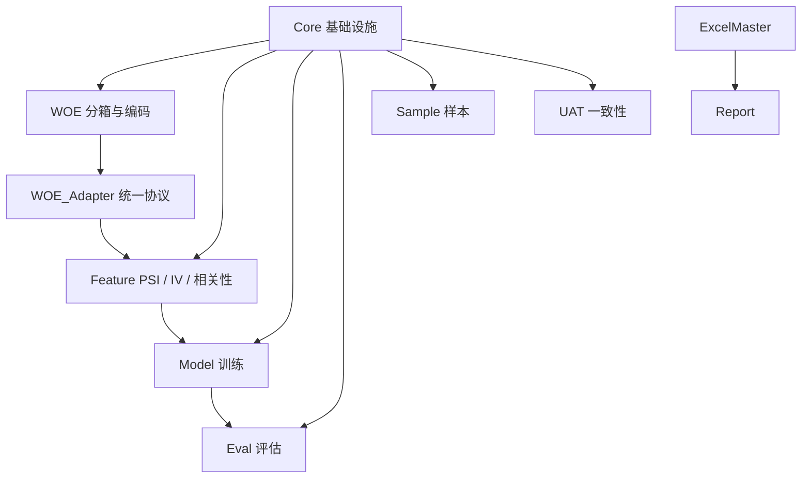

# 架构

## 顶层结构

```
SuperModelingFactory/
├── Modeling_Tool/          # 核心建模引擎
│   ├── Core/               # 基础设施：分箱、ODPS、工具、加密、JSON
│   ├── WOE/                # WOE 编码：分箱、变换、绘图、单调合并、统一分箱引擎
│   ├── Feature/            # 特征分析：PSI、IV、相关性、分布
│   ├── Model/              # 模型训练：LR / LightGBM / XGBoost / 后向消元
│   ├── Eval/               # 模型评估：Gains、ROC、KS、对比、流水线
│   ├── Sample/             # 样本管理：切分、分层、拒绝推断、分布适配
│   └── UAT/                # 线上线下一致性校验
├── ExcelMaster/            # Excel 报告引擎
└── Report/                 # 报告模板
```

## 模块依赖图



### 依赖原则

1. **Core 是基础层**：分箱、通用工具和基础计算尽量沉在 Core。
2. **WOE_Adapter 是桥接层**：`WOE_Master` 与 `MonotoneWOEBinner` 的产物格式不同，Feature 层通过 adapter 复用统一接口。
3. **Feature 不直接绑定某个 WOE 引擎**：PSI / IV / 相关性工具通过 `binning_engine` 或 `woe_binner` 接收已拟合引擎。
4. **顶层 `Modeling_Tool/__init__.py` 精选统一 API**：用户可直接 `from Modeling_Tool import ...`。
5. **ExcelMaster 独立**：只负责 Excel 写入和图表排版。

## 模块职责

### Core — 基础设施

| 文件 | 职责 |
|------|------|
| `Binning_Tool.py` | 等频 / 等距 / 卡方 / 决策树分箱 |
| `sample_weight_utils.py` | 样本权重解析（`weight_col` / `sample_weight`）与加权聚合 |
| `ODPS_Tool.py` | 阿里云 MaxCompute 客户端 |
| `utils.py` | 杂项工具、评分、WOE/IV 基础计算 |
| `Model_Registry_Tool.py` | 模型 artifact 与 metadata 持久化 |

### WOE — 证据权重编码

| 文件 | 职责 |
|------|------|
| `WOE_Master.py` | 全流程主控：fit → transform → 整体 / 分组 WOE 表 |
| `WOE_Monotone_Binner.py` | 贪心单调 WOE 分箱器 |
| `WOE_Adapter.py` | 统一 WOE 分箱引擎协议，桥接 Master / Monotone 与 Feature 筛选 |
| `WOE_Tool.py` | 单变量 / 多变量 WOE 转换、单调性检验 |
| `WOE_Plot_Tool.py` | 单变量 / 双变量绑图、整体 / 分组 WOE 表汇总 |
| `WOE_Report_Builder.py` | WOE 批量图 Excel 报告 |

### Feature — 特征分析

| 文件 | 职责 |
|------|------|
| `PSI_Tool.py` | PSI 计算，支持通过 `binning_engine` 复用 WOE 分箱 |
| `Feature_Insights.py` | IV / KS 计算、WOE 绘图、相关性过滤 |
| `WOE_Engine_Feature_Patch.py` | 给 PSI / IV / Correlation 工具挂载 WOE 引擎兼容路径 |
| `Distribution_Tool.py` | 分布偏移检测、KDE / 直方图 / 地毯图 |

### Model — 模型训练

| 文件 | 职责 |
|------|------|
| `GBM_Tool.py` | LightGBM / XGBoost / CatBoost 统一接口（含样本权重） |
| `GBM_Search_Tool.py` | GBM 超参搜索 |
| `LRM_Tool.py` | 逻辑回归、statsmodels 摘要、逐步选择（含 `weight_col`） |
| `Backward_Tool.py` | 后向变量消元（含训练/验证权重列） |

### Eval / Sample / UAT

| 模块 | 职责 |
|------|------|
| `Eval` | Gains、ROC、KS、性能汇总、评估流水线；`weighted_eval_utils.py` 提供加权指标实现 |
| `Sample` | 样本切分、分层采样、拒绝推断、分布适配 |
| `UAT` | 线上线下分数 / 特征一致性校验 |

## 命名规范

- 公开 API 通过 `__init__.py` 导出。
- 类名使用 PascalCase，函数名使用 snake_case。
- 私有成员以 `_` 开头，不保证稳定接口。
