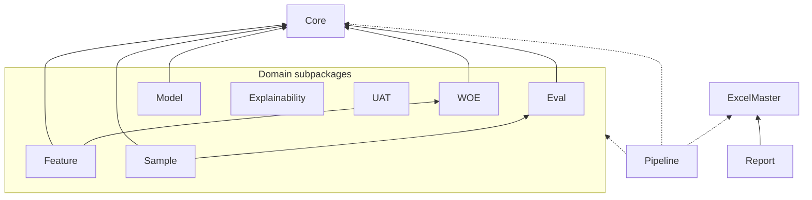

# Architecture

SMF installs three top-level packages. `Modeling_Tool` is the modeling engine and is split into subpackages, one per stage
of the scorecard workflow. `ExcelMaster` and `Report` write Excel output. This page shows the package layout, which
subpackage imports which, and where each public class lives.

## Package Layout

```
SuperModelingFactory/
├── Modeling_Tool/        # Modeling engine
│   ├── Core/             #   Binning, ODPS client, parallel engine, ProcCompare, model registry, utilities
│   ├── WOE/              #   WOE_Master, MonotoneWOEBinner, WOE transforms, WOE plots, engine adapter
│   ├── Feature/          #   PSI, IV/KS insights, correlation filter, feature_screen, distribution analysis
│   ├── Model/            #   LRMaster, GradientBoostingModel, backward elimination, hyperparameter search
│   ├── Eval/             #   Gains tables, PerformanceEvaluator, score comparison, ROC/KS/PR/lift functions and plots
│   ├── Sample/           #   Splitting, sampling, balancing, reject inference, distribution adaptation
│   ├── Explainability/   #   ModelExplainer (SHAP, Owen value, PDP, ICE, ALE, LIME), coalition structure
│   ├── Pipeline/         #   Seven one-click pipelines, config schema and registry helpers
│   ├── UAT/              #   UATConsistencyChecker and comparison helpers
│   ├── _utils/           #   Private helpers shared across subpackages (logging, NaN guards, sentinels)
│   └── ref_font/         #   CJK fonts bundled for the WOE plots
├── ExcelMaster/          # Cursor-based Excel writer, preset formats, report templates
└── Report/               # Report_Tool: model performance, WOE plot, and variable-importance sheets
```

The workflow stages map onto the subpackages like this:

| Stage | Subpackage | Guide |
|---|---|---|
| Sample design: split, balance, reject inference | `Sample` | [Sample Management](guides/sample.md), [Reject Inference](guides/reject_inference.md) |
| Binning and WOE encoding | `WOE` | [WOE Encoding](guides/woe.md) |
| Feature screening | `Feature` | [Feature Screening](guides/feature.md) |
| Model training | `Model` | [Model Training](guides/model.md) |
| Evaluation | `Eval` | [Model Evaluation](guides/eval.md) |
| Explainability | `Explainability` | [Model Explainability](guides/explainability.md) |
| Go-live checks, model persistence | `UAT`, `Core` | [Online/Offline Consistency Check](guides/uat.md), [Model Registry](guides/model_registry.md) |
| The whole workflow in one call | `Pipeline` | [Top-Level Pipelines](pipeline_one_click.md) |
| Excel reports | `ExcelMaster`, `Report` | [Excel Report Generation](guides/excel_report.md) |

## Import Dependencies

The diagram shows what each package imports **when it is imported** (solid arrows). Dashed arrows are imports that happen
inside functions, at call time.


```mermaid
flowchart BT
    Core["Core"]
    subgraph domain["Domain subpackages"]
        WOE["WOE"]
        Feature["Feature"]
        Eval["Eval"]
        Model["Model"]
        Sample["Sample"]
        Explain["Explainability"]
        UAT["UAT"]
    end
    Pipeline["Pipeline"]
    Excel["ExcelMaster"]
    Report["Report"]

    WOE --> Core
    Feature --> Core
    Eval --> Core
    Model --> Core
    Sample --> Core
    Feature --> WOE
    Sample --> Eval
    Pipeline -.-> domain
    Pipeline -.-> Core
    Report --> Excel
    Pipeline -.-> Excel
```

### Rules

1. **`Core` is the foundation.** At import time it imports no other public subpackage, only the private `_utils` helpers.
   Two lazy imports reach outside: `Model_Registry_Tool` reads `Modeling_Tool.__version__`, and `Proc_Compare` imports
   `ExcelMaster` when it writes an Excel report.
2. **`WOE`, `Feature`, `Eval`, `Model`, and `Sample` build on `Core`.** `Explainability` and `UAT` import no other SMF
   subpackage at import time.
3. **Only two peer-to-peer imports run at import time.** `Feature` imports `WOE` (the engine-aware screening classes in
   `WOE_Engine_Feature_Patch`), and `Sample` imports `Eval` (`Sample_Split` uses `PerformanceEvaluator`). Every other
   import between subpackages is inside a function. That is how subpackages that need each other in both directions, such
   as `Eval` and `Feature`, avoid import cycles.
4. **`Pipeline` sits on top.** It composes the other subpackages, mostly through `from Modeling_Tool import ...` inside
   functions. Its only module-level import of another subpackage is `Feature` in `screening_artifact.py`.
5. **`ExcelMaster` does not import `Modeling_Tool`, and `Report` imports only `ExcelMaster`.** Several `Modeling_Tool`
   modules import `ExcelMaster` lazily to write optional Excel reports: `Core.Proc_Compare`, `Eval`, `WOE`, `UAT`, and
   `Pipeline`.
6. **The binning engine is pluggable.** `WOE_Master` and `MonotoneWOEBinner` store their bins in different formats.
   `as_woe_engine` wraps either one behind a single adapter, so the screening tools in `Feature` accept a fitted engine
   through `binning_engine` (`PSICalculator`) or `woe_binner` (`VarExtractionInsights`, `CorrelationFilter`) and reuse its
   bins. See the [WOE Binning Engine guide](guides/woe_binning_engine.md).

### What Loads When

`import Modeling_Tool` imports `Core`, `Eval`, `Sample`, `WOE`, and `Feature`, and nothing from the optional extras.
Everything else loads on first use, so a light import stays light:

| First use | What loads |
|---|---|
| `GradientBoostingModel`, `LRMaster`, and the other `Model` names | The `Model` subpackage. LightGBM, XGBoost, or CatBoost load when a model of that type is built |
| `ModelExplainer`, `build_coalition_structure` | The `Explainability` subpackage. `shap` and `lime` load when a SHAP, Owen, or LIME method runs |
| Pipeline classes such as `CreditModelPipeline` | The `Pipeline` subpackage |
| `ODPSRunner`, `ParallelODPSManager`, `ParallelODPSConfig` | `pyodps` (the `odps` extra) |

## Public API

- Each subpackage lists its public names in `__init__.py`: `from Modeling_Tool.Eval import calc_roc`.
- `Modeling_Tool.__all__` curates 123 of the most used names, so `from Modeling_Tool import WOE_Master` works. The
  [API Reference](api/index.md) lists them all and the few names that need a subpackage import.
- `ExcelMaster` and `Report` have no top-level exports. Import the module you need:
  `from ExcelMaster.ExcelMaster import ExcelMaster`, `from Report.Report_Tool import single_model_perf`.

## Module Map

### Core: foundation

| Module | Main contents |
|---|---|
| `Binning_Tool.py` | `Binning`, `super_binning`, `chi2_binning`, `quick_binning`, `get_decision_tree_binning_edges`: equal-frequency, equal-width, chi-square, and decision-tree binning |
| `utils.py` | `calc_woe`, `calc_iv`, `scoring`, `WOEIVCalculator`, `DataFrameProcessor`, `FilePathManager`, `DateTimeUtils`, `parse_sql_file`, feature-name helpers |
| `sample_weight_utils.py` | `resolve_sample_weight`, `validate_sample_weight`, weighted sum, mean, and rate |
| `Model_Registry_Tool.py` | `save_model`, `load_model`, `load_model_metadata`, `make_model_artifact` |
| `ODPS_Tool.py` | `ODPSRunner`: MaxCompute SQL, table download and upload |
| `Parallel_ODPS_Manager.py` | `ParallelODPSManager`, `ParallelODPSConfig`: chunked concurrent pull and push |
| `Parallel_Engine.py` | `ParallelApplyEngine`, `ParallelApplyConfig`, `ParallelApplyResult`, `parallel_apply` |
| `Proc_Compare.py` | `ProcCompareEngine`, `ProcCompareConfig`, `ProcCompareResult`, `proc_compare` |
| `Slope_Tool.py` | `SlopeCalculator`, `calculate_slope_*` |
| `XOR_Encryptor.py` | `TextEncryptor` |
| `kDataFrame.py` | `kDataFrame`, `kSeries` |
| `Json_Data_Converter.py` | DataFrame to and from JSON helpers: `df_to_json`, `json_to_df`, and related functions |

### WOE: weight-of-evidence encoding

| Module | Main contents |
|---|---|
| `WOE_Master.py` | `WOE_Master` (fit, transform, mapping tables), `get_overall_woe_table`, `get_group_woe_table`, mapping-table I/O |
| `WOE_Monotone_Binner.py` | `MonotoneWOEBinner`: monotone bins, categorical features, special-value governance |
| `WOE_Adapter.py` | `as_woe_engine`, `WOEEngineAdapter`, `WOEMasterAdapter`, `MonotoneBinnerAdapter` |
| `WOE_Tool.py` | `woe_transform`, `woe_transformation`, `is_monotonic`, `check_monotonicity`, `WOETransformer` |
| `WOE_Plot_Tool.py` | `plot_woe`, `plot_woe_group`, `WOEPlotter`, `WOEAnalyzer`, mapped-WOE summaries |
| `WOE_Report_Builder.py` | `get_woe_plot_report_new`: WOE plots in an Excel workbook |
| `plot_woe_tool.py` | `extract_group_value`, `cre_psi_table` |

### Feature: screening and distribution analysis

| Module | Main contents |
|---|---|
| `PSI_Tool.py` | PSI functions such as `calculate_psi_within_dataset`, and the base `PSICalculator` |
| `Feature_Insights.py` | The base `VarExtractionInsights` (IV, KS, lift) and `CorrelationFilter`, and `var_corr_filter` |
| `WOE_Engine_Feature_Patch.py` | The exported `PSICalculator`, `VarExtractionInsights`, and `CorrelationFilter`: wrappers around the base classes that accept a fitted WOE engine |
| `Feature_Screen.py` | `feature_screen`, `feature_screen_from_dataframe`, `FeatureScreenConfig`, `FeatureScreenResult`: PSI, IV, and correlation screening across splits |
| `Weighted_Screen.py` | `weighted_feature_screen`, `WeightedScreenResult` |
| `Screen_Gates.py` | Post-correlation gates used by `feature_screen` (VIF, group stability, multi-target, truncation). Internal |
| `Distribution_Tool.py` | `proc_means`, `proc_means_by_grp`, `DistributionShiftAnalyzer`, `DistributionPlotter` |
| `ODPS_Distribution_Tool.py` | `proc_means_odps`: descriptive statistics computed inside MaxCompute |

### Model: training

| Module | Main contents |
|---|---|
| `LRM_Tool.py` | `LRMaster` (logistic regression, statsmodels-style summary, stepwise selection), `FeatureSelectionAnalyzer` |
| `GBM_Tool.py` | `GradientBoostingModel` (one interface for LightGBM, XGBoost, CatBoost), `LightGBMModel`, `XGBoostModel`, `CatBoostModel`, the quick-train functions |
| `GBM_Search_Tool.py` | The implementation behind `GradientBoostingModel.param_search` |
| `Backward_Tool.py` | `BackwardVariableEliminator`, `backward_lgbm`, `backward_xgbm` |

### Eval: evaluation

| Module | Main contents |
|---|---|
| `Model_Eval_Tool.py` | `GainsTableCalculator`, `PerformanceEvaluator`, `get_gains_table`, `get_perf_summary`, `cross_risk`, `get_gains_table_by_cust_metrics` |
| `Evaluation_Tool.py` | `Model_Evaluation_Tool` (champion/challenger comparison), `EvaluationPipeline` (slice-by-slice evaluation) |
| `evaluate_model.py` | `calc_roc`, `calc_pr`, `calc_equid_dist`, `calc_equid_pct`, `calc_fixed_pct`, `calc_lift_apt`, the `plot_*` functions, `evaluate_performance`, `comparison_performance` |
| `weighted_eval_utils.py` | Internal weighted implementations, used when `weight_col` or `sample_weight` is passed |

### Sample, Explainability, UAT

| Subpackage | Module | Main contents |
|---|---|---|
| `Sample` | `Sample_Split.py` | `SampleSplitter`, `StratifiedSampler`, `SampleBalancer`, `select_sample_seed` |
| `Sample` | `Reject_Infer.py` | `RejectInferenceFactory`, `RejectInferrer`, `ParcelingInferrer`, `HardCutoffInferrer`, `FuzzyAugmentInferrer`, `SimpleAugmentInferrer` |
| `Sample` | `Distribution_Adaptation.py` | `DistributionAdaptation` |
| `Explainability` | `Model_Explainer.py` | `ModelExplainer` |
| `Explainability` | `Coalition_Structure.py` | `build_coalition_structure`, `CREDIT_PRIOR_GROUPS` |
| `UAT` | `UAT_Consistency_Checker.py` | `UATConsistencyChecker`, `UATConfig`, and the comparison helpers `safe_diff`, `mismatch_mask`, and others |

### Pipeline

Seven pipelines, each defined in its own module with a `<Name>Config` and a `<Name>Result` class: `credit_model.py`
(`CreditModelPipeline`), `feature_validation.py` (`FeatureValidationPipeline`), `reject_inference.py`
(`RejectInferencePipeline`), `score_comparison.py` (`ScoreComparisonPipeline`), `score_consistency_uat.py`
(`ScoreConsistencyUATPipeline`), `sample_analysis.py` (`SampleAnalysisPipeline`), and `mock_sample.py`
(`MockSamplePipeline`). The remaining modules are `orchestrator.py` (`run_modeling_from_validation`),
`screening_artifact.py` (`FeatureScreeningArtifact`), and `field_meta.py` (config schema, registry, and YAML helpers such as
`extract_pipeline_schema`, `config_to_yaml`, and `validate_pipeline_config`).

### ExcelMaster and Report

| Package | Module | Main contents |
|---|---|---|
| `ExcelMaster` | `ExcelFormatTool.py` | `ExcelFormat`: the preset cell-format library |
| `ExcelMaster` | `ExcelMaster.py` | `ExcelWorkbook` (conditional formats, borders) and `ExcelMaster` (cursor, tables, text, images, charts) |
| `ExcelMaster` | `Template.py` | Report templates such as `get_pva_report` and `get_bivar_report` |
| `ExcelMaster` | `Utility.py` | Date, color, and table helpers |
| `Report` | `Report_Tool.py` | `single_model_perf`, `get_woe_plot_report_new`, `get_model_varimp`, and other functions that lay modeling artifacts out as sheets |

## Naming Conventions

- Most classes use PascalCase (`PerformanceEvaluator`, `LRMaster`). Several older classes keep underscores
  (`WOE_Master`, `Model_Evaluation_Tool`). Functions use snake_case.
- Module files are named after their main content (`WOE_Master.py`, `Feature_Screen.py`). `ExcelMaster/ExcelMaster.py` has
  the same name as its package and its class, so import it as `from ExcelMaster.ExcelMaster import ExcelMaster`.
  `from ExcelMaster import ExcelMaster` gives you the module, which is not callable.
- Names that start with `_`, and the `_utils` package, are private and carry no stability guarantee.
