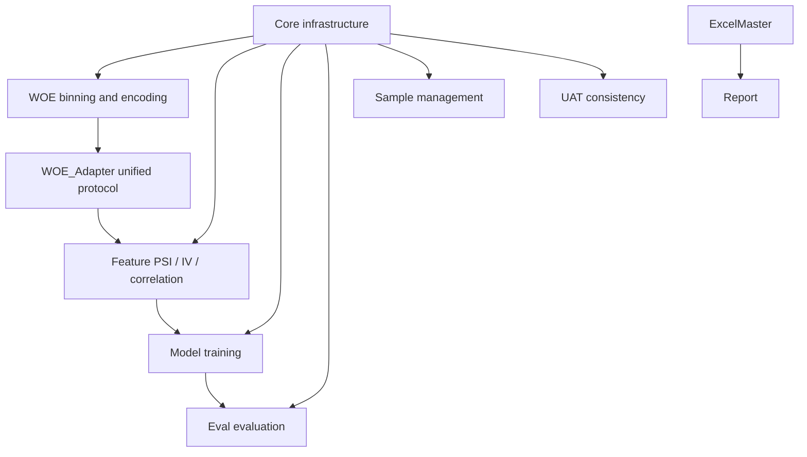

# Architecture

## Top-Level Structure

```
SuperModelingFactory/
├── Modeling_Tool/          # Core modeling engine
│   ├── Core/               # Infrastructure: binning, ODPS, utilities, encryption, JSON
│   ├── WOE/                # WOE encoding: binning, transforms, plotting, monotone merging, unified binning engine
│   ├── Feature/            # Feature analysis: PSI, IV, correlation, distribution
│   ├── Model/              # Model training: LR / LightGBM / XGBoost / backward elimination
│   ├── Eval/               # Model evaluation: Gains, ROC, KS, comparison, pipelines
│   ├── Sample/             # Sample management: splitting, stratification, reject inference, distribution adaptation
│   └── UAT/                # Online/offline consistency checks
├── ExcelMaster/            # Excel reporting engine
└── Report/                 # Report templates
```

## Module Dependency Graph


```mermaid
flowchart TD
    Core[Core infrastructure]
    WOE[WOE binning and encoding]
    Adapter[WOE_Adapter unified protocol]
    Feature[Feature PSI / IV / correlation]
    Model[Model training]
    Eval[Eval evaluation]
    Sample[Sample management]
    UAT[UAT consistency]
    Excel[ExcelMaster]
    Report[Report]

    Core --> WOE
    Core --> Feature
    Core --> Model
    Core --> Eval
    Core --> Sample
    Core --> UAT
    WOE --> Adapter
    Adapter --> Feature
    Feature --> Model
    Model --> Eval
    Excel --> Report
```

### Dependency Principles

1. **Core is the foundation layer**: binning, general utilities, and basic computations live in Core wherever possible.
2. **WOE_Adapter is the bridge layer**: `WOE_Master` and `MonotoneWOEBinner` produce artifacts in different formats, so the Feature layer reuses a unified interface through the adapter.
3. **Feature does not bind to a specific WOE engine**: the PSI / IV / correlation tools accept an already-fitted engine through `binning_engine` or `woe_binner`.
4. **The top-level `Modeling_Tool/__init__.py` curates a unified API**: users can import directly with `from Modeling_Tool import ...`.
5. **ExcelMaster is independent**: it is responsible only for Excel writing and chart layout.

## Module Responsibilities

### Core — Infrastructure

| File | Responsibility |
|------|------|
| `Binning_Tool.py` | Equal-frequency / equal-width / chi-square / decision-tree binning |
| `sample_weight_utils.py` | Sample-weight resolution (`weight_col` / `sample_weight`) and weighted aggregation |
| `ODPS_Tool.py` | Alibaba Cloud MaxCompute client |
| `utils.py` | Miscellaneous utilities, scoring, basic WOE/IV computation |
| `Model_Registry_Tool.py` | Model artifact and metadata persistence |

### WOE — Weight of Evidence Encoding

| File | Responsibility |
|------|------|
| `WOE_Master.py` | Full-workflow controller: fit → transform → overall / by-group WOE tables |
| `WOE_Monotone_Binner.py` | Greedy monotone WOE binner |
| `WOE_Adapter.py` | Unified WOE binning engine protocol, bridging Master / Monotone and Feature screening |
| `WOE_Tool.py` | Univariate / multivariate WOE transforms, monotonicity checks |
| `WOE_Plot_Tool.py` | Univariate / bivariate WOE plots, overall / by-group WOE table summaries |
| `WOE_Report_Builder.py` | Bulk WOE plot Excel reports |

### Feature — Feature Analysis

| File | Responsibility |
|------|------|
| `PSI_Tool.py` | PSI computation; can reuse WOE binning through `binning_engine` |
| `Feature_Insights.py` | IV / KS computation, WOE plotting, correlation filtering |
| `WOE_Engine_Feature_Patch.py` | Attaches WOE-engine compatibility paths to the PSI / IV / Correlation tools |
| `Distribution_Tool.py` | Distribution shift detection, KDE / histogram / rug plots |

### Model — Model Training

| File | Responsibility |
|------|------|
| `GBM_Tool.py` | Unified LightGBM / XGBoost / CatBoost interface (including sample weights) |
| `GBM_Search_Tool.py` | GBM hyperparameter search |
| `LRM_Tool.py` | Logistic regression, statsmodels summary, stepwise selection (including `weight_col`) |
| `Backward_Tool.py` | Backward variable elimination (including train/validation weight columns) |

### Eval / Sample / UAT

| Module | Responsibility |
|------|------|
| `Eval` | Gains, ROC, KS, performance summaries, evaluation pipelines; `weighted_eval_utils.py` provides the weighted-metric implementations |
| `Sample` | Sample splitting, stratified sampling, reject inference, distribution adaptation |
| `UAT` | Online/offline score and feature consistency checks |

## Naming Conventions

- Public APIs are exported through `__init__.py`.
- Class names use PascalCase; function names use snake_case.
- Private members start with `_` and carry no interface stability guarantee.
