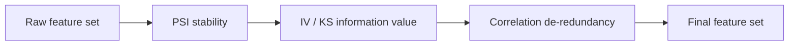

# Feature Screening

SuperModelingFactory provides four kinds of screening tools in the [`Feature`](../api/feature.md) subpackage: **PSI / IV / correlation / distribution**. The recommended order is stability first, then explanatory power, and finally redundancy removal.



!!! important "Binning consistency"

    If the model ultimately uses `MonotoneWOEBinner`, pass the same binner to `PSICalculator`, `VarExtractionInsights`, and `CorrelationFilter`. Otherwise the screening stage may re-bin, and the metrics will disagree with the final WOE encoding.

    See [WOE Binning Engine](woe_binning_engine.md) for details.

## 1. PSI Population Stability Index

The default usage is unchanged:

```python
from Modeling_Tool import PSICalculator

psi = PSICalculator(
    buckets=10,
    equal_freq=True,
    min_bin_prop=0.05,
    feature_block_size=64,
)
psi_table = psi.calculate(train_df, oot_df, features)
stable_features = psi_table.loc[psi_table["psi"] < 0.1, "var"].tolist()
```

If you already have a WOE binning engine, pass `binning_engine`:

```python
psi = PSICalculator(buckets=10, binning_engine=binner)
psi_table = psi.calculate(train_df, oot_df, features)
```

### v0.5.1 PSI one-sided bucket policy

When a bucket appears on only one side of a PSI comparison, SMF now defaults to
Laplace smoothing instead of flooring the missing side to `1e-6`:

```python
psi = PSICalculator(psi_missing_bucket_policy="smooth_laplace")  # default
```

Use `psi_missing_bucket_policy="floor_1e6"` for legacy reports, or
`psi_missing_bucket_policy="exclude"` to remove one-sided buckets from the PSI sum.

### PSI Thresholds

| PSI range | Meaning |
|---------|------|
| `< 0.1` | Stable, no attention needed |
| `0.1 - 0.25` | Slight drift, a review is recommended |
| `>= 0.25` | Significant drift, investigate immediately |

## 2. IV / KS Information Value

Default path:

```python
from Modeling_Tool import VarExtractionInsights

insights = VarExtractionInsights(
    data=train_df,
    dep="bad_flag",
    plot_path="./iv_plots/",
    nbins=10,
    equal_freq=True,
    tree_binning=True,
)
report = insights.get_var_analysis_report(train_df, features)
print(report[["var", "iv", "ks_in_gains", "lift_in_gains"]])
```

From v0.5.1, expected per-variable failures are recorded in
`insights.failed_variables` and summarized with one warning instead of silently
disappearing from the report.

Reuse the Monotone binning:

```python
insights = VarExtractionInsights(
    data=train_df,
    dep="bad_flag",
    plot_path="./iv_plots/",
    woe_engine="monotone",
    woe_binner=binner,
)
report = insights.get_var_analysis_report(train_df, features)
```

### IV Rules of Thumb

| IV range | Explanatory power |
|---------|---------|
| `< 0.02` | No predictive power, drop |
| `0.02 - 0.1` | Weak |
| `0.1 - 0.3` | Medium |
| `0.3 - 0.5` | Strong |
| `>= 0.5` | Abnormally strong, beware of overfitting / information leakage |

## 3. Correlation De-Redundancy

Drops variables whose pairwise correlation is too high and keeps the one with the higher IV or KS.

```python
from Modeling_Tool import CorrelationFilter

keep_vars = CorrelationFilter(
    data=train_df,
    dep="bad_flag",
    corr_cutpoint=0.7,
    woe_engine="monotone",
    woe_binner=binner,
).remove_highly_correlated(features)
```

### Key Parameters

| Parameter | Default | Description |
|------|-------|------|
| `corr_cutpoint` | `0.8` | Correlation coefficient threshold |
| `base_metric` | `iv` | Metric used to decide which variable to keep within a highly correlated group; `iv` or `ks` |
| `woe_engine` | `master` | Binning engine name |
| `woe_binner` | `None` | An already-fitted `WOE_Master` or `MonotoneWOEBinner` |

## 4. Unified Feature Screening (v0.3.9+)

`feature_screen` is the screening kernel shared by CM / FVP, performing PSI → IV → correlation removal on the INS/OOS/OOT splits. `weighted_feature_screen` and `CreditModelPipeline._feature_selection` both delegate to this API.

```python
from Modeling_Tool import FeatureScreenConfig, feature_screen, fit_screening_woe_engine

splits = {"ins": ins_df, "oos": oos_df, "oot": oot_df}
binner = fit_screening_woe_engine(splits["ins"], features, "badflag", woe_engine="monotone")
config = FeatureScreenConfig(
    psi_compare_splits=["oos"],
    psi_use_woe_bins=True,
    iv_use_woe_bins=True,
    corr_use_woe_bins=True,
    corr_block_size=256,
)
result = feature_screen(splits, features, "badflag", config=config, prefit_woe_engine=binner)
selected = result.selected_features
```

A `feature_selection` dict can be converted into a `FeatureScreenConfig` through `screen_config_from_mapping()`. When `weight_col` is non-empty, the weighted equal-frequency path is used by default; once `*_use_woe_bins=True` is set and a WOE engine is provided (or fitted automatically), weighted PSI/IV reuse the same bin boundaries.

`feature_block_size` controls how many columns the PSI/WOE adapter transforms at a time, and `corr_block_size` controls the block size of the weighted correlation matrix. Both only limit peak memory on very wide tables and do not change the metric definitions.

Grouped distribution statistics also support column blocks:

```python
from Modeling_Tool import proc_means_by_grp

summary = proc_means_by_grp(
    data,
    features,
    groupby=["apply_month", "channel"],
    feature_block_size=128,
)
```

If the source data lives in MaxCompute, you do not need to pull the full wide table into pandas first. `proc_means_odps()`
aggregates in feature batches on the ODPS side and downloads only the final statistics:

```python
from Modeling_Tool import proc_means_odps

summary = proc_means_odps(
    input_table_name="mex_anls.feature_wide_table",
    select_cols=features,
    group=["apply_month", "channel"],
    batch_size=50,
    where_clause="dt >= '2026-01-01'",
)
```

The returned fields align with the numeric `proc_means_by_grp()`, including `N_ALL/N/MEAN/STD/MIN/quantiles/MAX/MISSING_RATE`.
`batch_size` is the number of features in one aggregation SQL statement; source rows are never downloaded. For the full parameters, quantile modes, and ODPS write-back rules, see
[ODPS Data Extraction: `proc_means_odps`](odps.md#5-proc_means_odps-odps-side-descriptive-statistics).

## 5. Weighted Feature Screening (v0.3.8+)

`weighted_feature_screen` chains PSI → IV → correlation de-redundancy into a single API, and supports `weight_col` weighted quantile cut points, weighted IV/PSI, and weighted Pearson correlation (with IV arbitration).

```python
from Modeling_Tool import weighted_feature_screen

result = weighted_feature_screen(
    data=df,                      # must contain split_col with values ins/oos/oot
    feature_cols=features,
    target_col="badflag",
    split_col="sample_ind",
    weight_col="_weight",         # None takes the legacy unweighted tools, consistent with the old Pipeline regression
    psi_compare_splits=["oos", "oot"],  # standalone API default; the Pipeline default is only ["oos"]
)
selected = result.selected_features
iv_table = result.iv_table       # iv_weighted / n_bins / missing_rate
psi_table = result.psi_table     # psi_ins_oos / psi_ins_oot / psi_max
```

Typical scenarios: when Fuzzy Augment two-row samples carry `_weight`, weighted IV avoids the distortion from unweighted counts offsetting each other; the 05E experiment can run weighted top-N screening on RI-augmented samples + `weight_col`.

`CreditModelPipeline`'s `_feature_selection` already delegates to `feature_screen`; when `weight_col` is configured as non-empty, the weighted path is taken automatically.

### 0.7.2 Weighted VIF / corr Boundaries

- G06 VIF passes `weight_col` to `FeatureSelectionAnalyzer.compute_vif(..., sample_weight=...)`. Non-constant weights use a WLS auxiliary regression; when no weights are passed, or the weights are a normal positive constant, the original OLS computation is kept, preserving strict legacy parity.
- Under `corr_nan_policy="pairwise"`, normal positive constant weights reuse the actual iteration decisions of the unweighted corr, while keeping the weighted `corr_dropped` audit. `corr_nan_policy="raise"` still runs the NaN hard gate first and is not bypassed by the constant-weight path.
- Weighted WOE corr recognizes the adapter's custom suffix. If only some features are encoded successfully, the usable numeric sub-matrix is still computed; unencoded features stay in the full matrix as NaN rows/columns with a warning, and are never silently dropped.

## 6. Distribution Shift Analysis

```python
from Modeling_Tool import DistributionShiftAnalyzer

analyzer = DistributionShiftAnalyzer(dataset, grp_name="apply_month", benchmark_value="2025-01")
shift_table = analyzer.analyze(varlist=features, outlier_value=0.99)
print(shift_table)
```

## Complete Screening Pipeline

=== "WOE_Master (default)"

    ```python
    from Modeling_Tool import WOE_Master, PSICalculator, VarExtractionInsights, CorrelationFilter, SMF_MISSING_BIN

    woe = WOE_Master(train_data=train_df, varlist=features, dep="bad_flag")
    woe.fit(nbins=10, equal_freq=True)

    psi = PSICalculator(binning_engine=woe).calculate(train_df, oot_df, features)
    features = psi.loc[psi["psi"] < 0.1, "var"].tolist()

    insights = VarExtractionInsights(train_df, "bad_flag", "./iv_plots/", woe_binner=woe)
    iv_report = insights.get_var_analysis_report(train_df, features)
    features = iv_report.loc[iv_report["iv"].between(0.02, 0.5), "var"].tolist()

    features = CorrelationFilter(train_df, "bad_flag", corr_cutpoint=0.7, woe_binner=woe) \
        .remove_highly_correlated(features)
    ```

=== "MonotoneWOEBinner (recommended for scorecards)"

    ```python
    from Modeling_Tool import PSICalculator, VarExtractionInsights, CorrelationFilter
    from Modeling_Tool.WOE.WOE_Monotone_Binner import MonotoneWOEBinner

    binner = MonotoneWOEBinner(feature_cols=features, target_col="bad_flag")
    binner.fit(train_df, chi2_binning=True, chi2_p=0.95)

    psi = PSICalculator(binning_engine=binner).calculate(train_df, oot_df, features)
    features = psi.loc[psi["psi"] < 0.1, "var"].tolist()

    insights = VarExtractionInsights(
        train_df, "bad_flag", "./iv_plots/",
        woe_engine="monotone", woe_binner=binner,
    )
    iv_report = insights.get_var_analysis_report(train_df, features)
    features = iv_report.loc[iv_report["iv"].between(0.02, 0.5), "var"].tolist()

    features = CorrelationFilter(
        train_df, "bad_flag", corr_cutpoint=0.7,
        woe_engine="monotone", woe_binner=binner,
    ).remove_highly_correlated(features)
    ```

## FAQ

??? question "PSI and IV results don't match the WOE plots"

    This is usually because the screening stage was not given the `binning_engine` / `woe_binner` used for the final model. Reuse the `WOE_Master` or `MonotoneWOEBinner` fitted at training time.

??? question "After Monotone binning, should correlation filtering get raw data or WOE data?"

    Raw data is recommended, together with `woe_binner`. Correlation filtering then still relies on raw-variable correlations, while the decision on which variable to keep is based on the IV/KS from the same WOE binning.

## Post-Selection Gates (0.6.7+, G02–G06)

After the classic missing rate → PSI → IV → correlation, `feature_screen` adds a set of post-selection gates that are off by default,
executed in the order **VIF → group stability → multi-label → truncation**; the evidence frames and elimination details are unified in
`result.stage_tables` / `result.dropped_detail` (columns: var/stage/metric/value/threshold/reason):

```python
FeatureValidationPipelineConfig(
    selection_enabled=True,
    selection_group_dims=["apply_month"],       # G03 evidence grouping dimensions
    selection_params={
        "iv_upper_threshold": 2.0,               # G02 IV upper limit (eliminates suspected leakage)
        "monthly_iv_min": 0.02,                  # G03 lower limit of group IV
        "monthly_iv_cv_max": 1.0,                #     upper limit of the group-IV coefficient of variation
        "direction_consistency_min": 0.9,        #     lower limit of the share of direction-consistent groups
        "insufficient_group_policy": "keep_warn",#     qualifying groups < 2: keep_warn/drop/raise
        "target_rules": "all",                   # G04 multi-label joint gate: all/any/min_pass_count
        "per_target_iv_range": {"y": (0.02, None)},
        "direction_reference_target": "y",
        "max_selected_features": 30,             # G05 hard truncation (IV ranking, ties broken by name)
        "vif_enabled": True, "vif_threshold": 10.0,  # G06 requires pip install "SuperModelingFactory[stats]"
        "vif_use_woe_bins": True,                      # 0.7.1+: compute VIF on the WOE matrix
    },
)
```

Key points:

- The G03/G04 evidence (group/per-label IV and direction) is built by FVP as a **lazy closure** and is priced only for the post-corr survivor set;
  the CMP path has no evidence source — configuring group-stability/multi-label thresholds without evidence raises an error at the `feature_screen` entry.
- The unified definition of direction is the point-biserial sign (`Screen_Gates.point_biserial_direction`).
- If G05 truncation falls short of `min_selected_features`, it only warns and does not backfill, preserving the causal auditability of every gate.
- The monotone engine self-fitted by screening is attached to `result.woe_engine` and enters the CM reuse contract with `FeatureScreeningArtifact`
  (G00); `WOE_Master` attaches only the woe_table + a warning (it holds the training frame and should not be serialized).
- G06 defaults to `vif_use_woe_bins=False` and computes VIF only on raw numeric columns: non-numeric survivors are kept with a warning, and an exclusion audit is left in `selection_summary` / `stage_tables["vif"]`; when there are too few numeric columns, the gate is skipped as `skipped_insufficient_numeric`. bool and pandas nullable numeric columns are converted to floats only inside the VIF matrix.
- With `vif_use_woe_bins=True`, VIF uses the INS WOE-encoded matrix, so categorical variables can also take part in the collinearity check. When `categorical_features` is declared, `woe_engine="monotone"` is required; `equal_freq` explicitly rejects that combination before fitting. A pre-fitted WOE engine must cover all surviving variables, and custom WOE suffixes are recognized automatically.

### bool Features (0.8.2)

numpy does not accept quantiles on bool arrays (`TypeError: numpy boolean subtract`), so in 0.8.1 and earlier **any quantile-based binning failed on a bool feature**: `quick_binning`, `super_binning`, the gains table, `WOE_Master`, monotone binning, and both screeners all raised errors. In an FVP with WOE enabled, it showed up as a swallowed "feature insights computation failed" warning plus `KeyError: WOE column 'x_woe' was not produced` — the whole flow aborted, while the same column after `astype("int8")` worked fine.

0.8.2 maps bool columns to 0/1 at the point where quantiles are taken, and the binning, WOE table, IV, and scoring results are **bit-for-bit identical** to the int8 copy; only the `MIN` / `MAX` of the WOE table are still reported as `False` / `True` for the feature itself. pandas nullable `boolean` columns are converted to `Int8`, with missing values staying missing. In the distribution summary, bool is still reported as a categorical feature (as of 0.8.2, see above).

### FVP Categorical Transform Audit (0.7.2)

FVP freezes categorical coverage and unseen statistics immediately after each split's transform, so the engine's "most recent transform" state cannot overwrite earlier results. The full results can be viewed in `woe_artifacts["by_target"][target]["categorical_transform_stats_by_split"]` and `unseen_category_stats_by_split`; the batch/slim summaries are kept in `woe_artifacts["categorical_transform_stats_by_target"]` / `woe_artifacts["unseen_category_stats_by_target"]`. As of 0.8.2, hit statistics for "declared special values that never occur in the fit sample" on numeric features are frozen the same way (`unseen_special_stats_by_split` / `woe_artifacts["unseen_special_stats_by_target"]`; for their meaning, see the [WOE guide](woe.md)). If a batch merge finds conflicting statistics for the same target/split/feature, it raises an error rather than silently overwriting.
