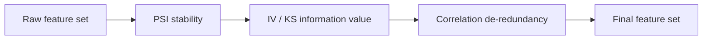

# Feature Screening

The [`Modeling_Tool.Feature`](../api/feature.md) subpackage answers three questions about every candidate variable before
it reaches a model:

1. Is it **stable** between the development sample and later data? Use PSI.
2. Does it **separate** good from bad accounts? Use IV, KS, and lift.
3. Is it **redundant** with another variable? Use correlation and VIF.

Screen in that order: drop unstable variables first, then weak ones, then duplicates. `feature_screen` runs the three
stages in one call. The subpackage also summarizes distributions by group and measures distribution shift.



| I want to... | Use | Import |
|---|---|---|
| Measure how far each variable drifted between two samples | `PSICalculator` | `from Modeling_Tool import PSICalculator` |
| Compare every month with a benchmark month | `calculate_psi_within_dataset` | `from Modeling_Tool import calculate_psi_within_dataset` |
| Rank variables by IV, KS, and lift | `VarExtractionInsights` | `from Modeling_Tool import VarExtractionInsights` |
| Drop the weaker variable of each highly correlated pair | `CorrelationFilter` | `from Modeling_Tool import CorrelationFilter` |
| Get chi-square p-values, VIF, or a plain correlation filter | `FeatureSelectionAnalyzer` | `from Modeling_Tool import FeatureSelectionAnalyzer` |
| Run PSI, IV, and correlation (plus VIF and size limits) in one call | `feature_screen`, `FeatureScreenConfig` | `from Modeling_Tool import feature_screen, FeatureScreenConfig` |
| Do the same with sample weights from one tagged frame | `weighted_feature_screen` | `from Modeling_Tool import weighted_feature_screen` |
| Summarize variables by group | `proc_means_by_grp` | `from Modeling_Tool.Feature import proc_means_by_grp` |
| Summarize variables inside MaxCompute | `proc_means_odps` | `from Modeling_Tool import proc_means_odps` |
| Measure how far each group deviates from a benchmark group | `DistributionShiftAnalyzer` | `from Modeling_Tool import DistributionShiftAnalyzer` |

`proc_means_by_grp`, `proc_means`, `var_corr_filter`, `calculate_psi`, `calculate_within_psi`,
`calculate_multivar_psi_two_sets`, `get_distribution_shift`, and `plot_distribution` are not exported at the top level.
Import them from `Modeling_Tool.Feature`.

!!! important "Use one binner for every step"

    By default the three screening tools bin a variable independently: `PSICalculator` and `CorrelationFilter` use
    equal-frequency bins, while `VarExtractionInsights` uses decision-tree bins (`tree_binning=True`). Tree bins are
    chosen with the target, so they overstate the IV of weak variables.

    Fit one `WOE_Master` or `MonotoneWOEBinner` on the development sample and pass the same object to all three tools
    (`binning_engine=` for `PSICalculator`, `woe_binner=` for the other two). PSI is then computed on the binner's own bins,
    the IV equals the IV in the binner's WOE table, and the choice between two correlated variables uses that IV. The
    binner must have been fitted on every variable you screen (see the [FAQ](#faq)). For the engine API, see
    [WOE Binning Engine](woe_binning_engine.md).

## Example data

Every snippet on this page runs top to bottom in one Python session. The synthetic sample has one strong predictor
(`score_b`), a noisier copy of it (`score_b2`), two weak predictors (`utilization`, `n_overdue`), and two pure-noise
variables (`age`, `income`). `income` also drifts upward in the last two months.

```python
import numpy as np
import pandas as pd

rng = np.random.default_rng(42)
n = 8000
months = [f"2025-{m:02d}" for m in range(1, 10)]

data = pd.DataFrame({
    "flow_id":     [f"f{i:05d}" for i in range(n)],
    "apply_month": rng.choice(months, n),
    "age":         rng.normal(35, 8, n).clip(18, 70),
    "income":      rng.lognormal(10, 0.4, n),
    "score_b":     rng.normal(600, 60, n),
    "utilization": rng.uniform(0, 1, n),
    "n_overdue":   rng.poisson(0.3, n),
    "sample_wgt":  rng.uniform(0.5, 2.0, n),
})
data["apply_time"] = pd.to_datetime(data["apply_month"] + "-15")
data["score_b2"] = data["score_b"] * 0.98 + rng.normal(0, 20, n)           # a noisier copy of score_b
data.loc[data["apply_month"] >= "2025-08", "income"] *= 1.6               # income drifts in the last two months

logit = -2.0 - 0.01 * (data["score_b"] - 600) + 0.3 * data["n_overdue"] - 0.5 * data["utilization"]
data["bad_flag"] = rng.binomial(1, 1 / (1 + np.exp(-logit)))

features = ["age", "income", "score_b", "score_b2", "utilization", "n_overdue"]

# Months 1-7 are the development sample (70% train / 30% test); months 8-9 are out-of-time
is_dev = data["apply_month"] < "2025-08"
is_train = is_dev & (rng.random(n) < 0.7)
data["sample_ind"] = np.where(is_train, "ins", np.where(is_dev, "oos", "oot"))
train_df, test_df, oot_df = (data[data["sample_ind"] == s].copy() for s in ("ins", "oos", "oot"))
```

Fit the binners on the training sample only. `WOE_Master` is the quick default; `MonotoneWOEBinner` forces monotone
bins and suits scorecards.

```python
from Modeling_Tool import WOE_Master, MonotoneWOEBinner

woe = WOE_Master(train_data=train_df, varlist=features, dep="bad_flag")
woe.fit(nbins=10, equal_freq=True)

binner = MonotoneWOEBinner(feature_cols=features, target_col="bad_flag")
binner.fit(train_df, chi2_binning=True, chi2_p=0.95)
```

## 1. PSI: Population Stability Index

PSI compares the distribution of a variable in two samples, bin by bin:
`PSI = sum((actual% - expected%) * ln(actual% / expected%))`. The expected sample defines the bins.

```python
from Modeling_Tool import PSICalculator

psi = PSICalculator(buckets=10, equal_freq=True, min_bin_prop=0.05, feature_block_size=64)
psi_table = psi.calculate(train_df, oot_df, features)       # bins are built on train_df
print(psi_table.sort_values("psi", ascending=False))

stable_features = psi_table.loc[psi_table["psi"] < 0.1, "var"].tolist()
```

`calculate(expected_df, current_data, varlist, group_by=None, group_name=None, return_details=False, missing_policy=None, psi_missing_bucket_policy=None)`
returns one row per variable with the columns `var` and `psi`. In this sample only `income`, which drifts in the
out-of-time months, is unstable.

| PSI range | Meaning |
|---|---|
| `< 0.1` | Stable. No action needed |
| `0.1` to `0.25` | Slight drift. A review is recommended |
| `>= 0.25` | Significant drift. Investigate before using the variable |

### Constructor parameters

| Parameter | Default | Meaning |
|---|---|---|
| `buckets` | `10` | Number of bins in the default binning |
| `equal_freq` | `True` | Equal-frequency bins. `False` gives equal-width bins |
| `min_bin_prop` | `0.05` | Minimum share of rows per bin. It caps the number of bins at `max(5, 1 / min_bin_prop)` |
| `content` | `1e-06` | Floor for a bin share, so the logarithm stays finite |
| `precision` | `5` | Decimals of the bin edges. With `binning_engine`, the decimals of the PSI value |
| `binning_engine` | `None` | A fitted `WOE_Master`, `MonotoneWOEBinner`, or `WOEEngineAdapter`. PSI is then computed on that engine's bins, and `buckets`, `equal_freq`, `min_bin_prop`, and `missing_policy` have no effect |
| `missing_policy` | `'include'` | `'include'` gives missing values their own bin, so a change in the missing rate raises the PSI. `'drop'` ignores missing rows. `'warn_and_drop'` drops them and emits a `RuntimeWarning` with the counts |
| `psi_missing_bucket_policy` | `'smooth_laplace'` | How to treat a bin that exists on one side only (below) |
| `feature_block_size` | `64` | Variables transformed per block when `binning_engine` is set. `None` processes all at once |

A passed `binning_engine` of any other type raises `TypeError`. A variable the engine was not fitted on raises `KeyError`.

### Reuse a fitted binner

```python
psi_woe = PSICalculator(binning_engine=woe).calculate(train_df, oot_df, features)
psi_mono = PSICalculator(binning_engine=binner).calculate(train_df, oot_df, features)
print(psi_woe)
```

The numbers differ from the default table because the bins differ. This is the intended behavior: monitoring PSI should
use the mapping the model uses.

!!! note "Categorical variables"

    The default binning handles numeric variables only, and a string column raises `TypeError`. For categorical variables,
    fit a `MonotoneWOEBinner` with `cate_feats=[...]` and pass it as `binning_engine`.

### One-sided bins

When a bin holds rows on one side only, for example a category that disappears, the PSI term involves the logarithm of
zero. The `psi_missing_bucket_policy` argument decides how to handle it:

| Policy | Behavior |
|---|---|
| `'smooth_laplace'` (default) | Add one to every bin count, then compute shares. Applied only when a one-sided bin exists |
| `'floor_1e6'` | Clip the shares at `content` (`1e-06`). The empty side then counts as `1e-06`, so every one-sided bin adds a large term |
| `'exclude'` | Drop one-sided bins from the sum |

```python
expected = pd.DataFrame({"x": rng.choice([0, 1, 2, 3, 4], 5000, p=[0.3, 0.3, 0.2, 0.18, 0.02])})
actual = pd.DataFrame({"x": rng.choice([0, 1, 2, 3], 5000, p=[0.3, 0.3, 0.2, 0.2])})    # value 4 never occurs

for policy in ["smooth_laplace", "floor_1e6", "exclude"]:
    value = PSICalculator(psi_missing_bucket_policy=policy).calculate(expected, actual, ["x"])["psi"].iloc[0]
    print(f"{policy:15s} {value:.4f}")
```

Use `floor_1e6` to reproduce reports from before 0.5.1. Any other value raises `ValueError`.

### PSI by group, and bin details

Pass `group_name` to compare every value of a column in `current_data` with the expected sample. The bins are built once
on `expected_df`.

```python
by_month = psi.calculate(train_df, oot_df, ["income"], group_name="apply_month")
print(by_month)                 # columns: apply_month, var, psi

detail = psi.calculate(train_df, oot_df, ["income"], return_details=True)
print(detail["psi"])
print(detail["details"][["bin", "expected_percent", "actual_percent", "psi_component"]])
```

!!! note "`group_by` and `return_details`"

    Use `group_name` for grouping. `group_by` is a legacy argument and does nothing on its own.
    With the default binning, `return_details=True` returns a dictionary with the keys `'psi'` and `'details'`. With a
    `binning_engine` it returns a tuple `(psi_table, shares)`, where `shares[var]` holds the `expected_bins` and
    `current_bins` share series.

### PSI over time against a benchmark month

`calculate_psi_within_dataset` compares every value of a group column with a benchmark value, for several variables at
once.

```python
from Modeling_Tool import calculate_psi_within_dataset

monthly = calculate_psi_within_dataset(
    data, grp_name="apply_month", varlist=["income", "score_b"], benchmark="2025-01",
)
print(monthly.pivot(index="apply_month", columns="var", values="psi").round(3))
```

The result has the columns `apply_month`, `psi`, and `var`, and does not list the benchmark month itself. With
`benchmark=None`, every group is compared with the whole dataset. The other arguments are `equal_freq`, `buckets`,
`min_bin_prop`, `content`, `precision`, `missing_policy`, and `psi_missing_bucket_policy`, with the same defaults as above.
`calculate_psi`, `calculate_within_psi`, and `calculate_multivar_psi_two_sets` in `Modeling_Tool.Feature` are the
single-variable building blocks of the same computation.

## 2. IV, KS, and Lift: `VarExtractionInsights`

`VarExtractionInsights` bins each variable, builds a bin table against the target, and reports IV, KS, and lift.

```python
from Modeling_Tool import VarExtractionInsights

insights = VarExtractionInsights(
    data=train_df,
    dep="bad_flag",
    plot_path="iv_plots",
    nbins=10,
    equal_freq=True,
    tree_binning=True,
)
report = insights.get_var_analysis_report(train_df, features)
print(report[["var", "iv", "ks_in_gains", "lift_in_gains", "n_bins"]])
```

`get_var_analysis_report(data, varlist, dep=None, iv_cut=0.01)` returns one row per variable. **Variables with
`iv < iv_cut` are left out of the report**, so pass `iv_cut=0` to keep them all. A variable that cannot be binned is left
out too: it is listed in `insights.failed_variables` as `(name, exception_type)` pairs, and one `UserWarning` summarizes
the failures. A constant column is skipped silently. The default binning handles numeric variables only; for a string
variable, pass a `MonotoneWOEBinner` fitted with `cate_feats=[...]` as `woe_binner`.

| Column | Meaning |
|---|---|
| `var` | Variable name |
| `n_all`, `n` | Number of rows, and the number with a non-missing value |
| `ks_in_gains` | KS of the variable's bin table |
| `lift_in_gains` | Largest bin lift (bin bad rate divided by the overall bad rate) |
| `iv` | Information value, rounded to four decimals |
| `n_bump` | Rank-order breaks between bins. With a `woe_binner` the column holds the bin count instead |
| `missing_rate` | Share of missing values |
| `min`, `mean`, `max` | Summary statistics of numeric variables. `NaN` for categorical variables |
| `n_bins` | Number of bins |

With the default binning the rows are sorted by `iv`, descending. With a `woe_binner` they follow `varlist`. A bool
variable is binned normally, but its `n_all`, `n`, `missing_rate`, `min`, `mean`, and `max` are `NaN`.

### Constructor parameters

| Parameter | Default | Meaning |
|---|---|---|
| `data` | required | Stored on the instance. Every method takes its own `data` argument |
| `dep` | required | Target column (0/1) |
| `plot_path` | required | Output folder of `plot_woe`. Pass `None` if you do not plot. `get_var_analysis_report` writes no files |
| `nbins` | `10` | Bins per variable |
| `equal_freq` | `True` | Equal-frequency bins. `False` gives equal-width bins |
| `min_bin_prop` | `0.05` | Minimum share of rows per bin |
| `precision` | `5` | Decimals of the bin edges |
| `chi2_method` | `False` | Merge an initial fine binning with a chi-square test |
| `chi2_p` | `0.9` | Confidence level of the chi-square merge |
| `init_equi_bins` | `5000` | Number of fine bins before the chi-square merge |
| `tree_binning` | `True` | Decision-tree (supervised) bin edges. See the warning below |
| `include_missing` | `True` | Missing values form their own bin |
| `seed` | `3407` | Random seed of the tree binning |
| `missing_rate_ref` | `-999999` | Sentinel for missing values. It fills `NaN` in the default binning and is treated as missing in `missing_rate`, `min`, `mean`, and `max` |
| `spec_values` | `None` | Special values that get their own bins |
| `woe_engine` | `'master'` | `'monotone'` makes the object fit its own `MonotoneWOEBinner` on first use and keep it in `insights.woe_binner`. Any other value behaves like `'master'` |
| `woe_binner` | `None` | A fitted `WOE_Master` or `MonotoneWOEBinner`. Bins and IV then come from it, and `nbins`, `equal_freq`, `min_bin_prop`, `precision`, `chi2_method`, `chi2_p`, `init_equi_bins`, `tree_binning`, `include_missing`, `seed`, and `spec_values` are ignored |
| `woe_engine_params` | `None` | Constructor arguments for the self-fitted `MonotoneWOEBinner`. The key `fit_params` is passed on to its `fit`. `chi2_method`, `chi2_p`, `init_equi_bins`, and `spec_values` also feed that fit |

!!! warning "Tree binning overstates the IV of weak variables"

    The default `tree_binning=True` places bin edges with the help of the target on the same sample, so even a
    pure-noise variable collects IV. Compare four ways of binning the same sample:

    ```python
    def iv_by_var(**kwargs):
        rep = VarExtractionInsights(train_df, "bad_flag", None, **kwargs).get_var_analysis_report(
            train_df, features, iv_cut=0,
        )
        return rep.set_index("var")["iv"]


    iv_compare = pd.DataFrame({
        "tree_binning=True": iv_by_var(),
        "tree_binning=False": iv_by_var(tree_binning=False),
        "woe_binner=woe": iv_by_var(woe_binner=woe),
        "woe_binner=binner": iv_by_var(woe_binner=binner),
    }).round(4)
    print(iv_compare)
    ```

    `age` and `income` carry no signal, yet tree bins give them an IV of 0.07 to 0.08. Ten equal-frequency bins
    (`tree_binning=False`, or the `WOE_Master`) give about 0.03, and the monotone binner, which merges bins that do not
    separate good from bad, gives less than 0.01. Fit a binner and pass it as `woe_binner` before you apply an IV threshold.

With a `woe_binner`, the reported IV equals the IV of that binner's WOE table:

```python
from Modeling_Tool import as_woe_engine

woe_table_iv = as_woe_engine(woe).get_woe_table().groupby("VAR")["IV"].sum()
print((iv_compare["woe_binner=woe"] - woe_table_iv).abs().max())      # rounding error only
```

### Plot WOE charts

```python
insights.plot_woe(train_df, ["score_b", "utilization"])     # writes iv_plots/var_analysis_plot/<var>.png
```

`plot_woe(data, varlist, plot_group=None, plot_dirname='var_analysis_plot', plot_path=None)` writes one bivariate chart per
variable to `<plot_path>/<plot_dirname>/`, creating the folders; `plot_path` defaults to the constructor's. With
`plot_group`, a second chart per variable, split by that column, is written as `<var>_<plot_group>.png`. When the object
holds a `MonotoneWOEBinner`, it plots every variable the binner was fitted on and ignores `varlist`.

### IV rules of thumb

| IV | Predictive power |
|---|---|
| `< 0.02` | None. Drop the variable |
| `0.02` to `0.1` | Weak |
| `0.1` to `0.3` | Medium |
| `0.3` to `0.5` | Strong |
| `>= 0.5` | Suspiciously strong. Check for overfitting or information leakage |

## 3. Correlation and Collinearity

### `CorrelationFilter`

`CorrelationFilter` finds pairs whose absolute correlation exceeds `corr_cutpoint` and, from each group of correlated
variables, keeps the one with the highest IV (or KS). It repeats until no variable is removed or `max_iterations` is reached.

```python
from Modeling_Tool import CorrelationFilter

corr_filter = CorrelationFilter(data=train_df, dep="bad_flag", corr_cutpoint=0.7, woe_binner=woe)
keep_vars = corr_filter.remove_highly_correlated(features)
print("kept:   ", keep_vars)
print("removed:", corr_filter.filtered_varlist)
```

`remove_highly_correlated(varlist, max_iterations=10)` returns the kept variables, with the winner of each group first.
`filtered_varlist` lists the removed variables, and `correlated_dict` maps each group's anchor variable to the
correlated pairs and the metric table behind the decision. Use `var_corr_filter` to list the pairs without removing anything:

```python
from Modeling_Tool.Feature import var_corr_filter

print(var_corr_filter(train_df, features, corr_cutpoint=0.7))     # columns: VAR1, VAR2, CORR
```

| Parameter | Default | Meaning |
|---|---|---|
| `data`, `dep` | required | Frame and target column |
| `corr_cutpoint` | `0.8` | A pair is correlated when `abs(corr) > corr_cutpoint` |
| `method` | `'pearson'` | `'pearson'`, `'spearman'`, or `'kendall'`, passed to `DataFrame.corr` |
| `base_metric` | `'iv'` | Metric that decides which variable survives: `'iv'` or `'ks'` |
| `woe_binner` | `None` | Fitted `WOE_Master` or `MonotoneWOEBinner` that supplies the IV and KS |
| `woe_engine` | `'master'` | `'monotone'` without a `woe_binner` fits a `MonotoneWOEBinner` on `data`. Any other value behaves like `'master'` |
| `woe_engine_params` | `None` | Constructor arguments for that self-fitted binner (`fit_params` is passed to `fit`) |
| `tree_binning`, `chi2_method`, `chi2_p`, `init_equi_bins`, `seed`, `missing_rate_ref` | `False`, `False`, `0.999`, `1000`, `42`, `-9999999` | Binning controls of the default IV and KS computation. Ignored when a `woe_binner` is given |
| `spec_values` | `[]` | Stored but not used by the default IV computation; it takes effect only with a `woe_binner` or `woe_engine='monotone'` |

!!! note "Raw values decide the correlation, the binner decides the winner"

    Correlation is computed on the raw values of numeric variables, so pass raw data together with `woe_binner`. Non-numeric
    variables cannot be correlated on raw values: without a `woe_binner` they are skipped with a warning and kept; with
    one they are WOE-encoded first. Defaults differ from `VarExtractionInsights`: `tree_binning=False` here.

### VIF and chi-square: `FeatureSelectionAnalyzer`

`FeatureSelectionAnalyzer` collects the statistical helpers: chi-square p-values, variance inflation factors (VIF), and a
plain correlation filter. `compute_vif` needs the optional `statsmodels` dependency:
`pip install "SuperModelingFactory[stats]"`.

```python
from Modeling_Tool import FeatureSelectionAnalyzer

woe_features = [f"{f}_woe" for f in features]
train_woe = woe.transform(train_df)

analyzer = FeatureSelectionAnalyzer(significance_level=0.05)
chi2_table = analyzer.chi2_selection(train_woe, woe_features, "bad_flag")
vif_table = analyzer.compute_vif(train_woe[woe_features])
kept = analyzer.correlation_filter(train_woe[woe_features], threshold=0.8)

print(chi2_table)       # feature, chi2, p_value, selected
print(vif_table)        # feature, VIF
print(kept)
```

| Method | Returns |
|---|---|
| `chi2_selection(data, feature_cols, target_col, nan_handling='fillna_median', nan_warn_threshold=0.05)` | DataFrame `feature`, `chi2`, `p_value`, `selected`, sorted by `chi2`. Features are min-max scaled first, and `selected` means `p_value < significance_level`. The result is also stored in `chi2_results_`, and the selected names in `selected_features_` |
| `compute_vif(data, nan_handling='fillna_median', nan_warn_threshold=0.05, sample_weight=None)` | DataFrame `feature`, `VIF`, sorted descending. A perfectly collinear variable has `inf` |
| `correlation_filter(data, threshold=0.8)` | List of kept columns. Within each correlated pair the later column is dropped, with no IV comparison |

`nan_handling` is `'fillna_median'`, `'fillna_mean'`, `'fillna_0'`, `'drop_rows'`, or `'raise'`; a NaN share above
`nan_warn_threshold` triggers a warning. As a rule of thumb, a VIF above 10 signals serious collinearity.
`CorrelationFilter.calculate_vif(df)` is a static helper that returns the VIF as a table with the columns `index` and `VIF`,
without NaN handling or weights.

!!! warning "Weighted and unweighted VIF are computed differently"

    With constant or no weights, `compute_vif` calls `statsmodels.stats.outliers_influence.variance_inflation_factor`,
    whose behavior depends on the statsmodels version (0.15 standardizes the columns first). With non-constant
    `sample_weight` it fits a weighted least-squares regression without an intercept. On WOE-encoded variables the two
    agree within about 15%. On raw variables with a large mean, such as `age` or a score, the weighted VIF can be orders of
    magnitude higher. Compute VIF on WOE-encoded variables when you use weights.

## 4. Unified Feature Screening: `feature_screen`

`feature_screen` chains the stages on pre-split INS, OOS, and OOT frames and returns the surviving variables with an
audit trail: **missing rate, PSI, IV, correlation, then the post-selection gates** (section 7). A stage that is not
configured is skipped.

```python
from Modeling_Tool import FeatureScreenConfig, feature_screen

splits = {"ins": train_df, "oos": test_df, "oot": oot_df}      # all three keys are required
config = FeatureScreenConfig(
    psi_compare_splits=["oos", "oot"],
    psi_use_woe_bins=True,
    iv_use_woe_bins=True,
    corr_use_woe_bins=True,
)
result = feature_screen(splits, features, "bad_flag", config=config, prefit_woe_engine=binner)
print(result.selected_features)
print(result.summary)
```

`feature_screen(splits, feature_cols, target_col, *, weight_col=None, config=None, prefit_woe_engine=None, selection_evidence=None)`:

- `splits` needs the keys `ins`, `oos`, and `oot`. Pass an empty frame (`df.iloc[0:0]`) for a split you do not have; a missing key raises
  `KeyError`. Bins and IV always come from `ins`.
- `config` is a `FeatureScreenConfig`. Without it, every default applies.
- `prefit_woe_engine` is a fitted `WOE_Master`, `MonotoneWOEBinner`, or `WOEEngineAdapter`. On an unweighted run, each
  stage uses it only when its `*_use_woe_bins` flag is set; without any flag it is merely attached to the result. A weighted
  run with an engine always bins PSI and IV with it.
- `weight_col` switches to the weighted path (section 5).
- `selection_evidence` carries the evidence for group-stability and multi-target gates. Only `FeatureValidationPipeline` builds it.

Use `feature_screen_from_dataframe(data, feature_cols, target_col, split_col, *, weight_col=None, config=None, prefit_woe_engine=None)`
when one frame holds a split column with the values `ins`, `oos`, and `oot`. It drops the target, split, and weight columns from
`feature_cols`.

### Stages and thresholds

| Stage | Keeps a variable when | Main settings |
|---|---|---|
| `missing_rate` | `missing_rate <= missing_rate_threshold` (off when `None`) | `missing_rate_threshold`, `missing_rate_ref` |
| `psi` | `max(PSI of the compared splits) < psi_threshold` | `psi_threshold`, `psi_compare_splits`, `psi_buckets`, `psi_use_woe_bins` |
| `iv` | `iv_threshold <= IV`, and `IV <= iv_upper_threshold` when that is set | `iv_threshold`, `iv_upper_threshold`, `iv_bins`, `iv_use_woe_bins` |
| `corr` | It wins its correlated group, with `abs(corr) > corr_threshold` | `corr_threshold`, `corr_max_iterations`, `corr_use_woe_bins` |

### `FeatureScreenConfig`

| Field | Default | Meaning |
|---|---|---|
| `psi_enabled` | `True` | Run the PSI stage |
| `psi_threshold` | `0.2` | Drop a variable when its largest PSI is not below this value |
| `psi_compare_splits` | `['oos']` | Splits compared with `ins`: `'oos'`, `'oot'`, or both |
| `psi_buckets` | `10` | Bins of the default PSI binning |
| `psi_use_woe_bins` | `False` | Compute PSI on the screening binner's bins |
| `iv_enabled` | `True` | Run the IV stage |
| `iv_threshold` | `0.02` | Drop a variable with a lower IV |
| `iv_upper_threshold` | `None` | Drop a variable with a higher IV: suspected leakage (gate G02) |
| `iv_bins`, `iv_min_bin_prop`, `iv_equal_freq` | `10`, `0.05`, `True` | Binning of the default IV. A weighted run without WOE bins uses weighted equal-frequency bins, ignores `iv_equal_freq`, and reads `min_bin_prop` instead of `iv_min_bin_prop` |
| `iv_use_woe_bins` | `False` | Compute IV on the screening binner's bins |
| `corr_enabled` | `True` | Run the correlation stage |
| `corr_threshold` | `0.75` | Absolute correlation above which two variables are redundant |
| `corr_max_iterations` | `10` | Maximum filtering rounds |
| `corr_use_woe_bins` | `False` | Let the screening binner supply the IV and the encoding of non-numeric variables |
| `corr_nan_policy` | `'pairwise'` | Weighted runs only: `'pairwise'`, `'median_fill'`, or `'raise'` on NaN |
| `corr_block_size` | `256` | Weighted runs only: columns per block of the correlation matrix. Limits memory only |
| `on_empty_stage` | `'keep_all_warn'` | When a stage would drop every variable: keep all of them, add a `<stage>_fallback` row to `summary`, and warn; or `'raise'` a `ValueError` |
| `missing_rate_threshold` | `None` | Maximum missing rate. `None` skips the stage |
| `missing_rate_ref` | `-999999` | Value treated as missing, in addition to `NaN` |
| `woe_engine` | `'equal_freq'` | Engine fitted when a `*_use_woe_bins` flag is set and no `prefit_woe_engine` is given: `'equal_freq'` (a `WOE_Master`) or `'monotone'` |
| `woe_fit_query` | `None` | `DataFrame.query` string that selects the INS rows used to fit the screening binner. An invalid query is ignored |
| `woe_params`, `monotone_woe_params` | see below | Arguments of the screening `WOE_Master.fit` and `MonotoneWOEBinner` |
| `categorical_features` | `None` | Variables to treat as categorical in a self-fitted monotone binner |
| `plot_path`, `plot_outputs` | `None`, `False` | With both set, unweighted runs write the IV-stage charts to `<plot_path>/overall/` |
| `content`, `precision`, `min_bin_prop` | `1e-06`, `5`, `0.05` | Shared numeric settings |
| Gate fields | all off | See section 7 |

The defaults of `woe_params` are `{'nbins': 10, 'equal_freq': True, 'min_bin_prop': 0.05}`, and those of `monotone_woe_params`
are `{'n_init_bins': 20, 'min_bin_size': 0.03, 'min_n_bins': 2}`.

`screen_config_from_mapping(mapping, *, woe_engine=None, woe_fit_query=None, woe_params=None, monotone_woe_params=None, plot_path=None, plot_outputs=False)`
builds a config from a plain dictionary with the same field names (`iv_nbins` is accepted as an alias of `iv_bins`, and
`psi_buckets` defaults to it). Pipelines use it for their `feature_selection` settings.

```python
from Modeling_Tool import screen_config_from_mapping

config = screen_config_from_mapping(
    {"psi_threshold": 0.25, "iv_threshold": 0.03, "corr_threshold": 0.8, "iv_nbins": 8},
    woe_engine="monotone",
)
print(config.iv_bins, config.psi_buckets)
```

### The result

`feature_screen` returns a `FeatureScreenResult`, which is also exported as `WeightedScreenResult`:

| Attribute | Content |
|---|---|
| `selected_features` | Names of the surviving variables |
| `summary` | One row per stage: `stage`, `n_in`, `n_out`, `threshold`, `weight_col`. Some gates add audit columns such as `note` |
| `psi_table` | `var`, `psi_ins_oos`, `psi_ins_oot`, `psi_max` |
| `iv_table` | `var`, `iv_weighted`, `n_bins`, `missing_rate`. Unweighted runs store the plain IV in `iv_weighted` |
| `corr_dropped` | `var_a`, `var_b`, `corr`, `iv_a`, `iv_b`, `kept`, `dropped`. Filled on weighted runs only |
| `missing_rate_table`, `missing_rate_dropped` | `var`, `missing_rate`, for all variables and for the dropped ones |
| `dropped_detail` | `var`, `stage`, `metric`, `value`, `threshold`, `reason`. Records drops by the IV upper limit and by the gates |
| `stage_tables` | Evidence frames of the gates, keyed by `vif`, `group_stability`, `group_stability_violations`, `multi_target`, and `truncation` |
| `woe_engine`, `woe_engine_meta` | The screening binner and its metadata (below) |

!!! note "Where to find what the correlation stage dropped"

    On unweighted runs `corr_dropped` stays empty even when the `corr` row of `summary` shows removed variables. Compare
    `result.selected_features` with the variables that entered the stage, or run `CorrelationFilter` yourself and read
    its `filtered_varlist`.

A screen that fits its own binner (a `*_use_woe_bins` flag without `prefit_woe_engine`) keeps it on the result. A
`MonotoneWOEBinner` (`woe_engine='monotone'`) is attached as `result.woe_engine`, so you can apply the same bins to the final
WOE encoding. A `WOE_Master` is not attached, because it holds the whole training frame: only `result.woe_engine_meta` carries its
`woe_table`, and a warning says so. `fit_screening_woe_engine(train, features, target_col, *, woe_engine='monotone', woe_fit_query=None, woe_params=None, monotone_woe_params=None, categorical_features=None)`
fits the same kind of binner by hand:

```python
from Modeling_Tool import fit_screening_woe_engine

screen_binner = fit_screening_woe_engine(train_df, features, "bad_flag", woe_engine="monotone")
print(type(screen_binner).__name__)
```

## 5. Weighted Feature Screening

Use weights when a row stands for more than one account: balance-weighted samples, sampling corrections, or reject-inference
rows such as those of [fuzzy augmentation](reject_inference.md), where each rejected application appears twice with the
weights `1 - p` and `p`. Unweighted counts distort IV and PSI in those samples.

`weighted_feature_screen` takes one frame with a split column and runs `feature_screen_from_dataframe` underneath:

```python
from Modeling_Tool import weighted_feature_screen

weighted = weighted_feature_screen(
    data=data,                         # split_col must hold the values 'ins', 'oos', and 'oot'
    feature_cols=features,
    target_col="bad_flag",
    split_col="sample_ind",
    weight_col="sample_wgt",           # None runs the legacy unweighted tools
    psi_compare_splits=["oos", "oot"], # the function's default; FeatureScreenConfig defaults to ['oos']
)
print(weighted.selected_features)
print(weighted.iv_table)               # var, iv_weighted, n_bins, missing_rate
print(weighted.psi_table)              # var, psi_ins_oos, psi_ins_oot, psi_max
```

The equivalent call with explicit splits is
`feature_screen(splits, features, "bad_flag", weight_col="sample_wgt", config=FeatureScreenConfig(psi_compare_splits=["oos", "oot"]))`.
The other arguments of `weighted_feature_screen` (`psi_threshold`, `iv_threshold`, `corr_threshold`, `iv_bins`,
`min_bin_prop`, the `*_use_woe_bins` flags, `prefit_woe_engine`, `corr_nan_policy`, `on_empty_stage`, and so on) have the
meaning and defaults of the `FeatureScreenConfig` fields of the same name. It does not expose `missing_rate_threshold`,
`iv_upper_threshold`, `categorical_features`, or the gate fields (`vif_*`, `max_selected_features`, and so on): use
`feature_screen` with a `FeatureScreenConfig` for those.

What a weighted run does:

- **Bins and statistics.** Bin edges are weighted quantiles of the INS sample. PSI and IV use the weights, and the
  correlation is the weighted Pearson correlation, with IV deciding between two correlated variables.
- **Numeric variables only**, unless a WOE engine is in use: without one, a string column raises `ValueError`. Use
  `iv_use_woe_bins` and a monotone binner for categorical variables.
- **Constant weights.** When every weight is the same positive number and `corr_nan_policy='pairwise'`, the correlation stage
  reuses the unweighted `CorrelationFilter`, so decisions match an unweighted run. `corr_dropped` is still filled.
  `corr_nan_policy='raise'` still checks for NaN first.
- **NaN policy.** `'pairwise'` correlates each pair on the rows where both values exist, `'median_fill'` fills NaN with the
  weighted median, and `'raise'` stops with a `ValueError`.
- **Non-numeric columns in the WOE correlation.** The adapter's WOE suffix is respected. If only some variables can be encoded, the
  usable sub-matrix is still computed, the others stay in the full matrix as `NaN` rows and columns with a warning, and
  they are never silently dropped.
- **VIF gate.** `weight_col` is passed on to `FeatureSelectionAnalyzer.compute_vif(..., sample_weight=...)`; see the warning in
  section 3.

## 6. Distribution Summaries and Shift

### `proc_means_by_grp`

`proc_means_by_grp(data, varlist, groupby=None, spec_missing_value=None, q=None, feature_block_size=128)` summarizes
variables, optionally by one or more group columns.

```python
from Modeling_Tool.Feature import proc_means_by_grp

summary = proc_means_by_grp(
    data,
    features,
    groupby=["apply_month", "sample_ind"],
    feature_block_size=128,
)
print(summary.head())
```

| Argument | Meaning |
|---|---|
| `groupby` | Group column or list of columns. `None` summarizes the whole frame |
| `spec_missing_value` | Value (or list of values) to treat as missing, such as `-999` |
| `q` | Quantiles to report. Default `[0.05, 0.15, 0.25, 0.5, 0.75, 0.95, 0.99]`. Columns are named `Q5`, `Q15`, and so on. pandas always adds the median, so a `q` without `0.5` yields an extra column named `50%`, and fractional quantiles such as `0.995` keep their pandas name (`99.5%`) |
| `feature_block_size` | Variables summarized per block. Limits peak memory on wide tables and does not change the result |

For numeric variables the result has the group columns, then `attribute`, `N_ALL`, `N`, `MEAN`, `STD`, `MIN`, one column
per quantile, `MAX`, and `MISSING_RATE`. Non-numeric variables get `UNIQUE`, `TOP`, and `FREQ` instead of the numeric
statistics. Rows are sorted by the group columns and `attribute`.

!!! warning "bool variables"

    A bool variable is left out of the result, without a warning, when the same call also contains numeric variables.
    Cast it with `astype("int8")` to get numeric statistics, or summarize bool variables in a separate call, where they
    are reported with `UNIQUE`, `TOP`, and `FREQ`.

### `proc_means_odps`

When the data lives in MaxCompute, `proc_means_odps` aggregates in feature batches on the ODPS side and downloads only the
final statistics. It needs `ODPSRunner` credentials in the environment (see [ODPS Data Extraction](odps.md)).

```python
# check: skip   (needs MaxCompute credentials)
from Modeling_Tool import proc_means_odps

summary = proc_means_odps(
    input_table_name="mex_anls.feature_wide_table",
    select_cols=features,
    group=["apply_month", "channel"],
    batch_size=50,
    where_clause="dt >= '2026-01-01'",
)
```

The result has the same columns as the numeric `proc_means_by_grp`. `batch_size` is the number of variables in one aggregation
SQL statement. Source rows are never downloaded. Rows follow the order of `select_cols`. For quantile modes, special missing
values, and writing results back to ODPS, see
[`proc_means_odps`](odps.md#5-proc_means_odps-odps-side-descriptive-statistics).

### `DistributionShiftAnalyzer`

`DistributionShiftAnalyzer(data, grp_name, benchmark_value)` takes the `outlier_value` quantile of each variable in the
benchmark group, then reports, for every group, the share of rows above that threshold. The benchmark group's own share is
about `1 - outlier_value`; a clearly higher share elsewhere means the upper tail has grown.

```python
from Modeling_Tool import DistributionShiftAnalyzer

analyzer = DistributionShiftAnalyzer(data, grp_name="apply_month", benchmark_value="2025-01")
shift_table = analyzer.analyze(varlist=features, outlier_value=0.99)
print(shift_table.round(4))        # rows: variables; columns: months
```

`analyze_single_var(var, outlier_value=0.99)` returns a dictionary for one variable. The function forms
`get_distribution_shift(data, varlist, grp_name, benchmark_value, outlier_value=0.99)` and
`get_distribution_shift_single_var(data, var, grp_name, benchmark_value, outlier_value=0.99)` do the same.
`outlier_value` must be a whole percentile such as `0.9`, `0.95`, or `0.99`; a value such as `0.995` raises `KeyError`.

## 7. Post-Selection Gates

After missing rate, PSI, IV, and correlation, `feature_screen` can apply gates that are all **off by default**. They run in the
order **VIF, group stability, multi-label, truncation** and record their evidence in `result.stage_tables` and
`result.dropped_detail`.

| Gate | Fields of `FeatureScreenConfig` | Effect |
|---|---|---|
| G02 IV upper limit | `iv_upper_threshold` | Drops variables whose IV is above the limit (suspected leakage). The check uses an IV with zero cells floored, so near-perfect separators are caught |
| G06 VIF | `vif_enabled`, `vif_threshold=10.0`, `vif_min_features=2`, `vif_use_woe_bins`, `vif_tie_break_metric='iv'` | Repeatedly drops the variable with the highest VIF above the threshold, until none remains or `vif_min_features` is reached. Ties go to the lower IV |
| G03 group stability | `monthly_iv_min`, `monthly_iv_cv_max`, `direction_consistency_min`, `min_group_n`, `insufficient_group_policy='keep_warn'` | Per-group IV floor, cap on the coefficient of variation of the group IVs, and floor on the share of groups with the same direction. Needs group evidence |
| G04 multi-label | `target_rules`, `min_pass_count`, `per_target_iv_range`, `direction_reference_target` | A variable must pass its IV range and direction on all, any, or at least `min_pass_count` labels. Needs per-label evidence |
| G05 truncation | `max_selected_features`, `min_selected_features`, `ranking_metric='iv'`, `tie_breaker='name'` | Keeps the top N variables by IV, ties broken by name. It never backfills: when fewer than `min_selected_features` survive, it only warns |

G02, G05, and G06 work directly in `feature_screen`. The demo adds two columns: `leaky_score`, which is almost a copy of
the label, and `blend`, a mix of `score_b` and `utilization`. Pairwise correlation misses `blend` (about 0.65 with each
component), but its VIF is high.

```python
def add_demo_columns(frame):
    mix = (frame["score_b"] - 600) / 60 + (frame["utilization"] - 0.5) / 0.29
    return frame.assign(
        leaky_score=frame["bad_flag"] * 3 + rng.normal(size=len(frame)),
        blend=mix + rng.normal(0, 0.5, len(frame)),
    )


gate_splits = {name: add_demo_columns(frame) for name, frame in splits.items()}
gate_config = FeatureScreenConfig(
    psi_compare_splits=["oos", "oot"],
    iv_upper_threshold=2.0,                 # G02
    vif_enabled=True, vif_threshold=5.0,    # G06
    max_selected_features=3,                # G05
)
gated = feature_screen(gate_splits, features + ["leaky_score", "blend"], "bad_flag", config=gate_config)

print(gated.selected_features)
print(gated.summary[["stage", "n_in", "n_out"]])
print(gated.dropped_detail)             # var, stage, metric, value, threshold, reason
print(gated.stage_tables["vif"])        # one row per variable the VIF gate dropped
```

`leaky_score` falls to G02, `blend` to G06, and the weakest remaining variable to G05. The VIF gate drops the variable with the
highest VIF. For two near-duplicates the VIFs are almost equal, so the choice between them is not meaningful: keep the
correlation stage enabled (it keeps the higher IV) and use VIF for collinearity among three or more variables.

The VIF gate has two bases:

- `vif_use_woe_bins=False` (default) computes VIF on the raw numeric columns. Non-numeric survivors are kept with a warning
  and noted in `summary` and `stage_tables["vif"]`. With too few numeric columns the gate is skipped and `summary` records
  `skipped_insufficient_numeric`. bool and pandas nullable numeric columns are converted to floats inside the VIF matrix only.
- `vif_use_woe_bins=True` computes VIF on the WOE-encoded INS matrix, so categorical variables take part. A pre-fitted binner
  must cover every surviving variable. When `categorical_features` is declared, set `woe_engine='monotone'`; the
  `'equal_freq'` engine rejects that combination before fitting.

G03 and G04 need evidence that only `FeatureValidationPipeline` (FVP) builds, as lazy closures priced only on the variables
that survived the correlation stage. Setting their thresholds on a plain `feature_screen` call raises `ValueError`. In the
pipeline, enable the selection and name the grouping columns:

```python
from Modeling_Tool import FeatureValidationPipeline, FeatureValidationPipelineConfig

data["bad_dpd30"] = data["bad_flag"] * rng.binomial(1, 0.6, len(data))      # a second label for the multi-label gate

fvp_config = FeatureValidationPipelineConfig(
    target_cols=["bad_flag", "bad_dpd30"],
    new_feature_cols=features,
    id_col="flow_id",
    apply_time_col="apply_time",
    time_dims=["apply_month"],
    write_outputs=False, write_excel=False, plot_outputs=False,
    selection_enabled=True,
    selection_group_dims=["apply_month"],            # grouping columns of the G03 evidence
    selection_params={
        "iv_upper_threshold": 2.0,                   # G02
        "monthly_iv_min": 0.02,                      # G03: lower limit of the group IV
        "monthly_iv_cv_max": 1.0,                    # G03: upper limit of the coefficient of variation
        "direction_consistency_min": 0.9,            # G03: share of groups with the same direction
        "insufficient_group_policy": "keep_warn",    # fewer than 2 qualifying groups: keep_warn, drop, or raise
        "target_rules": "all",                       # G04: all, any, or min_pass_count
        "per_target_iv_range": {"bad_flag": (0.02, None)},
        "direction_reference_target": "bad_flag",
        "max_selected_features": 30,                 # G05
        "vif_enabled": True, "vif_threshold": 10.0,  # G06
        "vif_use_woe_bins": True,
    },
)
fvp_result = FeatureValidationPipeline(fvp_config).run(data)
print(fvp_result.selected_features)
print(fvp_result.selection_summary["screen_summary"][["stage", "n_in", "n_out"]])
```

Notes on the gates:

- The direction of a variable is the sign of its point-biserial association with the target
  (`Modeling_Tool.Feature.Screen_Gates.point_biserial_direction`).
- The monotone engine that a screen fits by itself is attached as `result.woe_engine` and enters the reuse contract of
  `FeatureScreeningArtifact`. A `WOE_Master` attaches only its WOE table and a warning, because it holds the training frame
  and should not be serialized.
- For the pipeline settings, see [Top-Level Pipelines](../pipeline_one_click.md).

## Complete Screening Pipeline

=== "WOE_Master (default)"

    ```python
    from Modeling_Tool import PSICalculator, VarExtractionInsights, CorrelationFilter

    # 1) Stability
    psi_table = PSICalculator(binning_engine=woe).calculate(train_df, oot_df, features)
    selected = psi_table.loc[psi_table["psi"] < 0.1, "var"].tolist()

    # 2) Predictive power
    iv_report = VarExtractionInsights(train_df, "bad_flag", None, woe_binner=woe).get_var_analysis_report(
        train_df, selected,
    )
    selected = iv_report.loc[iv_report["iv"].between(0.02, 0.5), "var"].tolist()

    # 3) Redundancy
    selected = CorrelationFilter(train_df, "bad_flag", corr_cutpoint=0.7, woe_binner=woe).remove_highly_correlated(selected)
    print(selected)
    ```

=== "MonotoneWOEBinner (recommended for scorecards)"

    ```python
    from Modeling_Tool import PSICalculator, VarExtractionInsights, CorrelationFilter

    # 1) Stability
    psi_table = PSICalculator(binning_engine=binner).calculate(train_df, oot_df, features)
    selected = psi_table.loc[psi_table["psi"] < 0.1, "var"].tolist()

    # 2) Predictive power
    iv_report = VarExtractionInsights(
        train_df, "bad_flag", None, woe_engine="monotone", woe_binner=binner,
    ).get_var_analysis_report(train_df, selected)
    selected = iv_report.loc[iv_report["iv"].between(0.02, 0.5), "var"].tolist()

    # 3) Redundancy
    selected = CorrelationFilter(
        train_df, "bad_flag", corr_cutpoint=0.7, woe_engine="monotone", woe_binner=binner,
    ).remove_highly_correlated(selected)
    print(selected)
    ```

Each tab uses one binner at every step, so the PSI, the IV, and the choice between correlated variables agree with the WOE
encoding of the final model. The two binners can disagree about weak variables: with the `WOE_Master` bins `age` clears the
0.02 IV cut-off, while the monotone binner rejects it.

## FAQ

??? question "PSI and IV results do not match the WOE plots"

    The screening step was not given the binner used for the final model. Pass the same `WOE_Master` or `MonotoneWOEBinner`:
    `binning_engine=` for `PSICalculator`, `woe_binner=` for `VarExtractionInsights` and `CorrelationFilter`.

??? question "What happens when the binner was not fitted on a variable I screen?"

    `PSICalculator` raises `KeyError`. `VarExtractionInsights` leaves the variable out of the report, lists it in
    `failed_variables`, and warns once. `CorrelationFilter` has no IV for it, so the variable loses against every
    correlated variable and is removed without a warning (`WOE_Master` prints `was not fitted, skipping` lines).
    Fit the binner on the full variable list.

??? question "After monotone binning, does the correlation filter need raw data or WOE data?"

    Raw data, together with `woe_binner`. The correlation is computed on raw numeric values, and the choice between two
    correlated variables uses the IV or KS of the same WOE bins.

??? question "A variable I expected is missing from the IV report"

    `get_var_analysis_report` drops variables with `iv < iv_cut`, and its default is `0.01`. Pass `iv_cut=0`. If it is still
    missing, check `insights.failed_variables`.

??? question "My weighted screen raised `could not convert string to float`"

    The weighted path without WOE bins works on numeric columns only. Set `iv_use_woe_bins=True` (and the other `*_use_woe_bins`
    flags you need) with a monotone binner that declares the categorical variables.

??? question "A warning says a stage eliminated all variables"

    With the default `on_empty_stage='keep_all_warn'`, a stage that would drop every variable keeps all of them instead and
    issues a `UserWarning` such as `[feature_screen] stage 'psi' eliminated all 40 variables; keeping all of them
    (on_empty_stage='keep_all_warn')`. The `summary` frame then has a `<stage>_fallback` row. Loosen that stage's threshold,
    or pass `on_empty_stage='raise'` to fail with a `ValueError` instead.

## Notes on Specific Versions

### bool features (0.8.2)

bool variables work in every binner and screener since 0.8.2, and the binning, WOE table, IV, and scores equal those of the
same column cast to `int8`. In 0.8.1 and earlier, any quantile-based binning raised `TypeError: numpy boolean subtract` on a
bool column; cast it with `astype("int8")` there. pandas nullable `boolean` columns are converted to `Int8`, with missing
values staying missing. The `FeatureValidationPipeline` distribution summary reports bool as a categorical variable;
`proc_means_by_grp` has the limitation described in section 6. See the [0.8.2 changelog](../changelog/v0.8.2.md).

### FeatureValidationPipeline audit of categorical and special values (0.7.2 and 0.8.2)

`FeatureValidationPipeline` freezes the categorical coverage and unseen-value statistics right after each split's
transform, so a later transform cannot overwrite them. Read them from
`result.woe_artifacts["by_target"][target]` under `categorical_transform_stats_by_split`,
`unseen_category_stats_by_split`, and `unseen_special_stats_by_split` (declared special values that never occur in the fit
sample; see the [WOE guide](woe.md)). Per-target summaries are in `woe_artifacts["categorical_transform_stats_by_target"]`,
`["unseen_category_stats_by_target"]`, and `["unseen_special_stats_by_target"]`. If a batch merge finds conflicting statistics for
the same target, split, and feature, it raises `ValueError` instead of overwriting them.
