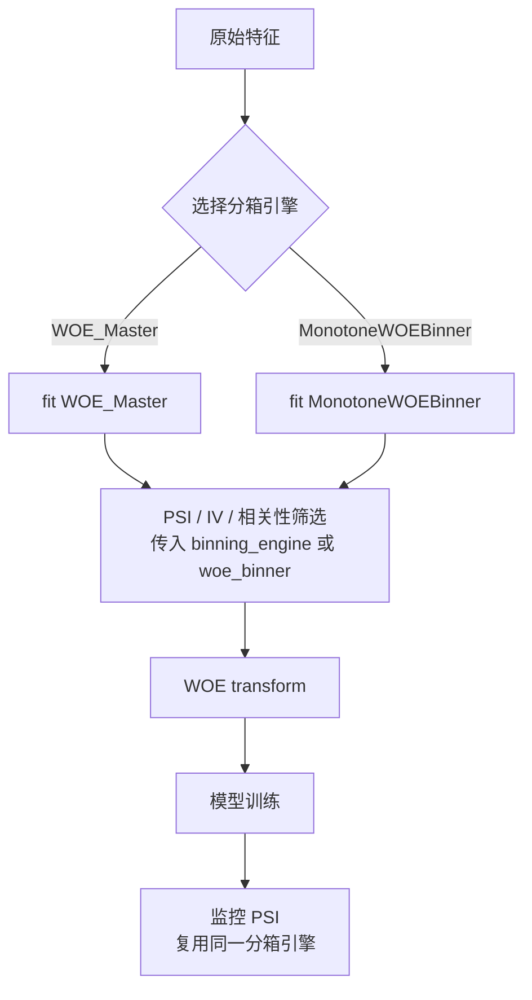

# WOE 分箱引擎

从 `0.1.4` 起，特征筛选工具支持复用已拟合的 WOE 分箱引擎。这样 PSI、IV、KS、相关性去冗余与最终建模使用的是同一套分箱，不会再出现“筛选时一套分箱，建模时另一套分箱”的偏差。



## 为什么需要统一引擎

过去 `PSICalculator`、`VarExtractionInsights`、`CorrelationFilter` 会各自重新分箱或默认使用 `WOE_Master`。如果生产模型实际采用 `MonotoneWOEBinner`，筛选指标就可能和最终 WOE 编码不一致。

统一分箱引擎后：

- PSI 使用训练期同一套分箱边界比较分布漂移。
- IV / KS 使用同一套 WOE 分箱计算变量解释力。
- 相关性去冗余时，保留变量的决策指标与最终建模一致。
- 默认不传新参数时，旧行为保持不变。

## 引擎对比

| 维度 | `WOE_Master` | `MonotoneWOEBinner` |
|------|-------------|---------------------|
| 适用场景 | 快速探索、通用 WOE 编码 | 评分卡上线、强单调约束 |
| 单调性 | 依赖分箱结果 | 贪心合并到单调 |
| 类别特征 | 按既有逻辑自动处理 | `cate_feats` + `refine_cate()` |
| 持久化产物 | mapping table | `get_final_bins()` |
| 转换方法 | `transform()` | `apply_woe()` |
| 统一入口 | `as_woe_engine(woe)` | `as_woe_engine(binner)` |

## 统一适配器

```python
from Modeling_Tool import as_woe_engine

engine = as_woe_engine(binner)   # binner 可以是 WOE_Master 或 MonotoneWOEBinner
woe_table = engine.get_woe_table(features)
train_woe = engine.transform(train_df, features)
```

大多数用户不需要直接操作 adapter，只需要把已拟合对象传给筛选工具。

## Monotone 路径示例

```python
from Modeling_Tool import PSICalculator, VarExtractionInsights, CorrelationFilter
from Modeling_Tool.WOE.WOE_Monotone_Binner import MonotoneWOEBinner

features = ["age", "income", "utilization"]

binner = MonotoneWOEBinner(
    feature_cols=features,
    target_col="bad_flag",
    n_init_bins=20,
    min_bin_size=0.03,
    special_values=[-1, -100, -999999],
)
binner.fit(train_df, chi2_binning=True, chi2_p=0.95)

# 1) PSI：复用 Monotone 分箱
psi = PSICalculator(buckets=10, binning_engine=binner)
psi_table = psi.calculate(train_df, oot_df, features)
stable_features = psi_table.loc[psi_table["psi"] < 0.1, "var"].tolist()

# 2) IV / KS：复用同一 binner
insights = VarExtractionInsights(
    data=train_df,
    dep="bad_flag",
    plot_path="./iv_plots/",
    woe_engine="monotone",
    woe_binner=binner,
)
iv_report = insights.get_var_analysis_report(train_df, stable_features)
keep_by_iv = iv_report.loc[iv_report["iv"].between(0.02, 0.5), "var"].tolist()

# 3) 相关性：高相关变量保留谁，也用同一套 IV/KS 指标
keep_vars = CorrelationFilter(
    data=train_df,
    dep="bad_flag",
    corr_cutpoint=0.7,
    woe_engine="monotone",
    woe_binner=binner,
).remove_highly_correlated(keep_by_iv)

# 4) 建模转换
train_woe = binner.apply_woe(train_df)
oot_woe = binner.apply_woe(oot_df)
```

超宽表或单变量分析可通过 `varlist` 限制转换范围，避免每次重复转换全部已拟合变量：

```python
age_income_woe = binner.apply_woe(train_df, varlist=["age", "income"])
bins = as_woe_engine(binner).assign_bins_frame(
    train_df,
    features,
    feature_block_size=64,
)
```

## WOE_Master 路径示例

```python
from Modeling_Tool import WOE_Master, PSICalculator, VarExtractionInsights

woe = WOE_Master(train_data=train_df, varlist=features, dep="bad_flag")
woe.fit(nbins=10, equal_freq=True)

psi_table = PSICalculator(binning_engine=woe).calculate(train_df, oot_df, features)

insights = VarExtractionInsights(
    data=train_df,
    dep="bad_flag",
    plot_path="./iv_plots/",
    woe_binner=woe,
)
iv_report = insights.get_var_analysis_report(train_df, features)

train_woe = woe.transform(train_df)
```

## 常见问题

??? question "不传 `binning_engine` 会怎样？"

    行为与旧版本一致：`PSICalculator` 仍按自身配置重新分箱，`VarExtractionInsights` 和 `CorrelationFilter` 仍走原有默认逻辑。

??? question "为什么 PSI 要复用建模分箱？"

    监控 PSI 的目标是检查线上样本相对训练样本在同一套特征映射下是否漂移。如果每次按当前数据重新分箱，PSI 会被分箱变化稀释，无法准确反映部署风险。

??? question "`CorrelationFilter` 应该传 raw 数据还是 WOE 数据？"

    推荐传 raw 数据，并传入同一个 `woe_binner`。相关性矩阵仍基于输入变量计算，但变量保留决策所需的 IV/KS 会复用该分箱引擎。
