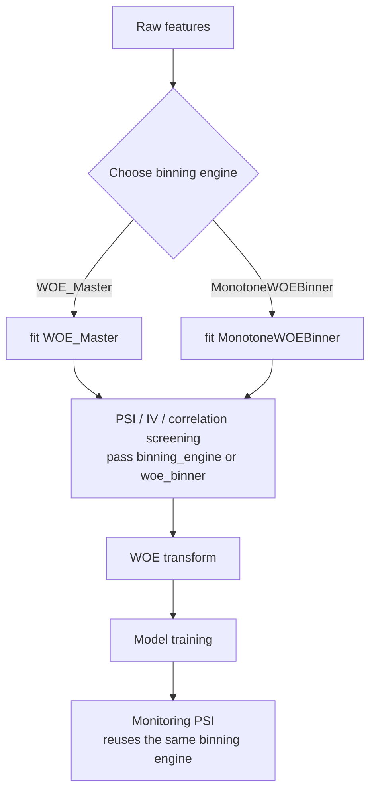

# WOE Binning Engine

The feature screening tools can reuse a WOE binning engine that you have already fitted. PSI, IV, KS, correlation
de-redundancy, and the final model then all use the same bins. Without it, a screening step may bin the data again with its own
settings, and its metrics describe different bins from the ones that go live.


```mermaid
flowchart TD
    A[Raw features] --> B{Choose binning engine}
    B -->|WOE_Master| C1[fit WOE_Master]
    B -->|MonotoneWOEBinner| C2[fit MonotoneWOEBinner]
    C1 --> D["PSI / IV / correlation screening<br/>pass binning_engine or woe_binner"]
    C2 --> D
    D --> E[WOE transform]
    E --> F[Model training]
    F --> G["Monitoring PSI<br/>reuses the same binning engine"]
```

## Why a Unified Engine Is Needed

`PSICalculator`, `VarExtractionInsights`, and `CorrelationFilter` bin the data themselves unless you hand them an engine. If
the production model uses `MonotoneWOEBinner`, their metrics can disagree with the final WOE encoding. With one engine:

- PSI compares drift on the same bin boundaries as at training time.
- IV and KS measure explanatory power on the same WOE bins.
- When two variables are highly correlated, the choice of which one to keep uses the IV and KS of the final bins.
- If you pass no engine, nothing changes: `PSICalculator` bins by its own configuration, and `VarExtractionInsights` and
  `CorrelationFilter` follow their original default logic.

## Engine Comparison

| Dimension | `WOE_Master` | `MonotoneWOEBinner` |
|---|---|---|
| Use case | Quick exploration, general WOE encoding | Scorecard deployment, strong monotonicity constraint |
| Monotonicity | Not enforced | Greedily merged until monotone |
| Categorical features | Not supported: numeric columns only | `cate_feats` and `refine_cate()` |
| Special and missing values | `spec_values` | `special_values`, with a `[Missing]` bin |
| Persisted artifact | Mapping table (`get_mapping_table()`, CSV) | `get_final_bins()` frames |
| Transform method | `transform()` | `apply_woe()` |
| Unified entry point | `as_woe_engine(woe)` | `as_woe_engine(binner)` |

See [WOE Encoding](woe.md) for both engines in detail.

## Example data

Every snippet on this page runs top to bottom in one Python session. The setup creates a synthetic sample where `-1` means
"no record" and some incomes are missing.

```python
import numpy as np
import pandas as pd

rng = np.random.default_rng(42)
n = 8000

df = pd.DataFrame({
    "age":         rng.normal(35, 8, n).clip(18, 70),
    "income":      rng.lognormal(10, 0.4, n),
    "score_b":     rng.normal(600, 60, n),
    "utilization": rng.uniform(0, 1, n),
    "n_overdue":   rng.poisson(0.3, n),
})
logit = -2.2 - 0.02 * (df["score_b"] - 600) + 0.5 * df["n_overdue"] - 0.8 * df["utilization"]
df["bad_flag"] = rng.binomial(1, 1 / (1 + np.exp(-logit)))

features = ["age", "income", "score_b", "utilization", "n_overdue"]
for col in features:                                  # -1 means "no record"
    df.loc[rng.random(n) < 0.02, col] = -1
df.loc[rng.random(n) < 0.05, "income"] = np.nan       # some incomes are missing

train_df = df.iloc[:5000].copy()
oot_df = df.iloc[5000:].copy()                        # later applications, never used to fit the bins
```

## Unified Adapter

`as_woe_engine()` wraps a fitted `WOE_Master` or `MonotoneWOEBinner` in an adapter with one interface. It never fits anything:
fit the engine first, then reuse it.

```python
from Modeling_Tool import MonotoneWOEBinner, WOE_Master, as_woe_engine

binner = MonotoneWOEBinner(
    feature_cols=features,
    target_col="bad_flag",
    n_init_bins=20,
    min_bin_size=0.03,
    special_values=[-1, np.nan],
)
binner.fit(train_df, chi2_binning=True, chi2_p=0.95)

engine = as_woe_engine(binner)                # a fitted WOE_Master works as well
woe_table = engine.get_woe_table(features)
train_woe = engine.transform(train_df, features)
print(engine.get_engine_name(), woe_table.shape, train_woe.shape)
```

| Adapter method | Returns |
|---|---|
| `transform(data, varlist=None, suffix="_woe")` | `data` with the WOE columns. With a `varlist`, only the original columns and those WOE columns |
| `get_woe_table(varlist=None)` | One table with columns `VAR`, `BIN_NUM`, `BIN_RANGE`, `MIN`, `MAX`, `N`, `N_BAD`, `N_GOOD`, `AVG_BAD`, `WOE`, `IV`, `IS_SPECIAL`, `ENGINE` |
| `assign_bins(data, var)` | Bin labels of one variable: the fitted WOE as text, or `__MISSING__` |
| `assign_bins_frame(data, varlist, feature_block_size=64)` | The same for several variables, in blocks of `feature_block_size` (`None` for one block). Bins with the same WOE share a label |
| `get_bin_edges(varlist=None)` | `{feature: [-inf, ..., inf]}` for the monotone engine, and `{}` for `WOE_Master` |
| `get_engine_name()` | `"master"` or `"monotone"` |

`as_woe_engine(None)` returns `None`, an existing adapter is returned unchanged, and any other object raises `TypeError`. Most
users never call the adapter directly. They pass the fitted engine to the screening tools, as below.

## Which Tools Accept an Engine

| Tool | How to pass it | Without it |
|---|---|---|
| `PSICalculator(buckets=10, ..., binning_engine=None)` | `binning_engine=engine` | Bins by its own `buckets`, `equal_freq`, and `min_bin_prop` |
| `VarExtractionInsights(data, dep, plot_path, ..., woe_engine="master", woe_binner=None, woe_engine_params=None)` | `woe_binner=engine` | Bins by its own settings |
| `CorrelationFilter(data, dep, corr_cutpoint=0.8, ..., woe_engine="master", woe_binner=None, woe_engine_params=None)` | `woe_binner=engine` | Bins by its own settings |
| `feature_screen(splits, feature_cols, target_col, *, config=None, prefit_woe_engine=None)` | `prefit_woe_engine=engine` | Fits its own engine. See [Feature Screening](feature.md) |

A `woe_binner` is used whenever you pass it, whatever `woe_engine` says, and an engine that is not fitted raises `RuntimeError`.
`woe_engine="monotone"` without a `woe_binner` makes `VarExtractionInsights` and `CorrelationFilter` fit their own
`MonotoneWOEBinner` (using their `spec_values` and chi-square settings, and `woe_engine_params` as extra constructor
arguments).

## Monotone Path Example

```python
from Modeling_Tool import PSICalculator, VarExtractionInsights, CorrelationFilter

# 1) PSI: reuse the monotone bins
psi = PSICalculator(buckets=10, binning_engine=binner)
psi_table = psi.calculate(train_df, oot_df, features)
stable_features = psi_table.loc[psi_table["psi"] < 0.1, "var"].tolist()

# 2) IV and KS: reuse the same binner
insights = VarExtractionInsights(
    data=train_df,
    dep="bad_flag",
    plot_path="./iv_plots/",
    woe_engine="monotone",
    woe_binner=binner,
)
iv_report = insights.get_var_analysis_report(train_df, stable_features, iv_cut=0.0)
keep_by_iv = iv_report.loc[iv_report["iv"] >= 0.02, "var"].tolist()

# 3) Correlation: which of two highly correlated variables to keep is decided with the same IV and KS
keep_vars = CorrelationFilter(
    data=train_df,
    dep="bad_flag",
    corr_cutpoint=0.7,
    woe_engine="monotone",
    woe_binner=binner,
).remove_highly_correlated(keep_by_iv)

# 4) Modeling transform
train_woe = binner.apply_woe(train_df)
oot_woe = binner.apply_woe(oot_df)

print(psi_table)
print(iv_report[["var", "iv", "n_bins"]])
print(keep_vars)
```

`get_var_analysis_report(data, varlist, dep=None, iv_cut=0.01)` drops the variables whose IV is below `iv_cut`, so the example
passes `iv_cut=0.0` to keep them all. `psi_table` has the columns `var` and `psi`. On a fitted engine the IV report has one row
per variable with `var`, `n_all`, `n`, `ks_in_gains`, `lift_in_gains`, `iv`, `n_bump`, `missing_rate`, `min`, `mean`, `max`, and
`n_bins`. `remove_highly_correlated` returns the list of variables to keep.

For very wide tables or single-variable work, limit the transform to the variables you need with `varlist`, instead of
transforming every fitted variable each time:

```python
age_income_woe = binner.apply_woe(train_df, varlist=["age", "income"])
bins = as_woe_engine(binner).assign_bins_frame(
    train_df,
    features,
    feature_block_size=64,
)
```

## WOE_Master Path Example

```python
woe = WOE_Master(train_data=train_df, varlist=features, dep="bad_flag")
woe.fit(nbins=10, equal_freq=True, spec_values=[-1, -999999])

psi_table = PSICalculator(binning_engine=woe).calculate(train_df, oot_df, features)

insights = VarExtractionInsights(
    data=train_df,
    dep="bad_flag",
    plot_path="./iv_plots/",
    woe_binner=woe,
)
iv_report = insights.get_var_analysis_report(train_df, features, iv_cut=0.0)

train_woe = woe.transform(train_df)
print(psi_table)
print(iv_report[["var", "iv", "n_bins"]])
```

## FAQ

??? question "Why should PSI reuse the modeling bins?"

    Monitoring PSI checks whether the online population drifts from the training population under the same feature mapping.
    If you re-bin on the current data each time, the bins move with the data, the PSI is diluted, and it no longer reflects
    deployment risk.

??? question "Should `CorrelationFilter` receive raw data or WOE data?"

    Raw data, together with the same `woe_binner`. The correlation matrix is still computed from the input variables, and the
    IV and KS that decide which variable to keep reuse the engine's bins.

??? question "`RuntimeError` that asks me to call `fit()` or `load_woe_bins()`"

    The `MonotoneWOEBinner` you passed is not fitted. Call `fit()` first, or load saved bins with `load_woe_bins()`.
