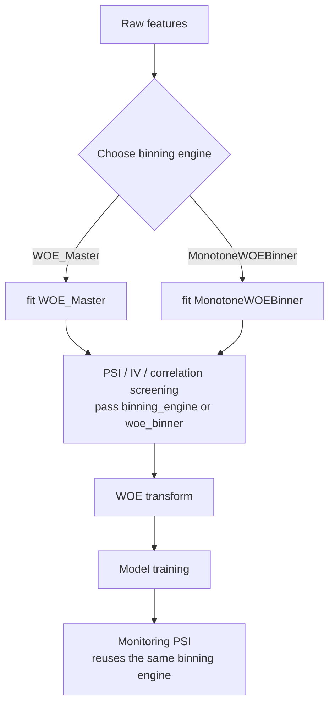

# WOE Binning Engine

Starting with `0.1.4`, the feature screening tools can reuse an already-fitted WOE binning engine. This way, PSI, IV, KS, correlation de-redundancy, and the final model all use the same binning, so you no longer get the discrepancy of "one binning at screening time, another at modeling time".


```mermaid
flowchart TD
    A[Raw features] --> B{Choose binning engine}
    B -->|WOE_Master| C1[fit WOE_Master]
    B -->|MonotoneWOEBinner| C2[fit MonotoneWOEBinner]
    C1 --> D[PSI / IV / correlation screening\npass binning_engine or woe_binner]
    C2 --> D
    D --> E[WOE transform]
    E --> F[Model training]
    F --> G[Monitoring PSI\nreuses the same binning engine]
```

## Why a Unified Engine Is Needed

Previously, `PSICalculator`, `VarExtractionInsights`, and `CorrelationFilter` each re-binned independently or defaulted to `WOE_Master`. If the production model actually used `MonotoneWOEBinner`, the screening metrics could disagree with the final WOE encoding.

With a unified binning engine:

- PSI compares distribution drift using the same bin boundaries as at training time.
- IV / KS measure variable explanatory power using the same WOE bins.
- During correlation de-redundancy, the decision metrics for which variable to keep match the final model.
- When the new parameters are not passed, the old behavior is unchanged.

## Engine Comparison

| Dimension | `WOE_Master` | `MonotoneWOEBinner` |
|------|-------------|---------------------|
| Use case | Quick exploration, general WOE encoding | Scorecard deployment, strong monotonicity constraint |
| Monotonicity | Depends on the binning result | Greedily merged until monotone |
| Categorical features | Handled automatically by existing logic | `cate_feats` + `refine_cate()` |
| Persisted artifact | mapping table | `get_final_bins()` |
| Transform method | `transform()` | `apply_woe()` |
| Unified entry point | `as_woe_engine(woe)` | `as_woe_engine(binner)` |

## Unified Adapter

```python
from Modeling_Tool import as_woe_engine

engine = as_woe_engine(binner)   # binner can be a WOE_Master or a MonotoneWOEBinner
woe_table = engine.get_woe_table(features)
train_woe = engine.transform(train_df, features)
```

Most users do not need to operate the adapter directly; just pass the fitted object to the screening tools.

## Monotone Path Example

```python
from Modeling_Tool import PSICalculator, VarExtractionInsights, CorrelationFilter
from Modeling_Tool.WOE.WOE_Monotone_Binner import MonotoneWOEBinner

features = ["age", "income", "utilization"]

binner = MonotoneWOEBinner(
    feature_cols=features,
    target_col="bad_flag",
    n_init_bins=20,
    min_bin_size=0.03,
    special_values=[-1, -100, -999999],
)
binner.fit(train_df, chi2_binning=True, chi2_p=0.95)

# 1) PSI: reuse the Monotone binning
psi = PSICalculator(buckets=10, binning_engine=binner)
psi_table = psi.calculate(train_df, oot_df, features)
stable_features = psi_table.loc[psi_table["psi"] < 0.1, "var"].tolist()

# 2) IV / KS: reuse the same binner
insights = VarExtractionInsights(
    data=train_df,
    dep="bad_flag",
    plot_path="./iv_plots/",
    woe_engine="monotone",
    woe_binner=binner,
)
iv_report = insights.get_var_analysis_report(train_df, stable_features)
keep_by_iv = iv_report.loc[iv_report["iv"].between(0.02, 0.5), "var"].tolist()

# 3) Correlation: which of two highly correlated variables to keep is also decided with the same IV/KS metrics
keep_vars = CorrelationFilter(
    data=train_df,
    dep="bad_flag",
    corr_cutpoint=0.7,
    woe_engine="monotone",
    woe_binner=binner,
).remove_highly_correlated(keep_by_iv)

# 4) Modeling transform
train_woe = binner.apply_woe(train_df)
oot_woe = binner.apply_woe(oot_df)
```

For very wide tables or single-variable analysis, you can limit the transform scope through `varlist`, avoiding repeated transformation of all fitted variables each time:

```python
age_income_woe = binner.apply_woe(train_df, varlist=["age", "income"])
bins = as_woe_engine(binner).assign_bins_frame(
    train_df,
    features,
    feature_block_size=64,
)
```

## WOE_Master Path Example

```python
from Modeling_Tool import WOE_Master, PSICalculator, VarExtractionInsights

woe = WOE_Master(train_data=train_df, varlist=features, dep="bad_flag")
woe.fit(nbins=10, equal_freq=True)

psi_table = PSICalculator(binning_engine=woe).calculate(train_df, oot_df, features)

insights = VarExtractionInsights(
    data=train_df,
    dep="bad_flag",
    plot_path="./iv_plots/",
    woe_binner=woe,
)
iv_report = insights.get_var_analysis_report(train_df, features)

train_woe = woe.transform(train_df)
```

## FAQ

??? question "What happens if I don't pass `binning_engine`?"

    Behavior matches the old versions: `PSICalculator` still re-bins according to its own configuration, and `VarExtractionInsights` and `CorrelationFilter` still follow their original default logic.

??? question "Why should PSI reuse the modeling bins?"

    The goal of monitoring PSI is to check whether online samples drift relative to training samples under the same feature mapping. If you re-bin on the current data each time, the PSI is diluted by the bin changes and cannot accurately reflect deployment risk.

??? question "Should `CorrelationFilter` receive raw data or WOE data?"

    Raw data is recommended, together with the same `woe_binner`. The correlation matrix is still computed from the input variables, but the IV/KS needed for deciding which variable to keep reuses that binning engine.
