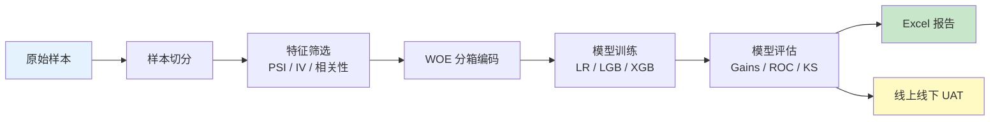

# 端到端建模流水线

本页用一条**生产级信用评分卡**的开发流程，把 SuperModelingFactory 的所有模块串起来。每一步都给出**目标 → 输入 → 输出 → 关键参数 → 完整代码**四要素，方便你按需取用。

## 流程总览



## Step 1：样本切分

**目标**：把全量样本分为 **训练集 / 验证集 / OOT 测试集**，保持目标变量分布一致。

```python
from Modeling_Tool import SampleSplitter, StratifiedSampler

# 7:3 切分（OOT 不参与分层）
splitter = SampleSplitter(test_size=0.3, random_state=42, stratify=True)
train_df, test_df = splitter.split_df(master_df, target="bad_flag")

# 分层采样（保持坏样本率一致）
strat = StratifiedSampler(random_state=42)
stratified = strat.sample(train_df, target="bad_flag", n_samples=5000)
```

!!! tip "OOT 与时间切分"

    真实业务里 OOT（Out-Of-Time）测试集通常按**时间窗**切分：

    ```python
    train_df = df[df["apply_month"] < "2025-07"]
    oot_df   = df[df["apply_month"] >= "2025-07"]
    ```

**关键参数**：

| 参数 | 默认值 | 含义 |
|------|-------|------|
| `test_size` | 0.25 | 验证集占比 |
| `stratify` | `True` | 是否按目标分层 |
| `random_state` | `None` | 随机种子 |

## Step 2：特征筛选

**目标**：从候选特征中剔除稳定性差、解释性弱、相关性过高的变量。

### 2.1 PSI 稳定性检验

```python
from Modeling_Tool import PSICalculator

psi = PSICalculator(buckets=10, equal_freq=True)
psi_table = psi.calculate(expected_df=train_df, current_data=oot_df, varlist=features)
print(psi_table.sort_values("PSI", ascending=False).head(10))

# PSI < 0.1 视为稳定
stable_features = psi_table.loc[psi_table["PSI"] < 0.1, "variable"].tolist()
```

### 2.2 IV 信息量排序

```python
from Modeling_Tool import VarExtractionInsights

insights = VarExtractionInsights(
    data=train_df,
    dep="bad_flag",
    plot_path="./iv_plots/",
    nbins=10,
)
report = insights.get_var_analysis_report(train_df, features)

# IV 阈值：<0.02 剔除，>0.5 警惕过拟合
keep_by_iv = report.loc[report["IV"].between(0.02, 0.5), "variable"].tolist()
```

### 2.3 高相关剔除

```python
from Modeling_Tool import CorrelationFilter

corr_filter = CorrelationFilter(data=train_woe, dep="bad_flag", corr_cutpoint=0.7)
keep_vars = corr_filter.remove_highly_correlated(keep_by_iv)
```

**特征筛选总流程**：

```python
# 三道过滤叠加
features = list(dict.fromkeys(stable_features + keep_by_iv))   # 并集去重
features = corr_filter.remove_highly_correlated(features)       # 相关性过滤
```

## Step 3：WOE 编码

**目标**：把原始特征映射为单调 WOE 值，便于 LR 训练与解释。

```python
from Modeling_Tool import WOE_Master, save_mapping_table

woe = WOE_Master(
    train_data=train_df,
    varlist=features,
    dep="bad_flag",
    missing_ref_value=-999999,
)
woe.fit(nbins=10, equal_freq=True)

train_woe = woe.transform(train_df)
test_woe  = woe.transform(test_df)
oot_woe   = woe.transform(oot_df)

# 持久化映射表（部署时直接加载）
save_mapping_table(woe, "./output/woe_mapping.pkl")
```

### 单调性检查

```python
from Modeling_Tool import is_monotonic, get_overall_woe_table

for var in features:
    woe_table = get_overall_woe_table(woe, train_df, [var])
    mono, direction = is_monotonic(woe_table, "WOE", direction="auto")
    if not mono:
        print(f"⚠️  {var} WOE 非单调")
```

### 替代方案：贪心单调分箱

如果对单调性要求高：

```python
from Modeling_Tool.WOE.WOE_Monotone_Binner import MonotoneWOEBinner

binner = MonotoneWOEBinner(
    feature_cols=features,
    target_col="bad_flag",
    n_init_bins=20,
    min_bin_size=0.03,
    special_values=[-1, -100, -999999],
)
binner.fit(train_df, chi2_binning=True, chi2_p=0.95)
train_woe = binner.apply_woe(train_df)
binner.export_woe_report("./output/woe_report.xlsx")
```

## Step 4：模型训练

### 4.1 逻辑回归（评分卡首选）

```python
from Modeling_Tool import LRMaster

woe_features = [f"{f}_woe" for f in features]

lr = LRMaster(params={"C": 1.0, "max_iter": 1000, "solver": "lbfgs"})
lr.fit(train_woe[woe_features], train_woe["bad_flag"])

# 系数 + VIF + p-value 完整摘要
summary = lr.get_model_summary()
print(summary)
```

### 4.2 LightGBM / XGBoost

```python
from Modeling_Tool import GradientBoostingModel

gbm = GradientBoostingModel(
    "lgb",
    params={
        "n_estimators": 500,
        "learning_rate": 0.05,
        "max_depth": 4,
        "num_leaves": 15,
        "min_child_samples": 100,
        "subsample": 0.8,
        "colsample_bytree": 0.8,
        "early_stopping_rounds": 30,
        "eval_metric": "auc",
    },
)
gbm.fit(
    train_woe[woe_features], train_woe["bad_flag"],
    test_woe[woe_features],  test_woe["bad_flag"],
)

# 变量重要性
varimp = gbm.get_feature_importance()
print(varimp.head(15))
```

### 4.3 后向变量消元

```python
from Modeling_Tool import BackwardVariableEliminator

eliminator = BackwardVariableEliminator(
    model_type="lgb",
    train_data=train_woe,
    validation_data=test_woe,
    oot_data=oot_woe,
    params={"n_estimators": 100, "learning_rate": 0.1},
    y="bad_flag",
    results_output_dir="./output/",   # 构造器参数，非 fit 参数
    modelsave_dir="./models/",
)
eliminator.fit(x=woe_features).analyze()
```

## Step 5：模型评估

### 5.1 多数据集汇总

```python
from Modeling_Tool import PerformanceEvaluator

evaluator = PerformanceEvaluator(
    tgt_name="bad_flag",
    model=gbm._model.model,
    feature_cols=woe_features,
)
perf = (
    evaluator.add_dataset("train", train_woe)
              .add_dataset("test",  test_woe)
              .add_dataset("oot",   oot_woe)
              .evaluate()
)
print(perf[["index", "KS", "AUC", "Top10%_TargetRate"]])
```

### 5.2 Gains 表

```python
from Modeling_Tool import GainsTableCalculator

gains = GainsTableCalculator(
    data=test_woe,
    score="prob",       # 模型预测概率列
    dep="bad_flag",
    nbins=10,
)
gains_table = gains.calculate()
print(gains_table)
```

### 5.3 链式分组评估

按时间段对比：

```python
from Modeling_Tool import Model_Evaluation_Tool, EvaluationPipeline

m_eval = Model_Evaluation_Tool(data=test_woe, dep="bad_flag", comp_scrlist=["prob"])

pipeline = (
    EvaluationPipeline(m_eval)
    .group_by("apply_month", min_size=100)
)

def my_metrics(current_data):
    return current_data.groupby("apply_month").agg(
        bad_rate=("bad_flag", "mean"),
        avg_score=("prob", "mean"),
        n=("bad_flag", "size"),
    )

result = pipeline.apply(my_metrics)
```

## Step 6：模型监控 —— PSI

```python
from Modeling_Tool import PSICalculator

psi = PSICalculator(buckets=10)
psi_monitor = psi.calculate(expected_df=train_df, current_data=latest_df, varlist=features)
print(psi_monitor)
```

## Step 7：Excel 报告

```python
from ExcelMaster.ExcelMaster import ExcelMaster

em = ExcelMaster("model_evaluation_report.xlsx", verbose=False)

# ---- 性能汇总 ----
ws1 = em.add_worksheet("模型性能")
em.merge_col(ws1, ncols=5, text="LightGBM 模型性能")
em.write_dataframe(ws1, perf, title="性能指标",
                   titleformat="BLUE_H2", headerformat="ORANGE_H4",
                   valueformat="NUM%.4")

# ---- Gains 表 ----
ws2 = em.add_worksheet("Gains")
em.write_dataframe(ws2, gains_table, title="Gains Table",
                   titleformat="BLUE_H2")

# ---- WOE 批量图 ----
ws3 = em.add_worksheet("WOE 分析")
from Modeling_Tool.WOE.WOE_Report_Builder import get_woe_plot_report_new
get_woe_plot_report_new(
    em, ws3,
    woe_plot_dir="./output/woe_plot/",
    grp_name="apply_month",
    varlist=features,
)

# ---- 变量重要性 ----
ws4 = em.add_worksheet("变量重要性")
em.write_dataframe(ws4, varimp.head(20), title="Top 20 变量重要性",
                   titleformat="BLUE_H2")

em.close_workbook()
print("已生成 model_evaluation_report.xlsx")
```

## Step 8：拒绝推断（可选）

如果建模数据只来自**审批通过**的样本，需要做拒绝推断以修正选择偏差：

```python
from Modeling_Tool import RejectInferenceFactory

# 用分箱法推断（推荐）
inferrer = RejectInferenceFactory.create(
    "parceling",
    target_col="bad_flag",
    score_col="prob",
)
df_with_inferred = inferrer.infer(
    df_approved=approved_df,
    df_rejected=rejected_df,
    score_col="prob",
)
```

## Step 9：UAT 一致性校验

模型上线后，用 SQL 拉取线上/线下同一批用户的打分与特征做容差比对（详见 [线上线下一致性校验](guides/uat.md)）：

```python
from Modeling_Tool.Core.ODPS_Tool import ODPSRunner
from Modeling_Tool.UAT.UAT_Consistency_Checker import UATConsistencyChecker, UATConfig

config = UATConfig(
    main_model_score_col="credit_risk_ltrs_subomdel_score",
    sql_dir="sql",
    offline_sql="pull_offline.sql",
    online_sql="pull_online.sql",
    tol_score=1e-6,
    tol_feat=1e-2,
    excel_output_path="uat_report.xlsx",
)
summary_df = UATConsistencyChecker(config, ODPSRunner()).run()
print(summary_df)
```

## 完整流水线（一键脚本）

```python
"""端到端建模流水线 —— 把本节全部片段组合为单个脚本。"""
import numpy as np
import pandas as pd
from Modeling_Tool import (
    SampleSplitter, WOE_Master, PSICalculator, CorrelationFilter,
    GradientBoostingModel, PerformanceEvaluator, GainsTableCalculator,
)
from ExcelMaster.ExcelMaster import ExcelMaster

# ============ 1) 样本切分 ============
train_df, test_df = SampleSplitter(test_size=0.3, random_state=42, stratify=True) \
                     .split_df(data, target="bad_flag")

features = ["age", "income", "score_b", "city_grade", "n_overdue"]

# ============ 2) 特征筛选 ============
psi = PSICalculator(buckets=10).calculate(train_df, test_df, features)
features = psi.loc[psi["PSI"] < 0.1, "variable"].tolist()

# ============ 3) WOE 编码 ============
woe = WOE_Master(train_data=train_df, varlist=features, dep="bad_flag")
woe.fit(nbins=10, equal_freq=True)
train_woe, test_woe = woe.transform(train_df), woe.transform(test_df)
woe_features = [f"{f}_woe" for f in features]

# ============ 4) 模型训练 ============
gbm = GradientBoostingModel("lgb", {"n_estimators": 200, "learning_rate": 0.05})
gbm.fit(train_woe[woe_features], train_woe["bad_flag"],
        test_woe[woe_features],  test_woe["bad_flag"])

# ============ 5) 模型评估 ============
perf = PerformanceEvaluator(
    tgt_name="bad_flag",
    model=gbm._model.model,
    feature_cols=woe_features,
).add_dataset("train", train_woe).add_dataset("test", test_woe).evaluate()

gains = GainsTableCalculator(test_woe, score="prob", dep="bad_flag").calculate()

# ============ 6) Excel 报告 ============
em = ExcelMaster("model_report.xlsx", verbose=False)
ws = em.add_worksheet("Performance")
em.write_dataframe(ws, perf, title="模型性能",
                   titleformat="BLUE_H2", headerformat="ORANGE_H4",
                   valueformat="NUM%.4")
em.close_workbook()
```

## 下一步

- 想深入某个步骤？请跳转到对应的 [用户指南](guides/index.md)
- 想查具体 API 签名？请访问 [API 参考](api/index.md)
- 想看 Excel 报告的更多模板？请阅读 [Excel 报告生成](guides/excel_report.md)
