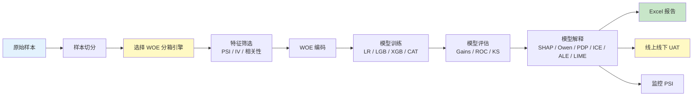

# 端到端建模流水线

本页用一条生产级信用评分卡开发流程，把 SuperModelingFactory 的主要模块串起来。重点原则：**训练期确定一套分箱引擎，筛选、编码、监控都复用它**。

若样本带权重（如按余额加权、过采样校正），在训练与评估阶段**统一传入同一 `weight_col`**，保证指标口径一致。详见 [模型训练 — 样本权重](guides/model.md#样本权重) 与 [模型评估 — 样本权重评估](guides/eval.md#样本权重评估)。

## 流程总览



## Step 1：样本切分

```python
from Modeling_Tool import SampleSplitter

splitter = SampleSplitter(test_size=0.3, random_state=42, stratify=True)
train_df, test_df = splitter.split_df(master_df, target="bad_flag")

oot_df = master_df[master_df["apply_month"] >= "2025-07"].copy()

# 权重列随 DataFrame 一起切分（示例：sample_wgt 已在 master_df 中）
assert "sample_wgt" in train_df.columns
```

!!! tip "权重列准备"

    权重列应在切分**之前**写入 `master_df`，切分后 `train_df` / `test_df` / `oot_df`
    均保留该列。典型来源：贷款余额、时间衰减系数、过采样逆概率等。

## Step 2：选择分箱引擎

如果只是快速探索，可以使用 `WOE_Master`；如果要做评分卡上线，推荐使用 `MonotoneWOEBinner`。

=== "WOE_Master"

    ```python
    from Modeling_Tool import WOE_Master

    woe_engine = WOE_Master(
        train_data=train_df,
        varlist=features,
        dep="bad_flag",
        missing_ref_value=-999999,
    )
    woe_engine.fit(nbins=10, equal_freq=True)
    ```

=== "MonotoneWOEBinner"

    ```python
    from Modeling_Tool.WOE.WOE_Monotone_Binner import MonotoneWOEBinner

    woe_engine = MonotoneWOEBinner(
        feature_cols=features,
        target_col="bad_flag",
        n_init_bins=20,
        min_bin_size=0.03,
        special_values=[-1, -100, -999999],
    )
    woe_engine.fit(train_df, chi2_binning=True, chi2_p=0.95)
    ```

!!! tip "为什么先选分箱引擎？"

    PSI、IV、相关性去冗余都应该基于最终建模使用的同一套分箱。否则筛选指标与最终 WOE 特征可能不一致。

## Step 3：特征筛选

### 3.1 PSI 稳定性

```python
from Modeling_Tool import PSICalculator

psi = PSICalculator(buckets=10, binning_engine=woe_engine)
psi_table = psi.calculate(expected_df=train_df, current_data=oot_df, varlist=features)
stable_features = psi_table.loc[psi_table["psi"] < 0.1, "var"].tolist()
```

### 3.2 IV / KS 信息量

```python
from Modeling_Tool import VarExtractionInsights

insights = VarExtractionInsights(
    data=train_df,
    dep="bad_flag",
    plot_path="./iv_plots/",
    woe_engine="monotone" if hasattr(woe_engine, "apply_woe") else "master",
    woe_binner=woe_engine,
)
report = insights.get_var_analysis_report(train_df, stable_features)
keep_by_iv = report.loc[report["iv"].between(0.02, 0.5), "var"].tolist()
```

### 3.3 高相关剔除

```python
from Modeling_Tool import CorrelationFilter

keep_vars = CorrelationFilter(
    data=train_df,
    dep="bad_flag",
    corr_cutpoint=0.7,
    woe_engine="monotone" if hasattr(woe_engine, "apply_woe") else "master",
    woe_binner=woe_engine,
).remove_highly_correlated(keep_by_iv)
```

## Step 4：WOE 编码

如果 Step 2 已经拟合了分箱器，这里不要重新 fit，直接 transform/apply。

```python
if hasattr(woe_engine, "apply_woe"):
    train_woe = woe_engine.apply_woe(train_df)
    test_woe = woe_engine.apply_woe(test_df)
    oot_woe = woe_engine.apply_woe(oot_df)
else:
    train_woe = woe_engine.transform(train_df, keep_vars)
    test_woe = woe_engine.transform(test_df, keep_vars)
    oot_woe = woe_engine.transform(oot_df, keep_vars)

woe_features = [f"{f}_woe" for f in keep_vars]

# 权重列随 WOE 编码保留（未做变换）
WEIGHT_COL = "sample_wgt"
```

## Step 5：模型训练

```python
from Modeling_Tool import LRMaster, GradientBoostingModel

# 逻辑回归：weight_col
lr = LRMaster(params={"C": 1.0, "max_iter": 1000, "solver": "lbfgs"})
lr.fit(train_woe, woe_features, "bad_flag", weight_col=WEIGHT_COL)

# 或使用 GBM：sample_weight / eval_sample_weight
gbm = GradientBoostingModel("lgb", {"n_estimators": 300, "learning_rate": 0.05})
gbm.fit(
    train_woe[woe_features], train_woe["bad_flag"],
    test_woe[woe_features],  test_woe["bad_flag"],
    sample_weight=train_woe[WEIGHT_COL],
    eval_sample_weight=test_woe[WEIGHT_COL],
)
```

可选：对 GBM 做加权 holdout 超参搜索（见 [GBM 超参搜索](guides/gbm_param_search.md#5-样本权重)）：

```python
gbm.param_search(
    data=train_woe,
    varlist=woe_features,
    tgt_name="bad_flag",
    eval_sets={"train": train_woe, "test": test_woe, "oot": oot_woe},
    search_space={"max_depth": [3, 4, 5], "num_leaves": [15, 31]},
    weight_col=WEIGHT_COL,
    eval_weight_col=WEIGHT_COL,
    primary_set="oot",
    refit=True,
)
```

## Step 6：模型评估

```python
from Modeling_Tool import PerformanceEvaluator, GainsTableCalculator

# 多数据集性能汇总（加权 AUC / KS / Lift）
perf = (
    PerformanceEvaluator(
        tgt_name="bad_flag",
        model=gbm._model.model,
        feature_cols=woe_features,
        weight_col=WEIGHT_COL,
    )
    .add_dataset("train", train_woe)
    .add_dataset("test", test_woe)
    .add_dataset("oot", oot_woe)
    .evaluate()
)
print(perf[["index", "KS", "AUC", "Top10%_TargetRate"]])

# Gains 表（N=权重和, N_RAW=行数）
gains = GainsTableCalculator(
    data=test_woe,
    score="prob",
    dep="bad_flag",
    weight_col=WEIGHT_COL,
    weighted_binning=True,
    nbins=10,
).calculate()
print(gains[["thresholds", "N", "N_RAW", "bad_rate", "lift"]])
```

## Step 7：模型解释

训练好的 GBM 可以直接交给 `ModelExplainer`。如果存在高度相关或同业务来源的变量，先构建 coalition structure，再计算 Owen Value，能得到更稳定的模块级 reason code。

!!! note "安装解释依赖"

    SHAP、Owen Value 和 LIME 是可选依赖。如果需要运行下面完整示例，请先安装：

    ```bash
    pip install 'supermodelingfactory[explain]'
    ```

```python
from Modeling_Tool import ModelExplainer, build_coalition_structure

explain_x = test_woe[woe_features]
background_x = train_woe[woe_features].sample(
    n=min(1000, len(train_woe)),
    random_state=42,
)
focus_feature = woe_features[0]

explainer = ModelExplainer(gbm, background_data=background_x)

# 1) SHAP：全局重要性、summary 图、单样本贡献
explainer.explain(explain_x)
shap_importance = explainer.feature_importance(normalize=True)
explainer.summary_plot(show=False, save_path="./output/explain/shap_summary.png")
local_shap = explainer.explain_instance(explain_x.iloc[[0]])

# 2) Owen Value：先验分组 + 自动聚类兜底，输出模块级 reason code
prior_groups = {
    "delinquency": ["max_dpd_12m_woe", "dpd_cnt_6m_woe", "ever_dpd30_woe"],
    "multi_lending": ["inquiries_3m_woe", "inquiries_6m_woe", "active_loans_woe"],
    "affordability": ["monthly_income_woe", "debt_to_income_woe", "monthly_obligation_woe"],
}

coalition = build_coalition_structure(
    background_x,
    prior_groups=prior_groups,
    threshold=0.35,
    method="complete",
    corr_method="spearman",
)
print(coalition["summary"][["n_features", "mean_abs_corr", "max_abs_corr"]])

# 非线性关联场景可改用 MIC：pip install 'supermodelingfactory[mic]'
# coalition = build_coalition_structure(background_x, threshold=0.35, corr_method="MIC")

explainer.explain_owen(
    explain_x,
    coalition_structure=coalition,
    model_output="log_odds",
    max_evals=500,
)
owen_group = explainer.owen_group_importance(normalize=True)
owen_local = explainer.owen_explain_instance(explain_x.iloc[0])

# 3) PDP：平均边际影响
pdp_curve = explainer.partial_dependence(
    explain_x,
    feature=focus_feature,
    grid_resolution=30,
    sample_size=2000,
    random_state=42,
)
explainer.pdp_plot(explain_x, feature=focus_feature, show=False, save_path="./output/explain/pdp.png")

# 4) ICE：个体响应曲线
ice_curve = explainer.ice(
    explain_x,
    feature=focus_feature,
    grid_resolution=30,
    sample_size=100,
    random_state=42,
    centered=True,
)
explainer.ice_plot(explain_x, feature=focus_feature, centered=True, show=False, save_path="./output/explain/ice.png")

# 5) ALE：累计局部效应
ale_curve = explainer.ale(explain_x, feature=focus_feature, bins=20)
explainer.ale_plot(explain_x, feature=focus_feature, show=False, save_path="./output/explain/ale.png")

# 6) LIME：单样本局部解释 + 采样聚合重要性
lime_local = explainer.lime_explain_instance(
    x_row=explain_x.iloc[0],
    X_train=background_x,
    num_features=10,
    num_samples=3000,
    random_state=42,
)
lime_global = explainer.lime_global_importance(
    X=explain_x,
    X_train=background_x,
    sample_size=50,
    num_features=10,
    num_samples=1000,
    random_state=42,
)

print(shap_importance.head(10))
print(owen_group[["group", "mean_abs_owen", "importance_pct"]].head(10))
print(owen_local[["group", "owen_value", "features"]].head(10))
print(pdp_curve.head())
print(ice_curve.head())
print(ale_curve.head())
print(lime_local.head(10))
print(lime_global.head(10))
```

!!! tip "性能建议"

    PDP、ICE、ALE、LIME 和 Owen Value 都会反复调用模型预测。生产样本较大时，建议通过 `sample_size`、`background_x.sample(...)` 或 `max_evals` 控制解释成本。

## Step 8：模型监控 PSI

监控期继续复用训练期分箱引擎：

```python
psi_monitor = PSICalculator(binning_engine=woe_engine).calculate(
    expected_df=train_df,
    current_data=latest_df,
    varlist=keep_vars,
)
print(psi_monitor)
```

## Step 9：Excel 报告

```python
from ExcelMaster.ExcelMaster import ExcelMaster

em = ExcelMaster("model_report.xlsx", verbose=False)
ws = em.add_worksheet("Performance")
em.write_dataframe(
    ws,
    perf,
    title="模型性能",
    titleformat="BLUE_H2",
    headerformat="ORANGE_H4",
    valueformat="NUM%.4",
)
em.close_workbook()
```

如果使用 `MonotoneWOEBinner`，可直接输出 WOE 图和报告：

```python
if hasattr(woe_engine, "plot_woe_graph"):
    woe_engine.plot_woe_graph("./output/woe_plot/", group_name="apply_month", _df_for_group=train_df)
    woe_engine.export_woe_report("./output/woe_report.xlsx")
```

## Step 10：UAT 一致性校验

```python
from Modeling_Tool.Core.ODPS_Tool import ODPSRunner
from Modeling_Tool.UAT.UAT_Consistency_Checker import UATConsistencyChecker, UATConfig

config = UATConfig(
    main_model_score_col="credit_risk_score",
    sql_dir="sql",
    offline_sql="pull_offline.sql",
    online_sql="pull_online.sql",
    tol_score=1e-6,
    tol_feat=1e-2,
    excel_output_path="uat_report.xlsx",
)
summary_df = UATConsistencyChecker(config, ODPSRunner()).run()
```

## 完整流水线（一键脚本）

```python
from Modeling_Tool import (
    SampleSplitter, PSICalculator, VarExtractionInsights, CorrelationFilter,
    GradientBoostingModel, PerformanceEvaluator, GainsTableCalculator, ModelExplainer,
    build_coalition_structure,
)
from Modeling_Tool.WOE.WOE_Monotone_Binner import MonotoneWOEBinner

WEIGHT_COL = "sample_wgt"

train_df, test_df = SampleSplitter(test_size=0.3, random_state=42, stratify=True) \
    .split_df(data, target="bad_flag")
oot_df = data[data["apply_month"] >= "2025-07"].copy()
features = ["age", "income", "score_b", "city_grade", "n_overdue"]

binner = MonotoneWOEBinner(feature_cols=features, target_col="bad_flag")
binner.fit(train_df, chi2_binning=True, chi2_p=0.95)

psi = PSICalculator(binning_engine=binner).calculate(train_df, oot_df, features)
features = psi.loc[psi["psi"] < 0.1, "var"].tolist()

iv_report = VarExtractionInsights(
    train_df, "bad_flag", "./iv_plots/",
    woe_engine="monotone", woe_binner=binner,
).get_var_analysis_report(train_df, features)
features = iv_report.loc[iv_report["iv"].between(0.02, 0.5), "var"].tolist()

features = CorrelationFilter(
    train_df, "bad_flag", corr_cutpoint=0.7,
    woe_engine="monotone", woe_binner=binner,
).remove_highly_correlated(features)

train_woe = binner.apply_woe(train_df)
test_woe = binner.apply_woe(test_df)
oot_woe = binner.apply_woe(oot_df)
woe_features = [f"{f}_woe" for f in features]

gbm = GradientBoostingModel("lgb", {"n_estimators": 200, "learning_rate": 0.05})
gbm.fit(
    train_woe[woe_features], train_woe["bad_flag"],
    test_woe[woe_features], test_woe["bad_flag"],
    sample_weight=train_woe[WEIGHT_COL],
    eval_sample_weight=test_woe[WEIGHT_COL],
)

perf = PerformanceEvaluator(
    tgt_name="bad_flag",
    model=gbm._model.model,
    feature_cols=woe_features,
    weight_col=WEIGHT_COL,
).add_dataset("train", train_woe).add_dataset("test", test_woe).add_dataset("oot", oot_woe).evaluate()

gains = GainsTableCalculator(
    test_woe, score="prob", dep="bad_flag",
    weight_col=WEIGHT_COL, weighted_binning=True, nbins=10,
).calculate()

explain_x = test_woe[woe_features]
background_x = train_woe[woe_features].sample(n=min(1000, len(train_woe)), random_state=42)
focus_feature = woe_features[0]
explainer = ModelExplainer(gbm, background_data=background_x)

explainer.explain(explain_x)
shap_importance = explainer.feature_importance(normalize=True)

prior_groups = {
    "delinquency": ["max_dpd_12m_woe", "dpd_cnt_6m_woe", "ever_dpd30_woe"],
    "multi_lending": ["inquiries_3m_woe", "inquiries_6m_woe", "active_loans_woe"],
}
coalition = build_coalition_structure(background_x, prior_groups=prior_groups, threshold=0.35)
explainer.explain_owen(explain_x, coalition_structure=coalition, model_output="log_odds", max_evals=500)
owen_group = explainer.owen_group_importance(normalize=True)
owen_local = explainer.owen_explain_instance(explain_x.iloc[0])

pdp_curve = explainer.partial_dependence(explain_x, focus_feature, sample_size=2000, random_state=42)
ice_curve = explainer.ice(explain_x, focus_feature, sample_size=100, centered=True, random_state=42)
ale_curve = explainer.ale(explain_x, focus_feature, bins=20)
lime_local = explainer.lime_explain_instance(explain_x.iloc[0], X_train=background_x, num_features=10)
lime_global = explainer.lime_global_importance(explain_x, X_train=background_x, sample_size=50)
```

## Pipeline 评估数据入口对比

若使用 [`Modeling_Tool.Pipeline`](pipeline_one_click.md) 高层封装而非手写 Step 1–8，三条主流水线的**额外评估数据**入口如下。设计原则一致：训练/拟合口径与评估口径解耦，默认行为向后兼容。

| Pipeline | 配置参数 | 典型用途 | 参与 WOE 拟合 | 参与模型训练 | 进入 perf 评估 |
|---|---|---|---|---|---|
| `RejectInferencePipeline` | `oot_data` | 外部全量 OOT 申请数据（可含未表现样本） | — | RI 后模型用 INS/OOS | ✅ OOT + RI 模型 perf |
| `FeatureValidationPipeline` | `woe_fit_query` | INS 剔除未成熟等行，仅收紧 WOE 拟合 | ✅ 仅 INS fit 子集 | —（无模型训练） | ✅ PSI/IV/KS 仍用全量 splits |
| `CreditModelPipeline` | `woe_fit_query` | 同左，收紧 WOE 拟合 | ✅ 仅 INS fit 子集 | ❌ 训练仍用全量 INS | ✅ 全量 ins/oos/oot |
| `CreditModelPipeline` | `extra_eval_datasets` | 竞品分、全量申请月等 eval-only 集 | ❌ | ❌ | ✅ 仅评估 |

对标关系：

- RI 的 `oot_data` ≈ CM 的「主表之外的独立 OOT 物理表」，但 RI 把它并入 OOT 评估链路；CM 用 `extra_eval_datasets` 挂载**任意命名**的 eval-only 集，且**不**替代 `split_col` 中的 `oot`。
- FV / CM 的 `woe_fit_query` 是**行掩码**，不是第二张物理表；`woe_fit_data`（第二物理拟合表）当前版本**不做**。

```python
# RI：外部 OOT 优先于 split_col == "oot"
RejectInferencePipelineConfig(oot_data=df_oot_full, ...)

# FV：仅 mature INS 参与 WOE fit，评估仍看全量
FeatureValidationPipelineConfig(woe_fit_query="mature_flag == 1", ...)

# CM：拟合过滤 + 额外 eval-only 集
CreditModelPipelineConfig(
    woe_fit_query="mature_flag == 1",
    extra_eval_datasets={"full_apply": df_apply},
    ...
)
```

详见 [顶层封装流水线 — WOE 拟合过滤与额外评估集](pipeline_one_click.md#woe-拟合过滤与额外评估集)。

## 下一步

- 模型解释细节：[模型解释](guides/explainability.md)
- 分箱引擎说明：[WOE 分箱引擎](guides/woe_binning_engine.md)
- 特征筛选细节：[特征筛选](guides/feature.md)
- WOE 编码细节：[WOE 编码](guides/woe.md)
- 样本权重 API 细节：[模型训练](guides/model.md) / [模型评估](guides/eval.md)
- Pipeline 一键 API：[顶层封装流水线](pipeline_one_click.md)
