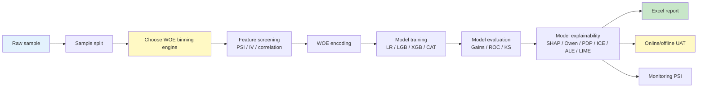

# End-to-End Modeling Pipeline

This page strings together the main modules of SuperModelingFactory along a production-grade credit scorecard development flow. The key principle: **settle on one binning engine at training time, and reuse it for screening, encoding, and monitoring**.

If the samples carry weights (such as balance weighting or oversampling correction), **pass the same `weight_col` consistently** in the training and evaluation stages, so that metrics share one basis. See [Model Training — Sample Weights](guides/model.md#sample-weights) and [Model Evaluation — Sample-Weighted Evaluation](guides/eval.md#sample-weighted-evaluation).

## Flow Overview


```mermaid
flowchart LR
    A[Raw sample] --> B[Sample split]
    B --> C[Choose WOE binning engine]
    C --> D[Feature screening<br/>PSI / IV / correlation]
    D --> E[WOE encoding]
    E --> F[Model training<br/>LR / LGB / XGB / CAT]
    F --> G[Model evaluation<br/>Gains / ROC / KS]
    G --> H[Model explainability<br/>SHAP / Owen / PDP / ICE / ALE / LIME]
    H --> I[Excel report]
    H --> J[Online/offline UAT]
    H --> K[Monitoring PSI]

    style A fill:#e3f2fd
    style C fill:#fff9c4
    style I fill:#c8e6c9
    style J fill:#fff9c4
```

## Step 1: Sample Splitting

```python
from Modeling_Tool import SampleSplitter

splitter = SampleSplitter(test_size=0.3, random_state=42, stratify=True)
train_df, test_df = splitter.split_df(master_df, target="bad_flag")

oot_df = master_df[master_df["apply_month"] >= "2025-07"].copy()

# The weight column is split along with the DataFrame (example: sample_wgt is already in master_df)
assert "sample_wgt" in train_df.columns
```

!!! tip "Preparing the weight column"

    The weight column should be written into `master_df` **before** splitting, so that `train_df` / `test_df` / `oot_df`
    all keep it after the split. Typical sources: loan balance, time-decay coefficients, oversampling inverse probabilities, and so on.

## Step 2: Choose the Binning Engine

For quick exploration, you can use `WOE_Master`; for scorecard deployment, `MonotoneWOEBinner` is recommended.

=== "WOE_Master"

    ```python
    from Modeling_Tool import WOE_Master

    woe_engine = WOE_Master(
        train_data=train_df,
        varlist=features,
        dep="bad_flag",
        missing_ref_value=-999999,
    )
    woe_engine.fit(nbins=10, equal_freq=True)
    ```

=== "MonotoneWOEBinner"

    ```python
    from Modeling_Tool.WOE.WOE_Monotone_Binner import MonotoneWOEBinner

    woe_engine = MonotoneWOEBinner(
        feature_cols=features,
        target_col="bad_flag",
        n_init_bins=20,
        min_bin_size=0.03,
        special_values=[-1, -100, -999999],
    )
    woe_engine.fit(train_df, chi2_binning=True, chi2_p=0.95)
    ```

!!! tip "Why choose the binning engine first?"

    PSI, IV, and correlation de-redundancy should all be based on the same binning used for the final model. Otherwise the screening metrics and the final WOE features may be inconsistent.

## Step 3: Feature Screening

### 3.1 PSI Stability

```python
from Modeling_Tool import PSICalculator

psi = PSICalculator(buckets=10, binning_engine=woe_engine)
psi_table = psi.calculate(expected_df=train_df, current_data=oot_df, varlist=features)
stable_features = psi_table.loc[psi_table["psi"] < 0.1, "var"].tolist()
```

### 3.2 IV / KS Information Value

```python
from Modeling_Tool import VarExtractionInsights

insights = VarExtractionInsights(
    data=train_df,
    dep="bad_flag",
    plot_path="./iv_plots/",
    woe_engine="monotone" if hasattr(woe_engine, "apply_woe") else "master",
    woe_binner=woe_engine,
)
report = insights.get_var_analysis_report(train_df, stable_features)
keep_by_iv = report.loc[report["iv"].between(0.02, 0.5), "var"].tolist()
```

### 3.3 Removing Highly Correlated Features

```python
from Modeling_Tool import CorrelationFilter

keep_vars = CorrelationFilter(
    data=train_df,
    dep="bad_flag",
    corr_cutpoint=0.7,
    woe_engine="monotone" if hasattr(woe_engine, "apply_woe") else "master",
    woe_binner=woe_engine,
).remove_highly_correlated(keep_by_iv)
```

## Step 4: WOE Encoding

If the binner was already fitted in Step 2, do not refit here; just transform/apply.

```python
if hasattr(woe_engine, "apply_woe"):
    train_woe = woe_engine.apply_woe(train_df)
    test_woe = woe_engine.apply_woe(test_df)
    oot_woe = woe_engine.apply_woe(oot_df)
else:
    train_woe = woe_engine.transform(train_df, keep_vars)
    test_woe = woe_engine.transform(test_df, keep_vars)
    oot_woe = woe_engine.transform(oot_df, keep_vars)

woe_features = [f"{f}_woe" for f in keep_vars]

# The weight column is kept through WOE encoding (not transformed)
WEIGHT_COL = "sample_wgt"
```

## Step 5: Model Training

```python
from Modeling_Tool import LRMaster, GradientBoostingModel

# Logistic regression: weight_col
lr = LRMaster(params={"C": 1.0, "max_iter": 1000, "solver": "lbfgs"})
lr.fit(train_woe, woe_features, "bad_flag", weight_col=WEIGHT_COL)

# Or use a GBM: sample_weight / eval_sample_weight
gbm = GradientBoostingModel("lgb", {"n_estimators": 300, "learning_rate": 0.05})
gbm.fit(
    train_woe[woe_features], train_woe["bad_flag"],
    test_woe[woe_features],  test_woe["bad_flag"],
    sample_weight=train_woe[WEIGHT_COL],
    eval_sample_weight=test_woe[WEIGHT_COL],
)
```

Optional: run a weighted holdout hyperparameter search for the GBM (see [GBM Hyperparameter Search](guides/gbm_param_search.md#5-sample-weights)):

```python
gbm.param_search(
    data=train_woe,
    varlist=woe_features,
    tgt_name="bad_flag",
    eval_sets={"train": train_woe, "test": test_woe, "oot": oot_woe},
    search_space={"max_depth": [3, 4, 5], "num_leaves": [15, 31]},
    weight_col=WEIGHT_COL,
    eval_weight_col=WEIGHT_COL,
    primary_set="oot",
    refit=True,
)
```

## Step 6: Model Evaluation

```python
from Modeling_Tool import PerformanceEvaluator, GainsTableCalculator

# Multi-dataset performance summary (weighted AUC / KS / Lift)
perf = (
    PerformanceEvaluator(
        tgt_name="bad_flag",
        model=gbm._model.model,
        feature_cols=woe_features,
        weight_col=WEIGHT_COL,
    )
    .add_dataset("train", train_woe)
    .add_dataset("test", test_woe)
    .add_dataset("oot", oot_woe)
    .evaluate()
)
print(perf[["index", "KS", "AUC", "Top10%_TargetRate"]])

# Gains table (N = sum of weights, N_RAW = row count)
gains = GainsTableCalculator(
    data=test_woe,
    score="prob",
    dep="bad_flag",
    weight_col=WEIGHT_COL,
    weighted_binning=True,
    nbins=10,
).calculate()
print(gains[["thresholds", "N", "N_RAW", "bad_rate", "lift"]])
```

## Step 7: Model Explainability

A trained GBM can be handed directly to `ModelExplainer`. If there are highly correlated variables or variables from the same business source, build a coalition structure first and then compute the Owen Value, which gives more stable module-level reason codes.

!!! note "Install the explainability dependencies"

    SHAP, Owen Value, and LIME are optional dependencies. To run the full example below, install them first:

    ```bash
    pip install 'supermodelingfactory[explain]'
    ```

```python
from Modeling_Tool import ModelExplainer, build_coalition_structure

explain_x = test_woe[woe_features]
background_x = train_woe[woe_features].sample(
    n=min(1000, len(train_woe)),
    random_state=42,
)
focus_feature = woe_features[0]

explainer = ModelExplainer(gbm, background_data=background_x)

# 1) SHAP: global importance, summary plot, single-sample contributions
explainer.explain(explain_x)
shap_importance = explainer.feature_importance(normalize=True)
explainer.summary_plot(show=False, save_path="./output/explain/shap_summary.png")
# With write_outputs=True, CreditModelPipeline automatically writes explain_outputs to output/explain/
# and returns result.explain_paths; for the advanced plots below (PDP/ICE/LIME and so on), a manual save_path is still recommended.
local_shap = explainer.explain_instance(explain_x.iloc[[0]])

# 2) Owen Value: prior grouping + automatic clustering fallback, outputs module-level reason codes
prior_groups = {
    "delinquency": ["max_dpd_12m_woe", "dpd_cnt_6m_woe", "ever_dpd30_woe"],
    "multi_lending": ["inquiries_3m_woe", "inquiries_6m_woe", "active_loans_woe"],
    "affordability": ["monthly_income_woe", "debt_to_income_woe", "monthly_obligation_woe"],
}

coalition = build_coalition_structure(
    background_x,
    prior_groups=prior_groups,
    threshold=0.35,
    method="complete",
    corr_method="spearman",
)
print(coalition["summary"][["n_features", "mean_abs_corr", "max_abs_corr"]])

# For nonlinear association, switch to MIC: pip install 'supermodelingfactory[mic]'
# coalition = build_coalition_structure(background_x, threshold=0.35, corr_method="MIC")

explainer.explain_owen(
    explain_x,
    coalition_structure=coalition,
    model_output="log_odds",
    max_evals=500,
)
owen_group = explainer.owen_group_importance(normalize=True)
owen_local = explainer.owen_explain_instance(explain_x.iloc[0])

# 3) PDP: average marginal effect
pdp_curve = explainer.partial_dependence(
    explain_x,
    feature=focus_feature,
    grid_resolution=30,
    sample_size=2000,
    random_state=42,
)
explainer.pdp_plot(explain_x, feature=focus_feature, show=False, save_path="./output/explain/pdp.png")

# 4) ICE: individual response curves
ice_curve = explainer.ice(
    explain_x,
    feature=focus_feature,
    grid_resolution=30,
    sample_size=100,
    random_state=42,
    centered=True,
)
explainer.ice_plot(explain_x, feature=focus_feature, centered=True, show=False, save_path="./output/explain/ice.png")

# 5) ALE: accumulated local effects
ale_curve = explainer.ale(explain_x, feature=focus_feature, bins=20)
explainer.ale_plot(explain_x, feature=focus_feature, show=False, save_path="./output/explain/ale.png")

# 6) LIME: single-sample local explanation + sampled aggregate importance
# When features contain nulls, missing_strategy="median" is the default (fills with the train-column median) and warnings.warn gives the details;
# optionally use missing_strategy="drop" to discard rows containing nulls.
lime_local = explainer.lime_explain_instance(
    x_row=explain_x.iloc[0],
    X_train=background_x,
    num_features=10,
    num_samples=3000,
    random_state=42,
    missing_strategy="median",
)
lime_global = explainer.lime_global_importance(
    X=explain_x,
    X_train=background_x,
    sample_size=50,
    num_features=10,
    num_samples=1000,
    random_state=42,
    missing_strategy="median",
)

print(shap_importance.head(10))
print(owen_group[["group", "mean_abs_owen", "importance_pct"]].head(10))
print(owen_local[["group", "owen_value", "features"]].head(10))
print(pdp_curve.head())
print(ice_curve.head())
print(ale_curve.head())
print(lime_local.head(10))
print(lime_global.head(10))
```

!!! tip "Performance advice"

    PDP, ICE, ALE, LIME, and Owen Value all call model prediction repeatedly. With large production samples, control the cost of explanation through `sample_size`, `background_x.sample(...)`, or `max_evals`.

## Step 8: Model Monitoring PSI

During monitoring, continue to reuse the training-time binning engine:

```python
psi_monitor = PSICalculator(binning_engine=woe_engine).calculate(
    expected_df=train_df,
    current_data=latest_df,
    varlist=keep_vars,
)
print(psi_monitor)
```

## Step 9: Excel Report

```python
from ExcelMaster.ExcelMaster import ExcelMaster

em = ExcelMaster("model_report.xlsx", verbose=False)
ws = em.add_worksheet("Performance")
em.write_dataframe(
    ws,
    perf,
    title="Model Performance",
    titleformat="BLUE_H2",
    headerformat="ORANGE_H4",
    valueformat="NUM%.4",
)
em.close_workbook()
```

If you use `MonotoneWOEBinner`, you can output the WOE plots and report directly:

```python
if hasattr(woe_engine, "plot_woe_graph"):
    woe_engine.plot_woe_graph("./output/woe_plot/", group_name="apply_month", _df_for_group=train_df)
    woe_engine.export_woe_report("./output/woe_report.xlsx")
```

## Step 10: UAT Consistency Check

```python
from Modeling_Tool.Core.ODPS_Tool import ODPSRunner
from Modeling_Tool.UAT.UAT_Consistency_Checker import UATConsistencyChecker, UATConfig

config = UATConfig(
    main_model_score_col="credit_risk_score",
    sql_dir="sql",
    offline_sql="pull_offline.sql",
    online_sql="pull_online.sql",
    tol_score=1e-6,
    tol_feat=1e-2,
    excel_output_path="uat_report.xlsx",
)
summary_df = UATConsistencyChecker(config, ODPSRunner()).run()
```

## Complete Pipeline (One-Click Script)

```python
from Modeling_Tool import (
    SampleSplitter, PSICalculator, VarExtractionInsights, CorrelationFilter,
    GradientBoostingModel, PerformanceEvaluator, GainsTableCalculator, ModelExplainer,
    build_coalition_structure,
)
from Modeling_Tool.WOE.WOE_Monotone_Binner import MonotoneWOEBinner

WEIGHT_COL = "sample_wgt"

train_df, test_df = SampleSplitter(test_size=0.3, random_state=42, stratify=True) \
    .split_df(data, target="bad_flag")
oot_df = data[data["apply_month"] >= "2025-07"].copy()
features = ["age", "income", "score_b", "city_grade", "n_overdue"]

binner = MonotoneWOEBinner(feature_cols=features, target_col="bad_flag")
binner.fit(train_df, chi2_binning=True, chi2_p=0.95)

psi = PSICalculator(binning_engine=binner).calculate(train_df, oot_df, features)
features = psi.loc[psi["psi"] < 0.1, "var"].tolist()

iv_report = VarExtractionInsights(
    train_df, "bad_flag", "./iv_plots/",
    woe_engine="monotone", woe_binner=binner,
).get_var_analysis_report(train_df, features)
features = iv_report.loc[iv_report["iv"].between(0.02, 0.5), "var"].tolist()

features = CorrelationFilter(
    train_df, "bad_flag", corr_cutpoint=0.7,
    woe_engine="monotone", woe_binner=binner,
).remove_highly_correlated(features)

train_woe = binner.apply_woe(train_df)
test_woe = binner.apply_woe(test_df)
oot_woe = binner.apply_woe(oot_df)
woe_features = [f"{f}_woe" for f in features]

gbm = GradientBoostingModel("lgb", {"n_estimators": 200, "learning_rate": 0.05})
gbm.fit(
    train_woe[woe_features], train_woe["bad_flag"],
    test_woe[woe_features], test_woe["bad_flag"],
    sample_weight=train_woe[WEIGHT_COL],
    eval_sample_weight=test_woe[WEIGHT_COL],
)

perf = PerformanceEvaluator(
    tgt_name="bad_flag",
    model=gbm._model.model,
    feature_cols=woe_features,
    weight_col=WEIGHT_COL,
).add_dataset("train", train_woe).add_dataset("test", test_woe).add_dataset("oot", oot_woe).evaluate()

gains = GainsTableCalculator(
    test_woe, score="prob", dep="bad_flag",
    weight_col=WEIGHT_COL, weighted_binning=True, nbins=10,
).calculate()

explain_x = test_woe[woe_features]
background_x = train_woe[woe_features].sample(n=min(1000, len(train_woe)), random_state=42)
focus_feature = woe_features[0]
explainer = ModelExplainer(gbm, background_data=background_x)

explainer.explain(explain_x)
shap_importance = explainer.feature_importance(normalize=True)

prior_groups = {
    "delinquency": ["max_dpd_12m_woe", "dpd_cnt_6m_woe", "ever_dpd30_woe"],
    "multi_lending": ["inquiries_3m_woe", "inquiries_6m_woe", "active_loans_woe"],
}
coalition = build_coalition_structure(background_x, prior_groups=prior_groups, threshold=0.35)
explainer.explain_owen(explain_x, coalition_structure=coalition, model_output="log_odds", max_evals=500)
owen_group = explainer.owen_group_importance(normalize=True)
owen_local = explainer.owen_explain_instance(explain_x.iloc[0])

pdp_curve = explainer.partial_dependence(explain_x, focus_feature, sample_size=2000, random_state=42)
ice_curve = explainer.ice(explain_x, focus_feature, sample_size=100, centered=True, random_state=42)
ale_curve = explainer.ale(explain_x, focus_feature, bins=20)
lime_local = explainer.lime_explain_instance(explain_x.iloc[0], X_train=background_x, num_features=10)
lime_global = explainer.lime_global_importance(explain_x, X_train=background_x, sample_size=50)
```

## Comparison of Pipeline Evaluation Data Entry Points

If you use the [`Modeling_Tool.Pipeline`](pipeline_one_click.md) high-level wrappers instead of hand-writing Steps 1–8, the entry points for **extra evaluation data** in the three main pipelines are as follows. The design principle is the same: the training/fit basis is decoupled from the evaluation basis, and the consumption scope is explicit and auditable; since 0.7.1, CM evaluates only `ins/oos` by default, and a real OOT must be included explicitly.

| Pipeline | Config parameter | Typical use | Takes part in WOE fit | Takes part in model training | Enters perf evaluation |
|---|---|---|---|---|---|
| `RejectInferencePipeline` | `oot_data` | External full OOT application data (may include unperformed samples) | — | The post-RI model uses INS/OOS | ✅ OOT + RI model perf |
| `FeatureValidationPipeline` | `woe_fit_query` | Drop immature rows etc. from INS, tightening only the WOE fit | ✅ Only the INS fit subset | — (no model training) | ✅ PSI/IV/KS still use the full splits |
| `CreditModelPipeline` | `woe_fit_query` | Same as above, tightening the WOE fit | ✅ Only the INS fit subset | ❌ Training still uses the full INS | ✅ ins/oos by default; a real oot must be listed explicitly in `evaluation_splits` |
| `CreditModelPipeline` | `extra_eval_datasets` | Competitor scores, full application months, and other eval-only sets | ❌ | ❌ | ✅ Evaluation only |

How they correspond:

- RI's `oot_data` ≈ CM's "independent physical OOT table outside the main table", but RI folds it into the OOT evaluation chain; CM uses `extra_eval_datasets` to mount eval-only sets with **arbitrary names**, and does **not** replace the `oot` in `split_col`.
- The `woe_fit_query` of FV / CM is a **row mask**, not a second physical table; `woe_fit_data` (a second physical fit table) is **not** implemented in the current version.

```python
# RI: external OOT takes precedence over split_col == "oot"
RejectInferencePipelineConfig(oot_data=df_oot_full, ...)

# FV: only mature INS takes part in the WOE fit; evaluation still looks at the full data
FeatureValidationPipelineConfig(woe_fit_query="mature_flag == 1", ...)

# CM: fit filtering + extra eval-only sets
CreditModelPipelineConfig(
    woe_fit_query="mature_flag == 1",
    extra_eval_datasets={"full_apply": df_apply},
    ...
)
```

See [Top-Level Pipelines — WOE Fit Filtering and Extra Evaluation Sets](pipeline_one_click.md#woe-fit-filtering-and-extra-evaluation-sets).

## Next Steps

- Model explainability details: [Model Explainability](guides/explainability.md)
- Binning engine notes: [WOE Binning Engine](guides/woe_binning_engine.md)
- Feature screening details: [Feature Screening](guides/feature.md)
- WOE encoding details: [WOE Encoding](guides/woe.md)
- Sample-weight API details: [Model Training](guides/model.md) / [Model Evaluation](guides/eval.md)
- One-click Pipeline API: [Top-Level Pipelines](pipeline_one_click.md)
