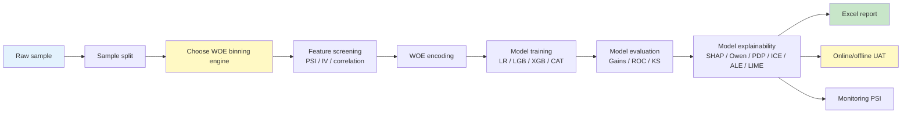

# End-to-End Modeling Pipeline

This page strings SMF's main modules into one scorecard development flow: split the sample, choose a WOE binning engine,
screen features, encode, train, evaluate, explain, monitor, and report. Every snippet runs top to bottom in one Python
session on synthetic data, so you can paste the blocks into a notebook in order. For a shorter first run, see the
[Quickstart](quickstart.md). To run the whole flow with one call per pipeline, see [Top-Level Pipelines](pipeline_one_click.md).

The key principle: **settle on one binning engine at training time, and reuse it for screening, encoding, and monitoring.**
PSI, IV, correlation filtering, the model inputs, and the monitoring PSI then all see the same bins.

If the samples carry weights (balance weights, oversampling correction), **pass the same `weight_col` in the training and
evaluation stages**, so that every metric shares one basis. See [Model Training: Sample Weights](guides/model.md#sample-weights)
and [Model Evaluation: Sample-Weighted Evaluation](guides/eval.md#sample-weighted-evaluation).

## Flow Overview


```mermaid
flowchart LR
    A[Raw sample] --> B[Sample split]
    B --> C[Choose WOE binning engine]
    C --> D[Feature screening<br/>PSI / IV / correlation]
    D --> E[WOE encoding]
    E --> F[Model training<br/>LR / LGB / XGB / CAT]
    F --> G[Model evaluation<br/>Gains / ROC / KS]
    G --> H[Model explainability<br/>SHAP / Owen / PDP / ICE / ALE / LIME]
    H --> I[Excel report]
    H --> J[Online/offline UAT]
    H --> K[Monitoring PSI]

    style A fill:#e3f2fd
    style C fill:#fff9c4
    style I fill:#c8e6c9
    style J fill:#fff9c4
```

## Example Data

The setup below creates 10,000 synthetic loan applications over nine months, with a 0/1 `bad_flag` and a weight column. It
plants one case for each screening stage: `income` drifts in the last two months (PSI should flag it), `noise_x` carries no
signal (IV should drop it), and `score_c` is a noisy copy of `score_b` (the correlation filter should drop one of the two).
To reuse this page on your own data, replace `master_df`, `features`, and `WEIGHT_COL`.

```python
import os

import numpy as np
import pandas as pd

rng = np.random.default_rng(42)
n = 10000
months = [f"2025-{m:02d}" for m in range(1, 10)]          # 2025-01 ... 2025-09

master_df = pd.DataFrame({
    "flow_id":     np.arange(n),                           # unique application id
    "apply_month": rng.choice(months, n),
    "city_grade":  rng.choice(["A", "B", "C", "D"], n),    # a categorical feature
    "age":         rng.normal(35, 8, n).clip(18, 70),
    "income":      rng.lognormal(10, 0.4, n),
    "score_b":     rng.normal(600, 60, n),
    "utilization": rng.uniform(0, 1, n),
    "n_overdue":   rng.poisson(0.3, n),
    "noise_x":     rng.normal(0, 1, n),                    # no signal: IV screening should drop it
})
# score_c is nearly a copy of score_b: the correlation filter should drop one of the two
master_df["score_c"] = 0.9 * master_df["score_b"] + rng.normal(0, 25, n)
# income drifts upward in the two most recent months: PSI should flag it
late = master_df["apply_month"] >= "2025-08"
master_df.loc[late, "income"] = rng.lognormal(10.4, 0.4, late.sum())

master_df["sample_wgt"] = rng.uniform(0.5, 2.0, n)         # e.g. balance or correction weight
city_effect = master_df["city_grade"].map({"A": -0.4, "B": -0.1, "C": 0.2, "D": 0.4})
logit = (-2.3 - 0.010 * (master_df["score_b"] - 600) + 0.45 * master_df["n_overdue"]
         - 0.9 * (master_df["utilization"] - 0.5) - 0.04 * (master_df["age"] - 35)
         - 0.35 * (np.log(master_df["income"]) - 10) + city_effect)
master_df["bad_flag"] = rng.binomial(1, 1 / (1 + np.exp(-logit)))

features = ["age", "income", "score_b", "score_c", "utilization", "n_overdue", "noise_x"]   # numeric features
WEIGHT_COL = "sample_wgt"
os.makedirs("output/explain", exist_ok=True)               # the later steps write files under output/
print(master_df.shape, round(master_df["bad_flag"].mean(), 3))
```

Each step creates objects that later steps use. If you jump into the middle of the page, make sure these exist:

| Object | Created in | Contents |
|---|---|---|
| `master_df`, `features`, `WEIGHT_COL` | Example Data | Full sample, numeric feature names, weight column name |
| `train_df`, `test_df`, `oot_df` | Step 1 | Raw-feature frames: train (INS), test (OOS), out-of-time |
| `woe_engine` | Step 2 | The fitted binning engine |
| `keep_vars` | Step 3 | Features that survive screening |
| `train_woe`, `test_woe`, `oot_woe`, `woe_features` | Step 4 | WOE-encoded frames and the model input columns |
| `lr`, `gbm` | Step 5 | Fitted models |
| `perf`, `gains` | Step 6 | Evaluation tables |

## Step 1: Split the Sample

```python
from Modeling_Tool import SampleSplitter

# Out-of-time (OOT) sample: the most recent months, held out completely
oot_df = master_df[master_df["apply_month"] >= "2025-08"].copy()
dev_df = master_df[master_df["apply_month"] < "2025-08"].copy()

# In-time split of the rest, stratified on the target
splitter = SampleSplitter(test_size=0.3, random_state=42, stratify=True)
train_df, test_df = splitter.split_df(dev_df, target="bad_flag")
print(f"train={len(train_df)}  test={len(test_df)}  oot={len(oot_df)}")
```

Carve out the OOT months first, then split what remains. If you split the full table and select the OOT rows from it
afterwards, the same rows land in both the training and the OOT sample. `split_df` returns the two frames with every
column of the input, so the weight column travels with each split.

| Sample | Role |
|---|---|
| `train_df` (INS) | Fits the binning engine and the models |
| `test_df` (OOS) | Validates the models and stops boosting early |
| `oot_df` | Out-of-time check: stability (PSI) and final performance |

!!! tip "Preparing the weight column"

    Write the weight column into `master_df` **before** splitting, so that `train_df`, `test_df`, and `oot_df` all keep it.
    Typical sources: loan balance, time-decay coefficients, and inverse oversampling probabilities.

## Step 2: Choose the Binning Engine

Choose the engine now, because PSI, IV, and correlation screening should use the same bins as the final model. Otherwise the
screening metrics and the final WOE features can disagree. Use `WOE_Master` for quick exploration and `MonotoneWOEBinner`
for scorecard deployment.

=== "WOE_Master"

    ```python
    from Modeling_Tool import WOE_Master

    woe_engine = WOE_Master(train_data=train_df, varlist=features, dep="bad_flag")
    woe_engine.fit(nbins=10, equal_freq=True)
    ```

=== "MonotoneWOEBinner"

    ```python
    from Modeling_Tool import MonotoneWOEBinner

    woe_engine = MonotoneWOEBinner(
        feature_cols=features,
        target_col="bad_flag",
        n_init_bins=20,       # start from 20 equal-frequency bins, then merge until the WOE is monotone
        min_bin_size=0.03,    # every bin holds at least 3% of the rows
    )
    woe_engine.fit(train_df, chi2_binning=True, chi2_p=0.95)   # also merge bins with no significant difference
    ```

Both tabs define `woe_engine`, so run the one you choose. Every later step works with either engine, except the WOE plots
and report at the end of [Step 9](#step-9-excel-report), which exist on `MonotoneWOEBinner` only.

!!! note "What `fit` prints"

    `MonotoneWOEBinner.fit` prints one line per feature with the number of bins, the IV, and whether the bin WOEs are
    monotone. The first and last lines summarize the run (`Fitting N features ...` and `Fit finished (greedy): k/N features
    monotone`).

### Categorical features

`WOE_Master` bins numeric columns only and raises `TypeError` for a string column. `MonotoneWOEBinner` needs the column
declared in `cate_feats`: without it, `fit` logs a failure for that column and carries on without it instead of raising,
and the screening tools later raise a `KeyError` for the missing `<feature>_woe` column. Each category becomes one bin.

```python
from Modeling_Tool import MonotoneWOEBinner

cat_binner = MonotoneWOEBinner(
    feature_cols=features + ["city_grade"],
    target_col="bad_flag",
    cate_feats=["city_grade"],        # one bin per category
)
cat_binner.fit(train_df, chi2_binning=True, chi2_p=0.95)
print(cat_binner.apply_woe(train_df.head())[["city_grade", "city_grade_woe"]])
```

A category that did not exist at fit time gets `missing_woe` (0.0 by default) and a warning
(`apply_woe(..., unseen_category_policy="warn")`). The rest of this page keeps `city_grade` out of the model so that it works
with either engine. To include it, pass `features + ["city_grade"]` to the screening tools and use `cat_binner` as the
engine; the later steps do not change.

!!! tip "Special values"

    Declare sentinel codes such as `-999999` (for example "no record") to give them their own bin:
    `MonotoneWOEBinner(..., special_values=[-999999])`, or `WOE_Master.fit(..., spec_values=[-999999])`. Since 0.8.2,
    `MonotoneWOEBinner.fit` reports declared special values that never occur in the fit sample.

## Step 3: Screen Features

Screen with the fitted engine, in the usual order: PSI, IV, correlation. Each stage narrows the list.

### 3.1 PSI stability

```python
from Modeling_Tool import PSICalculator

psi_table = PSICalculator(binning_engine=woe_engine).calculate(
    expected_df=train_df, current_data=oot_df, varlist=features,
)
stable_features = psi_table.loc[psi_table["psi"] < 0.1, "var"].tolist()
print(psi_table)
```

`calculate` returns one row per variable with columns `var` and `psi`. Conventionally, a PSI below 0.1 is stable, 0.1 to
0.25 is a moderate shift, and above 0.25 is a significant shift. When you pass `binning_engine`, PSI uses that engine's
bins and ignores the constructor's `buckets`, `equal_freq`, and `min_bin_prop`.

### 3.2 IV / KS information value

```python
from Modeling_Tool import VarExtractionInsights

insights = VarExtractionInsights(
    data=train_df, dep="bad_flag", plot_path="output/iv_plots/", woe_binner=woe_engine,
)
iv_report = insights.get_var_analysis_report(train_df, stable_features)
keep_by_iv = iv_report.loc[iv_report["iv"].between(0.02, 0.5), "var"].tolist()
print(iv_report[["var", "iv", "ks_in_gains", "n_bins"]])
```

The report has one row per variable: IV, `ks_in_gains`, `lift_in_gains`, the number of bins, and basic statistics
(`n_all`, `missing_rate`, `min`, `mean`, `max`). Variables with an IV below `iv_cut` (default `0.01`) are left out of the
report. The filter keeps IV between 0.02 and 0.5: below 0.02 a variable is weak, and above 0.5 it is usually too good to be
true, so look for leakage. `plot_path` is only used by `plot_woe`, which this flow does not call, so the folder is never
created.

### 3.3 Remove highly correlated features

```python
from Modeling_Tool import CorrelationFilter

corr_filter = CorrelationFilter(
    data=train_df, dep="bad_flag", corr_cutpoint=0.7, woe_binner=woe_engine,
)
keep_vars = corr_filter.remove_highly_correlated(keep_by_iv)

print("dropped by PSI        :", sorted(set(features) - set(stable_features)))
print("dropped by IV         :", sorted(set(stable_features) - set(keep_by_iv)))
print("dropped by correlation:", sorted(set(keep_by_iv) - set(keep_vars)))
print("kept                  :", keep_vars)
```

Among variables whose absolute correlation exceeds `corr_cutpoint`, the one with the highest IV survives
(`base_metric="iv"`; `"ks"` is the alternative). Correlation is computed on raw values (`method="pearson"` by default).
Categorical features are correlated through their WOE. On the example data the three stages drop `income`, `noise_x`, and
`score_c`, in that order.

!!! note "Screening is unweighted"

    `PSICalculator`, `VarExtractionInsights`, and `CorrelationFilter` have no weight argument. For weighted PSI, IV, and
    correlation use `weighted_feature_screen` (see [Feature Screening](guides/feature.md)).

!!! note "`woe_engine` on the screening tools"

    `VarExtractionInsights` and `CorrelationFilter` also accept `woe_engine="master"` or `"monotone"`. It only matters when
    you do not pass `woe_binner`: `"monotone"` then makes the tool fit its own binner. With `woe_binner` given, the engine
    type is detected from the object.

## Step 4: WOE Encoding

The engine is already fitted, so do not refit it: only transform. `as_woe_engine` gives both engines one interface.
`transform(df, varlist)` returns every input column, including the target and the weight column (which are never
transformed), plus one `<feature>_woe` column per variable in `varlist`.

```python
from Modeling_Tool import as_woe_engine

encoder = as_woe_engine(woe_engine)          # the same call for WOE_Master and MonotoneWOEBinner
train_woe = encoder.transform(train_df, keep_vars)
test_woe = encoder.transform(test_df, keep_vars)
oot_woe = encoder.transform(oot_df, keep_vars)

woe_features = [f"{f}_woe" for f in keep_vars]
print(train_woe[woe_features].head())
```

The engine-specific equivalents are `woe_engine.transform(df, keep_vars)` for `WOE_Master` and
`woe_engine.apply_woe(df, varlist=keep_vars)` for `MonotoneWOEBinner`.

## Step 5: Train Models

```python
from Modeling_Tool import LRMaster, GradientBoostingModel

# Logistic regression: pass the weight column by name
lr = LRMaster(params={"C": 1.0, "max_iter": 1000, "solver": "lbfgs"})
lr.fit(train_woe, woe_features, "bad_flag", weight_col=WEIGHT_COL)
print(lr.get_statsmodel_summary().round(3))      # coef, std_err, z, p_value, ci_lower, ci_upper

# LightGBM: weights for the training set and for the validation (early-stopping) set
gbm_params = {
    "n_estimators": 300,
    "learning_rate": 0.05,
    "max_depth": 3,
    "early_stopping_rounds": 30,                 # required for "lgb"
    "eval_metric": "auc",
    "n_jobs": 1,                                 # a sample this small needs one thread
    "verbose": -1,
}
gbm = GradientBoostingModel("lgb", gbm_params)
gbm.fit(
    train_woe[woe_features], train_woe["bad_flag"],
    test_woe[woe_features], test_woe["bad_flag"],
    sample_weight=train_woe[WEIGHT_COL],
    eval_sample_weight=test_woe[WEIGHT_COL],
)
print(gbm.get_feature_importance())
```

!!! warning "`early_stopping_rounds` is required for `lgb`"

    `GradientBoostingModel("lgb", params).fit(...)` raises `KeyError: 'early_stopping_rounds'` when the key is missing.
    XGBoost and CatBoost treat it as optional.

### Optional: tune the GBM

`param_search` runs a weighted holdout search: each candidate is fitted with `weight_col` and scored by weighted AUC with
`eval_weight_col`. Keep the OOT sample out of the search so that Step 6 stays an independent check; here the `oos` set
picks the winner and the `ins` set measures the overfitting gap. See
[GBM Hyperparameter Search](guides/gbm_param_search.md#5-sample-weights) for the objectives and the Optuna engine.

```python
tuner = GradientBoostingModel("lgb", gbm_params)
results = tuner.param_search(
    data=train_woe,
    varlist=woe_features,
    tgt_name="bad_flag",
    eval_sets={"ins": train_woe, "oos": test_woe},
    search_space={"max_depth": [2, 3, 4], "num_leaves": [7, 15]},
    weight_col=WEIGHT_COL,
    eval_weight_col=WEIGHT_COL,
    primary_set="oos",
    gap_ref_sets=["ins"],
    refit=False,
)
print(results)

# best_params_ stores integers as floats (7.0), which LightGBM rejects, so convert them back
best = {name: int(value) for name, value in tuner.best_params_.items()}
gbm = GradientBoostingModel("lgb", {**gbm_params, **best})
gbm.fit(
    train_woe[woe_features], train_woe["bad_flag"],
    test_woe[woe_features], test_woe["bad_flag"],
    sample_weight=train_woe[WEIGHT_COL],
    eval_sample_weight=test_woe[WEIGHT_COL],
)
```

!!! warning "`param_search` in 0.8.2: build the final model yourself"

    - `refit=True` re-fits the model with the parameters it had **before** the search, not with the winner: the best
      parameters are merged into the model's `params` attribute, but the refit still trains with the original ones.
      Search with `refit=False` and fit a new model from `best_params_`, as above.
    - `best_params_` holds integer parameters such as `max_depth` and `num_leaves` as floats (`7.0`). LightGBM raises
      `Parameter num_leaves should be of type int` for them, so convert integer parameters with `int()`.

## Step 6: Evaluate

Evaluate every model on all three samples with the same weights used in training. `model` takes a `GradientBoostingModel` or
an `LRMaster`. With `weight_col`, `evaluate` returns the weighted summary: `N` is the sum of weights and `N_RAW` the number of
rows.

```python
from Modeling_Tool import PerformanceEvaluator, GainsTableCalculator

samples = {"train": train_woe, "test": test_woe, "oot": oot_woe}
perf_by_model = []
for name, model in {"lr": lr, "lgb": gbm}.items():
    evaluator = PerformanceEvaluator(
        tgt_name="bad_flag", model=model, feature_cols=woe_features, weight_col=WEIGHT_COL,
    )
    for sample_name, frame in samples.items():
        evaluator.add_dataset(sample_name, frame)
    perf_by_model.append(evaluator.evaluate(display=False).assign(model=name))

perf = pd.concat(perf_by_model, ignore_index=True)
print(perf[["model", "index", "N", "N_RAW", "KS", "AUC", "LIFT", "IV"]])

# Weighted Gains table for the LightGBM score on the test sample (bin 1 = highest scores)
gains = GainsTableCalculator(
    data=test_woe, dep="bad_flag", model=gbm, varlist=woe_features, weight_col=WEIGHT_COL, nbins=10,
).calculate()
print(gains[["MIN", "MAX", "N", "N_RAW", "AVG_BAD", "LIFT", "KS"]])
```

`display=False` keeps `evaluate()` from calling `IPython.display`, which is not available outside notebooks. The weighted
summary has the columns `index, dataset, DATASET, AUC, KS, LIFT, IV, N, N_RAW, avgTrue, avgScore`. The weighted Gains table
has bins `1` to `nbins` of about equal total weight. See [Model Evaluation](guides/eval.md) for the unweighted tables, the
other evaluators, and where weights are not applied.

## Step 7: Explain the Model

Hand the trained GBM to `ModelExplainer`. If some variables are highly correlated or come from the same business source,
build a coalition structure first and compute the Owen Value: it gives more stable module-level reason codes than SHAP on
single variables.

!!! note "Install the explainability dependencies"

    SHAP, Owen Value, and LIME are optional dependencies. To run the example below, install them first:

    ```bash
    pip install 'supermodelingfactory[explain]'
    ```

```python
from Modeling_Tool import ModelExplainer, build_coalition_structure

explain_x = test_woe[woe_features].sample(n=min(500, len(test_woe)), random_state=42)       # rows to explain
background_x = train_woe[woe_features].sample(n=min(500, len(train_woe)), random_state=42)  # reference sample
focus_feature = woe_features[0]

explainer = ModelExplainer(gbm, background_data=background_x)

# 1) SHAP: global importance, summary plot, contributions for one row
explainer.explain(explain_x)
shap_importance = explainer.feature_importance(normalize=True)    # feature, mean_abs_shap, importance_pct
explainer.summary_plot(show=False, save_path="output/explain/shap_summary.png")
local_shap = explainer.explain_instance(explain_x.iloc[[0]])      # feature, value, shap_value
print(shap_importance)
```

The `save_path` folders must exist: the plot helpers do not create them. With `write_outputs=True`, `CreditModelPipeline`
writes its explainability outputs to `output/explain/` and returns `result.explain_paths`.

### Owen Value

`prior_groups` assigns variables to business modules. A variable can appear in only one module, and names that are not
columns of `background_x` are ignored. The remaining variables are clustered by correlation, and their groups get a
`residual_` prefix. With the default `method="complete"`, every pair inside an automatic cluster has an absolute
correlation of at least `1 - threshold`.

```python
prior_groups = {
    "bureau": ["score_b_woe", "n_overdue_woe"],
    "applicant": ["age_woe", "utilization_woe"],
}
coalition = build_coalition_structure(
    background_x, prior_groups=prior_groups, threshold=0.35, method="complete", corr_method="spearman",
)
print(coalition["summary"][["n_features", "mean_abs_corr", "max_abs_corr"]])

# Owen values are the slowest explanation: use a small sample and a modest max_evals
explainer.explain_owen(
    explain_x.head(100), coalition_structure=coalition, model_output="log_odds", max_evals=200,
)
owen_group = explainer.owen_group_importance(normalize=True)
print(owen_group[["group", "mean_abs_owen", "importance_pct"]])

# Module-level reason codes for one application, in log-odds
explainer.explain_owen(
    explain_x.iloc[[0]], coalition_structure=coalition, model_output="log_odds", max_evals=200,
)
owen_local = explainer.owen_explain_instance()
print(owen_local[["group", "owen_value", "features"]])
```

For nonlinear association, switch the clustering to MIC with `build_coalition_structure(background_x, corr_method="MIC")`. It
needs `pip install 'supermodelingfactory[mic]'`, and `minepy` supports Python before 3.11 only.

!!! warning "Do not pass the row to `owen_explain_instance`"

    `owen_explain_instance(x_row)` recomputes the Owen values for that row with the default
    `model_output="probability"` and replaces the cached values. The reason codes then come back in probability, not
    log-odds, and a later `owen_group_importance()` describes only that row. Compute the row with `explain_owen(...)` as
    above, then call `owen_explain_instance()` without an argument.

### PDP, ICE, and ALE

```python
# PDP: average prediction as one feature varies
pdp_curve = explainer.partial_dependence(
    explain_x, feature=focus_feature, grid_resolution=30, sample_size=300, random_state=42,
)
explainer.pdp_plot(explain_x, feature=focus_feature, show=False, save_path="output/explain/pdp.png")

# ICE: one response curve per row (centered at the first grid point)
ice_curve = explainer.ice(
    explain_x, feature=focus_feature, grid_resolution=30, sample_size=100, random_state=42, centered=True,
)
explainer.ice_plot(explain_x, feature=focus_feature, centered=True, show=False, save_path="output/explain/ice.png")

# ALE: accumulated local effects, more robust than PDP for correlated features
ale_curve = explainer.ale(explain_x, feature=focus_feature, bins=20)
explainer.ale_plot(explain_x, feature=focus_feature, show=False, save_path="output/explain/ale.png")

print(pdp_curve.head())    # feature, grid_value, average_prediction
print(ice_curve.head())    # feature, sample_index, grid_value, prediction
print(ale_curve.head())    # feature, bin_left, bin_right, bin_center, ale_value, n
```

### LIME

```python
lime_local = explainer.lime_explain_instance(
    x_row=explain_x.iloc[0], X_train=background_x, num_features=10, num_samples=1000,
    random_state=42, missing_strategy="median",
)
lime_global = explainer.lime_global_importance(
    X=explain_x, X_train=background_x, sample_size=30, num_features=10, num_samples=500,
    random_state=42, missing_strategy="median",
)
print(lime_local)      # feature, feature_rule, weight, abs_weight
print(lime_global)     # feature, mean_abs_lime_weight, frequency
```

If the features contain nulls, `missing_strategy="median"` (the default) fills them with the median of the matching training
column and emits a warning with the details. `missing_strategy="drop"` discards the rows with nulls instead.

!!! tip "Performance advice"

    PDP, ICE, ALE, LIME, and Owen Value call the model prediction many times. With large production samples, control the
    cost through `sample_size`, a smaller `background_x`, and `max_evals`.

## Step 8: Monitor with PSI

During monitoring, reuse the training-time engine. Persist it next to the model when you deploy, and load it in the
monitoring job.

```python
import joblib

os.makedirs("models", exist_ok=True)
joblib.dump(woe_engine, "models/woe_engine.joblib")             # at training time
monitor_engine = joblib.load("models/woe_engine.joblib")        # in the monitoring job

latest_df = master_df[master_df["apply_month"] == "2025-09"]
psi_monitor = PSICalculator(binning_engine=monitor_engine).calculate(
    expected_df=train_df, current_data=latest_df, varlist=keep_vars,
)
print(psi_monitor)

# One PSI per variable and month
psi_by_month = PSICalculator(binning_engine=monitor_engine).calculate(
    expected_df=train_df, current_data=oot_df, varlist=keep_vars, group_by="apply_month",
)
print(psi_by_month)
```

`joblib` files can run code when loaded, so load only files that you wrote. `group_by` adds the group column to the result.

## Step 9: Excel Report

```python
from ExcelMaster.ExcelMaster import ExcelMaster

em = ExcelMaster("output/model_report.xlsx", verbose=False)      # `verbose` is required
ws = em.add_worksheet("Performance")
em.write_dataframe(
    ws, perf,
    title="Model performance (weighted)",
    titleformat="BLUE_H2",
    headerformat="ORANGE_H4",
    valueformat="----",
)
em.write_dataframe(
    ws, gains.reset_index(),
    title="Gains table: LightGBM on the test sample",
    titleformat="BLUE_H2",
    headerformat="ORANGE_H4",
    valueformat="----",
)
em.close_workbook()
```

Each `write_dataframe` call writes below the previous table. `valueformat="----"` writes plain bordered cells; see
[Excel Report Generation](guides/excel_report.md) for the other formats.

With `MonotoneWOEBinner` you can also export the bin tables and WOE plots. These two methods exist on that class only, not
on `WOE_Master`.

```python
# One figure per feature: bar = good/bad share per bin, lines = WOE and IV per month (a stability view)
woe_engine.plot_woe_graph("output/woe_plot/", group_name="apply_month", _df_for_group=train_df)
woe_engine.export_woe_report("output/woe_report.xlsx")
```

`plot_woe_graph` writes `<feature>_by_apply_month.png` files into the folder, and `export_woe_report` writes the bin tables
and the figures into one workbook. Both print a progress message for every file they write.

## Step 10: UAT Consistency Check

Before go-live, check that the online system reproduces the offline score. `UATConsistencyChecker` pulls the offline and the
online results through a SQL runner, merges them on `flow_id`, compares the main score and every feature column pair, and
writes an Excel report. In production the runner is `ODPSRunner()`, which needs ODPS credentials. The block below uses a
stand-in runner that serves DataFrames, so it runs anywhere. See [Online/Offline Consistency Check](guides/uat.md) for all
options.

```python
from Modeling_Tool.UAT.UAT_Consistency_Checker import UATConfig, UATConsistencyChecker


class FrameRunner:
    """Stand-in for ODPSRunner: returns a prepared DataFrame for each SQL file."""

    def __init__(self, frames):
        self.frames = frames

    def run_sql(self, sql, n_process=None):
        return self.frames[sql.strip()].copy()


# Offline results: the scores this notebook produces for the OOT sample
offline = oot_woe[["flow_id", *woe_features]].copy()
offline.insert(1, "launch_time", pd.to_datetime(oot_woe["apply_month"] + "-15"))
offline["credit_risk_score"] = gbm.predict(oot_woe[woe_features])

# Online results: the same, except float noise and five scores the online system computes differently
online = offline.copy()
online["credit_risk_score"] += np.random.default_rng(0).normal(0, 1e-9, len(online))
online.iloc[:5, online.columns.get_loc("credit_risk_score")] += 0.01

os.makedirs("sql", exist_ok=True)
for name in ("offline", "online"):
    with open(f"sql/pull_{name}.sql", "w") as handle:
        handle.write(name)                      # real files hold the SQL that pulls each table

config = UATConfig(
    main_model_score_col="credit_risk_score",
    sql_dir="sql",
    offline_sql="pull_offline.sql",
    online_sql="pull_online.sql",
    tol_score=1e-6,
    tol_feat=1e-2,
    info_list=["launch_time"],                  # identifier column: reported, not compared
    excel_output_path="output/uat_report.xlsx",
)
runner = FrameRunner({"offline": offline, "online": online})     # production: ODPSRunner()
summary_df = UATConsistencyChecker(config, runner).run()
print(summary_df)                                                 # Check Item, Detail, Status
```

!!! warning "Keep a `launch_time` column"

    When a main score does not match, the checker lists the offending rows with a hard-coded `launch_time` column. If the
    offline frame has no such column, `run()` raises `KeyError: "['launch_time'] not in index"`. The checker also logs its
    progress to the console at INFO level.

## Condensed Script

The flow of Steps 1 to 6 plus a SHAP summary, without commentary. It assumes `master_df`, `features`, and `WEIGHT_COL` from
[Example Data](#example-data) and uses new variable names, so it does not overwrite the objects above.

```python
from Modeling_Tool import (
    SampleSplitter, MonotoneWOEBinner, PSICalculator, VarExtractionInsights, CorrelationFilter,
    as_woe_engine, GradientBoostingModel, PerformanceEvaluator, GainsTableCalculator, ModelExplainer,
)

# 1) Split
oot = master_df[master_df["apply_month"] >= "2025-08"].copy()
dev = master_df[master_df["apply_month"] < "2025-08"].copy()
train, test = SampleSplitter(test_size=0.3, random_state=42, stratify=True).split_df(dev, target="bad_flag")

# 2) Fit the binning engine once
binner = MonotoneWOEBinner(feature_cols=features, target_col="bad_flag", n_init_bins=20, min_bin_size=0.03)
binner.fit(train, chi2_binning=True, chi2_p=0.95)

# 3) Screen: PSI, then IV, then correlation
psi = PSICalculator(binning_engine=binner).calculate(train, oot, features)
stable = psi.loc[psi["psi"] < 0.1, "var"].tolist()
iv = VarExtractionInsights(train, "bad_flag", "output/iv_plots/", woe_binner=binner).get_var_analysis_report(train, stable)
by_iv = iv.loc[iv["iv"].between(0.02, 0.5), "var"].tolist()
keep = CorrelationFilter(train, "bad_flag", corr_cutpoint=0.7, woe_binner=binner).remove_highly_correlated(by_iv)

# 4) Encode with the same engine
encoder = as_woe_engine(binner)
train_w, test_w, oot_w = (encoder.transform(frame, keep) for frame in (train, test, oot))
cols = [f"{name}_woe" for name in keep]

# 5) Train
model = GradientBoostingModel("lgb", {"n_estimators": 300, "learning_rate": 0.05, "max_depth": 3,
                                      "early_stopping_rounds": 30, "eval_metric": "auc", "n_jobs": 1, "verbose": -1})
model.fit(train_w[cols], train_w["bad_flag"], test_w[cols], test_w["bad_flag"],
          sample_weight=train_w[WEIGHT_COL], eval_sample_weight=test_w[WEIGHT_COL])

# 6) Evaluate with the same weights
summary = (
    PerformanceEvaluator(tgt_name="bad_flag", model=model, feature_cols=cols, weight_col=WEIGHT_COL)
    .add_dataset("train", train_w).add_dataset("test", test_w).add_dataset("oot", oot_w)
    .evaluate(display=False)
)
decile_table = GainsTableCalculator(
    data=test_w, dep="bad_flag", model=model, varlist=cols, weight_col=WEIGHT_COL, nbins=10,
).calculate()

# 7) Explain with SHAP
shap_explainer = ModelExplainer(model, background_data=train_w[cols].sample(n=min(500, len(train_w)), random_state=42))
shap_explainer.explain(test_w[cols].head(500))
shap_top = shap_explainer.feature_importance(normalize=True)
print(summary[["index", "N", "KS", "AUC"]])
print(shap_top)
```

## Comparison of Pipeline Evaluation Data Entry Points

If you use the [`Modeling_Tool.Pipeline`](pipeline_one_click.md) wrappers instead of hand-writing Steps 1 to 8, three
pipelines accept extra data or filters for evaluation. In all of them, the data that fits the model is separate from the
data that evaluates it, and each option states what it touches. Since 0.7.1, `CreditModelPipeline` evaluates only `ins` and
`oos` by default, and a real OOT must be listed explicitly.

| Pipeline | Parameter | Typical use | WOE fit | Model training | Performance evaluation |
|---|---|---|---|---|---|
| `RejectInferencePipeline` | `oot_data` | An external OOT sample; rows with a missing target are dropped with a warning | Not applicable (no WOE encoding) | No: the RI models train on the approved sample, minus the validation rows | Yes: evaluated as `oot` next to `train` and `validation` for every RI method |
| `FeatureValidationPipeline` | `woe_fit_query` | Drop immature rows from INS for the WOE fit only | Yes: only the INS rows that match the query | No model is trained | PSI, IV, and KS still use the full splits |
| `CreditModelPipeline` | `woe_fit_query` | The same, for the WOE fit | Yes: only the INS rows that match the query | No: training still uses the full INS | `ins` and `oos` by default; list `oot` in `evaluation_splits` to include a real OOT |
| `CreditModelPipeline` | `extra_eval_datasets` | Evaluation-only frames, such as competitor scores or whole application months | No | No | Yes: evaluation only |

How they correspond:

- RI's `oot_data` is the counterpart of an independent OOT table kept outside the main table. RI folds it into its OOT
  evaluation, and it takes precedence over a `split_col` value of `oot`. `CreditModelPipeline` instead mounts evaluation-only
  frames through `extra_eval_datasets` under **arbitrary names** (not `ins`, `oos`, or `oot`), and does not replace the `oot`
  split.
- `woe_fit_query` of `FeatureValidationPipeline` and `CreditModelPipeline` is a **row mask** applied to the INS sample, not a
  second physical table. There is no `woe_fit_data` option.

```python
from Modeling_Tool.Pipeline import (
    CreditModelPipelineConfig, FeatureValidationPipelineConfig, RejectInferencePipelineConfig,
)

# RI: an external OOT sample takes precedence over split_col == "oot"
ri_config = RejectInferencePipelineConfig(oot_data=oot_df)

# FV: only the older INS rows take part in the WOE fit; evaluation still uses the full splits
fv_config = FeatureValidationPipelineConfig(woe_fit_query="apply_month <= '2025-05'")

# CM: a WOE-fit filter plus an evaluation-only sample
cm_config = CreditModelPipelineConfig(
    woe_fit_query="apply_month <= '2025-05'",
    extra_eval_datasets={"full_apply": master_df},
)
```

Each config is passed to its pipeline as `Pipeline(config).run(data=...)`. See
[Top-Level Pipelines: WOE Fit Filtering and Extra Evaluation Sets](pipeline_one_click.md#woe-fit-filtering-and-extra-evaluation-sets).

## Troubleshooting

??? question "`KeyError: 'early_stopping_rounds'` from `GradientBoostingModel.fit`"

    `lgb` needs `early_stopping_rounds` in `params`. Add it, for example `"early_stopping_rounds": 30`.

??? question "`MonotoneWOEBinner.fit` logs a failure for a column, or a later step reports a missing `<feature>_woe` column"

    The column is a string feature. Declare it in `cate_feats`; see [Categorical features](#categorical-features).
    `WOE_Master` raises `TypeError: Expected numeric dtype, got object instead.` for such columns.

??? question "`ValueError: at least one array or dtype is required` from `LRMaster.fit`"

    Screening removed every feature, so `woe_features` is empty. The thresholds on this page (PSI below 0.1, IV between
    0.02 and 0.5, correlation below 0.7) suit the example data. Print `psi_table` and `iv_report` for your data and
    adjust them.

??? question "LightGBM training is very slow or seems to hang"

    With `n_jobs` unset, LightGBM starts one thread per physical core. On a busy shared machine, or in a container with a CPU
    quota, that oversubscribes the CPUs you actually get, and training can stall. Set `"n_jobs"` in `params`, for example
    `"n_jobs": 1`, as the examples on this page do.

??? question "`ModuleNotFoundError: No module named 'IPython'` from `evaluate()`"

    `display=True` is the default and imports `IPython.display`. Pass `display=False` outside notebooks.

??? question "`FileNotFoundError` when saving an explainability plot"

    `save_path` must point into an existing folder. Create it first, as the example data block does for `output/explain`.

## Next Steps

- Model explainability details: [Model Explainability](guides/explainability.md)
- Binning engine notes: [WOE Binning Engine](guides/woe_binning_engine.md)
- Feature screening details: [Feature Screening](guides/feature.md)
- WOE encoding details: [WOE Encoding](guides/woe.md)
- Sample-weight API details: [Model Training](guides/model.md) and [Model Evaluation](guides/eval.md)
- One-click Pipeline API: [Top-Level Pipelines](pipeline_one_click.md)
