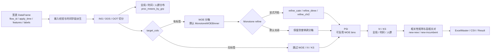
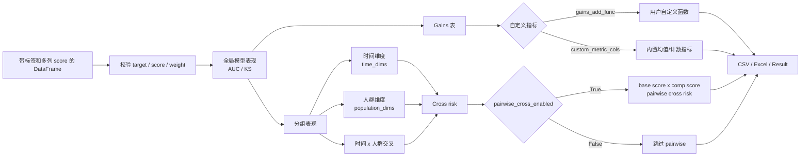
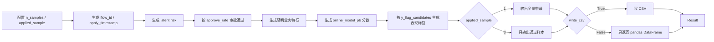
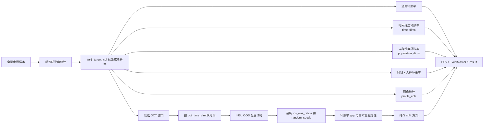

```mermaid
flowchart LR
    A["申请样本<br/>approved / rejected"] --> B{"train_prescore"}
    B -->|True| C["通过样本训练 pre-score"]
    B -->|False| D["使用已有 score_col"]
    C --> E["全量样本打 pre-score"]
    D --> F["拆分 approved / rejected"]
    E --> F
    F --> G{"RI approved reference"}
    G -->|默认| H["主数据全量 approved"]
    G -->|ri_approved_query / func| I["主数据 approved 子样本"]
    G -->|ri_approved_data| J["外部 approved reference"]
    H --> K["估计 RI 规则"]
    I --> K
    J --> K
    K --> L["生成 rejected inferred"]
    L --> M{"ri_approved_scope"}
    M -->|reference_only| N["主数据全量 approved + rejected inferred"]
    M -->|output_subset| O["approved 子样本 + rejected inferred"]
    N --> P{"train_ri_models"}
    O --> P
    P -->|True| Q["训练 RI 后模型<br/>含 no_ri_benchmark"]
    P -->|False| R["只输出 RI 数据集与摘要"]
    Q --> T{"save_models"}
    T -->|True| U["保存 pre-score / RI 模型 pkl"]
    T -->|False| S["CSV / Excel / Result"]
    U --> S
    R --> S
```

```mermaid
flowchart LR
    A["建模样本 DataFrame"] --> B{"已有 split_col / sample_col"}
    B -->|有 ins/oos/oot| C["读取样本切分"]
    B -->|无| D{"oot_col"}
    D -->|有| E["按 oot_col 拆 OOT"]
    D -->|无| F["随机切 INS / OOS / OOT"]
    E --> G["INS / OOS 切分"]
    F --> G
    C --> H["特征筛选<br/>PSI / IV / Corr"]
    G --> H
    H --> I["WOE 分箱与转换"]
    I --> J{"backward_enabled"}
    J -->|True| K["WOE 特征逐步剔除"]
    J -->|False| L["保留 WOE 特征"]
    K --> M["selected_woe_features"]
    L --> M
    M --> N{"gbm_feature_source"}
    N -->|LR| O["LR 固定使用 WOE 特征"]
    N -->|GBM = woe| P["LGB / XGB / Cat 使用 WOE 特征"]
    N -->|GBM = raw| Q["WOE 特征映射回原始变量<br/>LGB / XGB / Cat 使用 raw 特征"]
    O --> R{"LR 参数筛选"}
    P --> R
    Q --> R
    R -->|lr_search_enabled| S["LR grid_search_params"]
    R -->|关闭| T["跳过 LR search"]
    S --> U{"warm_start_enabled"}
    T --> U
    U -->|True| V["读取前置分<br/>probability / log_odds"]
    U -->|False| W["普通训练输入"]
    V --> X["训练候选模型<br/>LR / LGB / XGB / Cat"]
    W --> X
    X --> Y{"Optuna"}
    Y -->|optuna_models 非空| Z["GBM 超参搜索"]
    Y -->|空| AA["跳过调参"]
    Z --> AB["性能评估<br/>按模型特征源预测"]
    AA --> AB
    AB --> AC{"解释性"}
    AC -->|explain_models / owen_enabled| AD["SHAP / LIME / PDP / ALE / ICE / Owen"]
    AC -->|关闭| AE["跳过解释"]
    AD --> AF["CSV / Excel / Result"]
    AE --> AF
```

```mermaid
flowchart LR
    A{"数据来源"} -->|SQL 模式| B["读取 offline_sql / online_sql"]
    A -->|DataFrame 模式| C["offline_data / online_data"]
    B --> D["SQLRunner 拉数"]
    C --> E["标准化 online / offline 数据"]
    D --> E
    E --> F["flow_id outer merge"]
    F --> G["覆盖率检查<br/>common / only_offline / only_online"]
    G --> H["主模型分一致性"]
    H --> I{"子模型分"}
    I -->|include_submodel_scores=True| J["作为普通特征检查"]
    I -->|False + submodel_pairs| K["子模型专项检查"]
    J --> L["全量特征一致性"]
    K --> L
    L --> M["时间字段容忍度检查"]
    M --> N["per-flow 问题明细"]
    N --> O["CSV / Excel / Result"]
```

# 顶层封装流水线

`Modeling_Tool.Pipeline` 提供六条高层业务流水线和一个 mock 数据生成 Pipeline，把常见的端到端脚本封装成可复用、可配置、可返回结构化结果的 API。

这些 Pipeline **不生成模拟数据**。调用方需要先准备真实业务 DataFrame、模型分数据，或项目 SQL，然后通过 `Config` 控制要跑哪些步骤、哪些模型、哪些维度和哪些输出。

```python
from Modeling_Tool.Pipeline import (
    RejectInferencePipeline,
    RejectInferencePipelineConfig,
    CreditModelPipeline,
    CreditModelPipelineConfig,
    FeatureValidationPipeline,
    FeatureValidationPipelineConfig,
    ScoreComparisonPipeline,
    ScoreComparisonPipelineConfig,
    ScoreConsistencyUATPipeline,
    ScoreConsistencyUATPipelineConfig,
    SampleAnalysisPipeline,
    SampleAnalysisPipelineConfig,
    MockSamplePipeline,
    MockSamplePipelineConfig,
)
```

也可以从主包顶层导入：

```python
from Modeling_Tool import CreditModelPipeline, CreditModelPipelineConfig
```

## 1. 拒绝推断流水线

`RejectInferencePipeline` 用于已审批通过样本有标签、被拒绝样本无标签的场景。它可以自动训练 pre-score，也可以直接使用你已经准备好的拒绝推断分数。

### 流程图



### 中间步骤与可配置参数

| 步骤 | 产物 | 主要可配置参数 |
|---|---|---|
| 输入校验与特征准备 | `approved_data`、`rejected_data` 基础样本 | `approved_col`、`target_col`、`score_col`、`feature_cols` |
| pre-score 训练或复用 | `score_col` 分数列、`prescore_model` | `train_prescore`、`prescore_model_type`、`prescore_params`、`prescore_test_size`、`random_state` |
| OOT 口径确定 | OOT 样本、建模样本池、`oot_summary` | `split_col`、`oot_data`、`oot_frac`、`random_state`；外部 OOT 或 split OOT 会自动过滤 `target_col` 为空的未表现样本 |
| RI 参考样本确定 | `ri_approved_reference_data`、`ri_approved_summary` | `ri_approved_data`、`ri_approved_query`、`ri_approved_func`、`ri_approved_frac`、`ri_approved_n`、`ri_approved_scope` |
| RI 数据集生成 | `ri_datasets`、`ri_summary` | `ri_methods`、`ri_method_params`，例如 `bad_rate`、`cutoff`、`weight_factor`、`n_parcels` |
| RI 后模型训练 | `ri_models`、`ri_model_perf` | `train_ri_models`、`include_no_ri_benchmark`、`ri_model_type`、`ri_model_params` |
| 性能评估、模型保存与报告 | `best_method`、`model_paths`、`report_path` | `perf_pct_bins`、`min_bin_prop`、`save_models`、`model_output_dir`、`model_include_metadata`、`write_outputs`、`write_excel`、`output_dir` |

### 最小示例

```python
from Modeling_Tool import RejectInferencePipeline, RejectInferencePipelineConfig

cfg = RejectInferencePipelineConfig(
    output_dir="output/reject_inference",
    approved_col="approved",
    target_col="badflag",
    score_col="prescore_prob",
    feature_cols=[
        "income", "age", "score_b", "mob_on_book",
        "overdue_days_max", "util_rate", "loan_amount",
    ],
    train_prescore=True,
    ri_methods=["simple_augment", "hard_cutoff", "fuzzy_augment", "parceling"],
    train_ri_models=True,
)

result = RejectInferencePipeline(cfg).run(application_df)

result.ri_summary
result.ri_datasets["parceling"]
result.ri_model_perf
result.best_method
```

### Benchmark、模型保存与外部 OOT

`include_no_ri_benchmark=True` 时，Pipeline 会额外训练一个 `no_ri_benchmark` 模型：训练集只使用 approved 样本，不加入 rejected inferred。它会和各 RI 方法一起进入 `ri_model_perf` 排名，但不会写入 `ri_datasets`。

`save_models=True` 时会保存中间模型 pkl：pre-score 模型保存为 `prescore_model.pkl`，每个 RI 后模型保存为 `ri_model_{method}.pkl`，benchmark 保存为 `ri_model_no_ri_benchmark.pkl`。默认使用 SMF `save_model()` artifact 格式保存 metadata。

如果输入数据已有 `INS/OOS/OOT` 切分字段，推荐传 `split_col`。此时 `INS/OOS` 样本用于 pre-score、RI reference 和 RI 后模型训练，`OOT` 样本只用于评估，不进入 RI 增强训练集。

外部 `oot_data` 可以传全量申请数据，且优先级高于 `split_col == "oot"`。若 OOT 中 `target_col` 为空，Pipeline 会自动过滤未表现样本，并通过 warning 提示过滤数量；过滤情况会写入 `result.oot_summary`。

```python
cfg = RejectInferencePipelineConfig(
    ri_methods=["simple_augment", "parceling"],
    train_ri_models=True,
    split_col="model_split",
    include_no_ri_benchmark=True,
    save_models=True,
    oot_data=df_oot_full_application,
)

result = RejectInferencePipeline(cfg).run(df_train)

result.ri_model_perf      # 含 no_ri_benchmark
result.model_paths        # prescore / no_ri_benchmark / RI method pkl 路径
result.oot_summary        # 外部 OOT 成熟样本过滤摘要
```

### 输入数据要求

| 列 | 是否必需 | 说明 |
|---|---:|---|
| `approved_col` | 是 | 审批通过标识，默认 `approved`；通过样本为 `1`，拒绝样本为 `0`。 |
| `target_col` | 是 | 表现标签，默认 `badflag`；通过样本需要有标签，拒绝样本可为空。 |
| `score_col` | 视配置 | 拒绝推断分数。若 `train_prescore=True`，Pipeline 会生成该列；若 `False`，输入数据必须已有该列。 |
| `feature_cols` | 是 | 训练 pre-score 和 RI 后模型使用的特征列。 |

### `RejectInferencePipelineConfig` 参数

| 参数 | 默认值 | 说明 |
|---|---|---|
| `output_dir` | `"output/reject_inference"` | 输出根目录。数据集、CSV 报告和 Excel 报告会写到该目录下。 |
| `approved_col` | `"approved"` | 审批通过标识列。 |
| `target_col` | `"badflag"` | 目标标签列。 |
| `score_col` | `"prescore_prob"` | RI 使用的预评分列。 |
| `feature_cols` | `None` | 特征列列表。建议显式传入；不传时会从数值列中排除标签、审批标识、分数字段后推断。 |
| `split_col` | `None` | 已切分样本标识列，取值大小写不敏感，支持 `ins/oos/oot`。传入后 `ins/oos` 用于 RI 训练，`oot` 只用于评估；若同时传 `oot_data`，优先使用 `oot_data`。 |
| `random_state` | `42` | 随机种子，用于 pre-score 切分和 OOT 抽样。 |
| `write_outputs` | `True` | 是否写 CSV、图片等中间产物。 |
| `write_excel` | `True` | 是否输出 Excel 报告。 |
| `train_prescore` | `True` | 是否在通过样本上训练 pre-score 模型并给全量样本打分。 |
| `prescore_model_type` | `"lgb"` | pre-score 模型类型，传给 `GradientBoostingModel`，常用 `"lgb"`、`"xgb"`、`"cat"`。 |
| `prescore_params` | `{}` | pre-score 模型参数，会覆盖默认 LightGBM 参数。 |
| `prescore_test_size` | `0.3` | 在通过样本内部切分 pre-score validation 的比例。 |
| `ri_methods` | `["simple_augment", "hard_cutoff", "fuzzy_augment", "parceling"]` | 要尝试的拒绝推断方法。支持别名：`simple`、`hard`、`fuzzy`、`parcel`。 |
| `ri_method_params` | `{}` | 各 RI 方法的独立参数。 |
| `train_ri_models` | `True` | 是否基于每个 RI 增强数据集训练后续模型并比较 OOT 表现。 |
| `ri_model_type` | `"lgb"` | RI 后建模使用的模型类型。 |
| `ri_model_params` | `{}` | RI 后模型参数，会覆盖默认 LightGBM 参数。 |
| `include_no_ri_benchmark` | `True` | 是否额外训练 approved-only benchmark 模型，方法名为 `no_ri_benchmark`。 |
| `save_models` | `False` | 是否保存 pre-score 和 RI 后模型 pkl。 |
| `model_output_dir` | `None` | 模型 pkl 输出目录；不传时使用 `{output_dir}/models`。 |
| `model_include_metadata` | `True` | 是否使用 SMF `save_model()` artifact envelope 保存 metadata。 |
| `oot_data` | `None` | 外部指定 OOT 数据。传入后不再从 approved 样本随机抽 OOT；若包含 `target_col` 为空的未表现样本，会自动过滤并 warning。 |
| `oot_frac` | `0.2` | 未传 `oot_data` 时，从 approved 样本中随机抽取 OOT 的比例。 |
| `perf_pct_bins` | `10` | `PerformanceEvaluator` 的分箱数量。 |
| `min_bin_prop` | `0.03` | 性能评估最小分箱占比。 |
| `ri_approved_data` | `None` | 外部 approved reference 样本，仅用于估计 RI 规则；默认最终增强样本仍输出主数据全量 approved。 |
| `ri_approved_query` | `None` | 从主数据 approved 中筛选 RI reference 的 pandas query。 |
| `ri_approved_func` | `None` | 从主数据 approved 中筛选 RI reference 的自定义函数，返回 bool mask。 |
| `ri_approved_frac` | `None` | 从 RI reference 中随机抽样比例，不能和 `ri_approved_n` 同时使用。 |
| `ri_approved_n` | `None` | 从 RI reference 中随机抽样条数，不能和 `ri_approved_frac` 同时使用。 |
| `ri_approved_scope` | `"reference_only"` | `reference_only` 表示仅用 reference 估计 RI 规则，最终输出全量 approved；`output_subset` 表示最终只输出筛选后的 approved + rejected inferred。 |

### `ri_method_params` 写法

```python
cfg = RejectInferencePipelineConfig(
    ri_methods=["hard_cutoff", "parceling"],
    ri_method_params={
        "hard_cutoff": {"cutoff": 0.42},
        "parceling": {"n_parcels": 8},
        "simple_augment": {"bad_rate": 0.18},
        "fuzzy_augment": {"weight_factor": 1.5},
    },
)
```

| 方法 | 可配置参数 | 说明 |
|---|---|---|
| `simple_augment` | `bad_rate` | 不传时自动使用通过样本平均坏账率。 |
| `hard_cutoff` | `cutoff` | 不传时使用通过样本坏样本 pre-score 的 25 分位数。 |
| `fuzzy_augment` | `weight_factor` | 控制 fuzzy augmentation 权重强度。 |
| `parceling` | `n_parcels` | 按 score 分档的档数。 |

### RI approved reference 样本

默认情况下，Pipeline 使用主数据中的全量 approved 样本来估计 RI 规则，并输出“全量 approved + 全量 rejected inferred”的增强样本。若你只想用一部分 approved 或一份外部 approved 样本来估计 RI 规则，可以配置 reference 样本。

外部 reference 只参与 RI 估计，最终增强样本仍输出主数据全量 approved：

```python
cfg = RejectInferencePipelineConfig(
    ri_approved_data=external_approved_df,
    ri_methods=["parceling", "fuzzy_augment"],
    ri_approved_scope="reference_only",
)
```

从主数据 approved 中筛选 reference，但最终仍输出主数据全量 approved：

```python
cfg = RejectInferencePipelineConfig(
    ri_approved_query="channel == 'Google'",
    ri_approved_frac=0.5,
    ri_approved_scope="reference_only",
)
```

如果你希望最终增强样本也只包含筛选后的 approved：

```python
cfg = RejectInferencePipelineConfig(
    ri_approved_query="channel == 'Google'",
    ri_approved_scope="output_subset",
)
```

注意：`ri_approved_scope="output_subset"` 仅适用于从主数据筛选 reference；外部 `ri_approved_data` 不会被写入主数据增强输出。

### 结果对象

`RejectInferencePipeline.run()` 返回 `RejectInferencePipelineResult`。

| 字段 | 说明 |
|---|---|
| `approved_data` | 通过样本数据，包含 pre-score。 |
| `rejected_data` | 拒绝样本数据，包含 pre-score。 |
| `ri_datasets` | `{method: DataFrame}`，每种 RI 方法生成的增强训练集。 |
| `ri_summary` | 每种 RI 方法的数据规模、坏账率、是否有权重列等汇总。 |
| `ri_model_perf` | 每种 RI 增强数据和 `no_ri_benchmark` 训练模型后的 train / validation / OOT 表现。 |
| `best_method` | 按 OOT AUC 排名的最佳方法，可能是 RI 方法或 `no_ri_benchmark`。 |
| `prescore_model` | pre-score 模型 wrapper；若 `train_prescore=False` 则为空。 |
| `ri_models` | `{method: model}`，每种 RI 方法和可选 `no_ri_benchmark` 训练出的模型。 |
| `report_path` | Excel 报告路径；若 `write_excel=False` 则为空。 |
| `approved_full_data` | 主输入数据中的全量 approved 样本。 |
| `ri_approved_reference_data` | 实际用于 RI 规则估计的 approved reference 样本。 |
| `ri_approved_summary` | approved reference 来源、样本量、输出 approved 样本量和保留比例。 |
| `model_paths` | `{model_key: path}`，当 `save_models=True` 时记录 pre-score、benchmark 和 RI 后模型 pkl 路径。 |
| `oot_summary` | OOT 来源、原始样本数、成熟样本数、过滤未表现样本数和缺失率。 |

### 图表输出

当 `write_outputs=True` 且 `train_ri_models=True` 时，`RejectInferencePipeline` 会在 `report/perf_figs/` 下输出每个 RI 后模型的性能图，例如 `perf_simple_augment.png`、`perf_fuzzy_augment.png`。`fuzzy_augment` 这类带样本权重的评估会继续按加权口径输出表格，同时也会保存对应的 score performance 图。

## 2. 信用建模流水线

`CreditModelPipeline` 封装完整信用建模主线：样本切分、PSI/IV/相关性筛选、WOE、模型训练、backward、Optuna、评估、解释和 Excel 报告。

### 流程图



### 中间步骤与可配置参数

| 步骤 | 产物 | 主要可配置参数 |
|---|---|---|
| 样本切分 | `splits`，包含 `ins/oos/oot` | `split_col`、`sample_col`、`oot_col`、`split_config`、`random_state` |
| 特征筛选 | `feature_selection_summary`、候选特征列表 | `feature_cols`、`feature_selection.psi_enabled`、`feature_selection.iv_enabled`、`feature_selection.corr_enabled` 及各阈值 |
| WOE 分箱与转换 | `woe_artifacts`、WOE 特征 | `woe_engine`、`woe_params`、`monotone_woe_params` |
| Backward 变量剔除 | `backward_summary`、`selected_features` | `backward_enabled`、`backward_model`、`backward_params`、`use_backward_features` |
| 模型特征来源 | `model_feature_sources`、`model_feature_sets` | `gbm_feature_source`。LR 固定使用 WOE；LGB/XGB/Cat 可选 `"woe"` 或 `"raw"` |
| LR 参数筛选 | `lr_search_results`、LR best params | `lr_search_enabled`、`lr_search_param_grid`、`lr_search_params`、`use_lr_search_params` |
| 前置分 warm-start | `warm_start_summary`、GBM 增量模型 | `warm_start_enabled`、`warm_start_score_col`、`warm_start_score_type`、`warm_start_models` |
| 候选模型训练 | `models`、初始模型表现 | `train_models`、`model_params`、`target_col` |
| Optuna 调参 | `optuna_results`、调参后模型 | `optuna_models`、`optuna_n_trials`、`optuna_params` |
| 模型评估 | `perf_results` | `perf_pct_bins`、`perf_min_bin_prop` |
| 解释性与 Owen | `explain_outputs` | `explain_models`、`explain_params`、`owen_enabled`、`business_prior_groups` |
| 报告输出 | `report_path` | `output_dir`、`write_outputs`、`write_excel`、`plot_outputs` |

### 最小示例

```python
from Modeling_Tool import CreditModelPipeline, CreditModelPipelineConfig

cfg = CreditModelPipelineConfig(
    output_dir="output",
    target_col="badflag",
    feature_cols=[
        "income", "age", "score_b", "mob_on_book",
        "overdue_days_max", "util_rate", "loan_amount",
    ],
    oot_col="oot_flag",
    woe_engine="equal_freq",
    train_models=["lr", "lgb", "xgb", "cat"],
    gbm_feature_source="woe",
    backward_enabled=True,
    optuna_models=["lgb", "xgb", "cat"],
    explain_models=["lr", "lgb", "cat"],
    owen_enabled=True,
)

result = CreditModelPipeline(cfg).run(modeling_df)

result.selected_features
result.models["lgb"]
result.perf_results["lgb"]
```

### 输入数据要求

| 场景 | 必需列 | 说明 |
|---|---|---|
| 已切好样本 | `split_col` 或 `sample_col` | 推荐使用 `split_col` 指定字段名；`sample_col` 保留兼容。取值大小写不敏感，支持 `ins/oos/oot`。 |
| 只标记 OOT | `oot_col` | 默认 `oot_flag`，`0` 为 INS+OOS，非 `0` 为 OOT；Pipeline 再随机切 INS/OOS。 |
| 未标记样本 | 无 | 会从全量数据随机切 INS/OOS，并用 OOS 作为 OOT 的兜底。 |

### `CreditModelPipelineConfig` 参数

| 参数 | 默认值 | 说明 |
|---|---|---|
| `output_dir` | `"output"` | 输出根目录。 |
| `target_col` | `"badflag"` | 目标标签列。 |
| `feature_cols` | `None` | 原始入模特征列。建议显式传入；不传时从数值列推断。 |
| `split_col` | `None` | 推荐的新样本切分字段名。若传入，优先于 `sample_col`，取值支持 `ins/oos/oot`。 |
| `sample_col` | `"sample_ind"` | 兼容旧版本的已切分样本标识列。未传 `split_col` 时使用。 |
| `oot_col` | `"oot_flag"` | OOT 标识列。仅在没有有效 `split_col/sample_col` 时使用。 |
| `random_state` | `42` | 随机种子。 |
| `write_outputs` | `True` | 是否输出 CSV、图表等中间文件。 |
| `write_excel` | `True` | 是否输出 Excel 报告。 |
| `plot_outputs` | `True` | 是否输出 Pipeline 自动生成的分析图。关闭后 CSV/Excel 仍由 `write_outputs`、`write_excel` 控制。 |
| `split_config` | `{"test_size": 0.3, "stratify": True}` | INS/OOS 切分配置。 |
| `feature_selection` | 见下表 | PSI、IV、相关性筛选开关和阈值。 |
| `woe_engine` | `"equal_freq"` | WOE 引擎。支持 `"equal_freq"` 和 `"monotone"`。 |
| `woe_params` | `{"nbins": 10, "equal_freq": True, "min_bin_prop": 0.05}` | `WOE_Master.fit()` 参数和通用 WOE 配置。 |
| `monotone_woe_params` | `{"n_init_bins": 20, "min_bin_size": 0.03, "min_n_bins": 2}` | `MonotoneWOEBinner` 参数。 |
| `train_models` | `["lr", "lgb", "xgb", "cat"]` | 要训练的模型列表。 |
| `model_params` | `{}` | 每个模型的参数字典。 |
| `gbm_feature_source` | `"woe"` | GBM 入模特征来源。可传全局 `"woe"` / `"raw"`，也可传 `{"lgb": "raw", "xgb": "woe", "cat": "raw"}`。LR 始终使用 WOE 特征。 |
| `lr_search_enabled` | `False` | 是否为 LR 运行 `LRMaster.grid_search_params()` 参数筛选。 |
| `lr_search_param_grid` | `{"C": [0.01, 0.1, 1.0, 10.0]}` | LR 参数网格；会做笛卡尔积搜索。 |
| `lr_search_params` | `{}` | 覆盖 LR search 的 `objective`、`primary_set`、`gap_ref_sets`、`metric`、`refit`、`verbose` 等参数。 |
| `use_lr_search_params` | `True` | 是否把 LR best params 合并进最终 LR 训练参数。 |
| `warm_start_enabled` | `False` | 是否启用 GBM 前置分 warm-start。 |
| `warm_start_score_col` | `None` | 输入数据中的前置分列。 |
| `warm_start_score_type` | `"probability"` | `"probability"` 会裁剪后转 log-odds；`"log_odds"` 直接作为 init score。 |
| `warm_start_models` | `["lgb", "xgb"]` | 启用 warm-start 的 GBM 模型。当前底层支持 `lgb/xgb`。 |
| `warm_start_on_unsupported` | `"skip"` | CatBoost 等不支持 init score 时跳过 warm-start 或抛错。 |
| `warm_start_apply_to_optuna` | `False` | 是否在 GBM 参数搜索中传入 `fit_kwargs={"init_score": ...}`。 |
| `backward_enabled` | `True` | 是否运行 backward variable elimination。 |
| `backward_model` | `"lgb"` | backward 使用的代理模型。 |
| `backward_params` | `{}` | backward 初始化和运行参数。 |
| `use_backward_features` | `True` | 是否用 backward 选出的特征重新训练模型。 |
| `optuna_models` | `["lgb", "xgb", "cat"]` | 要跑 Optuna 搜索的模型。传 `[]` 可关闭。 |
| `optuna_n_trials` | `5` | 每个模型 Optuna trial 数。 |
| `optuna_params` | `{}` | Optuna 搜索空间和通用参数覆盖。 |
| `explain_models` | `["lr", "lgb", "cat"]` | 要跑 SHAP/LIME/PDP/ALE/ICE 主解释路径的模型。传 `[]` 可关闭。 |
| `explain_params` | `{"sample_n": 500, "background_n": 200}` | 解释样本量、背景样本量和 Owen 参数。 |
| `owen_enabled` | `True` | 是否计算 Owen value。 |
| `business_prior_groups` | `None` | Owen value 的业务先验分组。 |
| `perf_pct_bins` | `10` | 性能评估分箱数量。 |
| `perf_min_bin_prop` | `0.03` | 性能评估最小分箱占比。 |

### `split_config`

```python
split_config={
    "test_size": 0.3,
    "stratify": True,
    "random_state": 2026,
}
```

| 键 | 默认值 | 说明 |
|---|---|---|
| `test_size` | `0.3` | INS/OOS 切分中 OOS 占比。 |
| `stratify` | `True` | 是否按目标变量分层抽样。 |
| `random_state` | 使用顶层 `random_state` | 切分随机种子。 |

### `feature_selection`

```python
feature_selection={
    "psi_enabled": True,
    "psi_threshold": 0.2,
    "iv_enabled": True,
    "iv_threshold": 0.02,
    "corr_enabled": True,
    "corr_threshold": 0.75,
}
```

| 键 | 默认值 | 说明 |
|---|---|---|
| `psi_enabled` | `True` | 是否运行 PSI 稳定性筛选。 |
| `psi_threshold` | `0.2` | PSI 小于该阈值的变量保留。 |
| `psi_buckets` | `10` | PSI 分箱数。 |
| `iv_enabled` | `True` | 是否运行 IV 筛选。 |
| `iv_threshold` | `0.02` | IV 大于等于该阈值的变量保留。 |
| `iv_nbins` | `10` | IV 分析分箱数。 |
| `iv_equal_freq` | `True` | IV 分析是否等频分箱。 |
| `iv_min_bin_prop` | `0.05` | IV 分析最小分箱占比。 |
| `corr_enabled` | `True` | 是否运行高相关剔除。 |
| `corr_threshold` | `0.75` | 相关性阈值。 |
| `corr_max_iterations` | `10` | 相关性剔除最大迭代次数。 |

### WOE 参数

`woe_engine="equal_freq"` 时使用 `WOE_Master`：

```python
woe_params={
    "nbins": 10,
    "equal_freq": True,
    "min_bin_prop": 0.05,
    "woe_suffix": "_woe",
    "missing_ref_value": -999999,
}
```

`woe_engine="monotone"` 时使用 `MonotoneWOEBinner`：

```python
monotone_woe_params={
    "n_init_bins": 20,
    "min_bin_size": 0.03,
    "min_n_bins": 2,
    "special_values": [-999999],
    "chi2_binning": False,
}
```

### 模型参数

`train_models` 控制训练哪些模型，`model_params` 按模型名覆盖默认参数。

```python
model_params={
    "lr": {
        "C": 1.0,
        "max_iter": 1000,
        "solver": "lbfgs",
        "standardize": False,
    },
    "lgb": {
        "n_estimators": 300,
        "learning_rate": 0.05,
        "num_leaves": 31,
        "early_stopping_rounds": 50,
        "eval_metric": "auc",
    },
    "xgb": {
        "n_estimators": 300,
        "max_depth": 4,
        "learning_rate": 0.05,
        "eval_metric": "auc",
    },
    "cat": {
        "iterations": 300,
        "depth": 4,
        "learning_rate": 0.05,
        "eval_metric": "AUC",
    },
}
```

### LR 参数筛选

`lr_search_enabled=True` 且 `train_models` 包含 `"lr"` 时，Pipeline 会在 WOE 后、最终模型训练前运行 `LRMaster.grid_search_params()`。

```python
cfg = CreditModelPipelineConfig(
    train_models=["lr", "lgb"],
    lr_search_enabled=True,
    lr_search_param_grid={"C": [0.01, 0.1, 1.0, 10.0]},
    lr_search_params={
        "objective": "oot_gap_penalized",
        "primary_set": "oos",
        "gap_ref_sets": ["oot"],
        "metric": "auc",
        "refit": False,
        "verbose": False,
    },
    use_lr_search_params=True,
)
```

默认搜索训练集为 `ins`，评估集为 `oos/oot`。搜索结果返回在 `result.lr_search_results`，并可落盘为 `lr_param_search.csv`。

### GBM 原始 / WOE 特征开关

默认情况下，`CreditModelPipeline` 仍保持历史行为：LR、LGB、XGB、CatBoost 都使用 WOE 后特征。若希望树模型直接吃原始变量，可以通过 `gbm_feature_source` 切换。

```python
cfg = CreditModelPipelineConfig(
    train_models=["lr", "lgb", "xgb", "cat"],
    gbm_feature_source={
        "lgb": "raw",
        "xgb": "woe",
        "cat": "raw",
    },
)
```

规则如下：

| 模型 | 特征来源规则 |
|---|---|
| `lr` | 固定使用 WOE 特征，不受 `gbm_feature_source` 影响。 |
| `lgb/xgb/cat` | 可使用 `"woe"` 或 `"raw"`；全局传字符串时三个 GBM 使用同一来源，传 dict 时可逐模型配置。 |
| backward 后 raw GBM | backward 仍在 WOE 特征上筛选；当 GBM 选择 raw 且 `use_backward_features=True` 时，Pipeline 会把 `xxx_woe` 映射回原始 `xxx`。 |
| 类别特征 | raw 模式不自动做类别编码；如 CatBoost 需要 `cat_features`，请通过 `model_params["cat"]` 传给底层模型。 |

运行后可查看：

```python
result.model_feature_sources   # {"lr": "woe", "lgb": "raw", ...}
result.model_feature_sets      # 每个模型实际使用的字段
result.selected_raw_features
result.selected_woe_features
```

若 `write_outputs=True`，还会输出 `model_feature_sources.csv`；Excel 报告中对应 sheet 为 `Model_Feature_Source`。

### GBM 前置分 Warm-Start

`warm_start_enabled=True` 时，Pipeline 会把输入数据里的前置分转换为 GBM 的 `init_score/base_margin`。训练和评估时都会使用该前置分；评估阶段会走 `predict_with_base_margin()`，输出的是“前置分 + 增量模型”的融合概率。

```python
cfg = CreditModelPipelineConfig(
    train_models=["lr", "lgb"],
    warm_start_enabled=True,
    warm_start_score_col="base_model_prob",
    warm_start_score_type="probability",
    warm_start_models=["lgb"],
    warm_start_apply_to_optuna=False,
)
```

`warm_start_score_type="probability"` 适合传入概率分，Pipeline 会自动裁剪到 `(0, 1)` 并转为 log-odds；`"log_odds"` 适合已经准备好的 raw margin。当前底层 warm-start 支持 `lgb/xgb`，CatBoost 默认记录为 `skipped_unsupported`，也可以通过 `warm_start_on_unsupported="raise"` 改为直接抛错。

### Backward 参数

```python
backward_params={
    "init": {
        "model_type": "lgbm",
    },
    "run": {
        "n_rounds": 3,
        "cum_importance_threshold": 0.99,
        "min_vars": 5,
        "ret_perf": True,
    },
}
```

| 键 | 说明 |
|---|---|
| `init` | 覆盖 `BackwardVariableEliminator` 初始化参数。 |
| `run` | 覆盖 backward 运行参数。 |

### Optuna 参数

```python
optuna_models=["lgb", "xgb"]
optuna_n_trials=20
optuna_params={
    "search_spaces": {
        "lgb": {
            "num_leaves": {"type": "int", "low": 16, "high": 64},
            "learning_rate": {"type": "float", "low": 0.01, "high": 0.1, "log": True},
        },
    },
    "common": {
        "objective": "oot_gap_penalized",
        "primary_set": "oos",
        "gap_ref_sets": ["oot"],
        "metric": "auc",
        "refit": True,
    },
}
```

### Explain / Owen 参数

```python
explain_params={
    "sample_n": 500,
    "background_n": 200,
    "owen_threshold": 0.35,
    "owen_method": "complete",
    "owen_corr_method": "spearman",
    "owen_model_output": "probability",
}

business_prior_groups={
    "repayment_capacity": ["income_woe", "employment_months_woe", "loan_amount_woe"],
    "credit_behavior": ["score_b_woe", "overdue_days_max_woe", "mob_on_book_woe"],
}
```

| 键 | 默认值 | 说明 |
|---|---|---|
| `sample_n` | `500` | 解释计算使用的 OOS 样本数。 |
| `background_n` | `200` | SHAP/Owen 背景样本数。 |
| `owen_threshold` | `0.35` | coalition 自动聚类距离阈值。 |
| `owen_method` | `"complete"` | 层次聚类方法。 |
| `owen_corr_method` | `"spearman"` | 相关性方法。 |
| `owen_min_group_size` | `1` | 自动分组最小组大小。 |
| `owen_intra_dist` | `0.01` | 同组特征在 linkage 中的距离。 |
| `owen_inter_dist` | `0.99` | 跨组特征在 linkage 中的距离。 |
| `owen_model_output` | `"probability"` | Owen value 解释的模型输出空间。 |

### 结果对象

`CreditModelPipeline.run()` 返回 `CreditModelPipelineResult`。

| 字段 | 说明 |
|---|---|
| `splits` | `{"ins": df, "oos": df, "oot": df}`。 |
| `feature_selection_summary` | PSI、IV、相关性筛选结果和最终变量列表。 |
| `woe_artifacts` | WOE 引擎、WOE 后数据、WOE 特征名、WOE 表。 |
| `models` | `{model_name: (wrapper, raw_model, feature_cols)}`。 |
| `selected_features` | 兼容旧代码的 WOE 主线特征，等同于 `selected_woe_features`。 |
| `selected_raw_features` | 原始变量名版本的最终特征集合，供 raw GBM 使用。 |
| `selected_woe_features` | WOE 变量名版本的最终特征集合，供 LR 和 WOE GBM 使用。 |
| `model_feature_sources` | 每个模型实际使用 `"woe"` 还是 `"raw"`。 |
| `model_feature_sets` | 每个模型实际训练、评估、解释使用的字段列表。 |
| `backward_summary` | backward 汇总表；未启用时为空。 |
| `lr_search_results` | LR 参数筛选结果；未启用时为空。 |
| `optuna_results` | `{model_name: search_result_df}`。 |
| `warm_start_summary` | 前置分 warm-start 启用、跳过、score 类型和缺失率汇总；未启用时为空。 |
| `perf_results` | `{model_name: perf_df}`。 |
| `explain_outputs` | SHAP/Owen 等解释输出。 |
| `report_path` | Excel 报告路径；若 `write_excel=False` 则为空。 |

### 图表输出

当 `write_outputs=True` 且 `plot_outputs=True` 时，`CreditModelPipeline` 会自动输出以下图表：

| 目录 | 内容 | 触发条件 |
|---|---|---|
| `figs/var_analysis/overall/` | `VarExtractionInsights.plot_woe()` 生成的变量 WOE 分析图。 | `feature_selection["iv_enabled"]=True` |
| `figs/woe/overall/` | `WOE_Master.plot_bivar_graph()` 生成的 equal-freq WOE 图。 | `woe_engine="equal_freq"` |
| `figs/mono_woe/` | `MonotoneWOEBinner.plot_woe_graph()` 生成的单调分箱 WOE 图。 | `woe_engine="monotone"` |
| `figs/perf/` | 每个模型的性能评估图，例如 `perf_lr.png`、`perf_lgb.png`。 | 对应模型训练成功 |

## 3. 特征验收流水线

`FeatureValidationPipeline` 用于新接特征宽表验收。它关注新特征的分布稳定性、区分能力、PSI、WOE 分箱图、与现有特征的相关性，以及可落地复核的 ExcelMaster 报告。

### 流程图



### 最小示例

```python
from Modeling_Tool import FeatureValidationPipeline, FeatureValidationPipelineConfig

cfg = FeatureValidationPipelineConfig(
    output_dir="output/feature_validation",
    id_col="flow_id",
    apply_time_col="apply_time",
    target_cols=["badflag"],
    new_feature_cols=["new_score", "new_income", "new_channel"],
    incumbent_feature_cols=["old_score", "old_income"],
    categorical_features=["new_channel"],
    population_dims=["channel"],
    woe_engine="monotone",
    corr_include_incumbent=True,
)

result = FeatureValidationPipeline(cfg).run(feature_wide_df)

result.psi_summary
result.ivks_summary
result.high_corr_pairs
```

### 中间步骤与可配置参数

| 步骤 | 产物 | 主要可配置参数 |
|---|---|---|
| 样本切分 | `splits` | `split_col`、`sample_col`、`oot_col`、`split_config`、`random_state` |
| 分布分析 | `distribution_summary` | `time_dims`、`population_dims`、`group_specs`、`distribution_params` |
| WOE 分箱 | `woe_artifacts` | `woe_engine`、`woe_params`、`monotone_woe_params`、`categorical_features` |
| Monotone refine | `woe_artifacts["refine_summary"]` | `monotone_refine_cate_enabled`、`monotone_refine_dtree_enabled`、`monotone_refine_chi2_enabled` 及对应 params |
| PSI | `psi_summary`、`psi_details` | `psi_reference_dataset`、`psi_reference_data`、`psi_group_dims`、`psi_use_woe_bins`、`psi_params` |
| IV / KS | `ivks_summary` | `ivks_group_dims`、`ivks_use_woe_bins`、`ivks_params`、`min_group_size` |
| 相关性 | `corr_matrix`、`high_corr_pairs`、`correlated_detail` | `corr_include_incumbent`、`corr_use_woe_bins`、`corr_params` |
| 报告输出 | `output_paths`、`report_path` | `output_dir`、`write_outputs`、`write_excel` |

### `FeatureValidationPipelineConfig` 参数

| 参数 | 默认值 | 说明 |
|---|---|---|
| `output_dir` | `"output/feature_validation"` | 输出目录。 |
| `id_col` | `"flow_id"` | 主键列。 |
| `apply_time_col` | `"apply_time"` | 申请时间列，用于派生 `apply_week/month/quarter`。 |
| `target_cols` | `None` | 标签列；为空时跳过 WOE、IV、KS 和相关性中的 IV/KS 对比。 |
| `new_feature_cols` | `None` | 新接特征列表；建议显式传入。 |
| `incumbent_feature_cols` | `None` | 现有特征列表，主要用于 new vs incumbent 相关性对比。 |
| `split_col` | `None` | 推荐的新样本切分字段名，取值大小写不敏感，支持 `ins/oos/oot`。优先于 `sample_col`。 |
| `sample_col` / `oot_col` | `"sample_ind"` / `"oot_flag"` | 与 `CreditModelPipeline` 一致的兼容切分字段；未传 `split_col` 时使用 `sample_col`。 |
| `split_config` | `{"test_size": 0.3, "stratify": True}` | INS/OOS 切分配置。 |
| `time_dims` | `["apply_month"]` | 时间维度。 |
| `population_dims` | `[]` | 人群维度，如渠道、产品、策略版本。 |
| `group_specs` | `None` | 自定义分组规格；不传时自动组合 global/time/population/time x population。 |
| `min_group_size` | `100` | PSI/IV/KS 分组最小样本数保护。 |
| `woe_engine` | `"monotone"` | 默认 `MonotoneWOEBinner`；也支持 `"equal_freq"` 使用 `WOE_Master`。 |
| `categorical_features` | `None` | 类别特征列表，传给 `MonotoneWOEBinner(cate_feats=...)`。 |
| `monotone_refine_cate_enabled` | `False` | 是否对类别变量调用 `refine_cate()`。 |
| `monotone_refine_cate_params` | `{}` | 透传 `refine_cate(features, max_bins, min_bin_size, badrate_tol)`。 |
| `monotone_refine_dtree_enabled` | `False` | 是否调用 `refine_dtree()`。 |
| `monotone_refine_dtree_params` | `{}` | 透传 `refine_dtree(df, features, max_bins, min_samples_leaf, monotone, n_jobs)`。 |
| `monotone_refine_chi2_enabled` | `False` | 是否调用 `refine_chi2()`。 |
| `monotone_refine_chi2_params` | `{}` | 透传 `refine_chi2(df, features, chi2_p, chi2_init_size, n_jobs)`。 |
| `psi_reference_dataset` | `"ins"` | PSI benchmark，可选 `ins/oos/oot/external`。 |
| `psi_reference_data` | `None` | 外部 PSI benchmark；`psi_reference_dataset="external"` 时必传。 |
| `psi_use_woe_bins` | `True` | 是否复用 step 3 WOE 分箱边界。 |
| `ivks_use_woe_bins` | `True` | 是否复用 step 3 WOE 分箱边界计算 IV/KS。 |
| `corr_include_incumbent` | `True` | 相关性是否纳入现有特征。 |
| `corr_use_woe_bins` | `True` | 相关性对比中的 IV/KS 是否复用 step 3 WOE 分箱。 |
| `write_outputs` / `write_excel` | `True` / `True` | 是否输出 CSV/图片和 ExcelMaster 报告。 |

### Monotone Refine 示例

```python
cfg = FeatureValidationPipelineConfig(
    woe_engine="monotone",
    categorical_features=["new_channel", "new_industry"],
    monotone_refine_cate_enabled=True,
    monotone_refine_cate_params={"max_bins": 5, "min_bin_size": 0.02},
    monotone_refine_dtree_enabled=True,
    monotone_refine_dtree_params={"max_bins": 6, "min_samples_leaf": 0.05},
    monotone_refine_chi2_enabled=True,
    monotone_refine_chi2_params={"chi2_p": 0.95, "n_jobs": 4},
)
```

默认不执行任何 refine；执行顺序固定为 `refine_cate` -> `refine_dtree` -> `refine_chi2`。

### 结果对象

| 字段 | 说明 |
|---|---|
| `splits` | `{"ins": df, "oos": df, "oot": df}`。 |
| `distribution_summary` | 分布分析结果字典，包含数值和类别变量分组统计。 |
| `woe_artifacts` | WOE engine、WOE 表、WOE 后数据、refine summary。 |
| `psi_summary` / `psi_details` | PSI 汇总和分箱明细。 |
| `ivks_summary` | IV、KS、Lift、缺失率、分箱数等区分能力指标。 |
| `corr_matrix` | 相关性矩阵。 |
| `high_corr_pairs` | 超过阈值的两两高相关变量。 |
| `correlated_detail` | 高相关组中各变量 IV/KS 对比和保留/剔除建议。 |
| `validation_summary` | 行数、特征数、目标数、输出规模等总览。 |
| `output_paths` / `report_path` | CSV/Excel 输出路径。 |

## 4. 模型分对比流水线

`ScoreComparisonPipeline` 用于多模型分、多版本分数或 champion/challenger 模型分对比。它封装全局 AUC/KS、分维度 AUC/KS、Gains、自定义指标、cross risk 和 pairwise score cross risk。

### 流程图



### 中间步骤与可配置参数

| 步骤 | 产物 | 主要可配置参数 |
|---|---|---|
| 输入校验与分数角色定义 | 标准化后的 score 数据 | `target_col`、`score_cols`、`base_score`、`comp_scores`、`weight_col` |
| 全局表现评估 | `global_perf` | `nbins`、`min_data_size`、`weight_col` |
| 分 INS/OOS/OOT 评估 | `group_perf[split_col]` | `split_col`；仅作为分组维度，不做训练切分 |
| 分时间维度评估 | `group_perf[time_dim]` | `time_dims`、`group_min_size`、`group_specs` |
| 分人群维度评估 | `group_perf[population_dim]` | `population_dims`、`segment_dims`、`group_min_size`、`group_specs` |
| 时间 x 人群交叉评估 | `group_perf[population_x_time]` | `include_time_population_cross`、`time_dims`、`population_dims`、`group_min_size` |
| Gains 与业务指标 | `gains` | `gains_add_func`、`custom_metric_cols`、`nbins` |
| Cross risk | `cross_results` | `cross_vars`、`cross_metrics`、`cross_binning_numeric`、`nbins`、`min_bin_prop`、`equal_freq` |
| Pairwise score cross | `pairwise_cross` | `pairwise_cross_enabled`、`pairwise_cross_agg_dict`、`base_score`、`comp_scores` |
| 报告输出 | `report_path` | `output_dir`、`write_outputs`、`write_excel` |

### 最小示例

```python
from Modeling_Tool import ScoreComparisonPipeline, ScoreComparisonPipelineConfig

cfg = ScoreComparisonPipelineConfig(
    output_dir="output/score_comparison",
    target_col="badflag",
    score_cols=["score_A", "score_B", "score_C"],
    base_score="score_A",
    comp_scores=["score_B", "score_C"],
    weight_col="_w_ones",
    time_dims=["apply_month", "vintage"],
    population_dims=["channel", "product_type"],
    custom_metric_cols=["credit_limit", "age", "apr"],
    cross_vars=["rating"],
    cross_binning_numeric=[True, False],
)

result = ScoreComparisonPipeline(cfg).run(score_df)

result.global_perf
result.group_perf["channel_x_apply_month"]
result.gains
result.cross_results
result.pairwise_cross
```

### 输入数据要求

| 列 | 是否必需 | 说明 |
|---|---:|---|
| `target_col` | 是 | 目标标签列。 |
| `score_cols` / `base_score` / `comp_scores` | 是 | 模型分列。 |
| `weight_col` | 否 | 样本权重列。 |
| `time_dims` | 否 | 时间维度列，如 `apply_month`、`week`、`vintage`。 |
| `population_dims` | 否 | 人群维度列，如 `channel`、`product_type`、`city_tier`。 |
| `cross_vars` | 否 | 交叉风险中的第二维变量，如 `rating`。 |
| `flow_id` | 否 | 若不存在，Pipeline 会自动生成。 |

### `ScoreComparisonPipelineConfig` 参数

| 参数 | 默认值 | 说明 |
|---|---|---|
| `output_dir` | `"output/score_comparison"` | 输出根目录。 |
| `target_col` | `"badflag"` | 目标标签列。 |
| `score_cols` | `None` | 全部分数列。若传入，会结合 `base_score` 自动推断比较分。 |
| `base_score` | `None` | 基准分数列。未传时使用 `score_cols[0]`。 |
| `comp_scores` | `None` | 待比较分数列。未传时使用 `score_cols` 中除 `base_score` 以外的列。 |
| `weight_col` | `None` | 样本权重列。 |
| `split_col` | `None` | 已切分样本标识列，取值支持 `ins/oos/oot`。在本 Pipeline 中作为默认分组维度输出，不改变 global/cross 全量评估。 |
| `random_state` | `42` | 随机种子，保留给后续需要抽样的扩展逻辑。 |
| `write_outputs` | `True` | 是否输出 CSV。 |
| `write_excel` | `True` | 是否输出 Excel 报告。 |
| `nbins` | `10` | Gains 和 cross risk 分箱数。 |
| `min_bin_prop` | `0.02` | 最小分箱占比。 |
| `equal_freq` | `True` | 是否等频分箱。 |
| `min_data_size` | `50` | 全局和分组评估的最小样本量。 |
| `precision` | `5` | 数值精度。 |
| `include_missing` | `False` | 是否在分箱中包含缺失值。 |
| `fillna` | `-999999` | 缺失填充值。 |
| `positive_score_only` | `True` | 是否按正向分数处理。 |
| `time_dims` | `["apply_month"]` | 时间维度列表。 |
| `population_dims` | `["channel"]` | 人群维度列表。 |
| `segment_dims` | `None` | `population_dims` 的别名。传入后会覆盖 `population_dims`。 |
| `include_time_population_cross` | `True` | 是否自动跑人群 x 时间交叉维度。 |
| `group_min_size` | `None` | 分组评估最小样本量；不传时使用 `min_data_size`。 |
| `group_specs` | `None` | 高级自定义分组配置。传入后会覆盖 `time_dims/population_dims` 自动生成逻辑。 |
| `gains_add_func` | `None` | 自定义 Gains 分箱附加指标函数。 |
| `custom_metric_cols` | `["credit_limit", "age", "apr"]` | 默认自定义业务指标列，会自动计算均值。 |
| `gains_display_metric_list` | 标准 Gains 指标列表 | `add_func=None` 时用于控制 Gains 展示列。 |
| `cross_vars` | `["rating"]` | cross risk 的第二维变量列表。 |
| `cross_metrics` | `{}` | cross risk 指标配置；不传时使用 bad rate 和 `custom_metric_cols` 均值。 |
| `cross_binning_numeric` | `[True, False]` | cross risk 两个维度是否数值分箱。支持 bool 或二元列表。 |
| `pairwise_cross_enabled` | `True` | 是否计算 compare score x base score 的 pairwise cross risk。 |
| `pairwise_cross_agg_dict` | `None` | pairwise cross risk 的聚合配置。 |

### 时间维度与人群维度

最常见的用法是直接传 `time_dims` 和 `population_dims`：

```python
cfg = ScoreComparisonPipelineConfig(
    time_dims=["apply_month", "vintage"],
    population_dims=["channel", "product_type", "city_tier"],
    include_time_population_cross=True,
    group_min_size=100,
)
```

Pipeline 会自动生成：

| 输出 key | 维度 |
|---|---|
| `split_col` 字段名 | INS/OOS/OOT 分组；仅在配置 `split_col` 时生成 |
| `apply_month` | 单时间维度 |
| `vintage` | 单时间维度 |
| `channel` | 单人群维度 |
| `product_type` | 单人群维度 |
| `city_tier` | 单人群维度 |
| `channel_x_apply_month` | 人群 x 时间 |
| `channel_x_vintage` | 人群 x 时间 |
| `product_type_x_apply_month` | 人群 x 时间 |
| `city_tier_x_vintage` | 人群 x 时间 |

结果在：

```python
result.group_perf["channel_x_apply_month"]
```

如果你只想跑单维，不跑交叉：

```python
cfg = ScoreComparisonPipelineConfig(
    time_dims=["apply_month"],
    population_dims=["channel", "product_type"],
    include_time_population_cross=False,
)
```

### 高级分组：`group_specs`

如果维度组合不是简单的人群 x 时间，可以直接传 `group_specs`。一旦传入 `group_specs`，Pipeline 不再自动使用 `time_dims/population_dims`。

```python
cfg = ScoreComparisonPipelineConfig(
    group_specs=[
        {"name": "month", "columns": ["apply_month"], "min_size": 100},
        {"name": "channel_x_month", "columns": ["channel", "apply_month"], "min_size": 100},
        {"name": "channel_x_product_x_month", "columns": ["channel", "product_type", "apply_month"], "min_size": 80},
    ],
)
```

| 键 | 说明 |
|---|---|
| `name` | 输出 key 和落盘文件名的一部分。 |
| `columns` | 依次 group by 的列。一个列表示单维，多个列表示链式交叉维度。 |
| `min_size` | 该分组下最小样本量。 |

### Gains 自定义指标

不传 `gains_add_func` 时，Pipeline 会对 `custom_metric_cols` 自动输出均值：

```python
cfg = ScoreComparisonPipelineConfig(
    custom_metric_cols=["credit_limit", "age", "apr"],
)
```

需要自定义更多指标时传函数：

```python
import pandas as pd

def add_business_metrics(sub_df):
    return pd.Series({
        "credit_limit_mean": sub_df["credit_limit"].mean(),
        "apr_p75": sub_df["apr"].quantile(0.75),
        "approval_amount_sum": sub_df["approval_amount"].sum(),
    })

cfg = ScoreComparisonPipelineConfig(
    gains_add_func=add_business_metrics,
)
```

### Cross risk 指标

默认 cross risk 指标为：

- `bad_rate`: `target_col` 的均值
- `custom_metric_cols` 中每个字段的均值

自定义写法：

```python
cfg = ScoreComparisonPipelineConfig(
    cross_vars=["rating", "policy_group"],
    cross_metrics={
        "bad_rate": ("badflag", "mean"),
        "credit_limit": ("credit_limit", "mean"),
        "cnt": ("flow_id", "count"),
    },
    cross_binning_numeric=[True, False],
)
```

`cross_binning_numeric` 用于控制 `[score, cross_var]` 两个维度是否数值分箱：

| 值 | 含义 |
|---|---|
| `[True, False]` | 分数列分箱，评级/人群列按类别原值展示。 |
| `[True, True]` | 两个变量都数值分箱。 |
| `False` | 两个变量都按类别处理。 |

### Pairwise cross risk

默认会计算 `comp_scores` 与 `base_score` 的 pairwise cross risk。

关闭：

```python
cfg = ScoreComparisonPipelineConfig(pairwise_cross_enabled=False)
```

自定义聚合：

```python
cfg = ScoreComparisonPipelineConfig(
    pairwise_cross_agg_dict={
        "badflag": ["count", lambda x: round(x.sum() / x.count(), 4)],
        "credit_limit": ["count", lambda x: round(x.mean(), 2)],
        "apr": ["count", lambda x: round(x.mean(), 4)],
    },
)
```

### 结果对象

`ScoreComparisonPipeline.run()` 返回 `ScoreComparisonPipelineResult`。

| 字段 | 说明 |
|---|---|
| `global_perf` | 所有 score 的全局 AUC/KS 表。 |
| `group_perf` | `{group_name: DataFrame}`，时间、人群和交叉维度评估表。 |
| `gains` | 全局 Gains 表，可包含自定义业务指标。 |
| `cross_results` | `{score__cross_var__metric: DataFrame}`。 |
| `pairwise_cross` | compare score x base score 的 pairwise cross risk。 |
| `report_path` | Excel 报告路径；若 `write_excel=False` 则为空。 |

## 5. UAT 线上/离线一致性流水线

`ScoreConsistencyUATPipeline` 用于模型上线或 UAT 阶段的 online/offline 一致性校验。它复用主包 `UATConsistencyChecker`，检查 flow_id 覆盖、主模型分、子模型分、全量特征、时间字段和 per-flow 问题明细。

### 流程图



### 中间步骤与可配置参数

| 步骤 | 产物 | 主要可配置参数 |
|---|---|---|
| 数据获取 | `offline_data`、`online_data` | `offline_data`、`online_data`、`sql_dir`、`offline_sql`、`online_sql`、`sqlrunner`、`env_path`、`n_process` |
| 覆盖率检查 | `coverage_summary`、`compare_data`、`both_data` | 固定以 `flow_id` 为主键；`info_list` 会进入明细报告 |
| 主模型分检查 | `main_score_summary` | `main_model_score_col`、`tol_score` |
| 子模型分检查 | `submodel_summary` | `include_submodel_scores`、`submodel_pairs`、`tol_score` |
| 普通特征一致性 | `feature_diff_summary` | `tol_feat`、`info_list`、`time_featlist`、主模型分和子模型分配置 |
| 时间字段一致性 | `time_summary` | `time_featlist`、`tol_time_seconds` |
| per-flow 明细 | `per_flow_report`、`summary` | `info_list`、各类容忍度配置 |
| 报告输出 | `report_path` | `output_dir`、`write_outputs`、`write_excel`、`excel_output_path`、`excel_font` |

### SQL 模式示例

```python
from Modeling_Tool import ScoreConsistencyUATPipeline, ScoreConsistencyUATPipelineConfig
from Modeling_Tool.Core import ODPSRunner

cfg = ScoreConsistencyUATPipelineConfig(
    sql_dir="sql",
    offline_sql="pull_offline.sql",
    online_sql="pull_online.sql",
    sqlrunner=ODPSRunner(),
    main_model_score_col="credit_risk_v31_cdc_submodel_score",
    info_list=["user_id", "curp", "launch_time", "flowtime", "cdc_inserttime"],
)

result = ScoreConsistencyUATPipeline(cfg).run()
```

### DataFrame 模式示例

```python
cfg = ScoreConsistencyUATPipelineConfig(
    main_model_score_col="score",
    info_list=["user_id", "launch_time"],
    time_featlist=["decision_time"],
    tol_score=1e-6,
    tol_feat=1e-2,
    write_outputs=False,
    write_excel=False,
)

result = ScoreConsistencyUATPipeline(cfg).run(
    offline_data=df_offline,
    online_data=df_online,
)
```

### 输入数据要求

| 要求 | 说明 |
|---|---|
| `flow_id` | 必须存在，作为 online/offline merge 主键。 |
| 主模型分字段 | offline 与 online 需同名，例如 `score`；merge 后线上列会变成 `score_online`。 |
| 特征字段 | 同名字段会自动组成 `col` / `col_online` 特征对。 |
| 时间字段 | 配在 `time_featlist` 中，按 datetime 语义和秒级容忍度比较。 |
| 信息字段 | 配在 `info_list` 中，会进入明细报表，并从数值特征自动对比中排除。 |

### `ScoreConsistencyUATPipelineConfig` 参数

| 参数 | 默认值 | 说明 |
|---|---|---|
| `output_dir` | `"output/score_consistency_uat"` | CSV/Excel 输出根目录。 |
| `random_state` | `42` | 预留随机种子，保持高层 Pipeline 统一接口。 |
| `write_outputs` | `True` | 是否输出 summary、feature diff、per-flow 等 CSV。 |
| `write_excel` | `True` | 是否调用 `export_excel()` 输出 UAT Excel 报告。 |
| `sql_dir` | `"sql"` | SQL 文件目录。 |
| `offline_sql` | `"pull_offline.sql"` | 离线回溯 SQL 文件名。 |
| `online_sql` | `"pull_online.sql"` | 线上结果 SQL 文件名。 |
| `sqlrunner` | `None` | 已初始化的 SQL runner；SQL 模式不传时默认使用 `ODPSRunner()`。 |
| `env_path` | `None` | 可选 `.env` 路径；传入后用 `python-dotenv` 加载。 |
| `n_process` | `"auto"` | SQL 并发进程数；`"auto"` 表示 `cpu_count - 1`。 |
| `offline_data` | `None` | 可选离线 DataFrame；与 `online_data` 同时传入时走 DataFrame 模式。 |
| `online_data` | `None` | 可选线上 DataFrame。 |
| `main_model_score_col` | `"credit_risk_v31_cdc_submodel_score"` | 主模型分字段名。 |
| `tol_score` | `1e-6` | 主模型分和子模型分容忍度。 |
| `tol_feat` | `1e-2` | 普通数值特征容忍度。 |
| `time_featlist` | `[]` | 需要按时间语义比较的字段。 |
| `tol_time_seconds` | `60.0` | 时间字段秒级容忍度。 |
| `excel_output_path` | `None` | Excel 报告路径；为空时写到 `output_dir/report/Score_Consistency_UAT_Report.xlsx`。 |
| `excel_font` | `"Arial"` | Excel 报告字体。 |
| `info_list` | `[]` | 明细报表附带字段，也会从自动特征对比中排除。 |
| `include_submodel_scores` | `True` | `True` 时子模型分作为普通特征自动检查；`False` 时启用专项检查。 |
| `submodel_pairs` | `{}` | 子模型专项检查映射，格式为 `{offline_col: online_col}`。 |

### 子模型分专项检查

默认 `include_submodel_scores=True`，子模型分由全量特征检查覆盖。如果希望单独在报告中展示子模型分检查，设置：

```python
cfg = ScoreConsistencyUATPipelineConfig(
    include_submodel_scores=False,
    submodel_pairs={
        "sub_score_a": "sub_score_a_online",
        "sub_score_b": "sub_score_b_online",
    },
)
```

### 结果对象

`ScoreConsistencyUATPipeline.run()` 返回 `ScoreConsistencyUATPipelineResult`。

| 字段 | 说明 |
|---|---|
| `offline_data` | 离线数据。 |
| `online_data` | 线上数据。 |
| `compare_data` | online/offline outer merge 后的数据。 |
| `both_data` | 仅包含 online/offline 都存在的 common flow_id。 |
| `coverage_summary` | flow_id 覆盖统计字典。 |
| `main_score_summary` | 主模型分一致性统计。 |
| `submodel_summary` | 子模型专项检查结果列表。 |
| `feature_diff_summary` | 全量特征一致性汇总表。 |
| `time_summary` | 时间字段一致性汇总表。 |
| `per_flow_report` | flow_id 级别问题明细。 |
| `summary` | 整体结论表。 |
| `report_path` | Excel 报告路径；`write_excel=False` 时为 `None`。 |
| `checker` | 底层 `UATConsistencyChecker` 实例，便于高级用户继续读取内部明细。 |

### UAT 报告解读

| 模块 | 重点看什么 |
|---|---|
| `Flow ID Coverage` | online/offline 是否覆盖同一批 flow_id，是否存在 only_online 或 only_offline。 |
| `Main Model Score` | 主模型分是否有超过 `tol_score` 的差异或单边空值。 |
| `Feature Variables` | 哪些特征有差异，差异样本数和最大绝对差。 |
| `Time Fields` | 时间字段是否超过 `tol_time_seconds`。 |
| `Per Flow-ID Report` | 每个 flow_id 具体哪些字段不一致，便于逐笔排查。 |

## 6. Mock 样本生成流水线

`MockSamplePipeline` 用于生成模拟申请样本或通过样本，方便快速验证 `SampleAnalysisPipeline`、建模 demo 和模型分对比流程。它只负责造数和可选 CSV 输出，不做建模分析，也不输出 Excel。

### 流程图



### 最小示例

```python
from Modeling_Tool import MockSamplePipeline, MockSamplePipelineConfig

result = MockSamplePipeline(
    MockSamplePipelineConfig(
        n_samples=80000,
        applied_sample=1,
    )
).run()

df = result.data
result.summary
result.feature_metadata
```

只输出通过样本：

```python
result = MockSamplePipeline(
    MockSamplePipelineConfig(applied_sample=0)
).run()

assert result.data["is_approved"].eq(1).all()
```

输出 CSV：

```python
cfg = MockSamplePipelineConfig(
    write_csv=True,
    output_path="output/mock_sample/mock_sample.csv",
)
result = MockSamplePipeline(cfg).run()
```

### `MockSamplePipelineConfig` 参数

| 参数 | 默认值 | 说明 |
|---|---|---|
| `n_samples` | `80000` | 初始全量申请样本量。若 `applied_sample=0`，最终输出约为 `n_samples * approve_rate`。 |
| `applied_sample` | `1` | `1` 输出全量申请；`0` 只输出通过样本，且 `is_approved` 全为 1。 |
| `approve_rate` | `0.25` | 全量申请中的审批通过率。 |
| `num_online_scores` | `5` | 生成 `online_model_pb_1 ... online_model_pb_n`。 |
| `y_flag_candidates` | `[15, 30, 45]` | 生成 `y_flag_dpd7_in_15d`、`y_flag_dpd7_in_30d`、`y_flag_dpd7_in_45d` 等标签。 |
| `num_features` | `20` | 随机生成特征变量数量。 |
| `min_num_feature_business_type` | `5` | 特征至少覆盖的业务类型数量；不得大于 `num_features`，最多 10 类。 |
| `random_state` | `42` | 随机种子。 |
| `observation_timestamp` | 当前日期 | 判断表现标签是否成熟的观察日；测试或复现实验时建议固定。 |
| `application_months` | `18` | 申请时间向前回溯的月份数。 |
| `write_csv` | `False` | 是否输出 CSV。 |
| `output_path` | `"output/mock_sample/mock_sample.csv"` | CSV 输出路径。 |

### 输出字段

| 字段 | 说明 |
|---|---|
| `flow_id` | 模拟申请流水号。 |
| `apply_timestamp` | 模拟申请时间。 |
| `apply_week` / `apply_month` / `apply_quarter` | 由申请时间衍生的时间维度，方便直接进入样本分析。 |
| `is_approved` | 审批通过标识。 |
| `online_model_pb_*` | 随机生成的模型坏账概率分。 |
| `y_flag_dpd7_in_{days}d` | 指定天数内 DPD7 表现标签；`1` 为 bad，`0` 为 good，未表现为空。 |
| `feat_{business_type}_{idx}` | 随机业务特征变量。 |

业务类型最多 10 类：`basic_info`、`multi_loan`、`credit_report_stats`、`historical_limit`、`overdue_status`、`query_count`、`telecom_data`、`consumption_data`、`income_data`、`address_data`。

### 结果对象

`MockSamplePipeline.run()` 返回 `MockSamplePipelineResult`。

| 字段 | 说明 |
|---|---|
| `data` | 生成的 pandas DataFrame。 |
| `summary` | 样本量、通过率、标签成熟人数、标签坏账率等摘要。 |
| `feature_metadata` | 每个随机特征对应的业务类型和分布类型。 |
| `output_path` | CSV 文件路径；`write_csv=False` 时为 `None`。 |

### 联动 `SampleAnalysisPipeline`

```python
mock_result = MockSamplePipeline(MockSamplePipelineConfig()).run()

analysis_result = SampleAnalysisPipeline(
    SampleAnalysisPipelineConfig(
        target_cols=[
            "y_flag_dpd7_in_15d",
            "y_flag_dpd7_in_30d",
            "y_flag_dpd7_in_45d",
        ],
        time_col="apply_timestamp",
        time_dims=["apply_month"],
        oot_time_dim="apply_month",
        population_dims=[],
        profile_cols=list(mock_result.feature_metadata["feature"].head(5)),
    )
).run(mock_result.data)
```

## 7. 纯样本分析流水线

`SampleAnalysisPipeline` 用于建模前的样本成熟度与切分方案分析。它回答三个问题：不同 `y` 标签是否已经有足够表现样本、OOT 取最后几个时间窗更稳、INS/OOS 用 70/30、75/25 还是 80/20 更稳。Pipeline 使用 SMF `SampleSplitter` 做分层 INS/OOS 切分，并用 `EvaluationPipeline` 做分维度坏账率分析；Excel 报告由 `ExcelMaster` 生成。

### 流程图



### 中间步骤与可配置参数

| 步骤 | 产物 | 主要可配置参数 |
|---|---|---|
| 标签成熟度统计 | `label_coverage_summary` | `target_cols`、`time_col`；若有 `is_approved` 会额外统计成熟通过样本数 |
| 坏账率分维度分析 | `segment_bad_rate_summary` | `time_dims`、`population_dims` |
| 时间 x 人群交叉分析 | `segment_bad_rate_summary` 中的 `time_x_population` | `time_dims`、`population_dims` |
| 画像分析 | `profile_summary` | `profile_cols`、`time_dims`、`population_dims` |
| OOT 候选窗口生成 | 候选 OOT 样本 | `oot_time_dim`、`oot_windows` |
| INS/OOS 稳定性切分 | `split_candidate_summary` | `ins_oos_ratios`、`random_seeds`、`target_cols` |
| 推荐方案排序 | `split_recommendation` | `min_sample_size`；排序逻辑优先坏账率 gap 小、OOT 样本大、接近 75/25 |
| ExcelMaster 报告 | `Sample_Analysis_Report.xlsx` | `output_dir`、`write_outputs`、`write_excel` |

### 最小示例

```python
from Modeling_Tool import SampleAnalysisPipeline, SampleAnalysisPipelineConfig

cfg = SampleAnalysisPipelineConfig(
    target_cols=[
        "y_flag_dpd7_in_mob1",
        "y_flag_dpd7_in_mob3",
        "y_flag_dpd7_in_mob6",
        "y_flag_dpd7_in_mob12",
    ],
    time_col="apply_time",
    time_dims=["apply_week", "apply_month", "apply_quarter"],
    population_dims=["channel", "strategy_version"],
    profile_cols=["age", "income", "education", "credit_limit"],
    oot_time_dim="apply_month",
    oot_windows=[1, 2, 3, 6],
    ins_oos_ratios=[0.7, 0.75, 0.8],
    random_seeds=range(3000, 3020),
)

result = SampleAnalysisPipeline(cfg).run(full_application_df)

result.label_coverage_summary
result.split_recommendation
```

### 输入数据要求

| 列 | 是否必须 | 说明 |
|---|---:|---|
| `time_col` | 是 | 申请时间列，默认 `apply_time`，会被转换为 datetime。 |
| `target_cols` | 是 | 多个候选建模标签。每个标签只使用 `notna()` 的成熟样本进入分析和切分。 |
| `time_dims` | 是 | 时间维度列，例如 `apply_week`、`apply_month`、`apply_quarter`。 |
| `population_dims` | 是 | 人群维度列，例如渠道、策略版本、产品、人群分层。 |
| `profile_cols` | 是 | 画像字段，默认计算均值和中位数。 |
| `oot_time_dim` | 是 | OOT 尾段切分使用的时间维度，默认 `apply_month`。 |
| `is_approved` | 否 | 若存在，会在标签覆盖率表里输出成熟且通过样本数。 |

### `SampleAnalysisPipelineConfig` 参数

| 参数 | 默认值 | 说明 |
|---|---|---|
| `target_cols` | `["y_flag_dpd7_in_mob1", "y_flag_dpd7_in_mob3", "y_flag_dpd7_in_mob6", "y_flag_dpd7_in_mob12"]` | 候选目标标签列表。每个标签单独计算覆盖率、坏账率和切分方案。 |
| `time_col` | `"apply_time"` | 原始申请时间列。 |
| `time_dims` | `["apply_week", "apply_month", "apply_quarter"]` | 坏账率与画像分析的时间维度，可替换或追加自定义时间列。 |
| `population_dims` | `["channel", "strategy_version"]` | 坏账率与画像分析的人群维度，可传渠道、产品、城市层级、策略版本等。 |
| `profile_cols` | `["age", "income", "education", "credit_limit"]` | 画像字段，输出每个维度下的 mean/median。 |
| `oot_time_dim` | `"apply_month"` | OOT 候选窗口按该字段排序后取尾段。可以设为 `apply_week` 或 `apply_quarter`。 |
| `oot_windows` | `[1, 2, 3, 6]` | 候选 OOT 尾段窗口长度；含义取决于 `oot_time_dim`，默认是最后 N 个月。 |
| `ins_oos_ratios` | `[0.7, 0.75, 0.8]` | 候选 INS 占比，OOS 占比自动为 `1 - ins_ratio`。 |
| `random_seeds` | `range(3000, 3020)` | 反复切分使用的随机种子集合，用于观察坏账率扰动。 |
| `min_sample_size` | `500` | 推荐方案筛选时，INS/OOS/OOT 的最小样本量阈值。若无候选满足阈值，会在全量候选里选最稳组合。 |
| `output_dir` | `"output/sample_analysis"` | CSV 和 Excel 报告输出目录。 |
| `write_outputs` | `True` | 是否输出 5 张 CSV 明细表。 |
| `write_excel` | `True` | 是否使用 `ExcelMaster` 输出 `Sample_Analysis_Report.xlsx`。 |

### 分析口径

每个 `target_col` 单独分析，只让该标签 `notna()` 的成熟样本进入坏账率、画像和 INS/OOS/OOT 候选切分。OOT 先按 `oot_time_dim` 排序取最后 N 个时间窗；剩余样本再通过 `SampleSplitter(test_size=1-ins_ratio, stratify=True)` 分层切 INS/OOS。若某个小样本标签无法分层切分，会自动退回非分层切分。

### 结果对象

`SampleAnalysisPipeline.run()` 返回 `SampleAnalysisPipelineResult`。

| 字段 | 说明 |
|---|---|
| `label_coverage_summary` | 每个标签的全量样本数、有表现样本数、覆盖率、坏账率、最早/最晚申请时间。 |
| `segment_bad_rate_summary` | 全局、时间维度、人群维度、时间 x 人群维度下的样本数与坏账率。 |
| `profile_summary` | 全局、时间维度、人群维度、时间 x 人群维度下的画像均值和中位数。 |
| `split_candidate_summary` | 所有 `target x oot_window x ins_oos_ratio x seed` 组合的样本量、坏账率和稳定性指标。 |
| `split_recommendation` | 每个标签推荐的一组 OOT/INS/OOS 方案。排序优先坏账率最大差异更小，再优先 OOT 样本更大，再优先接近 75/25。 |
| `output_paths` | CSV 与 Excel 报告路径；若 `write_outputs=False` 且 `write_excel=False` 则为空字典。 |

### ExcelMaster 报告图表

开启 `write_excel=True` 后，报告包含明细表和 `Charts` 汇总页。图表包括：

| 图表 | 用途 |
|---|---|
| `Label maturity coverage and observed bad rate` | 对比不同标签的成熟样本量、覆盖率和观察坏账率。 |
| `Recommended split bad-rate comparison` | 对比每个标签推荐方案的 INS/OOS/OOT 坏账率。 |
| `Average max bad-rate gap by OOT window` | 判断 OOT 取几个时间窗时坏账率差异更稳。 |
| `Seed stability: average max bad-rate gap` | 判断随机种子对切分坏账率扰动是否明显。 |
| `Population bad-rate snapshot` | 快速查看主要人群维度下各标签坏账率差异。 |

## 8. 通用多进程引擎

`ParallelApplyEngine` 是一个通用执行引擎，不绑定某条业务 Pipeline。它可以把可序列化函数分配到多进程或多线程执行，适合对 SMF 现有函数、用户自定义清洗函数、变量分析函数、SQL/文件任务做并行加速。

### 使用边界

引擎不能可靠证明任意函数一定能按行或按列拆分。函数如果依赖全局均值、排序、窗口、跨 chunk 状态、随机数或外部副作用，拆分后结果可能改变。因此默认建议用户显式传入 `split_axis="row"`、`"column"` 或 `"chunk"`；`split_axis="auto"` 只做小样本 probe，不能证明时会要求用户显式指定。

`backend="thread"` 会共享同一个 Python 进程内的全局状态。如果被调用函数会修改类方法、全局配置、环境变量、随机种子或连接池状态，需要函数自身提供线程安全保护；`ODPSRunner.run_sql()` 的宽表下载补丁已内置锁和引用计数保护。

### 最小示例

```python
from Modeling_Tool import ParallelApplyEngine, ParallelApplyConfig, parallel_apply

def score_chunk(df):
    return df.assign(score=df["x1"] * 0.3 + df["x2"] * 0.7)

result = ParallelApplyEngine(
    ParallelApplyConfig(
        split_axis="row",
        backend="process",
        n_jobs=8,
        n_chunks=16,
    )
).run(data=modeling_df, func=score_chunk)

scored_df = result.output
```

便捷函数直接返回合并结果：

```python
scored_df = parallel_apply(
    data=modeling_df,
    func=score_chunk,
    split_axis="row",
    backend="process",
    n_jobs=8,
)
```

### 拆分方式

| `split_axis` | 用途 | 合并默认 |
|---|---|---|
| `"row"` | 对评分、清洗、逐行特征生成等行独立函数分行处理。 | `pd.concat(axis=0)` |
| `"column"` | 对变量分析、单变量统计、WOE/PSI/IV 类任务分列处理；可通过 `required_cols` / `id_cols` 给每个 chunk 带上标签或主键。 | `pd.concat(axis=1)` |
| `"chunk"` | 用户自己传 `chunks`，适合 SQL 列表、文件列表、模型列表、变量列表等非 DataFrame 任务。 | `pd.concat(axis=0)`，也可设为 `list/dict` |
| `"auto"` | 小样本分别尝试 row/column 拆分并与串行结果对比；不确定或双向都可行时抛错。 | 根据识别结果决定 |

### 执行后端

`backend` 控制 chunk 被如何执行。无论选择哪种后端，引擎都会走同一套切分、执行、合并、错误处理和 `summary` 汇总逻辑；差异只在 chunk 是串行执行、多线程执行，还是多进程执行。

| `backend` | 执行方式 | 适合场景 | 注意事项 |
|---|---|---|---|
| `"sequential"` | 当前 Python 进程内按 chunk 顺序逐个执行。 | 调试函数、小数据任务、建立串行基准、函数或参数不可序列化时先跑通逻辑。 | 不会开启 worker；即使 `n_jobs > 1`，也仍然串行执行。 |
| `"thread"` | 使用 joblib `threading` 后端，多线程共享同一进程内存。 | IO 密集任务、网络/SQL/文件请求、对象不方便 pickling 但函数本身线程安全的场景。 | 共享全局状态；如果函数修改类方法、全局变量、环境变量、随机种子或连接池，需要函数内部自行加锁。 |
| `"process"` | 使用 joblib `loky` 后端，多进程隔离执行。 | CPU 密集任务、可序列化函数、大规模行/列 chunk 计算。 | 函数、参数和 chunk 需要可序列化；跨进程复制数据有额外开销。 |

`backend="sequential"` 不是关闭引擎，而是“串行执行同一套引擎流程”。它常用于验证拆分和合并逻辑：

```python
seq = parallel_apply(
    data=df,
    func=my_func,
    split_axis="row",
    backend="sequential",
    n_chunks=10,
)

par = parallel_apply(
    data=df,
    func=my_func,
    split_axis="row",
    backend="process",
    n_jobs=8,
    n_chunks=10,
)

pd.testing.assert_frame_equal(seq, par)
```

推荐使用顺序：

1. 先用 `"sequential"` 调试函数、chunk 切分和结果合并。
2. 如果是 CPU 密集且函数可序列化，切到 `"process"`。
3. 如果是 IO 密集或对象无法 pickling，但函数线程安全，切到 `"thread"`。

### 关键参数

| 参数 | 默认值 | 说明 |
|---|---|---|
| `backend` | `"process"` | CPU 密集任务用 `"process"`；IO 密集或对象不可序列化时用 `"thread"`；调试和小数据基准用 `"sequential"`。 |
| `n_jobs` | `"auto"` | `"auto"` 使用 `CPU - 1`；`-1` 使用所有 CPU；正整数指定 worker 数。 |
| `chunk_size` / `n_chunks` | `None` | 二选一，控制切分粒度。 |
| `combine` | `"concat"` | 支持 `"concat"`、`"list"`、`"dict"`、`"none"`。 |
| `preserve_order` | `True` | 输出按 chunk 顺序合并。 |
| `pass_chunk_info` | `False` | 为 `True` 时给函数传入 `chunk_info`，包含 `chunk_id/rows/columns`。 |
| `on_error` | `"raise"` | `"raise"` 遇错抛出；`"collect"` 收集失败 chunk 到 `result.errors`。 |
| `validate_picklable` | `True` | 多进程前校验函数和参数是否可序列化。 |
| `required_cols` / `id_cols` | `[]` | column split 时每个列 chunk 都保留这些列。 |

### 返回结果

`ParallelApplyEngine.run()` 返回 `ParallelApplyResult`：

| 字段 | 说明 |
|---|---|
| `output` | 合并后的最终结果。 |
| `chunk_outputs` | 每个成功 chunk 的原始输出。 |
| `errors` | `on_error="collect"` 时的错误明细。 |
| `summary` | 实际 split、backend、worker 数、chunk 数、成功/失败数和耗时。 |
| `split_axis_resolved` | `auto` 模式下最终识别出的拆分方式。 |

## 推荐配置模板

### 快速信用建模

```python
cfg = CreditModelPipelineConfig(
    target_col="badflag",
    feature_cols=features,
    oot_col="oot_flag",
    train_models=["lr", "lgb"],
    backward_enabled=False,
    optuna_models=[],
    explain_models=[],
    owen_enabled=False,
)
```

### 完整信用建模

```python
cfg = CreditModelPipelineConfig(
    target_col="badflag",
    feature_cols=features,
    oot_col="oot_flag",
    woe_engine="monotone",
    train_models=["lr", "lgb", "xgb", "cat"],
    backward_enabled=True,
    backward_model="lgb",
    use_backward_features=True,
    optuna_models=["lgb", "xgb", "cat"],
    optuna_n_trials=20,
    explain_models=["lr", "lgb", "cat"],
    owen_enabled=True,
)
```

### 模型分多维对比

```python
cfg = ScoreComparisonPipelineConfig(
    target_col="badflag",
    score_cols=["score_A", "score_B", "score_C", "score_D"],
    base_score="score_A",
    comp_scores=["score_B", "score_C", "score_D"],
    weight_col="sample_weight",
    time_dims=["apply_month", "vintage"],
    population_dims=["channel", "product_type", "city_tier"],
    custom_metric_cols=["credit_limit", "age", "apr"],
    cross_vars=["rating"],
    cross_binning_numeric=[True, False],
)
```

### UAT 线上/离线一致性

```python
cfg = ScoreConsistencyUATPipelineConfig(
    sql_dir="sql",
    offline_sql="pull_offline.sql",
    online_sql="pull_online.sql",
    main_model_score_col="credit_risk_v31_cdc_submodel_score",
    info_list=["user_id", "curp", "launch_time", "flowtime", "cdc_inserttime"],
    time_featlist=[],
    tol_score=1e-6,
    tol_feat=1e-2,
    tol_time_seconds=60,
)
```

### 纯样本分析

```python
cfg = SampleAnalysisPipelineConfig(
    target_cols=["y_mob1", "y_mob3", "y_mob6", "y_mob12"],
    time_dims=["apply_month", "apply_quarter"],
    population_dims=["channel", "strategy_version", "product_type"],
    profile_cols=["age", "income", "education", "credit_limit"],
    oot_time_dim="apply_month",
    oot_windows=[1, 2, 3, 6],
    ins_oos_ratios=[0.7, 0.75, 0.8],
    random_seeds=range(3000, 3020),
)
```

## 常见关闭项

| 目标 | 配置 |
|---|---|
| 不落盘 CSV / 图片 | `write_outputs=False` |
| 不输出 Excel | `write_excel=False` |
| 不训练 RI 后模型 | `train_ri_models=False` |
| 不跑 backward | `backward_enabled=False` |
| 不跑 Optuna | `optuna_models=[]` |
| 不跑解释 | `explain_models=[]` |
| 不跑 Owen | `owen_enabled=False` |
| 不跑人群 x 时间交叉 | `include_time_population_cross=False` |
| 不跑 pairwise cross risk | `pairwise_cross_enabled=False` |
| UAT 不走 SQL 取数 | `run(offline_data=df_offline, online_data=df_online)` |
| 样本分析不写落盘文件 | `write_outputs=False, write_excel=False` |
