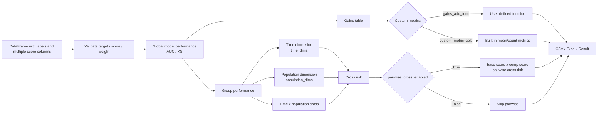
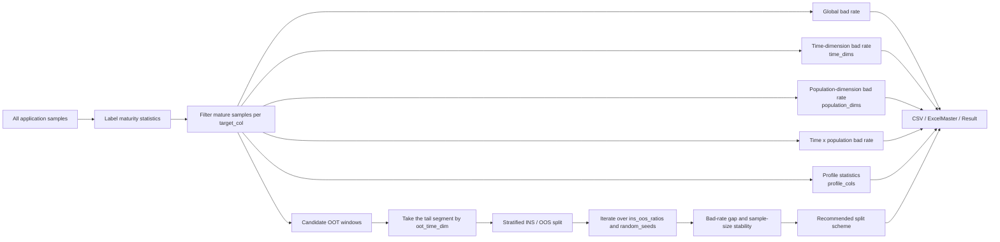

# Top-Level Pipelines

`Modeling_Tool.Pipeline` provides six high-level business pipelines and one mock-data-generation Pipeline, packaging common end-to-end scripts into APIs that are reusable, configurable, and return structured results.

These Pipelines **do not generate simulated data**. The caller must first prepare a real business DataFrame, model-score data, or project SQL, and then use `Config` to control which steps, models, dimensions, and outputs to run.

```python
from Modeling_Tool.Pipeline import (
    RejectInferencePipeline,
    RejectInferencePipelineConfig,
    CreditModelPipeline,
    CreditModelPipelineConfig,
    FeatureValidationPipeline,
    FeatureValidationPipelineConfig,
    ScoreComparisonPipeline,
    ScoreComparisonPipelineConfig,
    ScoreConsistencyUATPipeline,
    ScoreConsistencyUATPipelineConfig,
    SampleAnalysisPipeline,
    SampleAnalysisPipelineConfig,
    MockSamplePipeline,
    MockSamplePipelineConfig,
)
```

You can also import from the top level of the main package:

```python
from Modeling_Tool import CreditModelPipeline, CreditModelPipelineConfig
```

## 1. Reject Inference Pipeline

`RejectInferencePipeline` is for the scenario where approved samples have labels and rejected samples have none. It can train a pre-score automatically, or directly use reject-inference scores you have already prepared.

### Flow Chart


```mermaid
flowchart LR
    A["Application samples<br/>approved / rejected"] --> B{"train_prescore"}
    B -->|True| C["Train pre-score on approved samples"]
    B -->|False| D["Use existing score_col"]
    C --> E["Score all samples with pre-score"]
    D --> F["Split approved / rejected"]
    E --> F
    F --> G{"RI approved reference"}
    G -->|default| H["All approved in the main data"]
    G -->|ri_approved_query / func| I["Approved subsample of the main data"]
    G -->|ri_approved_data| J["External approved reference"]
    H --> K["Estimate RI rules"]
    I --> K
    J --> K
    K --> L["Generate rejected inferred"]
    L --> M{"ri_approved_scope"}
    M -->|reference_only| N["All approved in the main data + rejected inferred"]
    M -->|output_subset| O["Approved subsample + rejected inferred"]
    N --> P{"train_ri_models"}
    O --> P
    P -->|True| Q["Train post-RI models<br/>including no_ri_benchmark"]
    P -->|False| R["Output only the RI datasets and summary"]
    Q --> T{"save_models"}
    T -->|True| U["Save pre-score / RI model pkl"]
    T -->|False| S["CSV / Excel / Result"]
    U --> S
    R --> S
```

### Intermediate Steps and Configurable Parameters

| Step | Output | Main configurable parameters |
|---|---|---|
| Input validation and feature preparation | `approved_data`, `rejected_data` base samples | `approved_col`, `target_col`, `score_col`, `feature_cols` |
| pre-score training or reuse | `score_col` score column, `prescore_model` | `train_prescore`, `prescore_model_type`, `prescore_params`, `prescore_test_size`, `random_state` |
| OOT basis determination | OOT sample, modeling sample pool, `oot_summary` | `split_col`, `oot_data`, `oot_frac`, `random_state`; an external OOT or a split OOT automatically filters out unperformed samples whose `target_col` is empty |
| RI reference sample determination | `ri_approved_reference_data`, `ri_approved_summary` | `ri_approved_data`, `ri_approved_query`, `ri_approved_func`, `ri_approved_frac`, `ri_approved_n`, `ri_approved_scope` |
| RI dataset generation | `ri_datasets`, `ri_summary` | `ri_methods`, `ri_method_params`, for example `bad_rate`, `cutoff`, `weight_factor`, `n_parcels` |
| Post-RI model training | `ri_models`, `ri_model_perf` | `train_ri_models`, `include_no_ri_benchmark`, `ri_model_type`, `ri_model_params` |
| Performance evaluation, model saving, and report | `best_method`, `model_paths`, `report_path` | `perf_pct_bins`, `min_bin_prop`, `save_models`, `model_output_dir`, `model_include_metadata`, `write_outputs`, `write_excel`, `output_dir` |

### Minimal Example

```python
from Modeling_Tool import RejectInferencePipeline, RejectInferencePipelineConfig

cfg = RejectInferencePipelineConfig(
    output_dir="output/reject_inference",
    approved_col="approved",
    target_col="badflag",
    score_col="prescore_prob",
    feature_cols=[
        "income", "age", "score_b", "mob_on_book",
        "overdue_days_max", "util_rate", "loan_amount",
    ],
    train_prescore=True,
    ri_methods=["simple_augment", "hard_cutoff", "fuzzy_augment", "parceling"],
    train_ri_models=True,
)

result = RejectInferencePipeline(cfg).run(application_df)

result.ri_summary
result.ri_datasets["parceling"]
result.ri_model_perf
result.best_method
```

### Benchmark, Model Saving, and External OOT

When `include_no_ri_benchmark=True`, the Pipeline additionally trains a `no_ri_benchmark` model: the training set uses only approved samples, without adding rejected inferred ones. It enters the `ri_model_perf` ranking together with each RI method, but is not written into `ri_datasets`.

When `save_models=True`, intermediate model pkl files are saved: the pre-score model as `prescore_model.pkl`, each post-RI model as `ri_model_{method}.pkl`, and the benchmark as `ri_model_no_ri_benchmark.pkl`. By default the SMF `save_model()` artifact format is used to save metadata.

If the input data already has an `INS/OOS/OOT` split field, passing `split_col` is recommended. In that case, the `INS/OOS` samples are used for the pre-score, the RI reference, and post-RI model training, while the `OOT` samples are used only for evaluation and do not enter the RI-augmented training set.

An external `oot_data` may be the full application data, and it takes precedence over `split_col == "oot"`. If `target_col` is empty in the OOT, the Pipeline automatically filters out unperformed samples and reports the filtered count through a warning; the filtering is written to `result.oot_summary`.

```python
cfg = RejectInferencePipelineConfig(
    ri_methods=["simple_augment", "parceling"],
    train_ri_models=True,
    split_col="model_split",
    include_no_ri_benchmark=True,
    save_models=True,
    oot_data=df_oot_full_application,
)

result = RejectInferencePipeline(cfg).run(df_train)

result.ri_model_perf      # includes no_ri_benchmark
result.model_paths        # paths of the prescore / no_ri_benchmark / RI method pkl files
result.oot_summary        # summary of mature-sample filtering of the external OOT
```

### Input Data Requirements

| Column | Required? | Description |
|---|---:|---|
| `approved_col` | Yes | Approval flag, default `approved`; `1` for approved samples and `0` for rejected samples. |
| `target_col` | Yes | Performance label, default `badflag`; rejected samples may be empty. Approved samples without a label (not yet performed) stay in the RI datasets but are left out of the pre-score, model training, the validation sample and the OOT; `ri_summary` and `ri_model_perf` count them. |
| `score_col` | Depends on config | Reject-inference score. If `train_prescore=True`, the Pipeline generates this column; if `False`, the input data must already have it. |
| `feature_cols` | Yes | Feature columns used to train the pre-score and the post-RI models. |

### `RejectInferencePipelineConfig` Parameters

| Parameter | Default | Description |
|---|---|---|
| `output_dir` | `"output/reject_inference"` | Output root directory. Datasets, CSV reports, and the Excel report are written under it. |
| `approved_col` | `"approved"` | Approval flag column. |
| `target_col` | `"badflag"` | Target label column. |
| `score_col` | `"prescore_prob"` | Pre-score column used by RI. |
| `feature_cols` | `None` | List of feature columns. Passing it explicitly is recommended; when omitted, it is inferred from the numeric columns after excluding the label, approval flag, and score fields. |
| `split_col` | `None` | Column identifying already-split samples; values are case-insensitive and support `ins/oos/oot`. Once passed, `ins/oos` are used for RI training and `oot` only for evaluation; if `oot_data` is also passed, `oot_data` takes precedence. |
| `random_state` | `42` | Random seed, used for the pre-score split and OOT sampling. |
| `write_outputs` | `True` | Whether to write intermediate artifacts such as CSVs and images. |
| `write_excel` | `True` | Whether to output the Excel report. |
| `train_prescore` | `True` | Whether to train a pre-score model on approved samples and score all samples. The rows held out as random OOT (`oot_frac`) are left out of its training data. |
| `prescore_model_type` | `"lgb"` | Pre-score model type; supports `"lgb"`, `"xgb"`, `"cat"`, `"lr"`. GBMs use `GradientBoostingModel`, and LR uses `LRMaster`. |
| `prescore_params` | `{}` | Pre-score model parameter overrides; the Pipeline first picks the default parameters for the model type, and never passes LightGBM parameters to XGBoost/CatBoost/LR. |
| `prescore_test_size` | `0.3` | Share of the pre-score validation set split off inside the approved samples. |
| `ri_methods` | `["simple_augment", "hard_cutoff", "fuzzy_augment", "parceling"]` | Reject-inference methods to try. Aliases are supported: `simple`, `hard`, `fuzzy`, `parcel`. |
| `ri_method_params` | `{}` | Independent parameters for each RI method. |
| `ri_score_direction` | `"high_bad"` | RI score direction. The pre-score the Pipeline trains is P(bad), so a high score = high risk. `"high_good"` is only for your own credit-style score with `train_prescore=False`; combined with a pre-score the Pipeline trains (`train_prescore=True`, or `score_col` absent) it raises `ValueError`. |
| `train_ri_models` | `True` | Whether to train follow-up models on each RI-augmented dataset and compare OOT performance. |
| `ri_model_type` | `"lgb"` | Model type used for post-RI modeling; supports `"lgb"`, `"xgb"`, `"cat"`, `"lr"`. The `_weight` of Fuzzy Augment is passed to all four models. |
| `ri_model_params` | `{}` | Post-RI model parameter overrides; the default parameters are selected independently by `ri_model_type`. |
| `lr_nan_handling` | `"fillna_median"` | NaN/Inf handling for logistic-regression models only (pre-score and RI models). The fill modes impute with values learned on the training frame, re-applied at scoring time, with a `UserWarning` when values were filled. `"raise"` raises `ValueError` on non-finite features. Gradient-boosting models ignore it. |
| `include_no_ri_benchmark` | `True` | Whether to additionally train an approved-only benchmark model, with the method name `no_ri_benchmark`. |
| `ri_validation_frac` | `0.2` | When there is no explicit OOS, the share split off from the approved training pool as validation; training excludes the validation/OOT rows. |
| `save_models` | `False` | Whether to save the pre-score and post-RI model pkl files. |
| `model_output_dir` | `None` | Output directory for model pkl files; when omitted, `{output_dir}/models` is used. |
| `model_include_metadata` | `True` | Whether to save metadata using the SMF `save_model()` artifact envelope. |
| `write_ri_datasets` | `True` | Whether to write each RI-augmented dataset as a CSV; for full wide tables it can be set to `False` to avoid writing files of tens of GB. |
| `ri_dataset_output_cols` | `None` | Allowlist of output columns for the RI dataset CSVs; it does not affect the in-memory result `result.ri_datasets`. |
| `ri_dataset_warn_mb` | `1024.0` | A warning is issued when a single RI dataset is expected to exceed this memory size. |
| `oot_data` | `None` | Externally specified OOT data. Once passed, OOT is no longer sampled randomly from approved samples; if it contains unperformed samples whose `target_col` is empty, they are filtered automatically with a warning. |
| `oot_frac` | `0.2` | When neither `oot_data` nor OOT rows from `split_col` exist, the share of the approved samples with a label sampled randomly as OOT. The OOT is drawn before the pre-score is trained and is left out of its training data; with `ri_approved_scope="output_subset"` only the drawn rows inside the subset are used. |
| `perf_pct_bins` | `10` | Number of bins for `PerformanceEvaluator`. |
| `min_bin_prop` | `0.03` | Minimum bin share for performance evaluation. |
| `ri_approved_data` | `None` | External approved reference sample, used only to estimate the RI rules; by default the final augmented sample still outputs all approved samples of the main data. When the Pipeline trains the pre-score, the reference is scored with it (an existing `score_col` is replaced, with a warning) so that the rules and the rejected samples use the same score. |
| `ri_approved_query` | `None` | A pandas query that selects the RI reference from the main data's approved samples. |
| `ri_approved_func` | `None` | A custom function that selects the RI reference from the main data's approved samples, returning a bool mask. |
| `ri_approved_frac` | `None` | Share to randomly sample from the RI reference; cannot be used together with `ri_approved_n`. |
| `ri_approved_n` | `None` | Number of rows to randomly sample from the RI reference; cannot be used together with `ri_approved_frac`. |
| `ri_approved_scope` | `"reference_only"` | `reference_only` means the reference is used only to estimate the RI rules and the final output is all approved; `output_subset` means the final output is only the filtered approved + rejected inferred. |

### How to Write `ri_method_params`

```python
cfg = RejectInferencePipelineConfig(
    ri_methods=["hard_cutoff", "parceling"],
    ri_method_params={
        "hard_cutoff": {"cutoff": 0.42},
        "parceling": {"n_parcels": 8},
        "simple_augment": {"bad_rate": 0.18},
        "fuzzy_augment": {"weight_factor": 1.5},
    },
)
```

| Method | Configurable parameters | Description |
|---|---|---|
| `simple_augment` | `bad_rate` | When omitted, the average bad rate of approved samples is used automatically. |
| `hard_cutoff` | `cutoff` | When omitted, a reasonable quantile of the bad-sample pre-scores among approved samples is used according to `ri_score_direction`; under `high_bad`, above the cutoff is judged bad, and under `high_good`, below the cutoff is judged bad. |
| `fuzzy_augment` | `weight_factor` | A rejected case is split into two rows, bad/good, with weights P(bad)/P(good); real approved samples have a default weight of 1. |
| `parceling` | `n_parcels` | Maps rejected samples with the same qcut boundaries as the approved samples, and does binomial sampling by the parcel bad rate. |

### RI Approved Reference Samples

By default, the Pipeline uses all approved samples in the main data to estimate the RI rules, and outputs an augmented sample of "all approved + all rejected inferred". If you want to estimate the RI rules with only part of the approved samples or an external approved sample, you can configure a reference sample.

An external reference takes part only in RI estimation, and the final augmented sample still outputs all approved samples of the main data:

```python
cfg = RejectInferencePipelineConfig(
    ri_approved_data=external_approved_df,
    ri_methods=["parceling", "fuzzy_augment"],
    ri_approved_scope="reference_only",
)
```

Select the reference from the main data's approved samples, while the final output is still all approved samples of the main data:

```python
cfg = RejectInferencePipelineConfig(
    ri_approved_query="channel == 'Google'",
    ri_approved_frac=0.5,
    ri_approved_scope="reference_only",
)
```

If you want the final augmented sample to contain only the filtered approved samples as well:

```python
cfg = RejectInferencePipelineConfig(
    ri_approved_query="channel == 'Google'",
    ri_approved_scope="output_subset",
)
```

Note: `ri_approved_scope="output_subset"` applies only to selecting the reference from the main data; an external `ri_approved_data` is not written into the main-data augmented output.

### Result Object

`RejectInferencePipeline.run()` returns a `RejectInferencePipelineResult`.

`ri_summary.prescore_AUC` is always shown in the "high value = high risk" direction: `high_bad` uses the original score, and `high_good` uses the reversed score. The raw AUC without direction adjustment is kept in `prescore_AUC_raw`, and the actual direction is recorded in `prescore_score_direction`.

| Field | Description |
|---|---|
| `approved_data` | Approved sample data, including the pre-score. |
| `rejected_data` | Rejected sample data, including the pre-score. |
| `ri_datasets` | `{method: DataFrame}`, the augmented training set generated by each RI method. |
| `ri_summary` | Summary of each RI method's data size, bad rate, whether it has a weight column, and so on; `N_approved_unlabelled` / `N_rejected_unlabelled` count the rows without a label. |
| `ri_model_perf` | Train / validation / OOT performance after training models on each RI-augmented dataset and on `no_ri_benchmark`; `train_N` is the number of rows trained on and `train_unlabelled_n` the rows of the training pool left out because their target is missing. |
| `best_method` | The best method ranked by OOT AUC, which may be an RI method or `no_ri_benchmark`. |
| `prescore_model` | The pre-score model wrapper; empty if `train_prescore=False`. |
| `ri_models` | `{method: model}`, the models trained for each RI method and the optional `no_ri_benchmark`. |
| `report_path` | Excel report path; empty if `write_excel=False`. |
| `approved_full_data` | All approved samples in the main input data. |
| `ri_approved_reference_data` | The approved reference sample actually used to estimate the RI rules. |
| `ri_approved_summary` | Source of the approved reference, sample size, output approved sample size, and retention ratio. |
| `model_paths` | `{model_key: path}`; when `save_models=True`, it records the pkl paths of the pre-score, benchmark, and post-RI models. |
| `oot_summary` | OOT source, raw sample count, mature sample count, count of filtered unperformed samples, and missing rate. |

### Chart Output

When `write_outputs=True` and `train_ri_models=True`, `RejectInferencePipeline` outputs a performance plot for each post-RI model under `report/perf_figs/`, such as `perf_simple_augment.png` and `perf_fuzzy_augment.png`. Sample-weighted evaluation such as `fuzzy_augment` continues to output the table on the weighted basis, and also saves the corresponding score performance plot.

## 2. Credit Modeling Pipeline

`CreditModelPipeline` packages the full credit-modeling main line: sample splitting, PSI/IV/correlation screening, WOE, model training, backward, Optuna, evaluation, explanation, and the Excel report.

### Flow Chart


```mermaid
flowchart LR
    A["Modeling sample DataFrame"] --> B{"Existing split_col / sample_col"}
    B -->|has ins/oos/oot| C["Read the sample split"]
    B -->|none| D{"oot_col"}
    D -->|present| E["Split OOT by oot_col"]
    D -->|absent| F["Randomly split INS / OOS"]
    E --> G["INS / OOS split"]
    F --> G
    C --> H["Feature screening<br/>PSI / IV / Corr"]
    G --> H
    H --> I["WOE binning and transform"]
    I --> J{"backward_enabled"}
    J -->|True| K["Stepwise elimination of WOE features"]
    J -->|False| L["Keep WOE features"]
    K --> M["selected_woe_features"]
    L --> M
    M --> N{"gbm_feature_source"}
    N -->|LR| O["LR always uses WOE features"]
    N -->|GBM = woe| P["LGB / XGB / Cat use WOE features"]
    N -->|GBM = raw| Q["Map WOE features back to raw variables<br/>LGB / XGB / Cat use raw features"]
    O --> R{"LR parameter search"}
    P --> R
    Q --> R
    R -->|lr_search_enabled| S["LR grid_search_params"]
    R -->|off| T["Skip LR search"]
    S --> U{"warm_start_enabled"}
    T --> U
    U -->|True| V["Read the prior score<br/>probability / log_odds"]
    U -->|False| W["Ordinary training input"]
    V --> X["Train candidate models<br/>LR / LGB / XGB / Cat"]
    W --> X
    X --> Y{"Optuna"}
    Y -->|optuna_models non-empty| Z["GBM hyperparameter search"]
    Y -->|empty| AA["Skip tuning"]
    Z --> AB["Performance evaluation<br/>predicting with each model's feature source"]
    AA --> AB
    AB --> AC{"Explainability"}
    AC -->|explain_models / owen_enabled| AD["SHAP importance / summary plot / Owen"]
    AC -->|off| AE["Skip explanation"]
    AD --> AF["CSV / Excel / Result"]
    AE --> AF
```

### Intermediate Steps and Configurable Parameters

| Step | Output | Main configurable parameters |
|---|---|---|
| Sample splitting | `splits`, containing `ins/oos` and an optional real `oot` | `split_col`, `sample_col`, `oot_col`, `split_config`, `random_state`, `synthesize_missing_oot` |
| Feature screening | `feature_selection_summary`, candidate feature list | `feature_cols`, `feature_selection.psi_enabled`, `feature_selection.iv_enabled`, `feature_selection.corr_enabled` and each threshold |
| WOE binning and transform | `woe_artifacts`, WOE features | `woe_engine`, `woe_params`, `monotone_woe_params`, `woe_fit_query` |
| Backward variable elimination | `backward_summary`, `selected_features` | `backward_enabled`, `backward_model`, `backward_params`, `use_backward_features`, `weight_col` |
| Model feature source | `model_feature_sources`, `model_feature_sets` | `gbm_feature_source`. LR always uses WOE; LGB/XGB/Cat can choose `"woe"` or `"raw"` |
| LR parameter search | `lr_search_results`, LR best params | `lr_search_enabled`, `lr_search_param_grid`, `lr_search_params`, `use_lr_search_params`, `weight_col` |
| Prior-score warm-start | `warm_start_summary`, incremental GBM models | `warm_start_enabled`, `warm_start_score_col`, `warm_start_score_type`, `warm_start_models` |
| Candidate model training | `models`, initial model performance | `train_models`, `model_params`, `target_col`, `weight_col` |
| Optuna tuning | `optuna_results`, tuned models | `optuna_models`, `optuna_n_trials`, `optuna_params`, `weight_col` |
| Model evaluation | `perf_results` | `perf_pct_bins`, `perf_min_bin_prop`, `weight_col`, `extra_eval_datasets`, `evaluation_splits`, `gains_ascending` |
| Explainability and Owen | `explain_outputs` | `explain_models`, `explain_params`, `owen_enabled`, `business_prior_groups` |
| Report output | `report_path` | `output_dir`, `write_outputs`, `write_excel`, `plot_outputs` |

### Minimal Example

```python
from Modeling_Tool import CreditModelPipeline, CreditModelPipelineConfig

cfg = CreditModelPipelineConfig(
    output_dir="output",
    target_col="badflag",
    feature_cols=[
        "income", "age", "score_b", "mob_on_book",
        "overdue_days_max", "util_rate", "loan_amount",
    ],
    oot_col="oot_flag",
    woe_engine="equal_freq",
    train_models=["lr", "lgb", "xgb", "cat"],
    gbm_feature_source="woe",
    backward_enabled=True,
    optuna_models=["lgb", "xgb", "cat"],
    explain_models=["lr", "lgb", "cat"],
    owen_enabled=True,
)

result = CreditModelPipeline(cfg).run(modeling_df)

result.selected_features
result.models["lgb"]
result.perf_results["lgb"]
```

### Input Data Requirements

| Scenario | Required columns | Description |
|---|---|---|
| Already-split samples | `split_col` or `sample_col` | Using `split_col` to specify the field name is recommended; `sample_col` is kept for compatibility. Values are case-insensitive and support `ins/oos/oot`. |
| Only OOT marked | `oot_col` | Default `oot_flag`; `0` means INS+OOS and non-`0` means OOT; the Pipeline then randomly splits INS/OOS. |
| Unmarked samples | None | INS/OOS are split randomly from the full data; since 0.7.1, OOS is no longer used to synthesize an OOT by default. |
| Weighted samples | The column named by `weight_col` | Weights must be non-negative finite values; the column is kept in every split (`ins/oos/oot`). |

### Sample Weights

For scenarios such as balance weighting and oversampling correction, you can pass `weight_col` in the config, and training and evaluation use the same column name:

```python
cfg = CreditModelPipelineConfig(
    output_dir="output",
    feature_cols=["income", "age", "score_b"],
    weight_col="sample_wgt",
    train_models=["lr", "lgb"],
)
result = CreditModelPipeline(cfg).run(modeling_df)
```

`weight_col` runs through the following stages:

- **Feature screening** (PSI / IV / correlation, v0.3.8+ via `weighted_feature_screen`)
- LR / GBM model training (`LRMaster.fit`, `GradientBoostingModel.fit`)
- LR parameter search (`grid_search_params`) and GBM Optuna/Grid search (`param_search`)
- Backward variable elimination (`BackwardVariableEliminator`)
- Performance evaluation (`PerformanceEvaluator`)

When `write_outputs=True` and `plot_outputs=True`, the ROC, KDE,
Percentile, and Gain panels in `figs/perf/` also use each split's own `weight_col`; there is no basis difference where the CSV metrics are weighted
but the INS images are drawn from unweighted samples.

!!! note "WOE weighting"
    The underlying **WOE binning** API does not yet support `weight_col`; the Pipeline WOE fit is still run on unweighted samples. Weighted feature screening and unweighted WOE can coexist, and in scenarios such as Fuzzy Augment, weighted screening is preferred to correct the IV/PSI basis.

### WOE Fit Filtering and Extra Evaluation Sets

`woe_fit_query` and `extra_eval_datasets` solve two common basis problems:

| Parameter | Scope | Behavior |
|---|---|---|
| `woe_fit_query` | WOE **fit** | Uses a pandas `query()` to generate a row mask on the INS, affecting only the binning fit; OOS/OOT and the subsequent transform, training, and evaluation still keep all rows. The default `None` keeps the historical behavior. |
| `extra_eval_datasets` | Model **evaluation** | Eval-only datasets passed as `{"name": DataFrame}`; they go through the WOE transform and are merged into `perf_results`, but do not take part in feature screening, the WOE fit, training, backward, or Optuna. The name must not conflict with `ins/oos/oot`. |

Typical scenario: drop immature samples from the INS before fitting WOE, while using the full application month or competitor samples only for scoring evaluation.

```python
cfg = CreditModelPipelineConfig(
    output_dir="output",
    feature_cols=["income", "age", "score_b"],
    target_col="badflag",
    split_col="model_split",
    woe_fit_query="mature_flag == 1",          # only mature INS takes part in the WOE fit
    extra_eval_datasets={
        "full_apply": full_application_df,     # eval-only, not used in training
        "competitor": competitor_score_df,
    },
    train_models=["lr", "lgb"],
)
result = CreditModelPipeline(cfg).run(modeling_df)

result.perf_results["lgb"]  # by default includes ins/oos + full_apply + competitor; a real OOT must be included explicitly in evaluation_splits
result.woe_artifacts["extra_eval"]  # the extra evaluation sets after the WOE transform
```

The columns referenced by `woe_fit_query` must exist in the main input `DataFrame`; the expression is pre-checked at the `run()` entry. A column-name validation failure raises `KeyError`. A syntax error, an expression that fails on the INS rows, and an expression that selects no INS row (for example a typo in a value) raise `ValueError` before any stage runs. Method calls such as `x.notna()` or `channel.isin([...])` are accepted.

### OOT Governance and Evaluation Direction (0.7.1)

0.7.1 separates the candidate stage from the final OOT acceptance: by default only `ins/oos` are evaluated, tuning uses only `oos`, backward no longer puts OOT into the round-by-round report, and when there is no real OOT, a copy of OOS is no longer used to fake one. This way `result.split_governance` and the saved model metadata can directly state whether the OOT is real and whether the candidate stage retained it.

```python
cfg = CreditModelPipelineConfig(
    evaluation_splits=["ins", "oos"],
    search_eval_splits=["oos"],
    backward_report_splits=[],
    gains_ascending=True,
)
```

If the business flow has finished candidate selection and needs a formal acceptance on a real OOT, you can pass `evaluation_splits=["ins", "oos", "oot"]` explicitly. If you want to use OOT for search or backward, you must likewise configure the corresponding lists explicitly; `forbidden_splits` blocks any consumption request that tries to bypass this boundary through nested parameters.

### `CreditModelPipelineConfig` Parameters

| Parameter | Default | Description |
|---|---|---|
| `output_dir` | `"output"` | Output root directory. A run overwrites the files it writes and lists them in the hidden `.smf_manifest_credit_model.json`. |
| `clean_output_dir` | `False` | After a successful run, remove the files that the previous manifest lists and this run did not write again (for example `models/model_xgb.pkl` after a run without XGBoost), and the folders they leave empty. Files that the pipeline did not write, and files of versions without the manifest, are never removed. |
| `target_col` | `"badflag"` | Target label column. |
| `feature_cols` | `None` | Raw model input feature columns. Passing it explicitly is recommended; when omitted, it is inferred from the numeric columns. |
| `split_col` | `None` | The recommended new field name for the sample split. If passed, it takes precedence over `sample_col`; values support `ins/oos/oot`. |
| `sample_col` | `"sample_ind"` | The already-split sample identifier column compatible with older versions. Used when `split_col` is not passed. |
| `oot_col` | `"oot_flag"` | OOT flag column. Used only when there is no valid `split_col/sample_col`. **v0.3.17+ requires the column values to be numeric-convertible**: `0` (which can be `int`/`float`/`bool`/the string `"0"`) is judged INS+OOS, and non-`0` is judged OOT; non-numeric content (such as `"train"`/`"test"`) raises `TypeError` at the split stage, preventing historical versions from silently routing string flags entirely to OOT. |
| `weight_col` | `None` | Sample-weight column. When non-empty, it runs through feature screening (v0.3.8+), LR/GBM training, LR/GBM parameter search, backward, and performance evaluation; with `None`, the unweighted behavior is kept. |
| `random_state` | `42` | Random seed. |
| `write_outputs` | `True` | Whether to output intermediate files such as CSVs and charts. |
| `write_excel` | `True` | Whether to output the Excel report. |
| `plot_outputs` | `True` | Whether to output the analysis plots generated automatically by the Pipeline. After turning it off, CSV/Excel are still controlled by `write_outputs` and `write_excel`. |
| `save_models` | `False` | Whether to save the trained model pkl files. By default no empty `models/` directory is created; when turned on, the models and an artifact path table are written. |
| `model_output_dir` | `None` | Output directory for model pkl files; when omitted, `{output_dir}/models` is used. |
| `model_include_metadata` | `True` | Whether to save model metadata using the SMF `save_model()` artifact envelope. |
| `save_woe_artifacts` | `True` | When `save_models=True`, whether to also save the WOE table and WOE engine, to ease model reuse. |
| `split_config` | `{"test_size": 0.3, "stratify": True}` | INS/OOS split configuration. |
| `synthesize_missing_oot` | `False` | Whether to synthesize an OOT from a copy of OOS when there is no real OOT; off by default, and only an explicit `True` synthesizes it and issues a warning. |
| `evaluation_splits` | `None` | Split allowlist for default model evaluation, charts, and Excel. `None` means `["ins", "oos"]`, so a real OOT must be included explicitly. A listed split that does not exist in the run is skipped silently, and `extra_eval_datasets` is not restricted by this. |
| `forbidden_splits` | `[]` | Hard gate for forbidden splits; every consumption point of search, backward, and evaluation validates it. |
| `search_eval_splits` | `None` | Eval sets for LR search and Optuna. `None` means `["oos"]`, so OOT is not used for candidate tuning. A split that you list explicitly and that is absent from the run raises `ValueError`. |
| `search_objective_when_no_oot` | `"max_primary"` | Objective of the LR and Optuna searches when `oot` is not among the search eval splits (with OOT it is `"oot_gap_penalized"`). `"max_primary"` maximizes the AUC on `oos`; `"oot_gap_penalized"` needs a gap reference split and therefore raises `ValueError` here. |
| `backward_validation_split` | `"oos"` | Validation source for backward. |
| `backward_report_splits` | `None` | Splits on which backward reports performance after each round (the per-round `test_data_dict`). `None` means none, so OOT is not read. |
| `feature_selection` | See the table below | Switches and thresholds for PSI, IV, and correlation screening. |
| `screening_artifact` | `None` | The `FeatureScreeningArtifact` produced by FVP; once passed, CM's internal screening is skipped. |
| `feature_validation_result` | `None` | Convenience field: pass the FVP result directly, and it is converted internally to `screening_artifact`. |
| `feature_selection_mode` | `"run"` | `run` / `from_artifact` / `skip`; when there is an artifact, it automatically becomes `from_artifact`. |
| `reuse_screening_woe` | `True` | Whether to reuse the already-fitted WOE engine inside the artifact on handoff. A reused engine keeps its own kind, bins and parameters, so `woe_engine`, `woe_params`, `monotone_woe_params`, and `woe_fit_query` do not apply to it; a `RuntimeWarning` says when none can be reused. |
| `woe_engine` | `"equal_freq"` | WOE engine. Supports `"equal_freq"` and `"monotone"`. |
| `woe_params` | `{"nbins": 10, "equal_freq": True, "min_bin_prop": 0.05, "sv_min_bin_size": 0.0, "sv_small_policy": "keep", "sv_woe_smoothing": "none", "sv_smoothing_alpha": 0.0}` | `WOE_Master.fit()` parameters and the general WOE configuration. Since 0.8.0 it explicitly carries the four `sv_*` SV bin governance keys, with defaults = the old behavior. |
| `monotone_woe_params` | `{"n_init_bins": 20, "min_bin_size": 0.03, "min_n_bins": 2, "sv_min_bin_size": 0.0, "sv_small_policy": "keep", "sv_woe_smoothing": "none", "sv_smoothing_alpha": 0.0, "unseen_special_policy": "neutral"}` | `MonotoneWOEBinner` parameters. Since 0.8.0 it explicitly carries the four `sv_*` SV bin governance keys, and since 0.8.2 `unseen_special_policy`, with defaults = the old behavior. When `special_values` is not given explicitly, since 0.8.2 `-999999` is declared by default only if it actually appears in the WOE fit sample (binning and scoring are unchanged). `sv_total_basis` (`"all"` by default since 0.9.0, or the legacy `"ordinary"`) chooses the totals that the WOE of every bin is measured against, see the [WOE guide](guides/woe.md#which-totals-the-woe-is-measured-against-sv_total_basis). Keys not in the dict take the `MonotoneWOEBinner` defaults: since 0.9.1 `min_bad_count=1`, `min_good_count=1` and `small_bin_policy="merge"` merge class-pure bins (and bins under `min_bin_size`) into a neighbor; add `"small_bin_policy": None` to keep the 0.9.0 bins, see [Class-pure bins](guides/woe.md#class-pure-bins-merged-by-default-since-091). |
| `woe_fit_query` | `None` | A pandas `query()` expression that filters only the rows of the INS used for the WOE fit; the transform and evaluation still use the full splits. |
| `extra_eval_datasets` | `None` | Extra eval-only evaluation sets `dict[str, DataFrame]`; after the WOE transform they are merged into `perf_results`, and do not take part in screening/training/backward/Optuna. |
| `train_models` | `["lr", "lgb", "xgb", "cat"]` | List of models to train. |
| `model_params` | `{}` | Parameter dict for each model. |
| `gbm_feature_source` | `"woe"` | Source of GBM model input features. You can pass a global `"woe"` / `"raw"`, or `{"lgb": "raw", "xgb": "woe", "cat": "raw"}`. LR always uses WOE features. |
| `lr_search_enabled` | `False` | Whether to run the `LRMaster.grid_search_params()` parameter search for LR. |
| `lr_search_param_grid` | `{"C": [0.01, 0.1, 1.0, 10.0]}` | LR parameter grid; searched as a Cartesian product. |
| `lr_search_params` | `{}` | Overrides `objective`, `primary_set`, `gap_ref_sets`, `metric`, `refit`, and `verbose` of the LR search. This is a holdout search and does not accept `cv`; an illegal key raises a `ValueError` listing the allowed parameters before the search. |
| `use_lr_search_params` | `True` | Whether to merge the LR best params into the final LR training parameters. |
| `lr_elimination_mode` | `None` | Backward elimination of the final LR model: `None` keeps every feature, `"pvalue"` refits the LR without its feature of highest coefficient p-value until every p-value is at most `pvalue_threshold` (see `lr_elimination_params`). Any other value raises `ValueError`. The dropped features are recorded in `feature_selection_summary["lr_elimination"]`; the model's final features are `result.models["lr"][2]`, while `result.selected_features`, `selected_woe_features` and `model_feature_sets` still show the list from before the elimination. |
| `lr_elimination_params` | `{}` | Settings of the p-value elimination: `pvalue_threshold` (default 0.05), `min_features` (default 1; the elimination stops when this many features remain) and `max_iterations` (default 20). `tie_breaker` may only be `"pvalue"` (or `None`), which describes what happens anyway: equal p-values are resolved by column order. Any other `tie_breaker` value and any other key raise `ValueError`. |
| `warm_start_enabled` | `False` | Whether to enable the GBM prior-score warm-start. |
| `warm_start_score_col` | `None` | The prior-score column in the input data. This column is copied by position to each split after the WOE transform (since v0.3.18, the length is validated through `copy_column_length_checked`); if the upstream WOE / `dropna` / fit-query changes the row count, a `ValueError` is raised right at the copy step, rather than silently stitching on misaligned scores. |
| `warm_start_score_type` | `"probability"` | `"probability"` is clipped and converted to log-odds; `"log_odds"` is used directly as the init score. |
| `warm_start_models` | `["lgb", "xgb"]` | GBM models with warm-start enabled. The underlying layer currently supports `lgb/xgb`. |
| `warm_start_on_unsupported` | `"skip"` | Skip the warm-start or raise an error when init score is unsupported (e.g. CatBoost). |
| `warm_start_apply_to_optuna` | `False` | Whether to pass `fit_kwargs={"init_score": ...}` in the GBM parameter search. |
| `warm_start_score_scope` | `"full"` | Where the prior score is seen. `"full"`: in the training, the validation set of the early stopping, the scoring of the Optuna candidates (with `warm_start_apply_to_optuna`), the final evaluation and the Owen explanation, where it enters as its own group `warm_start_prior`, so that the Owen values add up to the scored probability. `"train"` (legacy, the behavior of 0.8.2 and earlier): in the training and in the final evaluation only, so the early stopping, the `AUC_*` of the Optuna table and the Owen explanations see the increment alone (in the test the table showed 0.726 while the evaluated model scored 0.743); pass it to reproduce models trained before the change. SHAP values of the trees do not depend on the prior (an additive offset in log-odds), so `explain_models` gives the same importance in both scopes. |
| `backward_enabled` | `True` | Whether to run backward variable elimination. |
| `backward_model` | `"lgb"` | Proxy model of the backward elimination: `"lgb"` (LightGBM) or `"xgb"` (XGBoost); case and surrounding spaces are ignored. Any other value raises `ValueError` when `run()` starts, while `backward_enabled` is on. |
| `backward_params` | `{}` | Backward initialization and run parameters. |
| `use_backward_features` | `True` | Whether to retrain the models with the features selected by backward. |
| `candidate_mode` | `False` | `True` forbids any consumption of OOT in the candidate stage: `"oot"` is added to `forbidden_splits` and the OOT frame is removed from the working splits. Explicit settings that request OOT (`synthesize_missing_oot=True`, `"oot"` in `evaluation_splits`, `search_eval_splits` or `backward_report_splits`, or `backward_validation_split="oot"`) raise `ValueError` when the pipeline is created. |
| `optuna_models` | `["lgb", "xgb", "cat"]` | Models to run the Optuna search on. Pass `[]` to turn it off. |
| `optuna_n_trials` | `5` | Number of Optuna trials per model. |
| `optuna_params` | `{}` | Optuna search-space and general-parameter overrides. |
| `explain_models` | `["lr", "lgb", "cat"]` | Trained models explained with SHAP: `feature_importance` and, with charts, `shap_summary.png`. `[]` together with `owen_enabled=False` skips the explanations altogether. |
| `explain_params` | `{"sample_n": 500, "background_n": 200}` | Explanation settings: `sample_n`, `background_n`, and the Owen options listed in [Explain / Owen Parameters](#explain--owen-parameters). Omitted keys take their defaults. |
| `owen_enabled` | `True` | Whether to compute Owen values (Shapley values over groups of related features) for every trained model except `xgb`. While it is `True`, the explanations also run for trained models that are not in `explain_models` (Owen values only). |
| `business_prior_groups` | `None` | Business prior groups for the Owen value. |
| `perf_pct_bins` | `10` | Number of bins for performance evaluation. |
| `perf_min_bin_prop` | `0.03` | Minimum share of a bin in the Gains tables of the performance evaluation (`IV`, `LIFT`, `KS_IN_GAINS`, `N_BINS`, ... of `perf_results`), weighted or not: they use `perf_pct_bins` bins capped at `1 / perf_min_bin_prop`, so each bin holds about that share or more (ties in the scores can move a few rows). The Top/Btm percentile bands keep `perf_pct_bins`. |
| `eval_target_cols` | `None` | Extra label columns evaluated against the same model scores in addition to `target_col` (duplicates removed; the results are stacked with a `tgt_name` column). They must exist in the input data and in every `extra_eval_datasets` frame, are not used for training, and are not excluded from inferred `feature_cols`. |
| `all_missing_score_value` | `None` | Score given in the evaluation to rows whose raw model features are all missing (for example -1), the rule of the scoring API; `None` applies no override. It is stored in the saved model metadata. The raw features must be present in every evaluated frame (`KeyError` otherwise). The rule is applied to the raw frames, so it also works with `woe_params={'woe_suffix': ''}`, where the WOE columns replace the raw ones. |
| `special_score_values` | `None` | Sentinel scores (for example `[-1]`) that get their own evaluation bin and are left out of the quantile edges and the ranking metrics. `N` and `avgTrue` of the summary count every row, weighted or not, and `N_SPECIAL` / `N_SPECIAL_RAW` report the sentinel part. |
| `gains_ascending` | `True` | Since 0.7.1, scores ascend by default and bin 1 is low-score, low-risk; the Gains table, the weighted path, and the evaluation plots use the same direction. |
| `eval_weight_col` | `"inherit"` | `"inherit"` reuses the training `weight_col`; `None` forces unweighted evaluation; a string can specify a separate evaluation weight column. |

### `split_config`

```python
split_config={
    "test_size": 0.3,
    "stratify": True,
    "random_state": 2026,
}
```

| Key | Default | Description |
|---|---|---|
| `test_size` | `0.3` | Share of OOS in the INS/OOS split. |
| `stratify` | `True` | Whether to sample stratified by the target variable. |
| `random_state` | Uses the top-level `random_state` | Random seed of the split. |

### `feature_selection`

```python
feature_selection={
    "psi_enabled": True,
    "psi_threshold": 0.2,
    "psi_compare_splits": ["oos"],
    "iv_enabled": True,
    "iv_threshold": 0.02,
    "corr_enabled": True,
    "corr_threshold": 0.75,
    "corr_max_iterations": 10,
    "corr_block_size": 256,
}
```

| Key | Default | Description |
|---|---|---|
| `psi_enabled` | `True` | Whether to run PSI stability screening. |
| `psi_threshold` | `0.2` | Variables with PSI below this threshold are kept. |
| `psi_compare_splits` | `["oos"]` | Splits PSI compares against; pass `["oos", "oot"]` to output both `psi_ins_oos` and `psi_ins_oot`. Case and spaces are ignored, a bare string is one split, and any other name raises `ValueError`. |
| `psi_buckets` | `10` | Number of PSI bins. |
| `iv_enabled` | `True` | Whether to run IV screening. |
| `iv_threshold` | `0.02` | Variables with IV greater than or equal to this threshold are kept. |
| `iv_nbins` | `10` | Number of bins for the IV analysis. |
| `iv_equal_freq` | `True` | Must stay `True`: the IV binning cannot switch equal-frequency bins off, so `False` raises `ValueError`. Tune the bins with `iv_nbins` and `iv_min_bin_prop`, or set `iv_use_woe_bins` to take them from the WOE engine. It no longer follows `psi_params["equal_freq"]`. |
| `iv_min_bin_prop` | `0.05` | Minimum bin share for the IV analysis. |
| `corr_enabled` | `True` | Whether to run high-correlation removal. |
| `corr_threshold` | `0.75` | Correlation threshold. |
| `corr_max_iterations` | `10` | Maximum number of iterations for correlation removal. |
| `corr_block_size` | `256` | Feature-column block size for weighted pairwise Pearson; reducing it lowers peak memory on very wide tables. |
| `psi_use_woe_bins` | `False` | Compute PSI on the bins of the screening WOE engine (a prefit engine, or one fitted from `woe_engine`) instead of the default binning. A weighted run that has an engine always bins PSI with it. |
| `iv_use_woe_bins` | `False` | Compute IV on the bins of the screening WOE engine instead of the default binning. A weighted run that has an engine always bins IV with it. |
| `corr_use_woe_bins` | `False` | Let the screening WOE engine take part in the correlation stage: non-numeric features are WOE-encoded so that they enter the correlation matrix (otherwise they are skipped with a warning and kept), and on unweighted runs the engine's bins also give the IV that decides between two correlated features. |

`CreditModelPipeline._feature_selection` now delegates uniformly to `feature_screen`; by default it keeps the v0.3.8 equal-frequency/tree binning behavior, and once `*_use_woe_bins` is turned on, it aligns with the `FeatureValidationPipeline` basis.

### WOE Parameters

With `woe_engine="equal_freq"`, `WOE_Master` is used:

```python
woe_params={
    "nbins": 10,
    "equal_freq": True,
    "min_bin_prop": 0.05,
    "woe_suffix": "_woe",
    "missing_ref_value": -999999,
    # 0.8.0 SV bin governance, passed through to WOE_Master.fit(); defaults = old behavior
    "sv_min_bin_size": 0.0,
    "sv_small_policy": "keep",
    "sv_woe_smoothing": "none",
    "sv_smoothing_alpha": 0.0,
}
```

With `woe_engine="monotone"`, `MonotoneWOEBinner` is used:

```python
monotone_woe_params={
    "n_init_bins": 20,
    "min_bin_size": 0.03,
    "min_n_bins": 2,
    "special_values": [-999999],
    "chi2_binning": False,
    # 0.8.0 SV bin governance, passed through to MonotoneWOEBinner.__init__(); defaults = old behavior
    "sv_min_bin_size": 0.0,
    "sv_small_policy": "keep",
    "sv_woe_smoothing": "none",
    "sv_smoothing_alpha": 0.0,
    # numeric special values declared but absent from the fit sample: neutral (default since 0.9.0) / normal_bin (0.8.2)
    "unseen_special_policy": "neutral",
}
```

The four `sv_*` keys govern only **special-value bins** (including `[Missing]`), leaving ordinary interval bins unaffected; for the semantics, the `laplace` formula, and the orthogonal combination order, see
[WOE Encoding · Low-Share Special-Value Governance](guides/woe.md).

!!! warning "FVP uses an allowlist; new monotone parameters must be kept in sync"
    The monotone branch of `FeatureValidationPipeline` filters `monotone_woe_params` with the `_MONOTONE_INIT_KEYS` allowlist,
    and **keys not on the allowlist are silently dropped** (no error). The four `sv_*` keys have been added to this allowlist and to
    `Feature_Screen._MONOTONE_INIT_KEYS`; from now on, any parameter added to `MonotoneWOEBinner.__init__` must be added to both lists.
    `sv_*` are constructor parameters and must not be added to `_MONOTONE_FIT_KEYS`.

### Model Parameters

`train_models` controls which models are trained, and `model_params` overrides the default parameters by model name. The GBM models (`lgb`, `xgb`, `cat`) are seeded with the top-level `random_state`; put `random_state` in `model_params[name]` to give one model its own seed.

```python
model_params={
    "lr": {
        "C": 1.0,
        "max_iter": 1000,
        "solver": "lbfgs",
        "standardize": False,
    },
    "lgb": {
        "n_estimators": 300,
        "learning_rate": 0.05,
        "num_leaves": 31,
        "early_stopping_rounds": 50,
        "eval_metric": "auc",
    },
    "xgb": {
        "n_estimators": 300,
        "max_depth": 4,
        "learning_rate": 0.05,
        "eval_metric": "auc",
    },
    "cat": {
        "iterations": 300,
        "depth": 4,
        "learning_rate": 0.05,
        "eval_metric": "AUC",
    },
}
```

### LR Parameter Search

When `lr_search_enabled=True` and `train_models` contains `"lr"`, the Pipeline runs `LRMaster.grid_search_params()` after WOE and before the final model training.

```python
cfg = CreditModelPipelineConfig(
    train_models=["lr", "lgb"],
    lr_search_enabled=True,
    lr_search_param_grid={"C": [0.01, 0.1, 1.0, 10.0]},
    lr_search_params={
        "objective": "oot_gap_penalized",
        "primary_set": "oos",
        "gap_ref_sets": ["oot"],
        "metric": "auc",
        "refit": False,
        "verbose": False,
    },
    use_lr_search_params=True,
)
```

By default the search training set is `ins` and the evaluation set is `oos`. If you explicitly put a real OOT into `search_eval_splits` or `gap_ref_sets`, that configuration becomes a deliberate OOT consumption, and must satisfy the corresponding split-existence and hard-gate checks. The search results are returned in `result.lr_search_results`, and can be written to disk as `lr_param_search.csv`.

### GBM Raw / WOE Feature Switch

By default, `CreditModelPipeline` still keeps the historical behavior: LR, LGB, XGB, and CatBoost all use the post-WOE features. If you want the tree models to consume raw variables directly, you can switch through `gbm_feature_source`.

```python
cfg = CreditModelPipelineConfig(
    train_models=["lr", "lgb", "xgb", "cat"],
    gbm_feature_source={
        "lgb": "raw",
        "xgb": "woe",
        "cat": "raw",
    },
)
```

The rules are as follows:

| Model | Feature-source rule |
|---|---|
| `lr` | Always uses WOE features, unaffected by `gbm_feature_source`. |
| `lgb/xgb/cat` | Can use `"woe"` or `"raw"`; when a string is passed globally, all three GBMs use the same source, and when a dict is passed they can be configured per model. |
| raw GBM after backward | Backward still selects on WOE features; when the GBM chooses raw and `use_backward_features=True`, the Pipeline maps `xxx_woe` back to the raw `xxx`. |
| Categorical features | Raw mode does no automatic categorical encoding; if CatBoost needs `cat_features`, pass it to the underlying model through `model_params["cat"]`. |

After the run, you can inspect:

```python
result.model_feature_sources   # {"lr": "woe", "lgb": "raw", ...}
result.model_feature_sets      # the fields each model actually used
result.selected_raw_features
result.selected_woe_features
```

If `write_outputs=True`, `model_feature_sources.csv` is also output; the corresponding sheet in the Excel report is `Model_Feature_Source`.

### GBM Prior-Score Warm-Start

When `warm_start_enabled=True`, the Pipeline converts the prior score in the input data into the GBM's `init_score/base_margin`. The prior score is used in both training and evaluation; the evaluation stage goes through `predict_with_base_margin()`, and the output is the fused probability of "prior score + incremental model".

```python
cfg = CreditModelPipelineConfig(
    train_models=["lr", "lgb"],
    warm_start_enabled=True,
    warm_start_score_col="base_model_prob",
    warm_start_score_type="probability",
    warm_start_models=["lgb"],
    warm_start_apply_to_optuna=False,
)
```

`warm_start_score_type="probability"` suits probability scores passed in; the Pipeline automatically clips them to `(0, 1)` and converts them to log-odds; `"log_odds"` suits a raw margin that is already prepared. The underlying warm-start currently supports `lgb/xgb`; CatBoost is recorded as `skipped_unsupported` by default, and you can also set `warm_start_on_unsupported="raise"` to raise an error directly.

### Backward Parameters

```python
backward_params={
    "init": {
        "model_type": "lgbm",
    },
    "run": {
        "n_rounds": 3,
        "cum_importance_threshold": 0.99,
        "min_vars": 5,
        "ret_perf": True,
    },
}
```

| Key | Description |
|---|---|
| `init` | Overrides the initialization parameters of `BackwardVariableEliminator`. |
| `run` | Overrides the backward run parameters. |

### Optuna Parameters

```python
optuna_models=["lgb", "xgb"]
optuna_n_trials=20
optuna_params={
    "search_spaces": {
        "lgb": {
            "num_leaves": {"type": "int", "low": 16, "high": 64},
            "learning_rate": {"type": "float", "low": 0.01, "high": 0.1, "log": True},
        },
    },
    "common": {
        "objective": "oot_gap_penalized",
        "primary_set": "oos",
        "gap_ref_sets": ["oot"],
        "metric": "auc",
        "refit": True,
    },
}
```

In the example above, `oot_gap_penalized` / `gap_ref_sets=["oot"]` is an advanced configuration that explicitly uses a real OOT; by default, the 0.7.1 search uses only `oos`, and when no real OOT is provided you should use the default `max_primary` objective or explicitly choose an objective that does not depend on OOT.

### Explain / Owen Parameters

```python
explain_params={
    "sample_n": 500,
    "background_n": 200,
    "owen_threshold": 0.35,
    "owen_method": "complete",
    "owen_corr_method": "spearman",
    "owen_model_output": "probability",
}

business_prior_groups={
    "repayment_capacity": ["income_woe", "employment_months_woe", "loan_amount_woe"],
    "credit_behavior": ["score_b_woe", "overdue_days_max_woe", "mob_on_book_woe"],
}
```

| Key | Default | Description |
|---|---|---|
| `sample_n` | `500` | Number of OOS samples used for the explanation computation. |
| `background_n` | `200` | Number of SHAP/Owen background samples. |
| `owen_threshold` | `0.35` | Distance threshold for coalition automatic clustering. |
| `owen_method` | `"complete"` | Hierarchical clustering method. |
| `owen_corr_method` | `"spearman"` | Correlation method. |
| `owen_min_group_size` | `1` | Minimum group size for automatic grouping. |
| `owen_intra_dist` | `0.01` | Distance between features of the same group in the linkage. |
| `owen_inter_dist` | `0.99` | Distance between features of different groups in the linkage. |
| `owen_model_output` | `"probability"` | Model output space for the Owen value explanation. |

### Result Object

`CreditModelPipeline.run()` returns a `CreditModelPipelineResult`.

| Field | Description |
|---|---|
| `splits` | `{"ins": df, "oos": df}`, with `"oot"` attached when the input has a real OOT or one was synthesized explicitly. |
| `feature_selection_summary` | The PSI, IV, and correlation screening results and the final variable list. In the Excel report each table is its own sheet (`FS_psi`, `FS_iv`, ...); a text longer than an Excel cell holds (32,767 characters) continues on extra rows. |
| `woe_artifacts` | WOE engine, post-WOE data, WOE feature names, WOE table. |
| `models` | `{model_name: (wrapper, raw_model, feature_cols)}`. |
| `selected_features` | The WOE main-line features, kept for compatibility with old code; equivalent to `selected_woe_features`. |
| `selected_raw_features` | The final feature set under raw variable names, for use by raw GBMs. |
| `selected_woe_features` | The final feature set under WOE variable names, for use by LR and WOE GBMs. |
| `model_feature_sources` | Whether each model actually uses `"woe"` or `"raw"`. |
| `model_feature_sets` | The field list each model actually uses for training, evaluation, and explanation. |
| `backward_summary` | Backward summary table; empty when not enabled. |
| `lr_search_results` | LR parameter search results; empty when not enabled. |
| `optuna_results` | `{model_name: search_result_df}`. |
| `warm_start_summary` | Summary of prior-score warm-start enabled/skipped state, score type, and missing rate; empty when not enabled. |
| `perf_results` | `{model_name: perf_df}`. |
| `explain_outputs` | Explanation outputs such as SHAP/Owen (in-memory objects, including DataFrames). |
| `explain_paths` | Index of each model's explanation artifact paths when `write_outputs=True` (including `explain_manifest`). |
| `model_paths` | The path of each model pkl when `save_models=True`. |
| `artifact_paths` | Paths of accompanying artifacts such as the WOE table and WOE engine when `save_models=True`. |
| `report_path` | Excel report path; empty if `write_excel=False`. |

### Saving Models

By default the Pipeline only keeps the models in `result.models` and does not create an empty `models/` directory. When you need to reuse the training artifacts, turn on `save_models=True`:

```python
cfg = CreditModelPipelineConfig(
    train_models=["lr", "lgb"],
    save_models=True,
    model_output_dir="output/credit_model/models",
    save_woe_artifacts=True,
)

result = CreditModelPipeline(cfg).run(modeling_df)

result.model_paths["lgb"]
result.artifact_paths["woe_engine"]
```

The saved models use the SMF `save_model()` artifact envelope, and the metadata records the model name, target column, the features actually used by the model, whether the GBM used raw/WOE, the warm-start configuration, and the random seed. WOE-input models also save `woe_table.csv` and `woe_engine.pkl`, so the same binning basis can be restored for deployment or offline reproduction. The metadata of a model records the parameters the model was built with (the defaults, your `model_params`, the best row of the LR search and the seed that the model used), `warm_start_enabled` only for models that were warm-started (`lgb`, `xgb`), `warm_start_score_type`, and `woe_suffix`. `woe_artifacts['woe_table']` and `woe_table.csv` are the mapping the transform applies (one row per bin, counts of the rows the engine was fitted on), so their WOE is the WOE the models received. A run overwrites the files it writes and leaves the others alone: a second run into the same `output_dir` with fewer stages keeps the files of the stages that no longer run, so use a fresh directory per run.

### Chart Output

When `write_outputs=True` and `plot_outputs=True`, `CreditModelPipeline` automatically outputs the following charts:

| Directory | Content | Trigger condition |
|---|---|---|
| `figs/var_analysis/overall/` | The variable WOE analysis plots generated by `VarExtractionInsights.plot_woe()`. | `feature_selection["iv_enabled"]=True` |
| `figs/woe/overall/` | The equal-freq WOE plots generated by `WOE_Master.plot_bivar_graph()`. | `woe_engine="equal_freq"` |
| `figs/mono_woe/` | The monotone-binning WOE plots generated by `MonotoneWOEBinner.plot_woe_graph()`. | `woe_engine="monotone"` |
| `figs/perf/` | The performance evaluation plots of each model, such as `perf_lr.png` and `perf_lgb.png`. | The corresponding model trained successfully |
| `explain/{model}/` | `feature_importance.csv`, the Owen importance table, `shap_summary.png` (`plot_outputs=True`); `explain_manifest.csv` at the root. | `write_outputs=True` and `explain_models` is non-empty or `owen_enabled=True` |

When `write_outputs=False`, explanation results are kept only in memory in `result.explain_outputs`; see `result.explain_paths` for the index of paths written to disk.

Since 0.7.1, the performance plots and the Gains table share the direction parameter `gains_ascending`: both display in ascending score order by default, avoiding opposite bin orders between the table, the weighted table, and the distribution plot of the same model.

## 3. Feature Validation Pipeline

`FeatureValidationPipeline` is for acceptance checks on newly onboarded feature wide tables. It focuses on the distribution stability, discriminative power, PSI, WOE bin plots, and correlation with existing features of the new features, plus an ExcelMaster report that supports review on the ground.

### Flow Chart


```mermaid
flowchart LR
    A["Wide table DataFrame / CSV<br/>flow_id / apply_time / features / labels"] --> B{"CSV feature batch"}
    B -->|No| C["Input validation and time-field derivation"]
    B -->|Yes| C1["Read the needed columns per feature batch<br/>base cols + batch features"]
    C1 --> C
    C --> D["INS / OOS / OOT split"]
    D --> E["Global / time / population distribution<br/>proc_means_by_grp"]
    D --> F{"target_cols"}
    F -->|has labels| G["WOE binning<br/>default MonotoneWOEBinner"]
    F -->|no labels| H["Skip WOE / IV / KS"]
    G --> I{"Monotone refine"}
    I -->|explicitly on| J["refine_cate / refine_dtree / refine_chi2"]
    I -->|off by default| K["Keep the greedy monotone binning"]
    J --> L["PSI<br/>can reuse WOE bins"]
    K --> L
    H --> L
    L --> M["IV / KS<br/>global / time / population"]
    M --> N["Correlation matrix and high-correlation pairs<br/>within batch / block pairwise"]
    N --> O["ExcelMaster / CSV / Result"]
```

### Minimal Example

```python
from Modeling_Tool import FeatureValidationPipeline, FeatureValidationPipelineConfig

cfg = FeatureValidationPipelineConfig(
    output_dir="output/feature_validation",
    id_col="flow_id",
    apply_time_col="apply_time",
    target_cols=["badflag"],
    new_feature_cols=["new_score", "new_income", "new_channel"],
    incumbent_feature_cols=["old_score", "old_income"],
    categorical_features=["new_channel"],
    population_dims=["channel"],
    woe_engine="monotone",
    corr_include_incumbent=True,
)

result = FeatureValidationPipeline(cfg).run(feature_wide_df)

result.psi_summary
result.ivks_summary
result.high_corr_pairs
```

### Intermediate Steps and Configurable Parameters

| Step | Output | Main configurable parameters |
|---|---|---|
| CSV direct read and batching | `batch_metadata`, the merged analysis tables | `input_type`, `csv_read_kwargs`, `enable_batch`, `feature_batch_size`, `feature_batches`, `batch_base_cols`, `batch_corr_mode` |
| Sample splitting | `splits` | `split_col`, `sample_col`, `oot_col`, `split_config`, `random_state` |
| Distribution analysis | `distribution_summary` | `time_dims`, `population_dims`, `group_specs`, `distribution_params` |
| WOE binning | `woe_artifacts` | `woe_engine`, `woe_params`, `monotone_woe_params`, `categorical_features`, `woe_fit_query` |
| Monotone refine | `woe_artifacts["refine_summary"]` | `monotone_refine_cate_enabled`, `monotone_refine_dtree_enabled`, `monotone_refine_chi2_enabled` and the corresponding params |
| PSI | `psi_summary`, `psi_details` | `psi_reference_dataset`, `psi_reference_data`, `psi_group_dims`, `psi_use_woe_bins`, `psi_params` |
| IV / KS | `ivks_summary` | `ivks_group_dims`, `ivks_use_woe_bins`, `ivks_params`, `min_group_size` |
| Correlation | `corr_matrix`, `high_corr_pairs`, `correlated_detail` | `corr_include_incumbent`, `corr_use_woe_bins`, `corr_params` |
| Variable selection (optional) | `selected_features`, `screening_artifact`, `selection_summary` (its `config_snapshot` holds the thresholds that were used; `missing_gate_dropped` lists the features removed by the missing-rate gate before the WOE fit) | `selection_enabled`, `selection_params`, `weight_col` |
| Report output | `output_paths`, `report_path` | `output_dir`, `write_outputs`, `write_excel`, `plot_outputs` |

### `FeatureValidationPipelineConfig` Parameters

| Parameter | Default | Description |
|---|---|---|
| `output_dir` | `"output/feature_validation"` | Output directory. A run overwrites the files it writes and lists them in the hidden `.smf_manifest_feature_validation.json`. |
| `clean_output_dir` | `False` | After a successful run, remove the files that the previous manifest lists and this run did not write again (for example the `feature_batches` folders of a former batch run), and the folders they leave empty. Files that the pipeline did not write are never removed. |
| `id_col` | `"flow_id"` | Primary key column. |
| `apply_time_col` | `"apply_time"` | Application time column, used to derive `apply_week/month/quarter`. Datetime columns, date strings (a mix of dates and date-times is fine), `YYYYMMDD` integers, and Unix epochs in seconds or milliseconds are read; a `UserWarning` reports the values that still cannot be parsed (their rows get no week, month or quarter). |
| `target_cols` | `None` | Label columns; when empty, WOE, IV, KS, and the IV/KS comparison in correlation are skipped. |
| `new_feature_cols` | `None` | List of newly onboarded features; passing it explicitly is recommended. `None` takes every numeric column except the id, application time, `sample_col`, `split_col`, `oot_col`, `target_cols`, incumbent, `weight_col` and grouping columns (`time_dims`, `population_dims`, `woe_plot_groups`, `selection_group_dims`, the columns of `psi_group_dims`, `ivks_group_dims` and `group_specs`), in the DataFrame and in the CSV (batch) mode alike. Any other helper column, such as a score, is a feature unless you list it as an incumbent or pass `new_feature_cols`. |
| `incumbent_feature_cols` | `None` | List of existing features, mainly used for the new vs incumbent correlation comparison. |
| `input_type` | `"auto"` | Input type, one of `auto/dataframe/csv`. `auto` recognizes a DataFrame or a CSV path automatically from the object passed to `run()`. |
| `csv_read_kwargs` | `{}` | Parameters passed through to `pd.read_csv()`; the Pipeline controls `usecols/chunksize` itself, so these two keys cannot be put here. |
| `enable_batch` | `False` | Whether to explicitly enable CSV feature batch mode; off by default. When off, even if `feature_batch_size` / `feature_batches` are configured, the CSV is read in full, with a warning. With `selection_enabled=True` the selection runs in two passes: each batch applies only the stages that judge a feature on its own (missing rate, PSI, IV, the group and target gates), then the candidates of all batches are read together and the full selection (WOE fit, correlation across batches, VIF, `max_selected_features` / `min_selected_features`) runs once on them, so the result is that of a run without batches. Only the candidates are held in memory at once in that pass; `selection_summary['batch_candidates']` lists them and `batch_screen_summary` gives the stage counts of each batch. A batch that fails is recorded in `batch_metadata`, warned about, and its features are left out of every output (`n_failed_features` in the summary); the keys of `batch_results` keep the batch ids. |
| `feature_batch_size` | `None` | When `enable_batch=True`, how many `new_feature_cols` to read per batch. |
| `feature_batches` | `None` | Explicitly specifies the feature batching, taking precedence over `feature_batch_size`; features not covered are automatically appended to the last batch. |
| `batch_base_cols` | `None` | Base columns read in every batch; when omitted, the id, time, split, target, time/population dimensions, categorical columns, existing features, and other necessary columns are included automatically. |
| `batch_output_subdir` | `"feature_batches"` | Output subdirectory for each batch's intermediate results. |
| `batch_keep_intermediate` | `True` | Whether to keep each batch's separate output in CSV batch mode; the final merged report is unaffected. |
| `batch_corr_mode` | `"within_batch"` | CSV batch correlation report: `within_batch` computes only within-batch correlation, `block_pairwise` additionally reads batches pairwise to capture cross-batch high correlation, and `off` skips correlation. The correlation stage of the selection compares the candidates of all batches in the first two modes and is skipped with `off` (an explicit `selection_params['corr_enabled']` wins). |
| `batch_corr_pair_chunk_size` | `None` | With `block_pairwise`, the variable sub-block size for each cross-batch correlation computation, used to further control the memory peak. |
| `split_col` | `None` | The recommended new field name for the sample split; values go through `strip().lower()`. It must contain non-empty `ins/oos`; `oot` is optional, and other values (such as `ft_oot`) are kept as extra evaluation sets. Takes precedence over `sample_col`. |
| `sample_col` | `"sample_ind"` | Legacy label column, used when `split_col` is None and the column exists with non-empty `ins` and `oos` values; otherwise the data are split with `oot_col` and `split_config`. Never treated as a feature. |
| `oot_col` | `"oot_flag"` | Numeric OOT flag column of the fallback split: rows with 0 or a missing value are INS/OOS candidates and non-zero rows are OOT. A non-numeric flag raises `TypeError`. Not used when labels define the splits. |
| `sample_col` / `oot_col` | `"sample_ind"` / `"oot_flag"` | Compatible split fields consistent with `CreditModelPipeline`; `sample_col` is used when `split_col` is not passed. |
| `split_config` | `{"test_size": 0.3, "stratify": True}` | INS/OOS split configuration. |
| `random_state` | `42` | Seed of the random INS/OOS split (unless `split_config` contains its own `random_state`), the Optuna searches, the explanation sampling, and the LightGBM, XGBoost, and CatBoost models: the final models, their Optuna candidates, and the backward-elimination proxy. A `random_state` in `model_params[name]` takes precedence for that model. |
| `time_dims` | `["apply_month"]` | Time dimensions. |
| `population_dims` | `[]` | Population dimensions, such as channel, product, and strategy version. |
| `group_specs` | `None` | Custom grouping specs; supports `{"monthly": ["apply_month"]}` or `[ {"name": "monthly", "columns": ["apply_month"]} ]`; when omitted, global/time/population/time x population are combined automatically. |
| `min_group_size` | `100` | Minimum sample-count guard for PSI/IV/KS groups. |
| `distribution_enabled` | `True` | Whether to build `distribution_summary`. |
| `distribution_params` | `{"q": [0.05, 0.15, 0.25, 0.5, 0.75, 0.95, 0.99]}` | Keys: `q` (quantiles of the numeric summary), `spec_missing_value` (value counted as missing, default None) and `feature_block_size` (columns per block, default 128). |
| `woe_enabled` | `True` | Whether to fit WOE binning per target on the INS rows with an observed target. It needs a target. Without it PSI, IV/KS and correlation use their own binning. |
| `distribution_params.feature_block_size` | `128` | Number of columns in each wide-table feature block for distribution statistics. |
| `woe_engine` | `"monotone"` | Default `MonotoneWOEBinner`; `"equal_freq"` is also supported, using `WOE_Master`. |
| `woe_fit_query` | `None` | A pandas `query()` expression that filters only the rows of the INS used for the WOE fit; PSI/IV/KS and the transform are still based on the full splits. The fit audit is written to the `fit_filter` row of `woe_artifacts["refine_summary"]`. |
| `woe_fit_scope` | `"post_missing_gate"` | Since 0.7.1, the selection-grade missing gate is run first by `missing_rate_threshold`, and the top-level WOE is then fitted on the surviving variables; an explicit `"all"` reproduces the old basis. |
| `woe_params` | `{"nbins": 10, "equal_freq": True, "min_bin_prop": 0.05, "sv_min_bin_size": 0.0, "sv_small_policy": "keep", "sv_woe_smoothing": "none", "sv_smoothing_alpha": 0.0}` | Passed through to `WOE_Master.fit()` when `woe_engine="equal_freq"`. Since 0.8.0 it explicitly carries the four `sv_*` SV bin governance keys, with defaults = the old behavior. |
| `monotone_woe_params` | `{"n_init_bins": 20, "min_bin_size": 0.03, "min_n_bins": 2, "sv_min_bin_size": 0.0, "sv_small_policy": "keep", "sv_woe_smoothing": "none", "sv_smoothing_alpha": 0.0, "unseen_special_policy": "neutral"}` | Passed through to `MonotoneWOEBinner`. **Filtered by the `_MONOTONE_INIT_KEYS` allowlist; keys not on the list are silently dropped**; the four `sv_*` keys and the 0.8.2 `unseen_special_policy` are already on the list. |
| `categorical_features` | `None` | List of categorical features, passed to `MonotoneWOEBinner(cate_feats=...)`. With the monotone engine every non-numeric feature must be listed here (`ValueError` otherwise, before any work is done). |
| `monotone_refine_cate_enabled` | `False` | Whether to call `refine_cate()` on categorical variables. |
| `monotone_refine_cate_params` | `{}` | Passed through to `refine_cate(features, max_bins, min_bin_size, badrate_tol)`. |
| `monotone_refine_dtree_enabled` | `False` | Whether to call `refine_dtree()`. |
| `monotone_refine_dtree_params` | `{}` | Passed through to `refine_dtree(df, features, max_bins, min_samples_leaf, monotone, n_jobs)`. |
| `monotone_refine_chi2_enabled` | `False` | Whether to call `refine_chi2()`. |
| `monotone_refine_chi2_params` | `{}` | Passed through to `refine_chi2(df, features, chi2_p, chi2_init_size, n_jobs)`. |
| `woe_plot_groups` | `[]` | Group columns for extra WOE plots by group (`figs/woe/<target>/by_<group>`). Plots are written only while `write_outputs` and `plot_outputs` are both True. |
| `psi_enabled` | `True` | Whether to compute `psi_summary` and `psi_details`. |
| `psi_reference_dataset` | `"ins"` | PSI benchmark; one of `ins/oos/oot/external`. |
| `psi_reference_data` | `None` | External PSI benchmark; required when `psi_reference_dataset="external"`, and it must hold every analysed feature (`ValueError` names the missing ones). A reference with no rows (for example `psi_reference_dataset="oot"` without OOT rows) gives a `UserWarning` and no PSI. |
| `psi_group_dims` | `["sample", "time", "population"]` | Grouping of the PSI: `'sample'` is the split, `'time'` and `'population'` expand to `time_dims` and `population_dims`, other names are column names. An overall PSI is computed only when no group column remains (`'global'` adds nothing by itself). |
| `psi_use_woe_bins` | `True` | Whether to reuse the step-3 WOE bin boundaries. Without them the numeric PSI skips non-numeric features with a `UserWarning`. |
| `psi_params` | `{"buckets": 10, "equal_freq": True, "min_bin_prop": 0.05}` | Keyword arguments of `PSICalculator`. |
| `ivks_enabled` | `True` | Whether to compute `ivks_summary`. It needs a target. |
| `ivks_group_dims` | `["global", "time", "population"]` | Groupings of the IV/KS report: `'global'` for all rows, `'time'` and `'population'` for each column of `time_dims` and `population_dims`, other names as single group columns. |
| `psi_params.feature_block_size` | `64` | Number of columns in each feature block for WOE binning and grouped PSI counting. |
| `ivks_use_woe_bins` | `True` | Whether to reuse the step-3 WOE bin boundaries to compute IV/KS. |
| `ivks_params` | `{"iv_cut": 0.0}` | `iv_cut` (minimum IV of the reported features), `feature_block_size` (columns per block with WOE bins, default 64), `missing_rate_ref` (the sentinel that `n`, `missing_rate`, `min`, `mean` and `max` count as missing on both paths, default `woe_params['missing_ref_value']`, -999999) and, without WOE bins, other keyword arguments of `VarExtractionInsights`. |
| `corr_enabled` | `True` | Whether to compute `corr_matrix`, `high_corr_pairs` and `correlated_detail`. |
| `ivks_params.feature_block_size` | `64` | Number of columns in each feature block when computing IV/KS with the reused WOE bins. |
| `corr_include_incumbent` | `True` | Whether the correlation includes existing features. |
| `corr_use_woe_bins` | `True` | Whether the IV/KS in the correlation comparison reuses the step-3 WOE bins. |
| `corr_params` | `{"corr_cutpoint": 0.75, "method": "pearson", "max_iterations": 10, "base_metric": "iv"}` | `corr_cutpoint` (pairs with a larger absolute correlation are flagged), `method` (`'pearson'`, `'spearman'` or `'kendall'`), `max_iterations` of the removal loop and other `CorrelationFilter` arguments such as `base_metric`. |
| `missing_rate_threshold` | `None` | Maximum missing rate of a feature on INS (NaN or the `missing_ref_value` sentinel). With `woe_fit_scope='post_missing_gate'` features above it are removed before the WOE fit and from all later stages (they are listed in `woe_artifacts['missing_gate_dropped']`). It is also the default threshold of the selection stage. `None` disables the gate. |
| `selection_enabled` | `False` | Whether to run PSI/IV/correlation removal after validation, producing `selected_features` and a `FeatureScreeningArtifact` for CM to pick up. |
| `selection_params` | `{}` | Screening thresholds and switches, with key names aligned to CM's `feature_selection` (such as `psi_threshold`, `iv_threshold`, `corr_threshold`, `*_use_woe_bins`); G06 can set `vif_use_woe_bins`. |
| `selection_group_dims` | `None` | Columns of the group-stability gates (`monthly_iv_min`, `monthly_iv_cv_max`, `direction_consistency_min`). They are required when one of those gates is set (`ValueError`) and must exist in the INS split (`KeyError`). |
| `weight_col` | `None` | Weight column for weighted screening; consistent with CM's `weight_col`. |
| `synthesize_missing_oot` | `False` | When no OOT rows exist, True copies the OOS rows in as a stand-in OOT (with a `UserWarning`); False keeps OOT empty. `None` counts as False. The stand-in feeds only what is reported per split (the `oot` group of the PSI by `sample`, the OOT checks of the selection); the pooled tables (distribution, `n_rows`, the global and grouped PSI and IV/KS, the correlation) count each row once. |
| `write_outputs` | `True` | Whether to output CSVs and intermediate artifacts; also the master switch for writing images to disk. |
| `write_excel` | `True` | Whether to output the ExcelMaster report. |
| `plot_outputs` | `True` | Whether to output the WOE analysis plots. Setting it to `False` still lets you keep CSV/Excel through `write_outputs=True` and `write_excel=True`; images are written only when both `write_outputs=True` and `plot_outputs=True`. |

Categorical variables declared in `categorical_features` can take part in weighted screening directly; the missing-rate stage is computed from the non-null state and the sample weights, without forcing string categories to floats. The WOE binning fit itself is still run on unweighted samples, and `weight_col` is used for the later screening and evaluation basis.

When `selection_params={"vif_enabled": True, "vif_use_woe_bins": True}`, FVP builds the VIF on the INS WOE-encoded matrix; categorical variables must be paired with `woe_engine="monotone"`. With the default `False` kept, raw VIF computes only numeric columns, and non-numeric columns are kept and recorded in the selection audit, instead of crashing statsmodels.

When `split_col` contains custom evaluation sets such as `ft_oot`, FVP fits the WOE using only `ins`, and runs feature screening using only the standard `ins/oos/oot`; custom evaluation sets take part in the WOE transform, the distributions, and validation outputs such as PSI by `sample`. The DataFrame and CSV batch modes use the same semantics.

### FVP → CM Handoff

After validating and screening, pass the `FeatureScreeningArtifact` to `CreditModelPipeline` to skip CM's internal `_feature_selection` and reuse the already-fitted monotone WOE:

```python
from Modeling_Tool import (
    CreditModelPipeline,
    CreditModelPipelineConfig,
    FeatureScreeningArtifact,
    FeatureValidationPipeline,
    FeatureValidationPipelineConfig,
)

fvp_result = FeatureValidationPipeline(
    FeatureValidationPipelineConfig(
        selection_enabled=True,
        selection_params={"psi_threshold": 0.2, "iv_threshold": 0.02},
        target_cols=["badflag"],
        new_feature_cols=features,
    )
).run(data)

artifact = FeatureScreeningArtifact.from_fvp_result(fvp_result)
cm_result = CreditModelPipeline(
    CreditModelPipelineConfig(
        screening_artifact=artifact,
        reuse_screening_woe=True,
        target_col=artifact.target_col,
        weight_col=artifact.weight_col,
        feature_cols=artifact.selected_features,
        woe_engine="monotone",
    )
).run(data)
```

You can also pass `feature_validation_result=fvp_result` directly. With `reuse_screening_woe=False`, only the screening list is reused, and the WOE is refitted per the CM configuration.

What the hand-off checks and reports:

- **Same split.** The artifact records the INS/OOS split settings of the validation run (`config_snapshot["split"]`). If the credit-model run splits differently (another `random_state`, `split_config`, `oot_col`, or another `split_col` / `sample_col`), it emits a `RuntimeWarning`: the validation fitted the WOE bins and chose the features on its INS rows, and the other split would score some of those rows as OOS. In a test with a pure-noise target, the OOS AUC was 0.58 instead of 0.51 for that reason. When both runs read the same label column, the split is the same and nothing is reported.
- **Reused engine.** A reused engine keeps its own kind, bins and parameters, so `woe_engine`, `woe_params`, `monotone_woe_params` and `woe_fit_query` of the CM config do not apply to it. Selected features that the engine did not bin (for example the missing-rate gate left them out of the fit) are left out of every model with a `RuntimeWarning`, and `feature_selection_summary['final_features']` lists what the models use (`dropped_without_woe` lists the rest). If the artifact holds no usable engine (a validation run without WOE and selection), the CM run fits its own and warns. The artifact of a CSV batch run carries the engine of its global selection pass, fitted on the candidates.
- **Missing columns.** A selected feature that is not a column of the modeling data raises `KeyError` that names it.
- **Orchestrator.** `run_modeling_from_validation` replaces the `target_col` and `weight_col` of `cm_config` with those of the validation run and emits a `UserWarning` when it changes a value that you set.

A pure WOE scenario with `selection_enabled=False` can also be handed to CM directly. The FVP Result always carries `config_snapshot`, which includes `weight_col`, the target, the WOE engine, and the feature list; `FeatureScreeningArtifact.from_fvp_result()` passes the unscreened new features through as the original list. The `weight_col` here is the sample-weight contract between FVP/CM; the WOE binning itself is still fitted on unweighted samples.

One-click orchestration:

```python
from Modeling_Tool import (
    CreditModelPipelineConfig,
    FeatureValidationPipelineConfig,
    run_modeling_from_validation,
)

fvp_result, cm_result = run_modeling_from_validation(
    data,
    fvp_config=FeatureValidationPipelineConfig(selection_enabled=True, ...),
    cm_config=CreditModelPipelineConfig(woe_engine="monotone", ...),
)
```

### Direct CSV Reading and Batching of Very Wide Tables

When there are many new features and reading everything into pandas at once would use too much memory, you can pass a local CSV path directly to `run()`, explicitly set `enable_batch=True`, and then batch by column through `feature_batch_size` or `feature_batches`. The Pipeline first reads the base columns to produce a stable INS/OOS/OOT split, then reads `base cols + current-batch features + incumbent features` batch by batch, and finally merges the distribution, WOE, PSI, IV/KS, correlation, and ExcelMaster report. The default is `enable_batch=False`, so configuring the batch parameters alone does not turn batching on automatically.

```python
cfg = FeatureValidationPipelineConfig(
    output_dir="output/feature_validation",
    new_feature_cols=[f"new_x{i}" for i in range(1, 501)],
    incumbent_feature_cols=["old_score", "old_income"],
    target_cols=["badflag"],
    split_col="model_split",
    enable_batch=True,
    feature_batch_size=100,
    batch_corr_mode="within_batch",
)

result = FeatureValidationPipeline(cfg).run("wide_features.csv")

result.batch_metadata
result.output_paths["batch_metadata"]
```

If you have already organized the variable lists by business domain, you can pass `feature_batches` explicitly:

```python
cfg = FeatureValidationPipelineConfig(
    enable_batch=True,
    feature_batches=[
        ["telco_days_active", "telco_bill_amt"],
        ["income_level", "income_stability"],
        ["address_risk_score", "address_city_tier"],
    ],
    batch_corr_mode="block_pairwise",
    corr_params={"method": "spearman", "corr_cutpoint": 0.8},
)
```

Recommendations for `batch_corr_mode`:

| Mode | When to use | Description |
|---|---|---|
| `"off"` | Only a quick univariate acceptance check | Skips correlation; the fastest and lowest in memory. |
| `"within_batch"` | Batching by business domain, mainly concerned with duplicate variables within a batch | Computes new-new and new-incumbent within each batch; does not find cross-batch new-new high correlation. |
| `"block_pairwise"` | Cross-batch high-correlation variables must be fully captured | Additionally reads feature batches pairwise, keeping only the pairs above the threshold; supports Pearson and Spearman, where Spearman is slower but can capture monotone nonlinear relationships; Kendall is not supported in the first version. If `target_cols` is passed, cross-batch high-correlation pairs are also added to `correlated_detail`, including IV/KS/Lift and keep/remove recommendations; their metrics come from the global rows of `ivks_summary` when the in-batch rows also use the WOE engine (`metric_source='ivks_summary'`), else from the raw values (`'raw_values'`). |

Whether within a batch or across batches, the correlation coefficients of `high_corr_pairs` are computed on the raw numeric columns; `corr_use_woe_bins` affects only the binning basis of auxiliary metrics such as IV/KS in `correlated_detail`.

In CSV batch mode, `woe_artifacts["by_target"]` does not keep all binning engine objects, to avoid bringing the memory pressure back into the result object; the merged WOE table, the refine summary, and `batch_metadata` are kept.

In wide-table scenarios, the Monotone WOE transform first collects all `{feature}_woe` columns and then `concat`s them back to the original table in one go, avoiding the fragmentation and near-O(n²) slowdown caused by pandas inserting columns one by one. For high-dimensional batch processing, keeping the default `inplace=False` is recommended; `inplace=True` is only for compatibility scenarios that need to modify the DataFrame in place.

`high_corr_pairs` has one row per highly correlated variable pair, suited to quickly locating which two variables are correlated. `correlated_detail` is a variable-level long table: the same high-correlation pair is usually expanded into two rows, each showing that variable's own IV/KS/Lift and keep/remove recommendation. The fields mean the following:

| Field | Meaning |
|---|---|
| `corr_var1` / `corr_var2` | The two variables whose correlation is actually computed. |
| `corr` | The correlation coefficient between `corr_var1` and `corr_var2`. |
| `corr_pair_id` | `corr_var1||corr_var2`, used to re-aggregate the two expanded rows back into the same pair. |
| `var` / `metric_var` | The variable whose IV/KS/Lift and `recommended_action` this row shows. `metric_var` is consistent with the old field `var`. |
| `metric_var_position` | Which side of the pair the current `metric_var` is on; the value is `corr_var1` or `corr_var2`. |
| `anchor_var` | The anchor variable `CorrelationFilter` uses in the current iteration to organize a high-correlation group; not equivalent to the finally kept variable. |
| `corr_method` | The correlation coefficient method, such as `pearson` or `spearman`. |
| `detail_scope` | Source of the detail: `within_batch` means within-batch correlation, and `cross_batch` means cross-batch correlation. |

### Monotone Refine Example

```python
cfg = FeatureValidationPipelineConfig(
    woe_engine="monotone",
    categorical_features=["new_channel", "new_industry"],
    monotone_refine_cate_enabled=True,
    monotone_refine_cate_params={"max_bins": 5, "min_bin_size": 0.02},
    monotone_refine_dtree_enabled=True,
    monotone_refine_dtree_params={"max_bins": 6, "min_samples_leaf": 0.05},
    monotone_refine_chi2_enabled=True,
    monotone_refine_chi2_params={"chi2_p": 0.95, "n_jobs": 4},
)
```

By default no refine is executed; the execution order is fixed as `refine_cate` -> `refine_dtree` -> `refine_chi2`.

### WOE Fit Filtering Example

When the INS contains immature samples but the OOS/OOT still need to keep all rows for the stability and discrimination evaluation, you can use `woe_fit_query` to tighten only the WOE fit basis:

```python
cfg = FeatureValidationPipelineConfig(
    output_dir="output/feature_validation",
    target_cols=["badflag"],
    new_feature_cols=["new_score", "new_income"],
    split_col="model_split",
    woe_engine="monotone",
    woe_fit_query="mature_flag == 1",
    population_dims=["channel"],  # columns referenced by the query must be in the input or in batch_base_cols
)
result = FeatureValidationPipeline(cfg).run(feature_wide_df)

# refine_summary contains a fit_filter audit row: n_before / n_after / query
result.woe_artifacts["refine_summary"]
```

In CSV batch mode, the columns referenced by `woe_fit_query` must be included in the automatically resolved `batch_base_cols`, or passed in explicitly through `batch_base_cols`.

### Result Object

| Field | Description |
|---|---|
| `splits` | `{"ins": df, "oos": df, "oot": df}`. |
| `distribution_summary` | Distribution analysis result dict, containing grouped statistics for numeric and categorical variables. |
| `woe_artifacts` | WOE engine, WOE table, post-WOE data, refine summary. |
| `psi_summary` / `psi_details` | PSI summary and bin details. |
| `ivks_summary` | Discrimination metrics such as IV, KS, Lift, missing rate, and bin count. |
| `corr_matrix` | Correlation matrix. |
| `high_corr_pairs` | Pairwise highly correlated variables above the threshold. |
| `correlated_detail` | The variable-level IV/KS/Lift comparison and keep/remove recommendations after expanding the high-correlation pairs; the `corr` of one row corresponds to `corr_var1` and `corr_var2`. |
| `validation_summary` | Overview of row count, feature count, target count, output scale, and so on. |
| `output_paths` / `report_path` | CSV/Excel output paths. |
| `batch_metadata` | In CSV batch mode, each batch's feature list, columns read, row count, status, and error message; empty in plain DataFrame mode. |
| `batch_results` | In CSV batch mode, a lightweight index of each batch's output paths and report path, without keeping each batch's full Result object. |

## 4. Score Comparison Pipeline

`ScoreComparisonPipeline` is for comparing multiple model scores, multiple score versions, or champion/challenger model scores. It packages global AUC/KS, per-dimension AUC/KS, Gains, custom metrics, cross risk, and pairwise score cross risk.

### Flow Chart


```mermaid
flowchart LR
    A["DataFrame with labels and multiple score columns"] --> B["Validate target / score / weight"]
    B --> C["Global model performance<br/>AUC / KS"]
    C --> D["Group performance"]
    D --> E["Time dimension<br/>time_dims"]
    D --> F["Population dimension<br/>population_dims"]
    D --> G["Time x population cross"]
    C --> H["Gains table"]
    H --> I{"Custom metrics"}
    I -->|gains_add_func| J["User-defined function"]
    I -->|custom_metric_cols| K["Built-in mean/count metrics"]
    E --> L["Cross risk"]
    F --> L
    G --> L
    L --> M{"pairwise_cross_enabled"}
    M -->|True| N["base score x comp score<br/>pairwise cross risk"]
    M -->|False| O["Skip pairwise"]
    J --> P["CSV / Excel / Result"]
    K --> P
    N --> P
    O --> P
```

### Intermediate Steps and Configurable Parameters

| Step | Output | Main configurable parameters |
|---|---|---|
| Input validation and score-role definition | Standardized score data | `target_col`, `score_cols`, `base_score`, `comp_scores`, `weight_col` |
| Global performance evaluation | `global_perf` | `nbins`, `min_data_size`, `weight_col` |
| Per-evaluation-set comparison | `group_perf[split_col]` | `split_col`; supports INS/OOS/OOT and custom names such as `ft_oot`, used only as a grouping dimension and not for a training split |
| Per-time-dimension evaluation | `group_perf[time_dim]` | `time_dims`, `group_min_size`, `group_specs` |
| Per-population-dimension evaluation | `group_perf[population_dim]` | `population_dims`, `segment_dims`, `group_min_size`, `group_specs` |
| Time x population cross evaluation | `group_perf[population_x_time]` | `include_time_population_cross`, `time_dims`, `population_dims`, `group_min_size` |
| Gains and business metrics | `gains` | `gains_add_func`, `custom_metric_cols`, `nbins` |
| Cross risk | `cross_results` | `cross_vars`, `cross_metrics`, `cross_binning_numeric`, `nbins`, `min_bin_prop`, `equal_freq` |
| Pairwise score cross | `pairwise_cross` | `pairwise_cross_enabled`, `pairwise_cross_agg_dict`, `base_score`, `comp_scores` |
| Report output | `report_path` | `output_dir`, `write_outputs`, `write_excel` |

### Minimal Example

```python
from Modeling_Tool import ScoreComparisonPipeline, ScoreComparisonPipelineConfig

cfg = ScoreComparisonPipelineConfig(
    output_dir="output/score_comparison",
    target_col="badflag",
    score_cols=["score_A", "score_B", "score_C"],
    base_score="score_A",
    comp_scores=["score_B", "score_C"],
    weight_col="_w_ones",
    time_dims=["apply_month", "vintage"],
    population_dims=["channel", "product_type"],
    custom_metric_cols=["credit_limit", "age", "apr"],
    cross_vars=["rating"],
    cross_binning_numeric=[True, False],
)

result = ScoreComparisonPipeline(cfg).run(score_df)

result.global_perf
result.group_perf["channel_x_apply_month"]
result.gains
result.cross_results
result.pairwise_cross
```

### Input Data Requirements

| Column | Required? | Description |
|---|---:|---|
| `target_col` | Yes | Target label column. |
| `score_cols` / `base_score` / `comp_scores` | Yes | Model score columns. |
| `weight_col` | No | Sample-weight column. |
| `time_dims` | No | Time-dimension columns, such as `apply_month`, `week`, `vintage`. |
| `population_dims` | No | Population-dimension columns, such as `channel`, `product_type`, `city_tier`. |
| `cross_vars` | No | The second-dimension variable in cross risk, such as `rating`. |
| `flow_id` | No | If absent, the Pipeline generates it automatically. |

### `ScoreComparisonPipelineConfig` Parameters

| Parameter | Default | Description |
|---|---|---|
| `output_dir` | `"output/score_comparison"` | Output root directory. |
| `target_col` | `"badflag"` | Target label column. |
| `score_cols` | `None` | All score columns. If passed, the comparison scores are inferred automatically together with `base_score`. |
| `base_score` | `None` | Baseline score column. When not passed, `score_cols[0]` is used. |
| `comp_scores` | `None` | Score columns to compare. When not passed, the columns of `score_cols` other than `base_score` are used. |
| `weight_col` | `None` | Sample-weight column. |
| `split_col` | `None` | Evaluation-set identifier column, accepting any non-empty name, such as `ins/oos/oot/ft_oot`; values go through `strip().lower()`. In this Pipeline it is used only as a default grouping dimension, and does not change the global/cross full-sample evaluation. |
| `random_state` | `42` | Random seed, reserved for later extension logic that needs sampling. |
| `write_outputs` | `True` | Whether to output CSVs to `<output_dir>/report` (`step1_global_perf.csv`, `step2_by_<group>.csv`, `step3_gains_with_metrics.csv`, `step4_<score>__<cross_var>__<metric>.csv`, `step4_pairwise.csv`). Characters a file name cannot hold (such as `/`) become `_`, and a name that would repeat another one gets a `_2` suffix, so every table lands in `report` itself. |
| `write_excel` | `True` | Whether to output the Excel report. |
| `nbins` | `10` | Number of bins for Gains and cross risk. |
| `min_bin_prop` | `0.02` | Minimum bin share. |
| `equal_freq` | `True` | Whether to use equal-frequency binning. |
| `min_data_size` | `50` | Minimum sample size for global and group evaluation. A group value with exactly this many rows is evaluated, in single-column and crossed groups alike. |
| `precision` | `5` | Numeric precision. |
| `include_missing` | `False` | Whether missing scores get a bin of their own in the Gains and cross-risk tables (unweighted: `(-inf, fillna]`; weighted: a `Missing` row). `False` leaves them out of those tables. |
| `fillna` | `-999999` | Missing-fill value. |
| `positive_score_only` | `True` | Whether a score counts as valid in `global_perf` / `group_perf` only where it is greater than 0 (0 and negative values mean "no score"). Missing and infinite scores are never valid. |
| `perf_common_rows` | `True` | `True` evaluates every score of `global_perf` / `group_perf`, the base score included, on the rows where all the scores are valid, so the scores are compared on one population; a score without any valid row is left out with a warning. `False` evaluates each score on its own valid rows. The column `N_OWN` gives each score's own number of valid rows. |
| `group_missing_values` | `["", " ", "NA", "NULL", "nan"]` | String values treated as missing in grouping dimensions. |
| `drop_missing_group_values` | `True` | Whether to set the values above to missing before group evaluation, so that empty strings are not treated as a separate population. If set to `False` with `include_missing=True`, they are kept as a `[Missing]` group. |
| `time_dims` | `["apply_month"]` | List of time dimensions. |
| `population_dims` | `["channel"]` | List of population dimensions. |
| `segment_dims` | `None` | An alias of `population_dims`. Once passed, it overrides `population_dims`. |
| `include_time_population_cross` | `True` | Whether to automatically run the population x time cross dimensions. |
| `group_min_size` | `None` | Minimum sample size for group evaluation; when not passed, `min_data_size` is used. |
| `group_specs` | `None` | Advanced custom grouping configuration. Supports a named dict or a `name/columns/min_size` list; once passed, it overrides the automatic generation logic of `time_dims/population_dims`. |
| `gains_add_func` | `None` | Custom function for extra metrics on the Gains bins, applied with and without `weight_col`. |
| `custom_metric_cols` | `["credit_limit", "age", "apr"]` | Default custom business-metric columns, whose means are computed automatically (weighted by `weight_col` when it is set). |
| `gains_display_metric_list` | Standard Gains metric list | Controls the Gains display columns when `add_func=None`. |
| `cross_vars` | `[]` | List of second-dimension variables for cross risk; by default the `rating` field is not implicitly required. |
| `cross_metrics` | `{}` | Cross-risk metric configuration, in the format `{metric_name: (column, aggregation)}`; when not passed, the bad rate and the means of the `custom_metric_cols` actually present in the input are used. |
| `cross_binning_numeric` | `[True, False]` | Whether the two dimensions of cross risk are numerically binned. Supports a bool (applied to both) or a two-element list. |
| `pairwise_cross_enabled` | `True` | Whether to compute the pairwise cross risk of compare score x base score. |
| `pairwise_cross_agg_dict` | `None` | Aggregation configuration for pairwise cross risk, in the format `{column: aggregation or [aggregations]}`. A missing column or a wrong format gives a clear error before execution. |

### Time and Population Dimensions

The most common usage is to pass `time_dims` and `population_dims` directly:

```python
cfg = ScoreComparisonPipelineConfig(
    time_dims=["apply_month", "vintage"],
    population_dims=["channel", "product_type", "city_tier"],
    include_time_population_cross=True,
    group_min_size=100,
)
```

The Pipeline then generates automatically:

| Output key | Dimension |
|---|---|
| The `split_col` field name | Grouping by INS/OOS/OOT and custom evaluation sets such as `ft_oot`; generated only when `split_col` is configured |
| `apply_month` | Single time dimension |
| `vintage` | Single time dimension |
| `channel` | Single population dimension |
| `product_type` | Single population dimension |
| `city_tier` | Single population dimension |
| `channel_x_apply_month` | Population x time |
| `channel_x_vintage` | Population x time |
| `product_type_x_apply_month` | Population x time |
| `city_tier_x_vintage` | Population x time |

The results are in:

```python
result.group_perf["channel_x_apply_month"]
```

The `global_perf` table additionally contains `sample_scope="global"`, indicating that the table is the overall performance on all input samples, not an OOT-specific result.

If you want to run only single dimensions and not the crosses:

```python
cfg = ScoreComparisonPipelineConfig(
    time_dims=["apply_month"],
    population_dims=["channel", "product_type"],
    include_time_population_cross=False,
)
```

### Advanced Grouping: `group_specs`

If the dimension combination is not a simple population x time, you can pass `group_specs` directly. Once `group_specs` is passed, the Pipeline no longer uses `time_dims/population_dims` automatically.

```python
cfg = ScoreComparisonPipelineConfig(
    group_specs=[
        {"name": "month", "columns": ["apply_month"], "min_size": 100},
        {"name": "channel_x_month", "columns": ["channel", "apply_month"], "min_size": 100},
        {"name": "channel_x_product_x_month", "columns": ["channel", "product_type", "apply_month"], "min_size": 80},
    ],
)
```

The same configuration can also use the named-dict shorthand:

```python
cfg = ScoreComparisonPipelineConfig(
    group_specs={
        "month": ["apply_month"],
        "channel_x_month": ["channel", "apply_month"],
    },
)
```

| Key | Description |
|---|---|
| `name` | Part of the output key and of the file name written to disk (characters a file name cannot hold, such as `/`, become `_` in the file name only). |
| `columns` | The columns to group by, in order. One column means a single dimension, and several columns mean a chained cross dimension. |
| `min_size` | Minimum sample size under that group. |

### Custom Gains Metrics

When `gains_add_func` is not passed, the Pipeline automatically outputs the means of `custom_metric_cols`:

```python
cfg = ScoreComparisonPipelineConfig(
    custom_metric_cols=["credit_limit", "age", "apr"],
)
```

When you need to customize more metrics, pass a function:

```python
import pandas as pd

def add_business_metrics(sub_df):
    return pd.Series({
        "credit_limit_mean": sub_df["credit_limit"].mean(),
        "apr_p75": sub_df["apr"].quantile(0.75),
        "approval_amount_sum": sub_df["approval_amount"].sum(),
    })

cfg = ScoreComparisonPipelineConfig(
    gains_add_func=add_business_metrics,
)
```

The function receives the rows of one bin, with or without `weight_col`; on the weighted table it sees the weight column
among the others, so a weighted statistic is up to the function (the default `custom_metric_cols` means are weighted).
Every score's block of `gains` ends with a `Grand Summary` row, weighted or not. Up to 0.9.0 the weighted table dropped
these columns and the summary row.

### Cross Risk Metrics

The default cross risk metrics are:

- `bad_rate`: the mean of `target_col`
- The mean of each field in `custom_metric_cols`

Custom form:

```python
cfg = ScoreComparisonPipelineConfig(
    cross_vars=["rating", "policy_group"],
    cross_metrics={
        "bad_rate": ("badflag", "mean"),
        "credit_limit": ("credit_limit", "mean"),
        "cnt": ("flow_id", "count"),
    },
    cross_binning_numeric=[True, False],
)
```

`cross_binning_numeric` controls whether the two dimensions `[score, cross_var]` are numerically binned:

| Value | Meaning |
|---|---|
| `[True, False]` | The score column is binned, and the rating/population column is shown by its raw categorical values. |
| `[True, True]` | Both variables are numerically binned. |
| `False` | Both variables are handled as categorical. |

### Pairwise cross risk

By default, the pairwise cross risk of `comp_scores` and `base_score` is computed.

To turn it off:

```python
cfg = ScoreComparisonPipelineConfig(pairwise_cross_enabled=False)
```

Custom aggregation:

```python
cfg = ScoreComparisonPipelineConfig(
    pairwise_cross_agg_dict={
        "badflag": ["count", lambda x: round(x.sum() / x.count(), 4)],
        "credit_limit": ["count", lambda x: round(x.mean(), 2)],
        "apr": ["count", lambda x: round(x.mean(), 4)],
    },
)
```

### Result Object

`ScoreComparisonPipeline.run()` returns a `ScoreComparisonPipelineResult`.

| Field | Description |
|---|---|
| `global_perf` | The global AUC/KS table for all scores. |
| `group_perf` | `{group_name: DataFrame}`, the evaluation tables for time, population, and cross dimensions. |
| `gains` | The global Gains table, which can contain custom business metrics. |
| `cross_results` | `{score__cross_var__metric: DataFrame}`. |
| `pairwise_cross` | The pairwise cross risk of compare score x base score. |
| `report_path` | Excel report path; empty if `write_excel=False`. |

## 5. UAT Online/Offline Consistency Pipeline

`ScoreConsistencyUATPipeline` is for online/offline consistency checks during model deployment or the UAT stage. It reuses the main package's `UATConsistencyChecker`, and checks flow_id coverage, the main model score, sub-model scores, all features, time fields, and per-flow problem details.

### Flow Chart


```mermaid
flowchart LR
    A{"Data source"} -->|SQL mode| B["Read offline_sql / online_sql"]
    A -->|DataFrame mode| C["offline_data / online_data"]
    B --> D["SQLRunner pulls the data"]
    C --> E["Standardize online / offline data"]
    D --> E
    E --> F["flow_id outer merge"]
    F --> G["Coverage check<br/>common / only_offline / only_online"]
    G --> H["Main model score consistency"]
    H --> I{"Sub-model scores"}
    I -->|include_submodel_scores=True| J["Checked as ordinary features"]
    I -->|False + submodel_pairs| K["Dedicated sub-model check"]
    J --> L["Consistency of all features"]
    K --> L
    L --> M["Time-field tolerance check"]
    M --> N["Per-flow problem details"]
    N --> O["CSV / Excel / Result"]
```

### Intermediate Steps and Configurable Parameters

| Step | Output | Main configurable parameters |
|---|---|---|
| Data acquisition | `offline_data`, `online_data` | `offline_data`, `online_data`, `sql_dir`, `offline_sql`, `online_sql`, `sqlrunner`, `env_path`, `n_process` |
| Coverage check | `coverage_summary`, `compare_data`, `both_data` | `flow_id` is always the primary key; `info_list` goes into the detail report |
| Main model score check | `main_score_summary` | `main_model_score_col`, `tol_score` |
| Sub-model score check | `submodel_summary` | `include_submodel_scores`, `submodel_pairs`, `tol_score` |
| Ordinary feature consistency | `feature_diff_summary` | `tol_feat`, `info_list`, `time_featlist`, the main-score and sub-model-score configuration |
| Time-field consistency | `time_summary` | `time_featlist`, `tol_time_seconds` |
| Per-flow details | `per_flow_report`, `summary` | `info_list`, the various tolerance configurations |
| Report output | `report_path` | `output_dir`, `write_outputs`, `write_excel`, `excel_output_path`, `excel_font` |

### SQL Mode Example

```python
from Modeling_Tool import ScoreConsistencyUATPipeline, ScoreConsistencyUATPipelineConfig
from Modeling_Tool.Core import ODPSRunner

cfg = ScoreConsistencyUATPipelineConfig(
    sql_dir="sql",
    offline_sql="pull_offline.sql",
    online_sql="pull_online.sql",
    sqlrunner=ODPSRunner(),
    main_model_score_col="credit_risk_v31_cdc_submodel_score",
    info_list=["user_id", "curp", "launch_time", "flowtime", "cdc_inserttime"],
)

result = ScoreConsistencyUATPipeline(cfg).run()
```

### DataFrame Mode Example

```python
cfg = ScoreConsistencyUATPipelineConfig(
    main_model_score_col="score",
    info_list=["user_id", "launch_time"],
    time_featlist=["decision_time"],
    tol_score=1e-6,
    tol_feat=1e-2,
    write_outputs=False,
    write_excel=False,
)

result = ScoreConsistencyUATPipeline(cfg).run(
    offline_data=df_offline,
    online_data=df_online,
)
```

### Input Data Requirements

| Requirement | Description |
|---|---|
| `flow_id` | Must exist, used as the online/offline merge primary key. |
| Main model score field | Must have the same name offline and online, such as `score`; after the merge the online column becomes `score_online`. |
| Feature fields | Fields with the same name automatically form `col` / `col_online` feature pairs. |
| Time fields | Configured in `time_featlist`, compared with datetime semantics and a second-level tolerance. |
| Info fields | Configured in `info_list`; they go into the detail report and are automatically excluded from the numeric feature comparison. |

### `ScoreConsistencyUATPipelineConfig` Parameters

| Parameter | Default | Description |
|---|---|---|
| `output_dir` | `"output/score_consistency_uat"` | CSV/Excel output root directory. |
| `random_state` | `42` | Reserved random seed, keeping the unified interface of the high-level Pipelines. |
| `write_outputs` | `True` | Whether to output CSVs such as the summary, feature diff, and per-flow. |
| `write_excel` | `True` | Whether to call `export_excel()` to output the UAT Excel report. |
| `sql_dir` | `"sql"` | SQL file directory. |
| `offline_sql` | `"pull_offline.sql"` | Offline backtest SQL file name. |
| `online_sql` | `"pull_online.sql"` | Online result SQL file name. |
| `sqlrunner` | `None` | An already-initialized SQL runner; in SQL mode, when not passed, `ODPSRunner()` is used by default. |
| `env_path` | `None` | Optional `.env` path; when passed, it is loaded with `python-dotenv`. |
| `n_process` | `"auto"` | Number of SQL concurrency processes; `"auto"` means `cpu_count - 1`. |
| `offline_data` | `None` | Optional offline DataFrame; when passed together with `online_data`, DataFrame mode is used. |
| `online_data` | `None` | Optional online DataFrame. |
| `main_model_score_col` | `"credit_risk_v31_cdc_submodel_score"` | Main model score field name. |
| `tol_score` | `1e-06` | Tolerance for the main model score and sub-model scores. |
| `tol_feat` | `0.01` | Tolerance for ordinary numeric features. |
| `time_featlist` | `[]` | Fields to compare with time semantics. |
| `tol_time_seconds` | `60.0` | Second-level tolerance for time fields. |
| `comparison_block_size` | `128` | Column block size for the per-flow wide-table consistency comparison; reducing it lowers peak memory. |
| `excel_output_path` | `None` | Excel report path; when empty, it is written to `output_dir/report/Score_Consistency_UAT_Report.xlsx`. |
| `excel_font` | `"Arial"` | Excel report font. |
| `info_list` | `[]` | Fields attached to the detail report, also excluded from the automatic feature comparison. |
| `include_submodel_scores` | `True` | When `True`, sub-model scores are checked automatically as ordinary features; when `False`, the dedicated check is enabled. |
| `submodel_pairs` | `{}` | Mapping for the dedicated sub-model check, in the format `{offline_col: online_col}`. |
| `numeric_coercion_mode` | `"safe"` | DataFrame mode only: how object-dtype columns of the merged frame become numeric. `"safe"` converts a column only if at least `numeric_coercion_min_ratio` of its non-null values parse as numbers (a warning is logged when some, but not enough, values parse); `"aggressive"` always converts and turns unparsable values into NaN (warning); `"off"` converts nothing. Any other value raises `ValueError`. In SQL mode the checker converts every object column that has at least one numeric value, and this field is ignored. |
| `numeric_coercion_min_ratio` | `0.99` | DataFrame mode with `numeric_coercion_mode="safe"` only: minimum share of parsable non-null values required to convert an object column. |

### Dedicated Sub-Model Score Check

By default `include_submodel_scores=True`, and the sub-model scores are covered by the all-feature check. If you want the sub-model score check shown separately in the report, set:

```python
cfg = ScoreConsistencyUATPipelineConfig(
    include_submodel_scores=False,
    submodel_pairs={
        "sub_score_a": "sub_score_a_online",
        "sub_score_b": "sub_score_b_online",
    },
)
```

### Result Object

`ScoreConsistencyUATPipeline.run()` returns a `ScoreConsistencyUATPipelineResult`.

| Field | Description |
|---|---|
| `offline_data` | Offline data. |
| `online_data` | Online data. |
| `compare_data` | Data after the online/offline outer merge. |
| `both_data` | Contains only the common flow_ids present both online and offline. |
| `coverage_summary` | Dict of flow_id coverage statistics. |
| `main_score_summary` | Main model score consistency statistics. |
| `submodel_summary` | List of results from the dedicated sub-model checks. |
| `feature_diff_summary` | Summary table of all-feature consistency. |
| `time_summary` | Summary table of time-field consistency. |
| `per_flow_report` | Problem details at the flow_id level. |
| `summary` | Overall conclusion table. |
| `report_path` | Excel report path; `None` when `write_excel=False`. |
| `checker` | The underlying `UATConsistencyChecker` instance, so advanced users can keep reading the internal details. |

### Interpreting the UAT Report

| Module | What to focus on |
|---|---|
| `Flow ID Coverage` | Whether online/offline cover the same set of flow_ids, and whether there are only_online or only_offline ones. |
| `Main Model Score` | Whether the main model score has differences beyond `tol_score` or one-sided nulls. |
| `Feature Variables` | Which features differ, the number of differing samples, and the maximum absolute difference. |
| `Time Fields` | Whether the time fields exceed `tol_time_seconds`. |
| `Per Flow-ID Report` | Which fields are inconsistent for each flow_id, for transaction-by-transaction troubleshooting. |

## 6. Mock Sample Generation Pipeline

`MockSamplePipeline` generates simulated application or approved samples, making it easy to quickly validate `SampleAnalysisPipeline`, modeling demos, and the score comparison flow. It is responsible only for producing data and optional CSV output; it does no modeling analysis and outputs no Excel.

### Flow Chart


```mermaid
flowchart LR
    A["Configure n_samples / applied_sample"] --> B["Generate flow_id / apply_timestamp"]
    B --> C["Generate latent risk"]
    C --> D["Approve by approve_rate"]
    D --> E["Generate random business features"]
    E --> F["Generate online_model_pb scores"]
    F --> G["Generate performance labels by y_flag_candidates"]
    G --> H{"applied_sample"}
    H -->|1| I["Output all applications"]
    H -->|0| J["Output only approved samples"]
    I --> K{"write_csv"}
    J --> K
    K -->|True| L["Write CSV"]
    K -->|False| M["Return only a pandas DataFrame"]
    L --> N["Result"]
    M --> N
```

### Minimal Example

```python
from Modeling_Tool import MockSamplePipeline, MockSamplePipelineConfig

result = MockSamplePipeline(
    MockSamplePipelineConfig(
        n_samples=80000,
        applied_sample=1,
    )
).run()

df = result.data
result.summary
result.feature_metadata
```

Output only approved samples:

```python
result = MockSamplePipeline(
    MockSamplePipelineConfig(applied_sample=0)
).run()

assert result.data["is_approved"].eq(1).all()
```

Output a CSV:

```python
cfg = MockSamplePipelineConfig(
    write_csv=True,
    output_path="output/mock_sample/mock_sample.csv",
)
result = MockSamplePipeline(cfg).run()
```

### `MockSamplePipelineConfig` Parameters

| Parameter | Default | Description |
|---|---|---|
| `n_samples` | `80000` | Initial number of full application samples. If `applied_sample=0`, the final output is about `n_samples * approve_rate`. |
| `applied_sample` | `1` | `1` outputs all applications; `0` outputs only approved samples, with `is_approved` all 1. |
| `approve_rate` | `0.25` | Approval rate among all applications. |
| `num_online_scores` | `5` | Generates `online_model_pb_1 ... online_model_pb_n`. |
| `y_flag_candidates` | `[15, 30, 45]` | Generates labels such as `y_flag_dpd7_in_15d`, `y_flag_dpd7_in_30d`, and `y_flag_dpd7_in_45d`. |
| `num_features` | `20` | Number of randomly generated feature variables. |
| `min_num_feature_business_type` | `5` | Minimum number of business types the features must cover; must not exceed `num_features`, with at most 10 types. |
| `random_state` | `42` | Random seed. |
| `observation_timestamp` | `None` | The observation date for judging whether performance labels are mature. `None` uses today's date at midnight, so fix it for tests or reproducible experiments. |
| `application_months` | `18` | Number of months the application time looks back. |
| `write_csv` | `False` | Whether to output a CSV. |
| `output_path` | `"output/mock_sample/mock_sample.csv"` | CSV output path. |

### Output Fields

| Field | Description |
|---|---|
| `flow_id` | Simulated application serial number. |
| `apply_timestamp` | Simulated application time. |
| `apply_week` / `apply_month` / `apply_quarter` | Time dimensions derived from the application time, convenient for feeding straight into sample analysis. |
| `is_approved` | Approval flag. |
| `online_model_pb_*` | Randomly generated model bad-probability scores. |
| `y_flag_dpd7_in_{days}d` | DPD7 performance label within the specified number of days; `1` is bad, `0` is good, and unperformed is empty. |
| `feat_{business_type}_{idx}` | Randomly generated business feature variables. |

There are at most 10 business types: `basic_info`, `multi_loan`, `credit_report_stats`, `historical_limit`, `overdue_status`, `query_count`, `telecom_data`, `consumption_data`, `income_data`, `address_data`.

### Result Object

`MockSamplePipeline.run()` returns a `MockSamplePipelineResult`.

| Field | Description |
|---|---|
| `data` | The generated pandas DataFrame. |
| `summary` | Summary of sample size, approval rate, count of mature labels, label bad rate, and so on. |
| `feature_metadata` | The business type and distribution type of each random feature. |
| `output_path` | CSV file path; `None` when `write_csv=False`. |

### Linking with `SampleAnalysisPipeline`

```python
mock_result = MockSamplePipeline(MockSamplePipelineConfig()).run()

analysis_result = SampleAnalysisPipeline(
    SampleAnalysisPipelineConfig(
        target_cols=[
            "y_flag_dpd7_in_15d",
            "y_flag_dpd7_in_30d",
            "y_flag_dpd7_in_45d",
        ],
        time_col="apply_timestamp",
        time_dims=["apply_month"],
        oot_time_dim="apply_month",
        population_dims=[],
        profile_cols=list(mock_result.feature_metadata["feature"].head(5)),
    )
).run(mock_result.data)
```

## 7. Pure Sample Analysis Pipeline

`SampleAnalysisPipeline` is for analyzing sample maturity and split schemes before modeling. It answers three questions: whether the different `y` labels already have enough performed samples, how many of the last time windows are more stable for the OOT, and whether 70/30, 75/25, or 80/20 is more stable for INS/OOS. The Pipeline uses the SMF `SampleSplitter` for the stratified INS/OOS split, and `EvaluationPipeline` for the per-dimension bad-rate analysis; the Excel report is generated by `ExcelMaster`.

### Flow Chart


```mermaid
flowchart LR
    A["All application samples"] --> B["Label maturity statistics"]
    B --> C["Filter mature samples per target_col"]
    C --> D["Global bad rate"]
    C --> E["Time-dimension bad rate<br/>time_dims"]
    C --> F["Population-dimension bad rate<br/>population_dims"]
    C --> G["Time x population bad rate"]
    C --> H["Profile statistics<br/>profile_cols"]
    C --> I["Candidate OOT windows"]
    I --> J["Take the tail segment by oot_time_dim"]
    J --> K["Stratified INS / OOS split"]
    K --> L["Iterate over ins_oos_ratios and random_seeds"]
    L --> M["Bad-rate gap and sample-size stability"]
    M --> N["Recommended split scheme"]
    D --> O["CSV / ExcelMaster / Result"]
    E --> O
    F --> O
    G --> O
    H --> O
    N --> O
```

### Intermediate Steps and Configurable Parameters

| Step | Output | Main configurable parameters |
|---|---|---|
| Label maturity statistics | `label_coverage_summary` | `target_cols`, `time_col`; if `is_approved` exists, the number of mature approved samples is also counted |
| Per-dimension bad-rate analysis | `segment_bad_rate_summary` | `time_dims`, `population_dims` |
| Time x population cross analysis | `time_x_population` in `segment_bad_rate_summary` | `time_dims`, `population_dims` |
| Profile analysis | `profile_summary` | `profile_cols`, `time_dims`, `population_dims` |
| OOT candidate window generation | Candidate OOT samples | `oot_time_dim`, `oot_windows` |
| INS/OOS stability splitting | `split_candidate_summary` | `ins_oos_ratios`, `random_seeds`, `target_cols` |
| Recommended scheme ranking | `split_recommendation` | `min_sample_size`; the ranking logic prefers a small bad-rate gap, a large OOT sample, and being close to 75/25 |
| ExcelMaster report | `Sample_Analysis_Report.xlsx` | `output_dir`, `write_outputs`, `write_excel` |

### Minimal Example

```python
from Modeling_Tool import SampleAnalysisPipeline, SampleAnalysisPipelineConfig

cfg = SampleAnalysisPipelineConfig(
    target_cols=[
        "y_flag_dpd7_in_mob1",
        "y_flag_dpd7_in_mob3",
        "y_flag_dpd7_in_mob6",
        "y_flag_dpd7_in_mob12",
    ],
    time_col="apply_time",
    time_dims=["apply_week", "apply_month", "apply_quarter"],
    population_dims=["channel", "strategy_version"],
    profile_cols=["age", "income", "education", "credit_limit"],
    oot_time_dim="apply_month",
    oot_windows=[1, 2, 3, 6],
    ins_oos_ratios=[0.7, 0.75, 0.8],
    random_seeds=range(3000, 3020),
)

result = SampleAnalysisPipeline(cfg).run(full_application_df)

result.label_coverage_summary
result.split_recommendation
```

### Input Data Requirements

| Column | Required? | Description |
|---|---:|---|
| `time_col` | Yes | Application time column, default `apply_time`, converted to datetime. |
| `target_cols` | Yes | Several candidate modeling labels. For each label, only the mature samples with `notna()` enter the analysis and splitting. |
| `time_dims` | Yes | Time-dimension columns, such as `apply_week`, `apply_month`, `apply_quarter`. |
| `population_dims` | Yes | Population-dimension columns, such as channel, strategy version, product, and population tier. |
| `profile_cols` | Yes | Profile fields; numeric columns get the mean/median, and categorical columns get the number of unique values, the mode, the mode count, and its share. |
| `oot_time_dim` | Yes | The time dimension used to split the OOT tail segment, default `apply_month`. |
| `approved_col` | No | Corresponds to `is_approved` by default. If present, the number of mature approved samples is output in the label coverage table; if the business field name is not `is_approved`, configure `approved_col` in the Config. |

### `SampleAnalysisPipelineConfig` Parameters

| Parameter | Default | Description |
|---|---|---|
| `target_cols` | `["y_flag_dpd7_in_mob1", "y_flag_dpd7_in_mob3", "y_flag_dpd7_in_mob6", "y_flag_dpd7_in_mob12"]` | List of candidate target labels. Coverage, bad rate, and split schemes are computed separately for each label. |
| `time_col` | `"apply_time"` | Raw application time column. |
| `time_dims` | `["apply_week", "apply_month", "apply_quarter"]` | Time dimensions for the bad-rate and profile analysis; custom time columns can replace or be appended to them. |
| `population_dims` | `["channel", "strategy_version"]` | Population dimensions for the bad-rate and profile analysis; channel, product, city tier, strategy version, and so on can be passed. |
| `profile_cols` | `["age", "income", "education", "credit_limit"]` | Profile fields. Numeric columns output mean/median; string or category columns output nunique/top/top_count/top_rate; all columns output missing_rate. |
| `oot_time_dim` | `"apply_month"` | OOT candidate windows take the tail segment after sorting by this field. It can be set to `apply_week` or `apply_quarter`. |
| `oot_windows` | `[1, 2, 3, 6]` | Window lengths of the candidate OOT tail segment; the meaning depends on `oot_time_dim`, and by default it is the last N months. |
| `ins_oos_ratios` | `[0.7, 0.75, 0.8]` | Candidate INS shares; the OOS share is automatically `1 - ins_ratio`. |
| `random_seeds` | `range(3000, 3020)` | The set of random seeds used for repeated splitting, to observe the bad-rate perturbation. |
| `min_sample_size` | `500` | The minimum-sample-size threshold for INS/OOS/OOT when screening the recommended scheme. If no candidate meets the threshold, the most stable combination is picked from all candidates. |
| `approved_col` | `"is_approved"` | Approved-sample flag field, used for `label_coverage_summary.n_approved_observed`. It can be set to the actual field name, or to `None` to turn this metric off. |
| `dry_run` | `False` | True makes `run` validate the input and return only the split-count estimate (a one-row `split_candidate_summary`, the other tables empty, `output_paths` empty) without any analysis or file output. |
| `id_col` | `None` | Unique row identifier column, required when `materialize_split` is True (`ValueError` if empty, `KeyError` if absent from the data). It must have no duplicates among the mature rows of any target. |
| `materialize_split` | `False` | True replays the recommended (OOT window, ratio, seed) of every target into row-level INS/OOS/OOT labels (`row_level_split`) and an audit record (`split_artifact`). A `ValueError` is raised if no recommendation exists. |
| `oot_cutoff` | `None` | Used only when `materialize_split` is True: the OOT sample becomes the mature rows with `oot_time_dim >= oot_cutoff` (artifact `oot_basis="cutoff"`) instead of the recommended trailing window, and the INS/OOS pool is rebuilt from that boundary. The candidate statistics still use the trailing windows. |
| `split_col_name` | `"sample_split"` | Name of the label column in `row_level_split`; its values are `"ins"`, `"oos"` and `"oot"`. |
| `persist_split_map` | `False` | With `materialize_split=True`, write `row_level_split.csv` and `split_artifact.json` to `output_dir` (even when `write_outputs` and `write_excel` are False) and add their absolute paths to `output_paths`. |
| `output_dir` | `"output/sample_analysis"` | Output directory for the CSV and Excel reports. |
| `write_outputs` | `True` | Whether to output the 5 CSV detail tables. |
| `write_excel` | `True` | Whether to use `ExcelMaster` to output `Sample_Analysis_Report.xlsx`. |

### Analysis Basis

Each `target_col` is analyzed separately, and only the mature samples with `notna()` for that label enter the bad rate, the profile, and the INS/OOS/OOT candidate splits. The OOT first takes the last N time windows after sorting by `oot_time_dim`; the remaining samples are then stratified into INS/OOS through `SampleSplitter(test_size=1-ins_ratio, stratify=True)`. If a small-sample label cannot be split with stratification, it automatically falls back to a non-stratified split.

### Result Object

`SampleAnalysisPipeline.run()` returns a `SampleAnalysisPipelineResult`.

| Field | Description |
|---|---|
| `label_coverage_summary` | For each label: the full sample count, the performed sample count, coverage, bad rate, and the earliest/latest application time. |
| `segment_bad_rate_summary` | Sample counts and bad rates under the global, time-dimension, population-dimension, and time x population dimensions. |
| `profile_summary` | Profile means and medians under the global, time-dimension, population-dimension, and time x population dimensions. |
| `split_candidate_summary` | Sample size, bad rate, and stability metrics for all `target x oot_window x ins_oos_ratio x seed` combinations. |
| `split_recommendation` | The recommended OOT/INS/OOS scheme for each label. The ranking first prefers a smaller maximum bad-rate difference, then a larger OOT sample, then closeness to 75/25. |
| `output_paths` | CSV and Excel report paths; an empty dict if `write_outputs=False` and `write_excel=False`. |

### ExcelMaster Report Charts

With `write_excel=True` on, the report contains the detail tables and a `Charts` summary sheet. The charts include:

| Chart | Purpose |
|---|---|
| `Label maturity coverage and observed bad rate` | Compares the mature sample size, coverage, and observed bad rate of different labels. |
| `Recommended split bad-rate comparison` | Compares the INS/OOS/OOT bad rates of each label's recommended scheme. |
| `Average max bad-rate gap by OOT window` | Judges how many time windows for the OOT give a more stable bad-rate difference. |
| `Seed stability: average max bad-rate gap` | Judges whether the random seed perturbs the split bad rates noticeably. |
| `Population bad-rate snapshot` | Quickly shows the bad-rate differences of each label under the main population dimensions. |

## 8. General-Purpose Multiprocessing Engine

`ParallelApplyEngine` is a general-purpose execution engine, not bound to any particular business Pipeline. It can distribute serializable functions across multiple processes or threads, suited to speeding up existing SMF functions, user-defined cleaning functions, variable-analysis functions, and SQL/file tasks in parallel.

### Usage Boundaries

The engine cannot reliably prove that an arbitrary function can be split by row or by column. If a function depends on a global mean, sorting, windows, cross-chunk state, random numbers, or external side effects, the result may change after splitting. So the default recommendation is for users to pass `split_axis="row"`, `"column"`, or `"chunk"` explicitly; `split_axis="auto"` only does a small-sample probe, and asks the user to specify explicitly when it cannot prove the split safe.

`backend="thread"` shares the global state within one Python process. If the called function modifies class methods, global configuration, environment variables, random seeds, or connection-pool state, the function itself must provide thread-safety protection; the wide-table download patch of `ODPSRunner.run_sql()` already has built-in lock and reference-count protection.

### Minimal Example

```python
from Modeling_Tool import ParallelApplyEngine, ParallelApplyConfig, parallel_apply

def score_chunk(df):
    return df.assign(score=df["x1"] * 0.3 + df["x2"] * 0.7)

result = ParallelApplyEngine(
    ParallelApplyConfig(
        split_axis="row",
        backend="process",
        n_jobs=8,
        n_chunks=16,
    )
).run(data=modeling_df, func=score_chunk)

scored_df = result.output
```

The convenience function directly returns the merged result:

```python
scored_df = parallel_apply(
    data=modeling_df,
    func=score_chunk,
    split_axis="row",
    backend="process",
    n_jobs=8,
)
```

### Split Modes

| `split_axis` | Use | Default merge |
|---|---|---|
| `"row"` | Process row-independent functions such as scoring, cleaning, and row-by-row feature generation by row. | `pd.concat(axis=0)` |
| `"column"` | Process variable analysis, univariate statistics, and WOE/PSI/IV-style tasks by column; `required_cols` / `id_cols` can attach labels or primary keys to each chunk. | `pd.concat(axis=1)` |
| `"chunk"` | The user passes `chunks` directly, suited to non-DataFrame tasks such as SQL lists, file lists, model lists, and variable lists. | `pd.concat(axis=0)`, or can be set to `list/dict` |
| `"auto"` | Tries row/column splitting on a small sample and compares each against the serial result; raises an error when uncertain or when both directions work. | Decided by the detection result |

### Execution Backends

`backend` controls how the chunks are executed. Whichever backend you choose, the engine follows the same splitting, execution, merging, error-handling, and `summary` aggregation logic; the only difference is whether the chunks run serially, in multiple threads, or in multiple processes.

| `backend` | Execution mode | Suitable scenarios | Notes |
|---|---|---|---|
| `"sequential"` | Runs chunk by chunk, one at a time, inside the current Python process. | Debugging a function, small-data tasks, establishing a serial baseline, and getting the logic working first when the function or parameters are not serializable. | No workers are started; even with `n_jobs > 1`, execution is still serial. |
| `"thread"` | Uses the joblib `threading` backend, with multiple threads sharing the same process memory. | IO-bound tasks, network/SQL/file requests, and scenarios where objects are awkward to pickle but the function itself is thread-safe. | Shares global state; if the function modifies class methods, global variables, environment variables, random seeds, or connection pools, it must add its own locking internally. |
| `"process"` | Uses the joblib `loky` backend, with multiprocess isolated execution. | CPU-bound tasks, serializable functions, and large-scale row/column chunk computation. | The function, parameters, and chunks must be serializable; copying data across processes has extra overhead. |

`backend="sequential"` does not turn the engine off; it means "running the same engine flow serially". It is commonly used to verify the splitting and merging logic:

```python
seq = parallel_apply(
    data=df,
    func=my_func,
    split_axis="row",
    backend="sequential",
    n_chunks=10,
)

par = parallel_apply(
    data=df,
    func=my_func,
    split_axis="row",
    backend="process",
    n_jobs=8,
    n_chunks=10,
)

pd.testing.assert_frame_equal(seq, par)
```

Recommended order of use:

1. First debug the function, the chunk splitting, and the result merging with `"sequential"`.
2. If the task is CPU-bound and the function is serializable, switch to `"process"`.
3. If the task is IO-bound or the objects cannot be pickled but the function is thread-safe, switch to `"thread"`.

### Key Parameters

| Parameter | Default | Description |
|---|---|---|
| `backend` | `"process"` | Use `"process"` for CPU-bound tasks; `"thread"` for IO-bound tasks or when objects are not serializable; `"sequential"` for debugging and small-data baselines. |
| `n_jobs` | `"auto"` | `"auto"` uses `CPU - 1`; `-1` uses all CPUs; a positive integer specifies the number of workers. |
| `chunk_size` / `n_chunks` | `None` | Pick one of the two, to control the splitting granularity. |
| `combine` | `"concat"` | Supports `"concat"`, `"list"`, `"dict"`, `"none"`. |
| `preserve_order` | `True` | Merges the output in chunk order. |
| `pass_chunk_info` | `False` | When `True`, passes `chunk_info` to the function, containing `chunk_id/rows/columns`. |
| `on_error` | `"raise"` | `"raise"` raises on error; `"collect"` collects the failed chunks into `result.errors`. |
| `validate_picklable` | `True` | Validates that the function and parameters are serializable before multiprocessing. |
| `required_cols` / `id_cols` | `[]` | These columns are kept in every column chunk during a column split. |

### Return Value

`ParallelApplyEngine.run()` returns a `ParallelApplyResult`:

| Field | Description |
|---|---|
| `output` | The final merged result. |
| `chunk_outputs` | The raw output of each successful chunk. |
| `errors` | Error details when `on_error="collect"`. |
| `summary` | The actual split, backend, worker count, chunk count, success/failure counts, and elapsed time. |
| `split_axis_resolved` | The split mode finally identified in `auto` mode. |

## Recommended Configuration Templates

### Quick Credit Modeling

```python
cfg = CreditModelPipelineConfig(
    target_col="badflag",
    feature_cols=features,
    oot_col="oot_flag",
    train_models=["lr", "lgb"],
    backward_enabled=False,
    optuna_models=[],
    explain_models=[],
    owen_enabled=False,
)
```

### Full Credit Modeling

```python
cfg = CreditModelPipelineConfig(
    target_col="badflag",
    feature_cols=features,
    oot_col="oot_flag",
    woe_engine="monotone",
    train_models=["lr", "lgb", "xgb", "cat"],
    backward_enabled=True,
    backward_model="lgb",
    use_backward_features=True,
    optuna_models=["lgb", "xgb", "cat"],
    optuna_n_trials=20,
    explain_models=["lr", "lgb", "cat"],
    owen_enabled=True,
)
```

### Multi-Dimensional Score Comparison

```python
cfg = ScoreComparisonPipelineConfig(
    target_col="badflag",
    score_cols=["score_A", "score_B", "score_C", "score_D"],
    base_score="score_A",
    comp_scores=["score_B", "score_C", "score_D"],
    weight_col="sample_weight",
    time_dims=["apply_month", "vintage"],
    population_dims=["channel", "product_type", "city_tier"],
    custom_metric_cols=["credit_limit", "age", "apr"],
    cross_vars=["rating"],
    cross_binning_numeric=[True, False],
)
```

### UAT Online/Offline Consistency

```python
cfg = ScoreConsistencyUATPipelineConfig(
    sql_dir="sql",
    offline_sql="pull_offline.sql",
    online_sql="pull_online.sql",
    main_model_score_col="credit_risk_v31_cdc_submodel_score",
    info_list=["user_id", "curp", "launch_time", "flowtime", "cdc_inserttime"],
    time_featlist=[],
    tol_score=1e-6,
    tol_feat=1e-2,
    tol_time_seconds=60,
)
```

### Pure Sample Analysis

```python
cfg = SampleAnalysisPipelineConfig(
    target_cols=["y_mob1", "y_mob3", "y_mob6", "y_mob12"],
    time_dims=["apply_month", "apply_quarter"],
    population_dims=["channel", "strategy_version", "product_type"],
    profile_cols=["age", "income", "education", "credit_limit"],
    oot_time_dim="apply_month",
    oot_windows=[1, 2, 3, 6],
    ins_oos_ratios=[0.7, 0.75, 0.8],
    random_seeds=range(3000, 3020),
)
```

## Common Switches to Turn Things Off

| Goal | Configuration |
|---|---|
| Don't write CSVs / images to disk | `write_outputs=False` |
| Don't output Excel | `write_excel=False` |
| Don't train post-RI models | `train_ri_models=False` |
| Don't run backward | `backward_enabled=False` |
| Don't run Optuna | `optuna_models=[]` |
| Don't run explanation | `explain_models=[]` |
| Don't run Owen | `owen_enabled=False` |
| Don't run the population x time cross | `include_time_population_cross=False` |
| Don't run pairwise cross risk | `pairwise_cross_enabled=False` |
| UAT without SQL data pulls | `run(offline_data=df_offline, online_data=df_online)` |
| Sample analysis without writing files to disk | `write_outputs=False, write_excel=False` |
